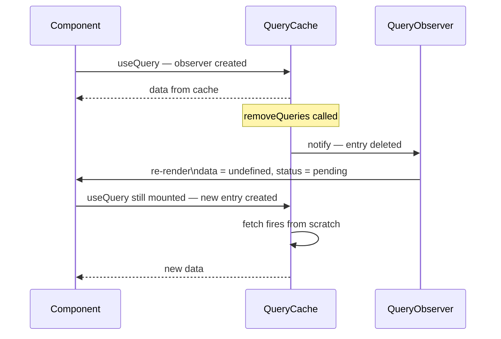
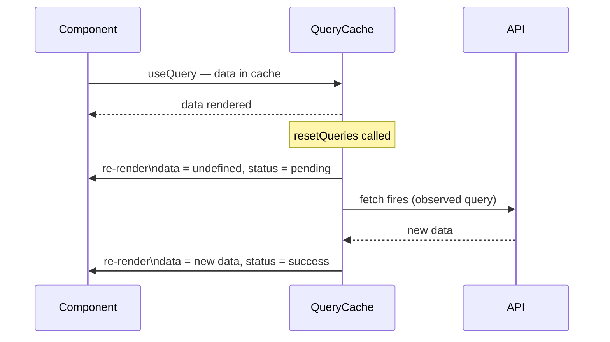
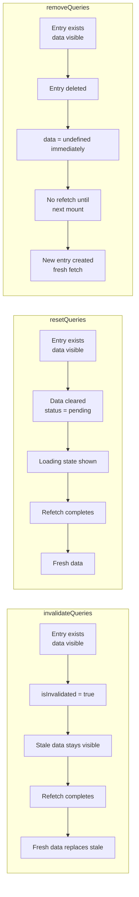
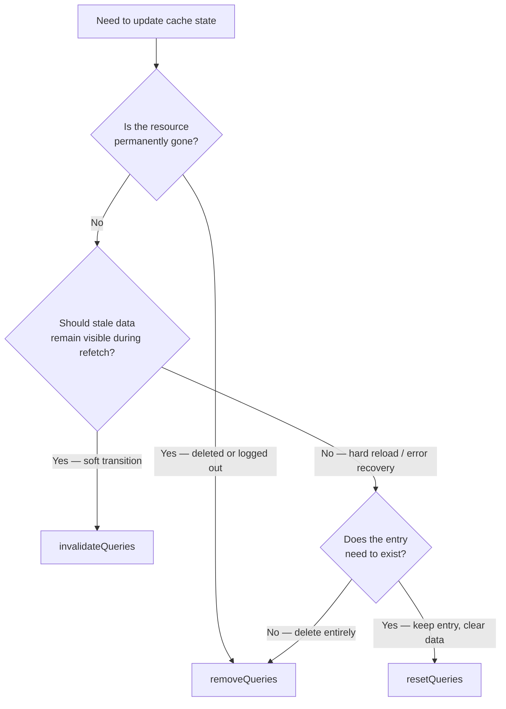

## TanStack Query — Advanced Querying — `removeQueries` and `resetQueries`

### Overview

`removeQueries` and `resetQueries` are two `QueryClient` methods that operate on cache entries more destructively than `invalidateQueries`. Where invalidation marks entries stale and waits for the next observation to trigger a refetch, removal deletes entries from the cache entirely and reset returns entries to their pre-fetch state. Both accept the same filter API as `invalidateQueries` — key prefix matching, exact matching, and predicate functions.

Understanding when each is appropriate requires understanding what each does to the three independent aspects of a cache entry: its **data**, its **status**, and its **observer relationships**.

---

### Effect Comparison

| Method | Data | Status | Observer re-render | Refetch triggered |
|---|---|---|---|---|
| `invalidateQueries` | Preserved until refetch | `isInvalidated = true` | No immediate change | If observed |
| `resetQueries` | Cleared to `undefined` (or `initialData`) | Back to `pending` | Yes — immediately | If observed |
| `removeQueries` | Deleted — entry gone | Entry does not exist | Yes — `data` becomes `undefined` | On next mount |

---

### `removeQueries`

`removeQueries` deletes matching cache entries from the `QueryCache` map entirely. The entry ceases to exist — it is not marked stale, it is not reset, it is gone.

```ts
queryClient.removeQueries({ queryKey: ['project', id] })
```

**Key Points**

- After removal, `getQueryData` returns `undefined` for the deleted key
- If components are actively subscribed to a removed entry, their `data` immediately becomes `undefined` and `status` returns to `'pending'`
- The next time a component mounts and calls `useQuery` with a removed key, a fresh cache entry is created and a fetch fires from scratch
- Unlike `invalidateQueries`, removal is **synchronous and immediate** — no fetch is triggered by the removal itself

---

#### `removeQueries` — Key Matching

The same filter options apply as with `invalidateQueries`:

```ts
// Remove one specific entry
queryClient.removeQueries({ queryKey: ['project', id], exact: true })

// Remove all entries under the 'project' prefix
queryClient.removeQueries({ queryKey: ['project'] })

// Remove by predicate
queryClient.removeQueries({
  predicate: (query) => query.state.status === 'error',
})
```

---

#### When to Use `removeQueries`

**After logout — clearing all user-scoped data:**

```ts
async function logout() {
  await authClient.signOut()

  // Remove all cached data — prevents next user from seeing prior user's data
  queryClient.removeQueries()

  navigate('/login')
}
```

**Key Points**

- Calling `removeQueries()` with no arguments removes **all** cache entries
- This is the correct post-logout pattern — `invalidateQueries` would only mark entries stale, leaving data in memory visible to the next session
- [Inference] For SSR or server-component environments where a `QueryClient` is shared across requests, `removeQueries` after each request is critical to prevent data leakage. For client-side SPAs with a singleton `QueryClient`, post-logout removal is a security and correctness concern.

**After deleting a resource:**

```ts
const mutation = useMutation({
  mutationFn: (id: string) => deleteProject(id),
  onSuccess: (_, id) => {
    // The detail entry is no longer meaningful — remove it
    queryClient.removeQueries({
      queryKey: projectKeys.detail(id),
      exact: true,
    })

    // Invalidate lists so they refetch without the deleted item
    queryClient.invalidateQueries({ queryKey: projectKeys.lists() })

    navigate('/projects')
  },
})
```

**Key Points**

- Removing the detail entry after deletion prevents the deleted resource from appearing if the user navigates back to that route before the list refetches
- List entries are invalidated (not removed) because they still have meaningful data — just stale after the deletion
- [Inference] If the user navigates back to the deleted resource's route before the list refetches, `useQuery` will find no cache entry and fire a fresh fetch. The server will return a 404 or equivalent. The application must handle this case gracefully.

---

#### `removeQueries` Lifecycle Diagram



---

### `resetQueries`

`resetQueries` returns matching cache entries to their **initial state** — as if they had just been created but not yet fetched. Data is cleared to `undefined` (or to `initialData` if configured), status returns to `'pending'`, and if the query has active observers, a refetch fires immediately.

```ts
queryClient.resetQueries({ queryKey: ['project', id] })
```

**Key Points**

- Unlike `removeQueries`, the cache entry **continues to exist** after reset — it is emptied, not deleted
- Unlike `invalidateQueries`, the existing data is **immediately cleared** — observers re-render with `data: undefined` before the refetch resolves
- If `initialData` is configured on the query, the reset value is `initialData`, not `undefined`
- `resetQueries` returns a `Promise<void>` that resolves when all triggered refetches complete

---

#### `resetQueries` with `initialData`

```ts
useQuery({
  queryKey: ['settings'],
  queryFn: fetchSettings,
  initialData: defaultSettings,
})

// Reset restores data to defaultSettings, not undefined
queryClient.resetQueries({ queryKey: ['settings'] })
```

**Key Points**

- `initialData` is re-applied on reset — this is one of the few cases where `initialData` has a visible effect after the initial mount
- [Inference] If `initialData` was defined as a function (the initializer form), the function is re-called on reset to produce the restored value. This is an inference based on the general behavior of `initialData` — verify against the specific version in use.

---

#### When to Use `resetQueries`

**"Refresh from zero" UX — forcing a visible reload:**

```ts
function ProjectDashboard() {
  const queryClient = useQueryClient()

  const handleHardRefresh = () => {
    // Clear data immediately — show loading state — then refetch
    queryClient.resetQueries({ queryKey: projectKeys.all() })
  }

  return (
    <div>
      <button onClick={handleHardRefresh}>Reset dashboard</button>
      {/* Children show loading spinners after reset */}
    </div>
  )
}
```

**Contrasted with `invalidateQueries`:**

```ts
// invalidateQueries — existing data stays visible during refetch
queryClient.invalidateQueries({ queryKey: projectKeys.all() })

// resetQueries — data clears immediately; loading state shown during refetch
queryClient.resetQueries({ queryKey: projectKeys.all() })
```

**Key Points**

- `invalidateQueries` is the softer path — the UI stays populated with stale data until fresh data arrives
- `resetQueries` is the harder path — the UI drops to a loading state immediately
- The choice is a UX decision: stale-then-fresh vs. loading-then-fresh
- [Inference] In most cases, `invalidateQueries` produces better perceived performance because data remains visible. `resetQueries` is appropriate when showing stale data would be actively misleading or when a clean loading state is explicitly required.

**Error recovery — clearing an error state before retrying:**

```ts
function ErrorBoundaryFallback({ queryKey }: { queryKey: QueryKey }) {
  const queryClient = useQueryClient()

  const handleRetry = async () => {
    // Clear error state and refetch from scratch
    await queryClient.resetQueries({ queryKey })
  }

  return (
    <div>
      <p>Something went wrong.</p>
      <button onClick={handleRetry}>Try again</button>
    </div>
  )
}
```

**Key Points**

- `resetQueries` clears `error` and `fetchFailureCount` alongside `data` — it is a full state reset, not just a data clear
- This is preferable to `invalidateQueries` in error recovery because `invalidateQueries` does not clear the error state — the query remains in `status: 'error'` until the refetch succeeds
- [Inference] `resetQueries` followed by a successful refetch transitions the query through `pending → success`. `invalidateQueries` on an errored query would immediately trigger a refetch but may briefly show the error state before success. The observable difference depends on render timing.

---

#### `resetQueries` Lifecycle Diagram



---

### Side-by-Side Behavioral Comparison



---

### Filter Options — Shared API

All three methods accept the same `QueryFilters` object:

```ts
type QueryFilters = {
  queryKey?: QueryKey           // prefix match (or exact if exact: true)
  exact?: boolean               // enforce exact key match
  predicate?: (query: Query) => boolean
  type?: 'active' | 'inactive' | 'all'  // filter by observer presence
  stale?: boolean               // filter by staleness
}
```

#### `type` Filter

```ts
// Only reset queries with no active observers
queryClient.resetQueries({
  queryKey: ['projects'],
  type: 'inactive',
})

// Only remove actively observed queries
queryClient.removeQueries({
  queryKey: ['session'],
  type: 'active',
})
```

| `type` value | Matches |
|---|---|
| `'active'` | Queries with at least one observer |
| `'inactive'` | Queries with zero observers |
| `'all'` | All queries (default) |

#### `stale` Filter

```ts
// Remove only stale entries (no point keeping them)
queryClient.removeQueries({
  queryKey: ['reports'],
  stale: true,
})
```

---

### Combining with Mutation Lifecycle

A complete mutation handler demonstrating all three methods in context:

```ts
const deleteMutation = useMutation({
  mutationFn: deleteProject,

  onMutate: async (id) => {
    // Cancel in-flight fetches for this entry
    await queryClient.cancelQueries({ queryKey: projectKeys.detail(id) })
    // Snapshot for rollback
    const previous = queryClient.getQueryData(projectKeys.detail(id))
    return { previous, id }
  },

  onSuccess: (_, id) => {
    // Detail is permanently gone — remove from cache
    queryClient.removeQueries({ queryKey: projectKeys.detail(id), exact: true })
  },

  onError: (_err, id, context) => {
    // Restore snapshot — reset was premature
    if (context?.previous) {
      queryClient.setQueryData(projectKeys.detail(id), context.previous)
    }
    // Reset the detail to force a clean reload
    queryClient.resetQueries({ queryKey: projectKeys.detail(id), exact: true })
  },

  onSettled: () => {
    // Lists need to reflect the deletion
    queryClient.invalidateQueries({ queryKey: projectKeys.lists() })
  },
})
```

---

### Common Pitfalls

| Pitfall | Description |
|---|---|
| Using `removeQueries` when `invalidateQueries` is appropriate | Removes data immediately; active subscribers see `undefined` before refetch; unnecessarily disruptive |
| Using `invalidateQueries` after resource deletion | Leaves deleted resource in cache; refetch returns 404 or stale data |
| Not handling `data: undefined` after `removeQueries` | Active observers immediately receive `undefined`; unguarded components may crash |
| Using `resetQueries` when a soft invalidation is sufficient | Forces loading state unnecessarily; `invalidateQueries` is less disruptive |
| Calling `removeQueries()` with no args unintentionally | Clears the entire cache — a destructive operation; scope with a key filter unless wholesale clearing is intended |
| Forgetting `resetQueries` clears error state | Can be used deliberately for error recovery; may be unexpected if used for other purposes |

---

### Decision Guide



---

### Summary

`removeQueries` and `resetQueries` are the destructive end of the TanStack Query cache management API, contrasted against the softer `invalidateQueries`:

- **`removeQueries`** — deletes entries entirely; appropriate post-logout, post-deletion, and for clearing sensitive data; no refetch is triggered by the removal itself
- **`resetQueries`** — empties entries to their initial state and refetches if observed; appropriate for hard reload UX, error recovery, and restoring `initialData`; the entry continues to exist
- **Both accept the full filter API** — key prefix, exact, predicate, `type`, and `stale` filters apply to all three invalidation-family methods
- **`type` filter** — scopes operations to active or inactive queries, enabling targeted reset/removal based on observer presence

**Next Steps** — Mutations: `useMutation`, lifecycle callbacks, and coordinating server writes