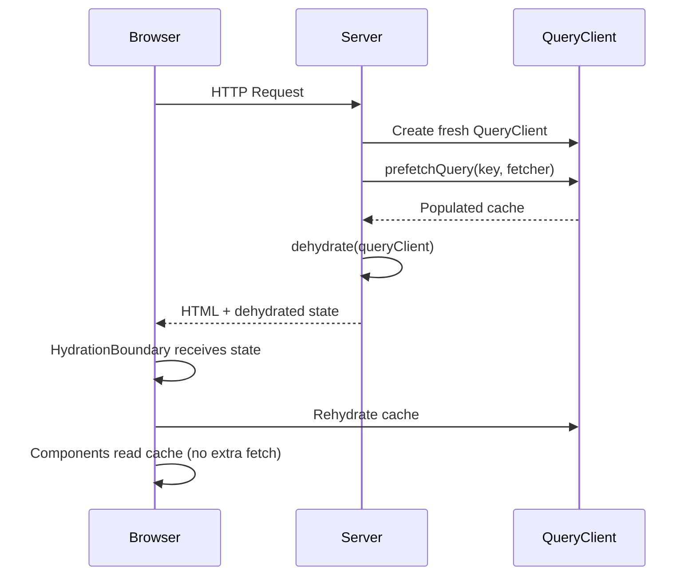

## SSR with TanStack Query

Server-Side Rendering (SSR) with TanStack Query enables you to prefetch data on the server and send a fully populated cache to the client, avoiding loading spinners on initial page load. TanStack Query provides a dedicated mechanism — **dehydration and hydration** — to serialize server-fetched data and rehydrate it on the client.

---

### How SSR Works in TanStack Query

The core model is:

1. On the server, create a fresh `QueryClient` instance.
2. Prefetch the queries you need using `queryClient.prefetchQuery(...)`.
3. Serialize ("dehydrate") the cache using `dehydrate(queryClient)`.
4. Send the dehydrated state to the client as part of the HTML payload.
5. On the client, wrap the app in `<HydrationBoundary>` with the dehydrated state.
6. TanStack Query rehydrates the cache — components read from it without triggering new fetches (subject to `staleTime` configuration).



---

### Installation and Prerequisites

TanStack Query SSR support is built into the core package. No additional package is needed beyond the standard setup.

```bash
npm install @tanstack/react-query
```

For framework-specific SSR (Next.js App Router, Remix, etc.), no extra adapter is required — the dehydration/hydration API works universally.

---

### Core API: dehydrate and HydrationBoundary

#### `dehydrate(queryClient, options?)`

Serializes the current state of a `QueryClient` into a plain JSON-compatible object (`DehydratedState`). By default, only **successful** queries are included.

| Option | Type | Default | Description |
|---|---|---|---|
| `shouldDehydrateQuery` | `(query) => boolean` | includes successful | Filter which queries to include |
| `shouldDehydrateMutation` | `(mutation) => boolean` | excludes all | Filter which mutations to include |

#### `<HydrationBoundary state={dehydratedState}>`

A React component that accepts dehydrated state and populates the nearest `QueryClient` (via context) with that data on the client side.

---

### Basic SSR Example (Next.js Pages Router)

This pattern applies to any Node.js-based SSR framework using `getServerSideProps` or equivalent.

```tsx
// pages/posts.tsx
import {
  dehydrate,
  HydrationBoundary,
  QueryClient,
  useQuery,
} from '@tanstack/react-query'
import { fetchPosts } from '../lib/api'

export async function getServerSideProps() {
  const queryClient = new QueryClient()

  await queryClient.prefetchQuery({
    queryKey: ['posts'],
    queryFn: fetchPosts,
  })

  return {
    props: {
      dehydratedState: dehydrate(queryClient),
    },
  }
}

function PostsList() {
  const { data } = useQuery({
    queryKey: ['posts'],
    queryFn: fetchPosts,
  })

  return (
    <ul>
      {data?.map(post => <li key={post.id}>{post.title}</li>)}
    </ul>
  )
}

export default function PostsPage({ dehydratedState }) {
  return (
    <HydrationBoundary state={dehydratedState}>
      <PostsList />
    </HydrationBoundary>
  )
}
```

**Key Points**
- A **new** `QueryClient` must be created per request on the server. Sharing a single instance across requests causes data leakage between users.
- The `queryKey` used in `prefetchQuery` must match exactly the `queryKey` used in `useQuery` on the client, or the data will not be found in the cache.
- `prefetchQuery` does not throw on error by default — failed prefetches are silently skipped, and the client will refetch instead.

---

### Next.js App Router (React Server Components)

The App Router pattern uses React Server Components (RSC). The recommended approach differs slightly because RSC do not use `getServerSideProps`.

```tsx
// app/posts/page.tsx  (Server Component)
import {
  dehydrate,
  HydrationBoundary,
  QueryClient,
} from '@tanstack/react-query'
import { fetchPosts } from '@/lib/api'
import PostsList from './PostsList'

export default async function PostsPage() {
  const queryClient = new QueryClient()

  await queryClient.prefetchQuery({
    queryKey: ['posts'],
    queryFn: fetchPosts,
  })

  return (
    <HydrationBoundary state={dehydrate(queryClient)}>
      <PostsList />
    </HydrationBoundary>
  )
}
```

```tsx
// app/posts/PostsList.tsx  (Client Component)
'use client'

import { useQuery } from '@tanstack/react-query'
import { fetchPosts } from '@/lib/api'

export default function PostsList() {
  const { data } = useQuery({
    queryKey: ['posts'],
    queryFn: fetchPosts,
  })

  return (
    <ul>
      {data?.map(post => <li key={post.id}>{post.title}</li>)}
    </ul>
  )
}
```

**Key Points**
- The Server Component is `async` — it `await`s the prefetch before rendering.
- `HydrationBoundary` is a Client Component internally (it uses React context). Wrapping it in a Server Component is valid because RSC can render Client Components.
- The `queryFn` in the client component must be defined and importable on the client — it cannot be a server-only function (e.g., direct database calls). Use an API route or a shared isomorphic fetcher instead.

---

### Shared QueryClient Configuration (Recommended Pattern)

To avoid per-file duplication and to enforce consistent `defaultOptions` across server and client, centralize `QueryClient` creation.

```ts
// lib/queryClient.ts

import { QueryClient } from '@tanstack/react-query'

export function makeQueryClient() {
  return new QueryClient({
    defaultOptions: {
      queries: {
        // Prevent refetching immediately after hydration
        staleTime: 60 * 1000, // 1 minute
      },
    },
  })
}
```

Use `makeQueryClient()` on every server request. On the client, create one instance and reuse it (typically via a module-level singleton or a `useState` guard).

```tsx
// app/providers.tsx  (Client Component)
'use client'

import { useState } from 'react'
import { QueryClient, QueryClientProvider } from '@tanstack/react-query'
import { makeQueryClient } from '@/lib/queryClient'

let browserQueryClient: QueryClient | undefined

function getQueryClient() {
  if (typeof window === 'undefined') {
    // Server: always create a new instance
    return makeQueryClient()
  }
  // Browser: reuse or create once
  if (!browserQueryClient) browserQueryClient = makeQueryClient()
  return browserQueryClient
}

export function Providers({ children }) {
  const queryClient = getQueryClient()

  return (
    <QueryClientProvider client={queryClient}>
      {children}
    </QueryClientProvider>
  )
}
```

---

### staleTime and Refetch Behavior After Hydration

By default, `staleTime` is `0`. This means that even if data was prefetched on the server, the client will immediately consider it stale and may refetch on mount.

To prevent an immediate client-side refetch after hydration, set `staleTime` to a value greater than `0`:

```ts
new QueryClient({
  defaultOptions: {
    queries: {
      staleTime: 60 * 1000, // data stays fresh for 1 minute
    },
  },
})
```

[Inference] If `staleTime` is left at `0`, a refetch will likely trigger on mount after hydration, defeating some of the performance benefit of SSR prefetching. Actual behavior depends on component mount timing and network conditions — behavior is not guaranteed to be consistent across environments.

---

### Prefetching Dependent Queries

When one query depends on the result of another, you must `await` each in sequence on the server.

```ts
const queryClient = new QueryClient()

// Step 1: fetch user
await queryClient.prefetchQuery({
  queryKey: ['user', userId],
  queryFn: () => fetchUser(userId),
})

// Step 2: get user from cache, then fetch their posts
const user = queryClient.getQueryData(['user', userId])

await queryClient.prefetchQuery({
  queryKey: ['posts', user.id],
  queryFn: () => fetchPostsByUser(user.id),
})

return { props: { dehydratedState: dehydrate(queryClient) } }
```

**Key Points**
- `queryClient.getQueryData(key)` reads from the cache synchronously after a prefetch completes.
- If the first prefetch fails silently, `user` will be `undefined` — add a guard before the dependent prefetch.

---

### Error Handling in Prefetch

`prefetchQuery` does not throw errors by default. To include error state in the dehydrated payload (so the client can render an error UI without refetching):

```ts
// Option 1: Use fetchQuery instead (throws on error)
try {
  await queryClient.fetchQuery({
    queryKey: ['posts'],
    queryFn: fetchPosts,
  })
} catch (error) {
  // handle or log; dehydrated state will not include this query
}

// Option 2: Configure dehydrate to include errored queries
dehydrate(queryClient, {
  shouldDehydrateQuery: (query) =>
    query.state.status === 'error' || query.state.status === 'success',
})
```

[Inference] Dehydrating errored queries may be appropriate when you want the client to display a cached error state rather than trigger an immediate refetch. Whether this improves UX depends on the specific application — behavior varies.

---

### Remix Integration

Remix handles SSR via `loader` functions. The pattern is identical in structure.

```tsx
// app/routes/posts.tsx
import { json } from '@remix-run/node'
import { useLoaderData } from '@remix-run/react'
import {
  dehydrate,
  HydrationBoundary,
  QueryClient,
} from '@tanstack/react-query'
import { fetchPosts } from '~/lib/api'
import PostsList from '~/components/PostsList'

export async function loader() {
  const queryClient = new QueryClient()

  await queryClient.prefetchQuery({
    queryKey: ['posts'],
    queryFn: fetchPosts,
  })

  return json({ dehydratedState: dehydrate(queryClient) })
}

export default function PostsRoute() {
  const { dehydratedState } = useLoaderData<typeof loader>()

  return (
    <HydrationBoundary state={dehydratedState}>
      <PostsList />
    </HydrationBoundary>
  )
}
```

---

### Streaming SSR with Suspense

TanStack Query integrates with React's streaming SSR (`renderToPipeableStream` / `renderToReadableStream`) via Suspense. When a query is prefetched, it resolves immediately during streaming. Queries not prefetched will suspend the boundary until the client fetches them.

[Inference] In streaming SSR contexts, `HydrationBoundary` may inject dehydrated state progressively as each Suspense boundary resolves. The exact streaming behavior depends on the framework's SSR implementation and React version — behavior is not guaranteed.

```tsx
// Suspense-enabled component on the client
function PostsList() {
  const { data } = useSuspenseQuery({
    queryKey: ['posts'],
    queryFn: fetchPosts,
  })

  return <ul>{data.map(p => <li key={p.id}>{p.title}</li>)}</ul>
}

// Server
<Suspense fallback={<Spinner />}>
  <PostsList />
</Suspense>
```

If the query was prefetched and hydrated, the Suspense boundary will not show the fallback on initial render.

---

### Common Mistakes

| Mistake | Consequence | Fix |
|---|---|---|
| Sharing a `QueryClient` instance across requests | Data leakage between users | Always create a new instance per request |
| Mismatched `queryKey` on server vs client | Cache miss; client refetches | Ensure keys are identical |
| `staleTime: 0` (default) | Immediate refetch after hydration | Set `staleTime > 0` |
| Using server-only `queryFn` in client component | Runtime error on client | Use an isomorphic fetcher or API route |
| Not `await`ing `prefetchQuery` | Empty cache sent to client | Always `await` prefetch calls |
| Forgetting `HydrationBoundary` | Dehydrated state is ignored | Wrap components in `HydrationBoundary` |

---

### Dehydration Internals

`dehydrate()` produces a `DehydratedState` object with this shape:

```ts
interface DehydratedState {
  mutations: DehydratedMutation[]
  queries: DehydratedQuery[]
}

interface DehydratedQuery {
  queryHash: string
  queryKey: QueryKey
  state: QueryState
}
```

This is serializable to JSON, which is how frameworks like Next.js safely pass it via `props` or `useLoaderData`.

---

**Related Topics**

- `useSuspenseQuery` and Suspense-first data fetching
- Streaming SSR with React and TanStack Query
- Prefetching on the client (hover/focus intent prefetching)
- `queryClient.prefetchInfiniteQuery` for paginated SSR
- Server Actions and mutations with TanStack Query
- TanStack Router SSR integration with `beforeLoad` and `loader`
- Caching strategies: `staleTime` vs `gcTime` in SSR contexts
- TanStack Start (meta-framework) SSR patterns