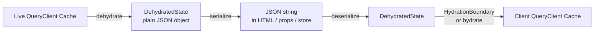
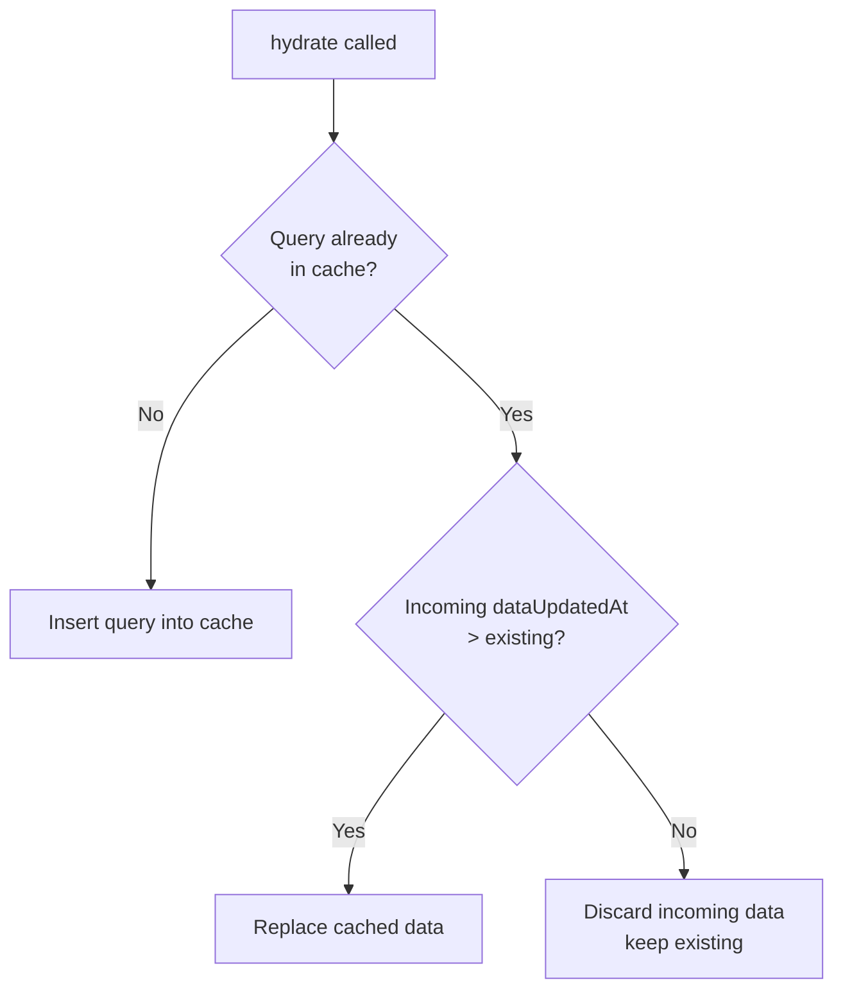
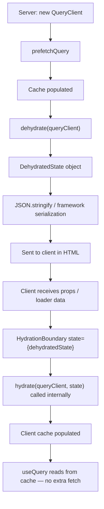

## Hydration and Dehydration in TanStack Query

Hydration and dehydration are the mechanisms TanStack Query uses to serialize cache state for transfer — typically from server to client during SSR, but also applicable to any context where cache state must cross a boundary (e.g., persistent storage, web workers, or inter-tab communication [Speculation]).

---

### Conceptual Model

**Dehydration** is the process of converting a live `QueryClient` cache into a plain, JSON-serializable snapshot.

**Hydration** is the reverse — taking that snapshot and merging it into a (possibly existing) `QueryClient` cache on the receiving end.



The transferred object is a **snapshot** — it captures query keys, data, status, and metadata at the moment `dehydrate()` is called. It is not a live reference.

---

### The `dehydrate()` Function

```ts
import { dehydrate } from '@tanstack/react-query'

const dehydratedState = dehydrate(queryClient, options?)
```

#### Signature

```ts
function dehydrate(
  client: QueryClient,
  options?: DehydrateOptions
): DehydratedState
```

#### `DehydrateOptions`

| Option | Type | Default | Description |
|---|---|---|---|
| `shouldDehydrateQuery` | `(query: Query) => boolean` | Only `success` status | Predicate to filter which queries are included |
| `shouldDehydrateMutation` | `(mutation: Mutation) => boolean` | All mutations excluded | Predicate to filter which mutations are included |
| `serializeData` | `(data: unknown) => unknown` | Identity (no transform) | Custom serializer applied to each query's data before inclusion |

#### Default Filter Behavior

By default, only queries in the `success` state are dehydrated. Queries in `pending`, `error`, or `idle` states are excluded unless `shouldDehydrateQuery` is overridden.

```ts
// Default behavior (equivalent explicit form):
dehydrate(queryClient, {
  shouldDehydrateQuery: (query) => query.state.status === 'success',
})
```

---

### The `DehydratedState` Shape

`dehydrate()` returns a plain object conforming to this structure:

```ts
interface DehydratedState {
  queries: DehydratedQuery[]
  mutations: DehydratedMutation[]
}

interface DehydratedQuery {
  queryHash: string       // serialized form of the queryKey
  queryKey: QueryKey      // original key array
  state: QueryState       // full state snapshot
}

interface DehydratedMutation {
  mutationId: number
  mutationKey?: MutationKey
  state: MutationState
}
```

#### `QueryState` snapshot includes:

- `data` — the cached response value
- `status` — `'success'` | `'error'` | `'pending'`
- `error` — the error object if status is `'error'`
- `dataUpdatedAt` — timestamp of last successful fetch
- `errorUpdatedAt` — timestamp of last error
- `fetchStatus` — `'fetching'` | `'paused'` | `'idle'`
- `dataUpdateCount` — number of times data has been updated

[Inference] The full set of fields in `QueryState` may vary across minor versions — refer to the installed version's TypeScript types for the authoritative definition.

---

### The `hydrate()` Function

```ts
import { hydrate } from '@tanstack/react-query'

hydrate(queryClient, dehydratedState, options?)
```

#### Signature

```ts
function hydrate(
  client: QueryClient,
  dehydratedState: DehydratedState,
  options?: HydrateOptions
): void
```

#### `HydrateOptions`

| Option | Type | Description |
|---|---|---|
| `defaultOptions.queries` | `QueryOptions` | Default query options applied to hydrated queries |
| `defaultOptions.mutations` | `MutationOptions` | Default mutation options applied to hydrated mutations |
| `deserializeData` | `(data: unknown) => unknown` | Custom deserializer applied to each query's data after hydration |

#### Merge Behavior

When `hydrate()` encounters a query that already exists in the target `QueryClient`:

- If the incoming data is **newer** (higher `dataUpdatedAt`), it replaces the existing cached value.
- If the existing data is **newer**, the incoming data is discarded.
- This makes `hydrate()` safe to call multiple times or with overlapping data — it will not overwrite fresher data with stale data.



---

### `<HydrationBoundary>` Component

`HydrationBoundary` is the declarative React API for hydration. It calls `hydrate()` internally when it receives a `state` prop.

```tsx
import { HydrationBoundary } from '@tanstack/react-query'

<HydrationBoundary state={dehydratedState}>
  {children}
</HydrationBoundary>
```

#### Props

| Prop | Type | Description |
|---|---|---|
| `state` | `DehydratedState \| unknown` | The dehydrated state to hydrate into the nearest QueryClient |
| `options` | `HydrateOptions` | Passed directly to the underlying `hydrate()` call |
| `children` | `ReactNode` | Components that will benefit from the hydrated cache |

**Key Points**
- `HydrationBoundary` reads the nearest `QueryClient` from React context (provided by `QueryClientProvider`).
- It accepts `unknown` for `state` — if the value is not a valid `DehydratedState`, it is silently ignored. This is intentional to allow safe passing of `undefined` or `null` without conditional rendering.
- Multiple `HydrationBoundary` components can be nested, each hydrating a different slice of data.

#### Nested HydrationBoundary

```tsx
<HydrationBoundary state={layoutDehydratedState}>
  <Layout>
    <HydrationBoundary state={pageDehydratedState}>
      <PageContent />
    </HydrationBoundary>
  </Layout>
</HydrationBoundary>
```

[Inference] Both boundaries write into the same `QueryClient` instance (the one provided by the nearest `QueryClientProvider`). They are not scoped — nesting is purely a convenience for colocation of data with the components that use it.

---

### Custom Serialization with `serializeData` / `deserializeData`

Some data types are not JSON-serializable by default: `Date` objects become strings, `Map`, `Set`, `BigInt`, and class instances lose their prototype.

TanStack Query provides `serializeData` (on `dehydrate`) and `deserializeData` (on `hydrate` / `HydrationBoundary`) hooks for custom transforms.

#### Example: Preserving Date Objects

```ts
// On the server — serialize Dates to ISO strings (JSON.stringify does this anyway,
// but deserializeData gives you the hook to restore them)
const dehydratedState = dehydrate(queryClient, {
  serializeData: (data) => {
    // data is the raw query result; transform as needed
    return data // no-op here; JSON.stringify handles Date → string
  },
})
```

```tsx
// On the client — restore ISO strings back to Date objects
<HydrationBoundary
  state={dehydratedState}
  options={{
    deserializeData: (data) => {
      // Example: restore a known date field
      if (data && typeof data === 'object' && 'createdAt' in data) {
        return { ...data, createdAt: new Date(data.createdAt) }
      }
      return data
    },
  }}
>
  {children}
</HydrationBoundary>
```

[Inference] For complex or deeply nested data structures, a library such as `superjson` can be used in both hooks to handle full serialization round-trips. This is a community pattern and not officially bundled with TanStack Query. Behavior depends on the serialization library used.

#### Example: Using superjson (community pattern)

```ts
import superjson from 'superjson'

// Server
const dehydratedState = dehydrate(queryClient, {
  serializeData: superjson.serialize,
})

// Client
<HydrationBoundary
  state={dehydratedState}
  options={{ deserializeData: superjson.deserialize }}
>
  {children}
</HydrationBoundary>
```

---

### Dehydrating Error States

By default, errored queries are excluded. To include them — for example, to let the client render an error UI without issuing a redundant network request:

```ts
const dehydratedState = dehydrate(queryClient, {
  shouldDehydrateQuery: (query) =>
    query.state.status === 'error' ||
    query.state.status === 'success',
})
```

On the client, `useQuery` will read the error from cache and immediately return `status: 'error'` without a refetch.

[Inference] Whether a client-side refetch is triggered after hydrating an error depends on `retry` configuration and `staleTime`. With default settings, the query is likely to refetch on mount regardless of the hydrated error state. Behavior is not guaranteed.

---

### Dehydrating Mutations

Mutations are excluded from dehydration by default. To include them:

```ts
const dehydratedState = dehydrate(queryClient, {
  shouldDehydrateMutation: (mutation) => mutation.state.status === 'pending',
})
```

[Speculation] Dehydrating pending mutations could be useful for resumable form state or optimistic update persistence across page navigations. This is an advanced pattern with limited documented usage — verify behavior against the installed version.

---

### Manual `hydrate()` Usage

Outside of React (e.g., in a test setup, Zustand integration, or a non-React environment), call `hydrate()` directly:

```ts
import { QueryClient, hydrate } from '@tanstack/react-query'

const queryClient = new QueryClient()

// Assume dehydratedState was received from the server
hydrate(queryClient, dehydratedState)

// The cache is now populated
const data = queryClient.getQueryData(['posts'])
```

This is also how you would hydrate a `QueryClient` in a non-component context such as a testing `beforeEach` block:

```ts
beforeEach(() => {
  hydrate(queryClient, mockDehydratedState)
})
```

---

### Dehydration in Non-SSR Contexts

While SSR is the primary use case, dehydration and hydration apply anywhere cache state must cross a boundary.

#### Persisting cache to localStorage [Inference]

```ts
// Persist on window unload
window.addEventListener('beforeunload', () => {
  const state = dehydrate(queryClient)
  localStorage.setItem('queryCache', JSON.stringify(state))
})

// Restore on app init
const stored = localStorage.getItem('queryCache')
if (stored) {
  hydrate(queryClient, JSON.parse(stored))
}
```

[Inference] This pattern may conflict with `@tanstack/query-sync-storage-persister` or `@tanstack/query-async-storage-persister`, which provide a more robust persistence layer using the same dehydrate/hydrate primitives internally. Manual implementation is possible but may be missing edge case handling present in the official persisters.

---

### Relationship to `persistQueryClient`

The `persistQueryClient` plugin (separate package) uses `dehydrate` and `hydrate` internally to implement full cache persistence to any async storage:

```ts
import { persistQueryClient } from '@tanstack/query-persist-client-core'
import { createSyncStoragePersister } from '@tanstack/query-sync-storage-persister'

persistQueryClient({
  queryClient,
  persister: createSyncStoragePersister({ storage: window.localStorage }),
})
```

Understanding `dehydrate`/`hydrate` directly is foundational to understanding how `persistQueryClient` works under the hood.

---

### Security Consideration

Dehydrated state is sent as part of the HTML page payload (embedded in a `<script>` tag or passed via props). Any data included in the dehydrated cache is visible to the client.

**Key Points**
- Never include sensitive server-side data (secrets, tokens, private fields) in queries that will be dehydrated unless the client is authorized to see that data.
- The dehydrated state is not encrypted or signed by default.
- [Inference] In Next.js App Router, data returned from Server Components is serialized and sent to the client as part of the RSC payload — the same caution applies.

---

### Full Round-Trip Summary



---

**Related Topics**

- `persistQueryClient` and storage persisters
- `createSyncStoragePersister` and `createAsyncStoragePersister`
- `useSuspenseQuery` behavior during hydration
- Streaming SSR and progressive hydration with Suspense
- Custom serialization with `superjson`
- SSR with TanStack Router's `beforeLoad` and `loader`
- Dehydrating mutations and resumable optimistic updates
- Security considerations in SSR data exposure