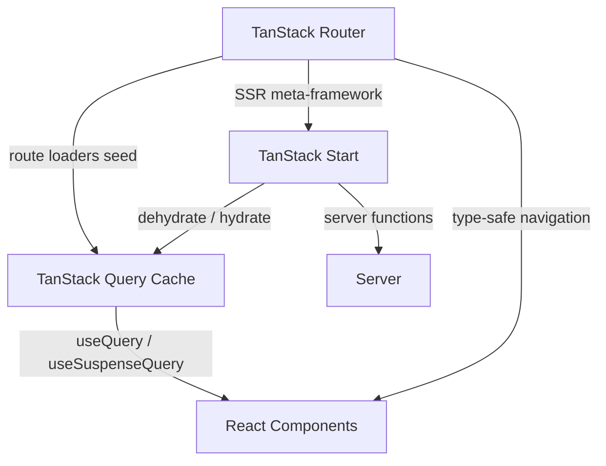

## TanStack Router

TanStack Router is a fully type-safe, client-side and server-side routing library for React applications. It is built and maintained by the TanStack team and is designed as a modern replacement for or alternative to React Router, with a strong emphasis on TypeScript inference, built-in data loading, and first-class search parameter management.

---

### Core Design Goals

TanStack Router is built around several principles that distinguish it from other React routing solutions:

- **End-to-end type safety** — route parameters, search parameters, loader data, and context are all fully inferred by TypeScript without manual type annotations at the call site.
- **Built-in data loading** — routes define `loader` functions that run before the route renders, similar to Remix's model.
- **First-class search parameter management** — search params are treated as structured, validated state rather than raw strings.
- **Framework-agnostic core** — the router core is framework-agnostic; the React adapter is the primary supported binding. [Inference] Additional framework bindings may exist or be planned — verify against current official documentation.
- **File-based or code-based routing** — supports both a file-system convention (via `@tanstack/router-plugin`) and a fully programmatic API.

---

### How It Differs from React Router

| Aspect | TanStack Router | React Router v6+ |
|---|---|---|
| TypeScript inference | End-to-end, automatic | Partial; many types require manual annotation |
| Search parameter handling | Structured, validated, type-safe | Raw strings; manual parsing required |
| Built-in data loading | `loader` with caching | `loader` (v6.4+), less integrated |
| Built-in caching | Yes (route-level, configurable) | No built-in cache |
| File-based routing | Optional plugin | Via Remix or manual convention |
| Bundle size | [Unverified — verify against current benchmarks] | Established baseline |
| SSR support | Yes, via TanStack Start | Via Remix or manual |

---

### Route Definition

TanStack Router routes are defined using `createRoute` (code-based) or auto-generated via the file-based plugin.

#### Code-Based Routing

```ts
import {
  createRouter,
  createRoute,
  createRootRoute,
} from '@tanstack/react-router'
import { RootLayout } from './RootLayout'
import { PostsList } from './PostsList'
import { PostDetail } from './PostDetail'

// 1. Root route
const rootRoute = createRootRoute({
  component: RootLayout,
})

// 2. Child routes
const postsRoute = createRoute({
  getParentRoute: () => rootRoute,
  path: '/posts',
  component: PostsList,
})

const postDetailRoute = createRoute({
  getParentRoute: () => postsRoute,
  path: '$postId',       // dynamic segment
  component: PostDetail,
})

// 3. Route tree
const routeTree = rootRoute.addChildren([
  postsRoute.addChildren([postDetailRoute]),
])

// 4. Router instance
const router = createRouter({ routeTree })
```

---

### Type-Safe Parameters

Route parameters are fully inferred. When you access `params` inside a component or loader, TypeScript knows exactly which keys exist.

```ts
const postDetailRoute = createRoute({
  getParentRoute: () => postsRoute,
  path: '$postId',
  component: function PostDetail() {
    // params.postId is typed as string — no cast needed
    const { postId } = postDetailRoute.useParams()
    return <p>Post ID: {postId}</p>
  },
})
```

---

### Search Parameter Management

Search parameters in TanStack Router are defined with a schema and are validated on parse. They behave like structured state, not raw query strings.

```ts
import { z } from 'zod'

const postsRoute = createRoute({
  getParentRoute: () => rootRoute,
  path: '/posts',
  validateSearch: z.object({
    page: z.number().int().min(1).default(1),
    filter: z.string().optional(),
  }),
  component: PostsList,
})
```

```ts
function PostsList() {
  // page is typed as number, filter as string | undefined
  const { page, filter } = postsRoute.useSearch()

  return <p>Page {page}</p>
}
```

**Key Points**
- `validateSearch` accepts any validator that conforms to the expected interface — Zod is commonly used but not the only option. [Inference]
- Invalid search params cause validation to fall back to defaults rather than crashing, depending on the schema definition. Behavior depends on the validator used.

---

### Built-In Data Loading with `loader`

Each route can define a `loader` function that runs before the component renders. The loader's return value is available via `useLoaderData`.

```ts
const postDetailRoute = createRoute({
  getParentRoute: () => postsRoute,
  path: '$postId',
  loader: async ({ params }) => {
    const post = await fetchPost(params.postId)
    return { post }
  },
  component: function PostDetail() {
    const { post } = postDetailRoute.useLoaderData()
    return <h1>{post.title}</h1>
  },
})
```

**Key Points**
- The loader runs on both the server and client during navigation.
- Loader data is cached by TanStack Router's built-in cache at the route level.
- The return type of `loader` is inferred — `useLoaderData()` is fully typed.

---

### Integration with TanStack Query

TanStack Router is designed to work alongside TanStack Query. The recommended pattern uses the router's `loader` to **prefetch** TanStack Query data, and components use `useQuery` or `useSuspenseQuery` to read from the cache.

```ts
import { queryClient } from './queryClient'
import { fetchPost } from './api'

const postDetailRoute = createRoute({
  getParentRoute: () => postsRoute,
  path: '$postId',
  loader: ({ params }) =>
    queryClient.ensureQueryData({
      queryKey: ['post', params.postId],
      queryFn: () => fetchPost(params.postId),
    }),
  component: function PostDetail() {
    const { postId } = postDetailRoute.useParams()

    const { data } = useSuspenseQuery({
      queryKey: ['post', postId],
      queryFn: () => fetchPost(postId),
    })

    return <h1>{data.title}</h1>
  },
})
```

**Key Points**
- `queryClient.ensureQueryData` fetches the data if not cached, or returns the cached value if fresh. It is preferable to `prefetchQuery` here because the loader return value can be used directly if needed.
- TanStack Router handles **route-level** navigation timing; TanStack Query handles **data-level** caching and background updates. They are complementary layers.
- [Inference] This is the most commonly documented integration pattern. Whether it is the only valid approach depends on application requirements.

---

### File-Based Routing

The `@tanstack/router-plugin` (for Vite) generates a route tree automatically from a file system convention, similar to Next.js or Remix file routing.

```
app/routes/
  __root.tsx         → root layout
  index.tsx          → /
  posts.tsx          → /posts (layout)
  posts/
    index.tsx        → /posts
    $postId.tsx      → /posts/:postId
```

The plugin generates a `routeTree.gen.ts` file that wires all routes together with full type inference preserved.

```ts
// app/main.tsx
import { routeTree } from './routeTree.gen'
import { createRouter, RouterProvider } from '@tanstack/react-router'

const router = createRouter({ routeTree })

function App() {
  return <RouterProvider router={router} />
}
```

---

### Navigation

TanStack Router provides type-safe navigation. The `to` parameter is constrained to known route paths, and required params and search params are enforced by TypeScript.

```tsx
import { Link, useNavigate } from '@tanstack/react-router'

// Declarative
<Link to="/posts/$postId" params={{ postId: '42' }}>
  View Post
</Link>

// Imperative
const navigate = useNavigate()
navigate({ to: '/posts/$postId', params: { postId: '42' } })
```

Navigating to an unknown path or omitting a required param is a **compile-time TypeScript error**.

---

### Pending and Error States

Routes can define `pendingComponent` and `errorComponent` for loading and error UI, co-located with the route definition.

```ts
const postDetailRoute = createRoute({
  getParentRoute: () => postsRoute,
  path: '$postId',
  loader: ({ params }) => fetchPost(params.postId),
  pendingComponent: () => <p>Loading post...</p>,
  errorComponent: ({ error }) => <p>Error: {error.message}</p>,
  component: PostDetail,
})
```

---

### SSR and TanStack Start

TanStack Router supports SSR, but the full SSR meta-framework experience is provided by **TanStack Start** — a separate framework built on top of TanStack Router that adds server-side rendering, server functions, and deployment adapters.

[Inference] TanStack Start is the recommended path for SSR with TanStack Router, rather than manually implementing SSR with TanStack Router alone. Verify the current stability and feature status of TanStack Start against official documentation, as it was under active development as of the knowledge cutoff.

---

### Relationship to the TanStack Ecosystem



- **TanStack Router** handles routing, navigation, and route-level data loading.
- **TanStack Query** handles client-side caching, background updates, and server state synchronization.
- **TanStack Start** wraps TanStack Router with SSR infrastructure.

---

### Current Status

TanStack Router reached a stable v1 release. It is actively maintained and production-ready for client-side routing. TanStack Start (the SSR layer) has a separate release status — verify current stability against the official TanStack documentation before adopting in production.

---

**Related Topics**

- TanStack Start — SSR meta-framework built on TanStack Router
- File-based routing with `@tanstack/router-plugin`
- `loader` and `ensureQueryData` integration with TanStack Query
- Type-safe search parameter validation with Zod
- `useNavigate`, `Link`, and programmatic navigation
- Route context and dependency injection
- Nested layouts and outlet patterns
- Pending and error components per route
- TanStack Router devtools
- Migrating from React Router to TanStack Router