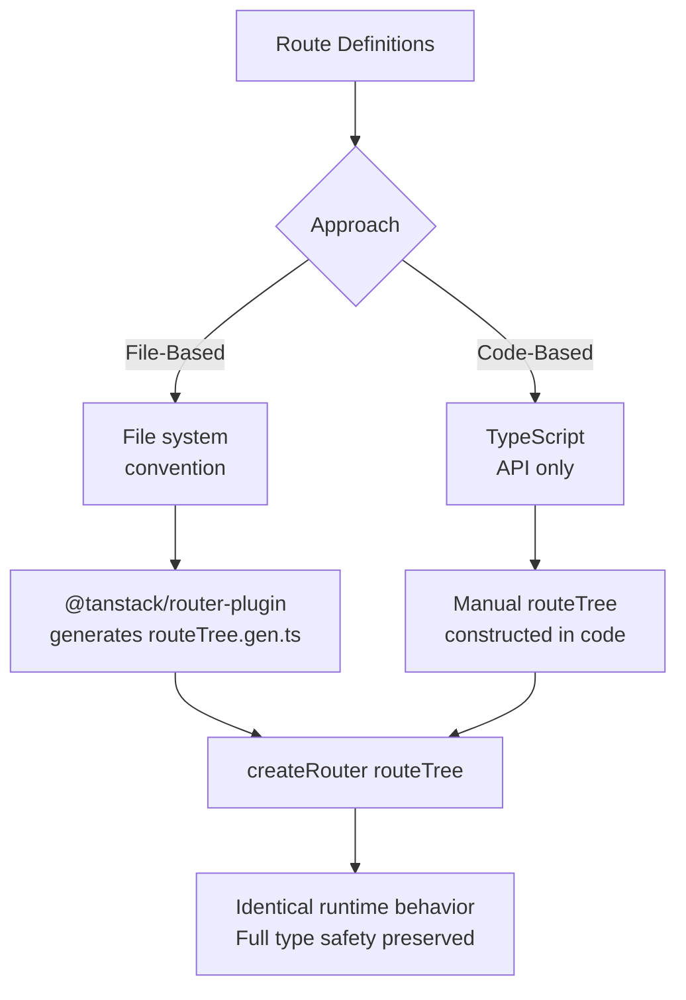

## File-Based vs Code-Based Routing in TanStack Router

TanStack Router supports two approaches to defining routes: **file-based routing**, where the file system structure determines the route tree, and **code-based routing**, where routes are constructed entirely in TypeScript. Both approaches produce an identical runtime route tree and preserve full type safety. The choice is primarily one of convention, tooling preference, and project scale.

---

### Conceptual Comparison



Both approaches feed into the same `createRouter` call. The router does not distinguish between them at runtime.

---

### Code-Based Routing

Code-based routing uses the TanStack Router API directly — no build plugin or file system convention is required.

#### Core API

| Function | Purpose |
|---|---|
| `createRootRoute` | Creates the root route (one per app) |
| `createRoute` | Creates a child route attached to a parent |
| `createRouter` | Creates the router from the complete route tree |
| `route.addChildren` | Attaches child routes to a parent |

#### Minimal Example

```ts
// src/main.tsx
import {
  createRootRoute,
  createRoute,
  createRouter,
  RouterProvider,
  Outlet,
  Link,
} from '@tanstack/react-router'

// Root route — renders the persistent layout
const rootRoute = createRootRoute({
  component: () => (
    <div>
      <nav>
        <Link to="/">Home</Link>
        <Link to="/posts">Posts</Link>
      </nav>
      <Outlet />
    </div>
  ),
})

// Index route — matches "/"
const indexRoute = createRoute({
  getParentRoute: () => rootRoute,
  path: '/',
  component: () => <h1>Home</h1>,
})

// Posts route — matches "/posts"
const postsRoute = createRoute({
  getParentRoute: () => rootRoute,
  path: '/posts',
  component: () => <h1>Posts</h1>,
})

// Dynamic post detail — matches "/posts/:postId"
const postDetailRoute = createRoute({
  getParentRoute: () => postsRoute,
  path: '$postId',
  component: function PostDetail() {
    const { postId } = postDetailRoute.useParams()
    return <p>Post: {postId}</p>
  },
})

// Assemble the route tree
const routeTree = rootRoute.addChildren([
  indexRoute,
  postsRoute.addChildren([postDetailRoute]),
])

// Create the router
const router = createRouter({ routeTree })

// Render
export default function App() {
  return <RouterProvider router={router} />
}
```

---

#### Route Configuration Options

Every `createRoute` call accepts the same configuration object:

```ts
const exampleRoute = createRoute({
  getParentRoute: () => parentRoute,  // required — establishes tree position
  path: '/example',                   // URL segment this route matches
  component: ExampleComponent,        // rendered when route is active
  loader: async ({ params, context }) => {
    return await fetchSomething(params.id)
  },
  validateSearch: z.object({          // search param schema
    page: z.number().default(1),
  }),
  beforeLoad: async ({ context }) => {
    // Runs before loader — useful for auth guards
  },
  pendingComponent: () => <Spinner />,
  errorComponent: ({ error }) => <ErrorUI error={error} />,
  staleTime: 10_000,                  // route-level data cache duration
  gcTime: 30_000,
})
```

---

#### Splitting Routes Across Files (Code-Based)

For larger applications, each route can be defined in its own file and imported into a central assembly file.

```ts
// src/routes/posts.ts
import { createRoute } from '@tanstack/react-router'
import { rootRoute } from './root'
import { PostsList } from '../components/PostsList'

export const postsRoute = createRoute({
  getParentRoute: () => rootRoute,
  path: '/posts',
  component: PostsList,
})
```

```ts
// src/routes/posts.$postId.ts
import { createRoute } from '@tanstack/react-router'
import { postsRoute } from './posts'
import { PostDetail } from '../components/PostDetail'

export const postDetailRoute = createRoute({
  getParentRoute: () => postsRoute,
  path: '$postId',
  component: PostDetail,
})
```

```ts
// src/routeTree.ts
import { rootRoute } from './routes/root'
import { postsRoute } from './routes/posts'
import { postDetailRoute } from './routes/posts.$postId'

export const routeTree = rootRoute.addChildren([
  postsRoute.addChildren([postDetailRoute]),
])
```

**Key Points**
- `getParentRoute` creates the type-level link between parent and child. It must return the actual parent route object — TypeScript uses this to infer param and context types through the tree.
- Every import must resolve correctly. A broken import silently drops a route from the tree — no build error is produced in some configurations. [Inference]

---

### File-Based Routing

File-based routing uses the `@tanstack/router-plugin` (Vite) or `@tanstack/router-cli` to watch the file system and auto-generate a `routeTree.gen.ts` file. Routes are still written in TypeScript — only the tree assembly is automated.

#### Installation

```bash
npm install @tanstack/router-plugin
# or for non-Vite setups:
npm install @tanstack/router-cli
```

```ts
// vite.config.ts
import { defineConfig } from 'vite'
import react from '@vitejs/plugin-react'
import { TanStackRouterVite } from '@tanstack/router-plugin/vite'

export default defineConfig({
  plugins: [
    TanStackRouterVite(), // must come before react()
    react(),
  ],
})
```

---

#### File System Convention

The plugin reads files from a designated routes directory (default: `src/routes/`) and maps file names to URL paths using a specific naming convention.

| File | Route Path | Notes |
|---|---|---|
| `__root.tsx` | Root layout | Required; one per app |
| `index.tsx` | `/` | Index of the parent segment |
| `posts.tsx` | `/posts` | Layout route for `/posts` subtree |
| `posts.index.tsx` | `/posts` (index) | Index of the `/posts` layout |
| `posts.$postId.tsx` | `/posts/:postId` | Dynamic segment |
| `posts_.$postId.edit.tsx` | `/posts/:postId/edit` | Pathless layout separator (`_`) |
| `_auth.tsx` | (no path) | Pathless layout route |
| `_auth.dashboard.tsx` | `/dashboard` | Child of pathless layout |
| `$.tsx` | `*` (catch-all) | Splat / 404 route |

---

#### File Naming Rules

```
Segment separators:   .  (dot) between path segments
Dynamic segments:     $paramName
Pathless layouts:     _prefix (underscore prefix — no URL segment added)
Non-nested (flat):    parentSegment_.$paramName  (trailing underscore breaks nesting)
Index routes:         index.tsx or segment.index.tsx
Root layout:          __root.tsx (double underscore)
Catch-all:            $.tsx
```

---

#### Example File Structure

```
src/routes/
  __root.tsx               → root layout, renders <Outlet />
  index.tsx                → matches "/"
  posts.tsx                → layout for "/posts" subtree
  posts.index.tsx          → matches "/posts" (index)
  posts.$postId.tsx        → matches "/posts/:postId"
  posts.$postId.edit.tsx   → matches "/posts/:postId/edit"
  _auth.tsx                → pathless auth layout (no URL)
  _auth.dashboard.tsx      → matches "/dashboard" (inside auth layout)
  _auth.settings.tsx       → matches "/settings" (inside auth layout)
  $.tsx                    → catch-all / 404
```

---

#### Individual Route File Structure

Each file exports a `Route` using `createFileRoute`. The path argument is a string literal that the plugin validates and infers types from — it must match the file name exactly.

```tsx
// src/routes/posts.$postId.tsx
import { createFileRoute } from '@tanstack/react-router'
import { fetchPost } from '../lib/api'

export const Route = createFileRoute('/posts/$postId')({
  loader: async ({ params }) => {
    return await fetchPost(params.postId)
  },
  component: PostDetail,
})

function PostDetail() {
  const post = Route.useLoaderData()
  const { postId } = Route.useParams()

  return (
    <article>
      <h1>{post.title}</h1>
      <p>ID: {postId}</p>
    </article>
  )
}
```

**Key Points**
- `createFileRoute('/posts/$postId')` — the path string must exactly match the file's inferred path. If it does not match, the plugin emits a warning and TypeScript inference breaks.
- The plugin auto-updates the path argument when you rename a file — if using the Vite plugin in watch mode. [Inference]
- `export const Route` — the export name must be `Route` exactly. The plugin looks for this named export.

---

#### The Generated `routeTree.gen.ts`

The plugin generates this file automatically. You should not edit it manually — it is overwritten on every run.

```ts
// src/routeTree.gen.ts  (auto-generated — do not edit)
import { createRouter } from '@tanstack/react-router'

import { Route as rootRoute } from './routes/__root'
import { Route as indexRoute } from './routes/index'
import { Route as postsRoute } from './routes/posts'
import { Route as postsIndexRoute } from './routes/posts.index'
import { Route as postsPostIdRoute } from './routes/posts.$postId'

const routeTree = rootRoute.addChildren([
  indexRoute,
  postsRoute.addChildren([
    postsIndexRoute,
    postsPostIdRoute,
  ]),
])

export { routeTree }
```

```ts
// src/main.tsx
import { createRouter, RouterProvider } from '@tanstack/react-router'
import { routeTree } from './routeTree.gen'

const router = createRouter({ routeTree })

export default function App() {
  return <RouterProvider router={router} />
}
```

---

#### Root Route in File-Based Routing

```tsx
// src/routes/__root.tsx
import { createRootRoute, Outlet, Link } from '@tanstack/react-router'
import { ReactQueryDevtools } from '@tanstack/react-query-devtools'

export const Route = createRootRoute({
  component: () => (
    <div>
      <nav>
        <Link to="/">Home</Link>
        <Link to="/posts">Posts</Link>
      </nav>
      <Outlet />
      <ReactQueryDevtools />
    </div>
  ),
})
```

---

#### Pathless Layout Routes

Pathless layouts group routes under a shared layout without adding a URL segment.

```
src/routes/
  _auth.tsx               → layout component (no URL contribution)
  _auth.dashboard.tsx     → matches "/dashboard"
  _auth.settings.tsx      → matches "/settings"
```

```tsx
// src/routes/_auth.tsx
import { createFileRoute, Outlet, redirect } from '@tanstack/react-router'

export const Route = createFileRoute('/_auth')({
  beforeLoad: async ({ context }) => {
    if (!context.auth.isAuthenticated) {
      throw redirect({ to: '/login' })
    }
  },
  component: () => <Outlet />,
})
```

```tsx
// src/routes/_auth.dashboard.tsx
import { createFileRoute } from '@tanstack/react-router'

export const Route = createFileRoute('/_auth/dashboard')({
  component: () => <h1>Dashboard</h1>,
})
```

---

#### Non-Nested (Flat) Routes

By default, `posts.$postId.edit.tsx` is nested under `posts.tsx` layout. To break out of nesting — rendering without the parent layout — use a trailing underscore on the parent segment in the filename:

```
posts_.$postId.edit.tsx  → matches "/posts/:postId/edit"
                           but does NOT render inside posts.tsx layout
```

---

#### Catch-All Route

```tsx
// src/routes/$.tsx
import { createFileRoute } from '@tanstack/react-router'

export const Route = createFileRoute('/$')({
  component: () => <h1>404 — Page Not Found</h1>,
})
```

---

### Side-by-Side Comparison

| Aspect | Code-Based | File-Based |
|---|---|---|
| Route tree assembly | Manual, explicit | Auto-generated by plugin |
| Boilerplate | More (wiring routes together) | Less (plugin handles assembly) |
| Visibility of route tree | Fully explicit in code | In generated file (opaque) |
| File naming constraints | None | Strict convention required |
| Tooling requirement | None beyond TypeScript | Vite plugin or CLI |
| Refactoring routes | Rename import + path string | Rename file; plugin updates |
| Co-location of logic | Flexible | Natural (logic lives in route file) |
| Type inference | Identical | Identical |
| Runtime behavior | Identical | Identical |
| Suitable for | Libraries, non-Vite setups, full control | Application projects with Vite |
| Learning curve | Lower API surface | File naming convention to learn |

---

### Mixing Both Approaches

[Inference] It is not officially documented as a supported pattern to mix file-based and code-based route definitions within the same router instance. The generated `routeTree.gen.ts` covers all file-based routes — adding manually constructed routes to that tree is possible in principle but may conflict with plugin expectations. Verify against current documentation before attempting.

---

### Which to Choose

**Choose code-based routing if:**
- You are not using Vite (e.g., Webpack, esbuild, Turbopack without plugin support)
- You are building a library that embeds a router
- You want explicit, auditable control over the route tree with no generated files
- Your team prefers all routing logic visible in TypeScript without a build step

**Choose file-based routing if:**
- You are building an application with Vite
- You prefer convention over configuration for route organization
- You want co-located route logic (loader, component, search schema in one file)
- You are working on a larger team where file structure communicates routing structure

---

**Related Topics**

- `createFileRoute` and route file anatomy
- Pathless layouts and `_prefix` convention
- Route context and `beforeLoad` guards
- `loader` and `ensureQueryData` with TanStack Query
- Search parameter validation with `validateSearch`
- Nested layouts and `<Outlet />`
- Catch-all and 404 routes
- TanStack Router Devtools
- TanStack Start file-based routing conventions
- Migrating from React Router file-based routing