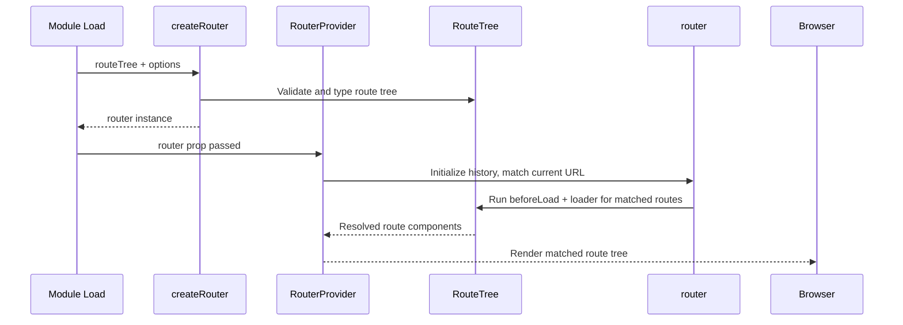

## RouterProvider and createRouter

`createRouter` and `RouterProvider` are the two foundational primitives that initialize and mount a TanStack Router instance. `createRouter` constructs the router object from a route tree and configuration. `RouterProvider` mounts it into the React component tree and makes it available to all routing hooks and components.

---

### `createRouter`

`createRouter` takes a route tree and optional configuration and returns a fully typed `Router` instance. It is called once — typically at module level outside of any component.

```ts
import { createRouter } from '@tanstack/react-router'
import { routeTree } from './routeTree.gen' // file-based
// or import a manually assembled routeTree for code-based routing

const router = createRouter({ routeTree })
```

The return value is a `Router` object that encapsulates routing state, history, cache, and the full type information derived from the route tree.

---

### `createRouter` Options

```ts
const router = createRouter({
  routeTree,             // required
  history,               // optional — custom history instance
  basepath,              // optional — string base URL prefix
  context,               // optional — router-level context object
  defaultPreload,        // optional — preload strategy for links
  defaultPreloadDelay,   // optional — ms before preload triggers
  defaultStaleTime,      // optional — route data cache duration (ms)
  defaultGcTime,         // optional — route data garbage collection time (ms)
  defaultPendingMs,      // optional — delay before pending UI shows
  defaultPendingMinMs,   // optional — minimum time pending UI is shown
  defaultErrorComponent, // optional — global error fallback component
  defaultPendingComponent, // optional — global pending fallback component
  defaultNotFoundComponent, // optional — global not-found component
  notFoundMode,          // optional — 'root' | 'fuzzy'
  trailingSlash,         // optional — 'always' | 'never' | 'preserve'
  caseSensitive,         // optional — boolean, default false
  defaultStructuralSharing, // optional — boolean
  scrollRestoration,     // optional — boolean | ScrollRestorationOptions
  Wrap,                  // optional — wrapper component for the router
  InnerWrap,             // optional — inner wrapper component
  transformer,           // optional — data transformer (e.g. superjson)
  stringifySearch,       // optional — custom search serializer
  parseSearch,           // optional — custom search deserializer
})
```

---

### Option Details

#### `routeTree`

The assembled route tree, either generated by the file-based plugin (`routeTree.gen.ts`) or manually constructed via `rootRoute.addChildren(...)`. This is the only required option.

```ts
const router = createRouter({ routeTree })
```

---

#### `history`

By default, TanStack Router uses the browser's History API (`createBrowserHistory`). You can override this with a custom history instance.

```ts
import {
  createBrowserHistory,
  createHashHistory,
  createMemoryHistory,
} from '@tanstack/react-router'

// Default — uses window.history
const browserHistory = createBrowserHistory()

// Hash-based — for environments without server-side routing support
const hashHistory = createHashHistory()

// Memory-based — for SSR, testing, or non-browser environments
const memoryHistory = createMemoryHistory({
  initialEntries: ['/posts/1'],
})

const router = createRouter({ routeTree, history: memoryHistory })
```

**Key Points**
- `createBrowserHistory` is the default and requires server-side wildcard routing to handle direct URL access.
- `createHashHistory` encodes the path in the URL hash — no server configuration required.
- `createMemoryHistory` holds navigation state in memory — appropriate for SSR and testing contexts.

---

#### `context`

A router-level context object made available to every route's `loader`, `beforeLoad`, and component via `useRouterContext`. The context object is typed and propagated through the entire route tree.

```ts
import { createRouter } from '@tanstack/react-router'
import { queryClient } from './queryClient'

const router = createRouter({
  routeTree,
  context: {
    queryClient,
    auth: undefined as AuthContext | undefined, // populated later
  },
})
```

```ts
// In a route loader
const postRoute = createRoute({
  getParentRoute: () => rootRoute,
  path: '/posts/$postId',
  loader: ({ context, params }) => {
    return context.queryClient.ensureQueryData({
      queryKey: ['post', params.postId],
      queryFn: () => fetchPost(params.postId),
    })
  },
})
```

**Key Points**
- The `context` type is inferred from the object passed to `createRouter`. All routes in the tree receive the full context type.
- Context is immutable at the router level. Per-route context augmentation is done via `beforeLoad`'s return value, which merges into the context for child routes.
- [Inference] Passing `undefined` as a placeholder for a context property (as shown with `auth` above) and populating it later is a common pattern when the value is not available at module initialization time. Behavior depends on when routes access that property.

---

#### `defaultPreload`

Controls when linked routes are preloaded. Applies to all `<Link>` components unless overridden per-link.

```ts
const router = createRouter({
  routeTree,
  defaultPreload: 'intent',     // preload on hover / focus
  // defaultPreload: false,     // disable preloading (default)
  // defaultPreload: 'viewport', // preload when link enters viewport [Inference — verify current supported values]
  defaultPreloadDelay: 50,      // ms to wait before triggering preload on intent
})
```

---

#### `defaultStaleTime` and `defaultGcTime`

Control route-level data caching for loader results. These mirror TanStack Query's `staleTime` and `gcTime` semantics applied to router loader data.

```ts
const router = createRouter({
  routeTree,
  defaultStaleTime: 0,          // loader re-runs on every navigation (default)
  defaultGcTime: 30 * 60 * 1000, // cached data kept for 30 minutes
})
```

[Inference] These options affect TanStack Router's internal route data cache, not TanStack Query's cache. When using TanStack Query for data fetching inside loaders (`ensureQueryData`), TanStack Query's own `staleTime` governs refetch behavior — the router's `defaultStaleTime` controls when the loader function itself re-runs.

---

#### `defaultPendingMs` and `defaultPendingMinMs`

Prevent the pending UI from flashing briefly for fast navigations.

```ts
const router = createRouter({
  routeTree,
  defaultPendingMs: 1000,    // pending component only shows after 1s delay
  defaultPendingMinMs: 500,  // once shown, pending component stays for at least 500ms
})
```

---

#### `defaultErrorComponent` and `defaultPendingComponent`

Global fallback components used when a route does not define its own.

```ts
import { ErrorComponent } from '@tanstack/react-router'

const router = createRouter({
  routeTree,
  defaultErrorComponent: ({ error }) => (
    <div>
      <p>Something went wrong.</p>
      <pre>{error.message}</pre>
    </div>
  ),
  defaultPendingComponent: () => <p>Loading...</p>,
  defaultNotFoundComponent: () => <p>404 — Not found.</p>,
})
```

---

#### `trailingSlash`

Controls how trailing slashes in URLs are handled.

```ts
const router = createRouter({
  routeTree,
  trailingSlash: 'never',    // /posts/ → redirects to /posts
  // trailingSlash: 'always', // /posts → redirects to /posts/
  // trailingSlash: 'preserve', // no normalization (default)
})
```

---

#### `stringifySearch` and `parseSearch`

Custom serializers for URL search parameters. By default, TanStack Router uses its own structured search serialization format.

```ts
import { JSURL } from 'jsurl'

const router = createRouter({
  routeTree,
  stringifySearch: (search) => '?' + JSURL.stringify(search),
  parseSearch: (searchStr) => JSURL.parse(searchStr.substring(1)),
})
```

[Inference] Replacing the default search serializer affects all search parameter handling across the app. Verify compatibility with `validateSearch` schemas when using a custom serializer.

---

#### `transformer`

A data transformer applied to all data crossing the server/client boundary in SSR contexts. Commonly used with `superjson` to preserve `Date`, `Map`, `Set`, and other non-JSON-native types.

```ts
import superjson from 'superjson'

const router = createRouter({
  routeTree,
  transformer: superjson,
})
```

---

#### `Wrap` and `InnerWrap`

Wrapper components injected around the router's rendered output. Useful for providing context (e.g., `QueryClientProvider`) at the router level rather than outside `RouterProvider`.

```tsx
import { QueryClientProvider } from '@tanstack/react-query'
import { queryClient } from './queryClient'

const router = createRouter({
  routeTree,
  Wrap: ({ children }) => (
    <QueryClientProvider client={queryClient}>
      {children}
    </QueryClientProvider>
  ),
})
```

**Key Points**
- `Wrap` wraps the entire router output including the root route component.
- `InnerWrap` wraps the outlet inside the root route. [Inference] The distinction between `Wrap` and `InnerWrap` is relevant when the root route renders layout elements outside the outlet — verify behavior against current documentation.
- Using `Wrap` for `QueryClientProvider` is an alternative to placing the provider outside `RouterProvider` in the component tree.

---

### TypeScript Registration

TanStack Router's type inference requires the router instance to be registered globally so that hooks like `useParams`, `useSearch`, and `useNavigate` are typed without explicit generics.

```ts
// src/main.tsx or src/router.ts
declare module '@tanstack/react-router' {
  interface Register {
    router: typeof router
  }
}
```

This declaration extends TanStack Router's internal `Register` interface with your specific router type. Without it, hooks return loosely typed values. With it, all hooks infer types from the route tree automatically.

**Key Points**
- This is a TypeScript module augmentation — it has no runtime effect.
- It must be placed in a file that TypeScript processes as part of the project (typically `main.tsx` or a dedicated `router.ts`).
- Only one router can be registered globally at a time. Applications with multiple router instances are not a supported pattern for this inference mechanism. [Inference]

---

### `RouterProvider`

`RouterProvider` is a React component that mounts the router and makes it available to the component tree via React context.

```tsx
import { RouterProvider } from '@tanstack/react-router'
import { router } from './router'

export default function App() {
  return <RouterProvider router={router} />
}
```

It accepts a small set of props:

| Prop | Type | Description |
|---|---|---|
| `router` | `Router` | Required. The router instance from `createRouter`. |
| `defaultComponent` | `ComponentType` | Fallback component if no route matches. |
| `defaultPendingComponent` | `ComponentType` | Global pending UI override. |
| `defaultErrorComponent` | `ComponentType` | Global error UI override. |
| `context` | `Partial<RouterContext>` | Runtime context values to merge into router context. |

**Key Points**
- `RouterProvider` renders the matched route tree, handles scroll restoration, and manages navigation state.
- It does not need to be wrapped in any other provider specifically — though `QueryClientProvider` and other context providers are commonly placed above or inside it via `Wrap`.
- Only one `RouterProvider` should be mounted per application. [Inference]

---

### Passing Runtime Context via `RouterProvider`

When context values are not available at `createRouter` time (e.g., an auth object derived from a React hook), they can be passed at render time via the `context` prop on `RouterProvider`.

```tsx
// router.ts
export const router = createRouter({
  routeTree,
  context: {
    auth: undefined as AuthContext | undefined,
    queryClient,
  },
})
```

```tsx
// App.tsx
import { useAuth } from './auth'

export default function App() {
  const auth = useAuth() // React hook — only available inside components

  return (
    <RouterProvider
      router={router}
      context={{ auth }}
    />
  )
}
```

The `context` prop merges with the base context defined in `createRouter`, overriding matching keys. Routes can then access `context.auth` in `beforeLoad` or `loader`.

---

### Full Setup Example

```ts
// src/queryClient.ts
import { QueryClient } from '@tanstack/react-query'

export const queryClient = new QueryClient({
  defaultOptions: { queries: { staleTime: 60_000 } },
})
```

```ts
// src/router.ts
import { createRouter } from '@tanstack/react-router'
import { routeTree } from './routeTree.gen'
import { queryClient } from './queryClient'

export const router = createRouter({
  routeTree,
  context: { queryClient },
  defaultPreload: 'intent',
  defaultStaleTime: 0,
  defaultErrorComponent: ({ error }) => <p>Error: {error.message}</p>,
  defaultPendingComponent: () => <p>Loading...</p>,
})

declare module '@tanstack/react-router' {
  interface Register {
    router: typeof router
  }
}
```

```tsx
// src/main.tsx
import React from 'react'
import ReactDOM from 'react-dom/client'
import { RouterProvider } from '@tanstack/react-router'
import { QueryClientProvider } from '@tanstack/react-query'
import { router } from './router'
import { queryClient } from './queryClient'

ReactDOM.createRoot(document.getElementById('root')!).render(
  <React.StrictMode>
    <QueryClientProvider client={queryClient}>
      <RouterProvider router={router} />
    </QueryClientProvider>
  </React.StrictMode>
)
```

---

### Router Initialization Sequence



---

### Common Mistakes

| Mistake | Consequence | Fix |
|---|---|---|
| Creating `router` inside a component | New instance on every render; state lost | Create at module level outside components |
| Omitting `declare module` registration | Hooks return loosely typed values | Add `Register` augmentation in `router.ts` |
| Placing `QueryClientProvider` inside a route component | Provider not available to all routes | Place above `RouterProvider` or use `Wrap` |
| Passing dynamic context values in `createRouter` directly | Values fixed at module load time | Use `RouterProvider context` prop for runtime values |
| Using `createMemoryHistory` in the browser unintentionally | Navigation does not update the URL | Use `createBrowserHistory` (default) for browser apps |
| Multiple `RouterProvider` mounts | Conflicting routing state | Mount exactly one `RouterProvider` per app |

---

**Related Topics**

- Route context and `beforeLoad` for auth guards
- `loader` and `ensureQueryData` integration with TanStack Query
- `defaultPreload` and link preloading strategies
- `createBrowserHistory`, `createHashHistory`, `createMemoryHistory`
- TypeScript module augmentation and `Register` interface
- `Wrap` and `InnerWrap` for provider injection
- TanStack Start SSR and server-side `createRouter`
- `notFoundMode` and custom 404 handling
- Search parameter serialization and `stringifySearch`