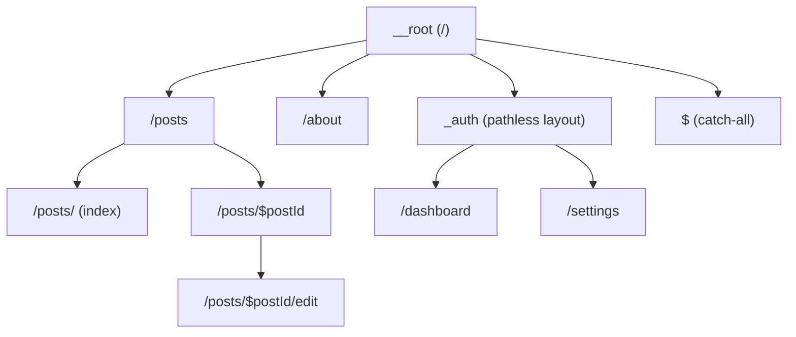
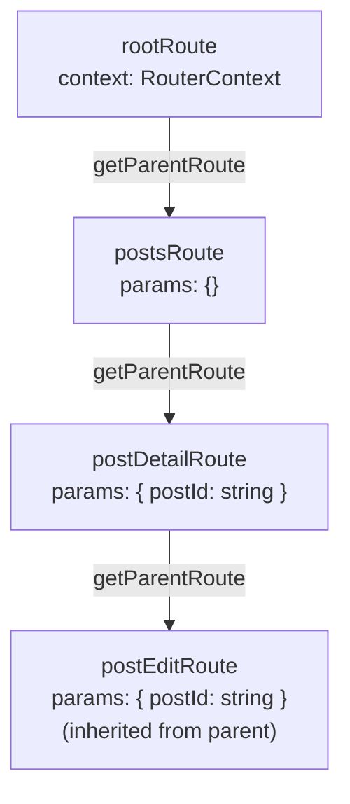

## Route Definitions and Route Trees

A route definition is the configuration object that describes a single URL segment — its path, data loading behavior, component, guards, and search parameter schema. A route tree is the hierarchical assembly of route definitions that collectively describe the entire navigable structure of an application. In TanStack Router, both are fully typed — TypeScript infers parameter types, loader return types, and context shapes through the tree without manual annotation.

---

### Mental Model



Every node in this tree is a route definition. The tree root is always the root route. Nesting determines both URL structure and layout composition — a child route renders inside its parent's `<Outlet />`.

---

### The Root Route

Every TanStack Router application has exactly one root route. It is the ancestor of all other routes and is the only route created with `createRootRoute` (code-based) or defined in `__root.tsx` (file-based).

#### Code-Based

```tsx
import { createRootRoute, Outlet } from '@tanstack/react-router'

export const rootRoute = createRootRoute({
  component: () => (
    <div>
      <nav>Site navigation here</nav>
      <Outlet />   {/* child routes render here */}
    </div>
  ),
})
```

#### File-Based (`src/routes/__root.tsx`)

```tsx
import { createRootRoute, Outlet } from '@tanstack/react-router'

export const Route = createRootRoute({
  component: () => (
    <div>
      <nav>Site navigation here</nav>
      <Outlet />
    </div>
  ),
})
```

**Key Points**
- The root route has no `path` — it always matches.
- It renders persistently across all navigations. Layout elements placed here (nav, footer, providers) remain mounted.
- `<Outlet />` is where the matched child route's component renders.
- The root route can define `loader`, `beforeLoad`, `context`, and error/pending components just like any other route.

---

### `createRootRouteWithContext`

When the router uses a typed context (e.g., passing `queryClient` or auth), the root route must be created with `createRootRouteWithContext` to establish the context type for the entire tree.

```ts
import { createRootRouteWithContext } from '@tanstack/react-router'
import type { QueryClient } from '@tanstack/react-query'

interface RouterContext {
  queryClient: QueryClient
  auth: AuthContext | undefined
}

export const rootRoute = createRootRouteWithContext<RouterContext>()({
  component: RootLayout,
})
```

This is a curried call — `createRootRouteWithContext<RouterContext>()` returns a function that accepts route options. The generic establishes the context shape for all descendant routes.

```ts
// In createRouter — context must satisfy RouterContext shape
const router = createRouter({
  routeTree,
  context: {
    queryClient,
    auth: undefined,
  },
})
```

**Key Points**
- Without `createRootRouteWithContext`, `context` in loaders and `beforeLoad` is typed as `{}`.
- The context type propagates automatically through every child route in the tree — no per-route annotation is needed.

---

### `createRoute` (Code-Based)

`createRoute` creates a non-root route. It requires `getParentRoute` to establish its position in the tree.

```ts
import { createRoute } from '@tanstack/react-router'

const postsRoute = createRoute({
  getParentRoute: () => rootRoute,   // establishes type-level parent link
  path: '/posts',
  component: PostsLayout,
})
```

#### Route Options

| Option | Type | Description |
|---|---|---|
| `getParentRoute` | `() => AnyRoute` | Required. Returns the parent route object. |
| `path` | `string` | URL segment this route matches. |
| `id` | `string` | For pathless routes — identifies the route without contributing a URL segment. |
| `component` | `ComponentType` | Rendered when this route is active. |
| `loader` | `LoaderFn` | Async function that runs before render. |
| `beforeLoad` | `BeforeLoadFn` | Runs before `loader`. Used for guards and context augmentation. |
| `validateSearch` | `SearchSchema` | Validates and types URL search parameters. |
| `params` | `ParamsSchema` | Parses and transforms URL path parameters. |
| `pendingComponent` | `ComponentType` | Shown while `loader` is pending. |
| `errorComponent` | `ComponentType` | Shown when `loader` or `beforeLoad` throws. |
| `notFoundComponent` | `ComponentType` | Shown when no child route matches. |
| `staleTime` | `number` | How long loader data is considered fresh (ms). |
| `gcTime` | `number` | How long loader data is retained after route unmounts (ms). |
| `shouldReload` | `boolean \| ShouldReloadFn` | Controls when the loader re-runs on re-navigation. |
| `preload` | `'intent' \| false` | Per-route preload override. |
| `preloadMaxAge` | `number` | Max age of preloaded data (ms). |
| `wrapInSuspense` | `boolean` | Explicitly wrap component in Suspense. |
| `head` | `HeadFn` | Defines document head metadata (title, meta tags). |

---

### `createFileRoute` (File-Based)

In file-based routing, each route file exports a `Route` using `createFileRoute`. The path string argument must match the file's inferred path exactly — the plugin validates this and updates it automatically when files are renamed.

```tsx
// src/routes/posts.$postId.tsx
import { createFileRoute } from '@tanstack/react-router'
import { fetchPost } from '../lib/api'

export const Route = createFileRoute('/posts/$postId')({
  loader: async ({ params }) => {
    return await fetchPost(params.postId)
  },
  component: PostDetail,
})

function PostDetail() {
  const post = Route.useLoaderData()
  const { postId } = Route.useParams()

  return (
    <article>
      <h1>{post.title}</h1>
      <p>ID: {postId}</p>
    </article>
  )
}
```

**Key Points**
- `createFileRoute` is a curried function: `createFileRoute(path)(options)`.
- The `path` string is a string literal used by TypeScript for type inference — changing it without renaming the file breaks type safety.
- `Route.useLoaderData()`, `Route.useParams()`, and `Route.useSearch()` are route-scoped hooks that return fully typed values without generic arguments.

---

### Path Syntax

#### Static Segments

```ts
path: '/posts'          // matches "/posts" exactly
path: '/about/team'     // matches "/about/team"
```

#### Dynamic Segments

Prefixed with `$`. The segment name becomes a typed key in `params`.

```ts
path: '/posts/$postId'         // params.postId: string
path: '/org/$orgId/repo/$repoId'  // params.orgId, params.repoId: string
```

#### Index Route

An empty string path or `path: '/'` on a child of a layout route matches the layout's exact URL.

```ts
// Child of postsRoute (path: '/posts')
const postsIndexRoute = createRoute({
  getParentRoute: () => postsRoute,
  path: '/',           // matches "/posts" exactly (not "/posts/anything")
  component: PostsList,
})
```

#### Splat / Catch-All

```ts
path: '$'              // matches any remaining path segments
                       // params['*']: string contains the unmatched portion
```

#### Pathless Routes

Omit `path` and use `id` instead. Pathless routes add layout without contributing a URL segment.

```ts
const authLayout = createRoute({
  getParentRoute: () => rootRoute,
  id: 'auth',          // no path — no URL contribution
  beforeLoad: ({ context }) => {
    if (!context.auth?.isAuthenticated) throw redirect({ to: '/login' })
  },
  component: () => <Outlet />,
})
```

---

### Route Tree Assembly (Code-Based)

After all routes are defined, they are assembled into a tree using `addChildren`.

```ts
const routeTree = rootRoute.addChildren([
  indexRoute,
  postsRoute.addChildren([
    postsIndexRoute,
    postDetailRoute.addChildren([
      postEditRoute,
    ]),
  ]),
  authLayout.addChildren([
    dashboardRoute,
    settingsRoute,
  ]),
  catchAllRoute,
])
```

`addChildren` returns the parent route with its children type-merged in. The result is passed directly to `createRouter`.

```ts
const router = createRouter({ routeTree })
```

---

### Type Flow Through the Tree

TanStack Router propagates types down through `getParentRoute`. Each route inherits its ancestors' params and context automatically.



```ts
const postEditRoute = createRoute({
  getParentRoute: () => postDetailRoute,
  path: 'edit',
  loader: ({ params }) => {
    // params.postId is typed — inherited from postDetailRoute
    return fetchPostForEdit(params.postId)
  },
})
```

**Key Points**
- `getParentRoute` is called at type-check time (not runtime) to establish the inheritance chain. The function must return the actual parent route object — not a string or ID.
- If a route defines its own dynamic segment, its params type is the union of its own segment and all ancestor segments.

---

### Loader

The `loader` function runs before the route component renders. It receives `params`, `search`, `context`, `location`, and several utility functions.

```ts
const postDetailRoute = createRoute({
  getParentRoute: () => postsRoute,
  path: '$postId',
  loader: async ({
    params,     // typed path params
    search,     // typed search params
    context,    // router context (queryClient, auth, etc.)
    location,   // current location object
    abortController, // AbortController for the loader
    preload,    // boolean — true if this is a preload run
    cause,      // 'enter' | 'stay' — why loader is running
  }) => {
    return context.queryClient.ensureQueryData({
      queryKey: ['post', params.postId],
      queryFn: () => fetchPost(params.postId),
    })
  },
  component: PostDetail,
})
```

The return value of `loader` is typed and accessible via `Route.useLoaderData()` or `route.useLoaderData()`.

#### `cause`

`cause` indicates why the loader is running:

| Value | Meaning |
|---|---|
| `'enter'` | Route is being entered for the first time |
| `'stay'` | Route is already active but params or search changed |

---

### `beforeLoad`

`beforeLoad` runs before `loader`. It is used for authentication guards, authorization checks, and context augmentation. If it throws a `redirect`, navigation is aborted and the browser redirects.

```ts
import { redirect } from '@tanstack/react-router'

const dashboardRoute = createRoute({
  getParentRoute: () => authLayout,
  path: '/dashboard',
  beforeLoad: async ({ context, location }) => {
    if (!context.auth?.isAuthenticated) {
      throw redirect({
        to: '/login',
        search: { redirect: location.href },
      })
    }
    // Return value is merged into context for this route and children
    return {
      user: context.auth.user,
    }
  },
  loader: ({ context }) => {
    // context.user is now available — added by beforeLoad above
    return fetchDashboardData(context.user.id)
  },
  component: Dashboard,
})
```

**Key Points**
- `beforeLoad` runs for every route in the matched branch, from root to leaf, before any `loader` runs.
- The return value of `beforeLoad` is merged into the context object passed to `loader` and child route `beforeLoad` calls.
- Throwing a `redirect` from `beforeLoad` cancels all further loading for that navigation.
- `beforeLoad` can be `async`.

---

### `validateSearch`

Defines and validates URL search parameters for a route. Values are typed and parsed — components receive structured data, not raw strings.

```ts
import { z } from 'zod'

const postsRoute = createRoute({
  getParentRoute: () => rootRoute,
  path: '/posts',
  validateSearch: z.object({
    page: z.number().int().min(1).default(1),
    q: z.string().optional(),
    sort: z.enum(['asc', 'desc']).default('asc'),
  }),
  component: PostsList,
})

function PostsList() {
  // page: number, q: string | undefined, sort: 'asc' | 'desc'
  const { page, q, sort } = postsRoute.useSearch()

  return <p>Page {page}, sort: {sort}</p>
}
```

**Key Points**
- `validateSearch` accepts any object with a `parse` method compatible with TanStack Router's schema interface. Zod schemas satisfy this natively.
- If validation fails, TanStack Router falls back to schema defaults where defined, or omits the invalid value. [Inference] Exact behavior on validation failure depends on the schema and TanStack Router version — verify against current documentation.
- Search params are inherited down the tree — a child route can access its own and ancestor search params.

---

### `params` Transform

Path params arrive as raw strings. The `params` option allows you to parse and validate them before they reach `loader` or components.

```ts
const postDetailRoute = createRoute({
  getParentRoute: () => postsRoute,
  path: '$postId',
  params: {
    parse: (params) => ({
      postId: parseInt(params.postId, 10), // string → number
    }),
    stringify: (params) => ({
      postId: String(params.postId),       // number → string (for URL generation)
    }),
  },
  component: function PostDetail() {
    const { postId } = postDetailRoute.useParams()
    // postId is now typed as number, not string
    return <p>Post {postId}</p>
  },
})
```

---

### Error and Pending Components

Each route can define its own error and pending UI, scoping failures to the nearest enclosing route rather than the entire page.

```ts
const postDetailRoute = createRoute({
  getParentRoute: () => postsRoute,
  path: '$postId',
  loader: ({ params }) => fetchPost(params.postId),
  pendingComponent: () => (
    <div>Loading post...</div>
  ),
  errorComponent: ({ error, reset }) => (
    <div>
      <p>Failed to load post: {error.message}</p>
      <button onClick={reset}>Retry</button>
    </div>
  ),
  component: PostDetail,
})
```

**Key Points**
- `errorComponent` receives `{ error, reset }`. `reset` re-runs the loader for that route.
- If a route does not define `errorComponent`, the error propagates up to the nearest ancestor that does, or to `defaultErrorComponent` on the router.
- `pendingComponent` is shown after `defaultPendingMs` milliseconds if the loader has not resolved.

---

### `notFoundComponent` and Not-Found Handling

A route can render a custom component when none of its children match the current URL.

```ts
const postsRoute = createRoute({
  getParentRoute: () => rootRoute,
  path: '/posts',
  component: PostsLayout,
  notFoundComponent: () => <p>No post found at this URL.</p>,
})
```

The router-level `notFoundMode` option controls whether not-found state bubbles to the root or is caught by the nearest ancestor.

```ts
const router = createRouter({
  routeTree,
  notFoundMode: 'root',   // not-found always handled at root level
  // notFoundMode: 'fuzzy', // caught by nearest ancestor with notFoundComponent
})
```

---

### `head` — Document Metadata

Routes can define document `<head>` metadata co-located with the route definition.

```ts
const postDetailRoute = createRoute({
  getParentRoute: () => postsRoute,
  path: '$postId',
  loader: ({ params }) => fetchPost(params.postId),
  head: ({ loaderData }) => ({
    meta: [
      { title: loaderData?.title ?? 'Post' },
      { name: 'description', content: loaderData?.summary },
    ],
  }),
  component: PostDetail,
})
```

[Inference] The `head` option is part of TanStack Start's document head management integration. Its availability in standalone TanStack Router (without TanStack Start) may vary — verify against the installed version's documentation.

---

### Complete Code-Based Route Tree Example

```ts
// src/router.ts
import {
  createRouter,
  createRootRouteWithContext,
  createRoute,
  redirect,
  Outlet,
} from '@tanstack/react-router'
import { z } from 'zod'
import type { QueryClient } from '@tanstack/react-query'

// --- Context type ---
interface RouterContext {
  queryClient: QueryClient
  auth: { isAuthenticated: boolean; user?: { id: string } } | undefined
}

// --- Root route ---
const rootRoute = createRootRouteWithContext<RouterContext>()({
  component: () => <><nav /><Outlet /></>,
})

// --- Index ---
const indexRoute = createRoute({
  getParentRoute: () => rootRoute,
  path: '/',
  component: () => <h1>Home</h1>,
})

// --- Auth layout (pathless) ---
const authLayout = createRoute({
  getParentRoute: () => rootRoute,
  id: 'auth',
  beforeLoad: ({ context, location }) => {
    if (!context.auth?.isAuthenticated) {
      throw redirect({ to: '/login', search: { redirect: location.href } })
    }
  },
  component: () => <Outlet />,
})

// --- Login ---
const loginRoute = createRoute({
  getParentRoute: () => rootRoute,
  path: '/login',
  validateSearch: z.object({ redirect: z.string().optional() }),
  component: () => <p>Login page</p>,
})

// --- Posts layout ---
const postsRoute = createRoute({
  getParentRoute: () => rootRoute,
  path: '/posts',
  validateSearch: z.object({
    page: z.number().int().min(1).default(1),
  }),
  component: () => <Outlet />,
})

// --- Posts index ---
const postsIndexRoute = createRoute({
  getParentRoute: () => postsRoute,
  path: '/',
  loader: ({ context, search }) =>
    context.queryClient.ensureQueryData({
      queryKey: ['posts', search.page],
      queryFn: () => fetchPostsPage(search.page),
    }),
  component: PostsList,
})

// --- Post detail ---
const postDetailRoute = createRoute({
  getParentRoute: () => postsRoute,
  path: '$postId',
  loader: ({ context, params }) =>
    context.queryClient.ensureQueryData({
      queryKey: ['post', params.postId],
      queryFn: () => fetchPost(params.postId),
    }),
  errorComponent: ({ error }) => <p>Error: {error.message}</p>,
  component: PostDetail,
})

// --- Dashboard (protected) ---
const dashboardRoute = createRoute({
  getParentRoute: () => authLayout,
  path: '/dashboard',
  component: () => <h1>Dashboard</h1>,
})

// --- Catch-all ---
const catchAllRoute = createRoute({
  getParentRoute: () => rootRoute,
  path: '$',
  component: () => <p>404 — Not Found</p>,
})

// --- Assemble tree ---
const routeTree = rootRoute.addChildren([
  indexRoute,
  loginRoute,
  postsRoute.addChildren([
    postsIndexRoute,
    postDetailRoute,
  ]),
  authLayout.addChildren([
    dashboardRoute,
  ]),
  catchAllRoute,
])

// --- Create router ---
export const router = createRouter({
  routeTree,
  context: { queryClient, auth: undefined },
})

declare module '@tanstack/react-router' {
  interface Register {
    router: typeof router
  }
}
```

---

### Common Mistakes

| Mistake | Consequence | Fix |
|---|---|---|
| Calling `getParentRoute` with a function that returns a string | TypeScript cannot infer param types | Return the actual route object |
| Mismatched `createFileRoute` path string and file name | Type inference breaks silently | Let the plugin manage the path string |
| Defining `path` and `id` on the same route | Undefined behavior | Use `path` for URL routes, `id` for pathless |
| Not using `createRootRouteWithContext` when context is needed | `context` typed as `{}` in loaders | Replace `createRootRoute` with `createRootRouteWithContext` |
| Forgetting `<Outlet />` in layout route component | Child routes render nothing | Add `<Outlet />` where child content should appear |
| Throwing non-`redirect` errors from `beforeLoad` | May not be caught correctly | Throw `redirect(...)` for navigation; throw `Error` for error boundaries |
| Assembling route tree with wrong nesting in `addChildren` | Routes match at wrong URL depth | Verify tree mirrors intended URL hierarchy |

---

**Related Topics**

- `<Outlet />` and nested layout rendering
- `beforeLoad` and authentication guards
- `validateSearch` and search parameter schemas
- `loader` with `ensureQueryData` and TanStack Query integration
- `redirect` and programmatic navigation from loaders
- `Link` and type-safe navigation
- `useLoaderData`, `useParams`, `useSearch` hooks
- Pending and error component scoping
- File-based route naming conventions
- Route context propagation and augmentation