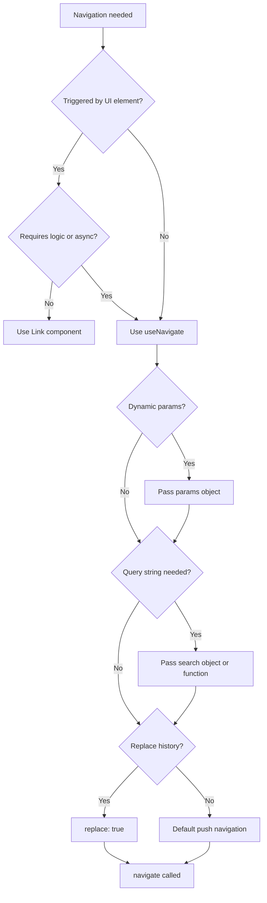

## Programmatic Navigation with `useNavigate`

### Overview

`useNavigate` is a hook provided by TanStack Router that returns a `navigate` function, enabling imperative, code-driven navigation outside of link components. It is the primary mechanism for triggering route transitions in response to user actions, form submissions, async operations, or conditional logic.

---

### Importing and Basic Usage

```ts
import { useNavigate } from '@tanstack/react-router'

function MyComponent() {
  const navigate = useNavigate()

  const handleClick = () => {
    navigate({ to: '/dashboard' })
  }

  return <button onClick={handleClick}>Go to Dashboard</button>
}
```

`useNavigate` must be called inside a component that is rendered within a `RouterProvider` context. Calling it outside this context will throw a runtime error. [Unverified: exact error message may vary across versions.]

---

### The `navigate` Function Signature

The `navigate` function accepts a single options object. Its full shape:

```ts
navigate({
  to,           // target route path (string or route reference)
  params,       // path parameters for dynamic segments
  search,       // URL search params (query string)
  hash,         // URL hash fragment
  replace,      // boolean — replace history entry instead of push
  resetScroll,  // boolean — whether to reset scroll position on navigation
  state,        // arbitrary state attached to history entry
  from,         // the originating route (for relative navigation and type safety)
  mask,         // route mask configuration (advanced)
})
```

Not all fields are required. The minimum viable call is `navigate({ to: '/some-path' })`.

---

### Navigating to Static Routes

```ts
navigate({ to: '/about' })
navigate({ to: '/settings/profile' })
```

TanStack Router performs type-checking on `to` values when routes are defined using the file-based or code-based route tree. [Inference: type errors at build time depend on correct route tree generation and TypeScript configuration.]

---

### Navigating to Dynamic Routes

For routes with path parameters such as `/posts/$postId`, pass a `params` object:

```ts
navigate({
  to: '/posts/$postId',
  params: { postId: '42' },
})
```

**Key Points**
- Parameter names in `to` must match the keys in `params` exactly.
- TanStack Router's type system will surface mismatches when the route tree is correctly typed.
- At runtime, mismatched or missing params may cause navigation to fail silently or throw depending on the version. [Unverified: exact failure behavior may vary.]

---

### Navigating with Search Parameters

Search parameters (query strings) are passed via the `search` option:

```ts
navigate({
  to: '/products',
  search: { category: 'electronics', page: 1 },
})
```

Search parameters in TanStack Router are validated and typed through search param schemas defined on the route. Passing undeclared keys may be ignored or cause validation errors depending on schema strictness. [Inference: behavior depends on whether `validateSearch` is defined on the target route.]

You can also use a function to derive the new search state from the current state:

```ts
navigate({
  to: '/products',
  search: (prev) => ({ ...prev, page: prev.page + 1 }),
})
```

This pattern is useful for incrementally updating query parameters without losing existing ones.

---

### Replace vs Push

By default, `navigate` pushes a new entry onto the browser history stack. Setting `replace: true` replaces the current entry instead, which means the user cannot navigate back to the previous route with the browser back button.

```ts
navigate({ to: '/login', replace: true })
```

**Key Points**
- Use `replace: true` after form submissions or authentication redirects where returning to the previous page would be undesirable or confusing.
- This maps directly to the underlying history API behavior. [Inference: subject to browser history API limitations.]

---

### Hash Navigation

To navigate to a specific anchor within a page:

```ts
navigate({ to: '/docs/getting-started', hash: 'installation' })
```

This appends `#installation` to the URL. Scroll behavior to the anchor is handled by the browser and may vary. [Unverified: TanStack Router does not guarantee scroll-to-anchor behavior across all environments.]

---

### History State

Arbitrary serializable state can be attached to a history entry via `state`:

```ts
navigate({
  to: '/checkout/confirmation',
  state: { orderId: 'abc-123', fromCart: true },
})
```

This state is accessible from the history entry but is not reflected in the URL. It is lost on hard refresh. [Inference: relies on browser History API `state` field behavior, which is not persistent across sessions.]

---

### Relative Navigation with `from`

Specifying `from` allows navigation relative to a known route, and is also required for correct TypeScript inference in some configurations:

```ts
navigate({
  from: '/dashboard',
  to: '/dashboard/settings',
})
```

`from` does not restrict where the user is at runtime — it is primarily a TypeScript hint for path resolution and type narrowing. [Inference: runtime navigation is not blocked by a `from` mismatch in most configurations.]

---

### Scroll Reset

By default, TanStack Router resets the scroll position to the top on navigation. This can be controlled:

```ts
navigate({
  to: '/feed',
  resetScroll: false,
})
```

Set `resetScroll: false` when preserving scroll position is intentional, such as when navigating between paginated results in a feed. [Inference: actual scroll behavior may also be influenced by browser, renderer, or framework specifics.]

---

### Usage After Async Operations

A common pattern is navigating after an async action completes:

```ts
async function handleSubmit(data) {
  await submitForm(data)
  navigate({ to: '/success' })
}
```

**Key Points**
- If the component unmounts before the async operation completes, calling `navigate` afterward is generally safe in React 18+ but may produce warnings in older versions. [Unverified: React version behavior differences not confirmed across all setups.]
- Always handle errors before calling `navigate` to avoid navigating on failure.

---

### Conditional Navigation

```ts
function handleAction(isAuthenticated: boolean) {
  if (!isAuthenticated) {
    navigate({ to: '/login', replace: true })
    return
  }
  navigate({ to: '/dashboard' })
}
```

---

### `useNavigate` vs `<Link>`

| Concern | `useNavigate` | `<Link>` |
|---|---|---|
| Triggered by user action in JSX | Possible but verbose | Natural |
| Triggered by code logic | Primary use case | Not applicable |
| Accessibility (keyboard, screen reader) | Manual | Built-in |
| Preloading on hover | Not supported | Supported |
| Type-safe destination | Yes (with route tree) | Yes |

**Key Points**
- Prefer `<Link>` for navigation that maps directly to visible anchors in the UI. Use `useNavigate` for navigation driven by application logic.
- Using `useNavigate` for all navigation is not recommended as it bypasses built-in accessibility affordances of `<Link>`. [Inference]

---

### Full Example: Form Submission Flow

```tsx
import { useNavigate } from '@tanstack/react-router'

function LoginForm() {
  const navigate = useNavigate()

  async function handleSubmit(event: React.FormEvent) {
    event.preventDefault()
    const formData = new FormData(event.currentTarget as HTMLFormElement)

    try {
      await loginUser({
        email: formData.get('email') as string,
        password: formData.get('password') as string,
      })
      navigate({ to: '/dashboard', replace: true })
    } catch (error) {
      // handle error — do not navigate
    }
  }

  return (
    <form onSubmit={handleSubmit}>
      <input name="email" type="email" />
      <input name="password" type="password" />
      <button type="submit">Login</button>
    </form>
  )
}
```

**Output**
On successful login, the user is redirected to `/dashboard`. The login route is removed from the history stack via `replace: true`, preventing back-navigation to the login form.

---

### Diagram: Navigation Decision Flow



---

### Caveats and Limitations

- `useNavigate` does not block navigation — it does not perform route guards on its own. Route-level guards are handled through `beforeLoad` or `loader` on the target route. [Inference]
- Navigating to a route that does not exist in the route tree at runtime may result in a 404 render or unmatched route behavior, not a thrown exception. [Unverified: exact fallback behavior depends on router configuration.]
- `useNavigate` is a React hook and subject to the Rules of Hooks — it cannot be called outside components or in non-hook functions. [Fact: standard React rules apply.]

---

**Related Topics**
- `<Link>` component — declarative navigation with type safety and preloading
- `redirect()` — server-side and loader-level redirects in TanStack Router
- `useRouter` — accessing the router instance imperatively
- `beforeLoad` and route guards — controlling navigation before it completes
- Search parameter schemas with `validateSearch`
- Route masking — navigating with a different displayed URL
- History state management patterns
- Scroll restoration configuration