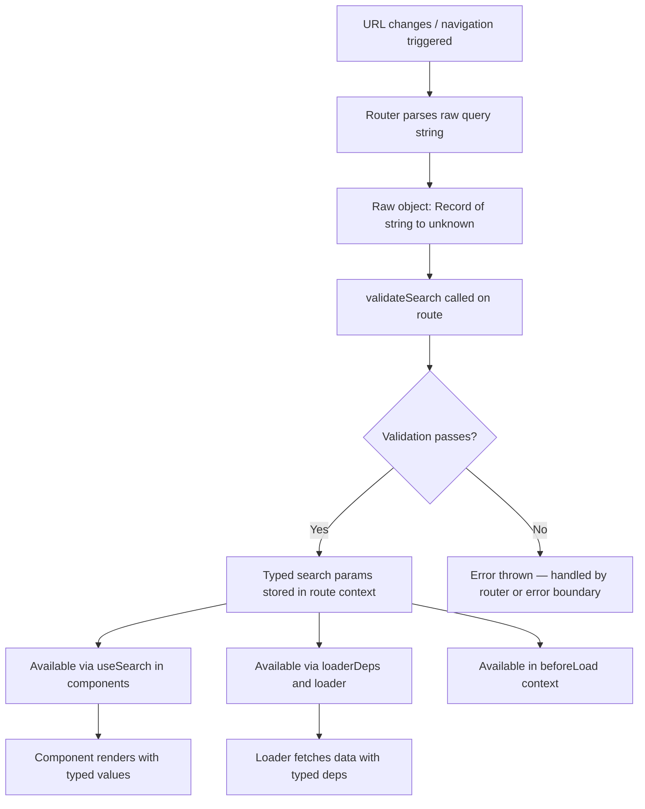

## Typed Search Params

### Overview

TanStack Router treats URL search parameters as first-class, type-safe state. Unlike most routers where query strings are untyped strings, TanStack Router allows each route to declare a schema for its search parameters — validated at runtime and fully typed at compile time. This means search params behave like typed application state that happens to live in the URL.

---

### Why Typed Search Params

Untyped query strings require manual parsing, casting, and validation throughout the codebase. TanStack Router centralizes this by attaching a `validateSearch` function to each route definition. All consumers of that route's search params receive correctly typed values without additional parsing.

**Key Points**
- Search params are scoped per route — each route validates only its own params.
- Validated params are accessible in `loaders`, `beforeLoad`, and component hooks.
- Type errors on search param access are caught at compile time when the route tree is correctly generated. [Inference: requires TypeScript and correct route tree setup.]

---

### Defining Search Params with `validateSearch`

`validateSearch` is a function defined on a route that receives the raw parsed search object and returns a validated, typed result.

```ts
import { createFileRoute } from '@tanstack/react-router'

export const Route = createFileRoute('/products')({
  validateSearch: (search: Record<string, unknown>) => ({
    category: (search.category as string) ?? 'all',
    page: Number(search.page) ?? 1,
    inStock: search.inStock === 'true',
  }),
})
```

**Key Points**
- The input to `validateSearch` is always `Record<string, unknown>` — raw, unvalidated data from the URL.
- The return value determines the TypeScript type of search params for this route.
- Coercion and defaulting are the author's responsibility within this function. [Inference: TanStack Router does not inject defaults automatically unless the function returns them.]

---

### Using a Validation Library

`validateSearch` is compatible with any validation library that accepts unknown input and returns a typed result. The most common integrations are with Zod, Valibot, and ArkType.

#### With Zod

```ts
import { z } from 'zod'
import { createFileRoute } from '@tanstack/react-router'

const searchSchema = z.object({
  category: z.string().default('all'),
  page: z.number().int().min(1).default(1),
  inStock: z.boolean().default(false),
})

export const Route = createFileRoute('/products')({
  validateSearch: (search) => searchSchema.parse(search),
})
```

If `searchSchema.parse` throws (e.g., due to invalid input), TanStack Router will catch the error and may redirect or render an error boundary depending on configuration. [Unverified: exact error handling behavior may vary across versions.]

#### With Valibot

```ts
import { parse, object, string, number, boolean, optional } from 'valibot'

const searchSchema = object({
  category: optional(string(), 'all'),
  page: optional(number(), 1),
  inStock: optional(boolean(), false),
})

export const Route = createFileRoute('/products')({
  validateSearch: (search) => parse(searchSchema, search),
})
```

---

### Accessing Search Params in Components

Use the `useSearch` hook to read typed search params inside a component rendered under a route:

```ts
import { useSearch } from '@tanstack/react-router'

function ProductList() {
  const { category, page, inStock } = useSearch({ from: '/products' })

  return (
    <div>
      <p>Category: {category}</p>
      <p>Page: {page}</p>
      <p>In Stock Only: {inStock ? 'Yes' : 'No'}</p>
    </div>
  )
}
```

**Key Points**
- `from` is required to identify which route's search schema to use for type inference.
- The return value is fully typed based on the `validateSearch` return type of the specified route.
- Omitting `from` or using the wrong route path will affect type inference. [Inference: runtime behavior is unaffected, but TypeScript types may be incorrect or overly broad.]

---

### Accessing Search Params in Loaders

Search params are available in the `loaderDeps` and `loader` context:

```ts
export const Route = createFileRoute('/products')({
  validateSearch: (search: Record<string, unknown>) => ({
    category: (search.category as string) ?? 'all',
    page: Number(search.page) ?? 1,
  }),
  loaderDeps: ({ search }) => ({ category: search.category, page: search.page }),
  loader: async ({ deps }) => {
    return fetchProducts({ category: deps.category, page: deps.page })
  },
})
```

**Key Points**
- `loaderDeps` extracts the values that, when changed, should trigger a loader re-run.
- Without `loaderDeps`, changes to search params alone do not automatically re-invoke the loader. [Inference: exact reactivity behavior may depend on router version and caching configuration.]

---

### Navigating with Typed Search Params

When navigating to a route with defined search params, TanStack Router enforces the correct shape on the `search` option of `navigate` and `<Link>`:

```ts
navigate({
  to: '/products',
  search: { category: 'electronics', page: 2, inStock: true },
})
```

Passing unknown keys or incorrect types will produce TypeScript errors at the call site. [Inference: requires correct route tree generation and TypeScript strict mode.]

#### Using a Function to Update Search Params

```ts
navigate({
  to: '/products',
  search: (prev) => ({ ...prev, page: prev.page + 1 }),
})
```

The `prev` argument is typed as the validated search params of the target route, making incremental updates type-safe.

---

### Search Param Inheritance and Merging

By default, navigating to a route does not automatically carry over search params from the current route. Each navigation call must explicitly supply all required search params.

```ts
// If 'page' is required and not passed, TypeScript will surface an error
navigate({ to: '/products', search: { category: 'books' } }) // TS error if page is required
```

To preserve existing params:

```ts
navigate({
  to: '/products',
  search: (prev) => ({ ...prev, category: 'books' }),
})
```

[Inference: behavior of spreading `prev` depends on whether the current route and target route share search schemas. Cross-route spreading may include unvalidated keys.]

---

### Default Values and Optional Params

There is no dedicated API for declaring defaults separately from `validateSearch`. Defaults are established within the validation function itself:

```ts
validateSearch: (search: Record<string, unknown>) => ({
  page: typeof search.page === 'number' ? search.page : 1,
  query: typeof search.query === 'string' ? search.query : '',
})
```

With Zod, `.default()` on schema fields serves the same purpose:

```ts
const schema = z.object({
  page: z.coerce.number().default(1),
  query: z.string().default(''),
})
```

`z.coerce.number()` is particularly useful because URL params arrive as strings even when the schema expects numbers.

---

### Diagram: Search Param Lifecycle



---

### Coercion Considerations

URL query strings are always serialized as strings. Coercion must be applied in `validateSearch` for non-string types:

| Intended Type | Raw URL Value | Coercion Approach |
|---|---|---|
| `number` | `"3"` | `Number(search.page)` or `z.coerce.number()` |
| `boolean` | `"true"` | `search.val === 'true'` or `z.coerce.boolean()` |
| `string[]` | `"a,b,c"` | `String(search.tags).split(',')` |
| `Date` | `"2024-01-01"` | `new Date(search.date as string)` |

[Inference: `z.coerce.boolean()` behavior for values other than `"true"` may not match expectations — verify with Zod documentation for the version in use.]

---

### Caveats and Limitations

- `validateSearch` runs on every navigation, including back/forward. Keep it synchronous and inexpensive.
- Validation errors in `validateSearch` that are not caught internally will propagate as route errors. [Unverified: exact propagation behavior is version-dependent.]
- Search params are serialized to the URL using `JSON.stringify`-like encoding by default. Complex nested objects may not round-trip cleanly depending on the serializer. [Inference: TanStack Router uses a custom serializer; behavior with deeply nested structures is not guaranteed.]
- `useSearch` must be called from within the route subtree that owns the schema. Calling it in a parent route without a corresponding schema will not return child route params.

---

**Related Topics**
- `loaderDeps` — controlling loader reactivity based on search param changes
- `useSearch` — reading typed search params in components
- Search param serialization and custom serializers
- Zod integration patterns for route validation
- `validateSearch` error handling and fallback behavior
- Combining search params with path params in dynamic routes
- Search params in `<Link>` — type-safe `search` prop
- Persistent search params across navigation