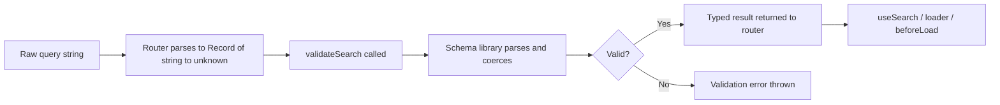

## Search Param Validation with Schemas

### Overview

TanStack Router's `validateSearch` function accepts any validation logic, but pairing it with a schema library produces the most maintainable and type-safe result. Schema-based validation centralizes coercion, defaulting, and constraint checking in a single declaration, and the inferred types flow automatically into all router-aware APIs — hooks, loaders, and navigation calls — without manual type annotation.

---

### How Schema Validation Fits into the Router

`validateSearch` receives a `Record<string, unknown>` and must return a typed object. A schema library handles the transformation from unknown input to a known shape. The router does not prescribe which library to use — any function matching the signature is valid.



---

### Zod

Zod is the most widely used schema library in the TanStack Router ecosystem. [Unverified: ecosystem adoption distribution not formally measured.] Its `.parse()` method throws on invalid input and returns a typed value on success.

#### Basic Schema

```ts
import { z } from 'zod'
import { createFileRoute } from '@tanstack/react-router'

const searchSchema = z.object({
  query: z.string().default(''),
  page: z.coerce.number().int().min(1).default(1),
  sort: z.enum(['asc', 'desc']).default('asc'),
  inStock: z.coerce.boolean().default(false),
})

export type ProductSearch = z.infer<typeof searchSchema>

export const Route = createFileRoute('/products')({
  validateSearch: (search) => searchSchema.parse(search),
})
```

**Key Points**
- `z.coerce.number()` and `z.coerce.boolean()` handle the string-to-primitive conversion that occurs because URL params are always strings.
- `.default()` on each field means missing params are replaced with the declared default rather than producing a validation error.
- `z.infer<typeof searchSchema>` extracts the output type for reuse elsewhere without duplication.

#### Coercion Reference for Zod

| Schema | Input `"true"` | Input `"1"` | Input `undefined` |
|---|---|---|---|
| `z.string()` | `"true"` | `"1"` | error (or `""` with `.default("")`) |
| `z.coerce.number()` | `NaN` | `1` | error (or default) |
| `z.coerce.boolean()` | `true` | `true` | error (or default) |
| `z.enum(['a','b'])` | error | error | error (or default) |

[Inference: `z.coerce.boolean()` coerces any non-empty string to `true`. If the URL contains `inStock=false` as a string, it will coerce to `true`. Prefer explicit string comparison for boolean params when this matters.]

#### Safer Boolean Handling with Zod

```ts
const searchSchema = z.object({
  inStock: z
    .string()
    .transform((v) => v === 'true')
    .default('false'),
})
```

This approach treats the raw string explicitly before transforming to boolean, avoiding the coercion ambiguity. [Inference: behavior depends on whether the value arrives as a string or is absent entirely — verify for your serialization setup.]

#### Optional and Nullable Fields

```ts
const searchSchema = z.object({
  category: z.string().optional(),         // string | undefined
  tag: z.string().nullable().optional(),   // string | null | undefined
  minPrice: z.coerce.number().optional(),  // number | undefined
})
```

Optional fields are absent from the URL when not set. Nullable fields can be explicitly passed as `null` if the serializer supports it. [Inference: whether `null` survives URL serialization depends on TanStack Router's search serializer — not guaranteed by default.]

---

### Valibot

Valibot is a modular, tree-shakeable alternative to Zod with a smaller bundle footprint. Its API differs structurally — schemas are composed from standalone functions rather than chained methods.

```ts
import { parse, object, string, number, boolean, optional, pipe, transform, toMinValue } from 'valibot'
import { createFileRoute } from '@tanstack/react-router'

const searchSchema = object({
  query: optional(string(), ''),
  page: optional(
    pipe(string(), transform(Number), toMinValue(1)),
    1
  ),
  inStock: optional(
    pipe(string(), transform((v) => v === 'true')),
    false
  ),
})

export const Route = createFileRoute('/products')({
  validateSearch: (search) => parse(searchSchema, search),
})
```

**Key Points**
- Valibot uses `pipe()` to compose transformations, replacing Zod's method chaining.
- `optional(schema, default)` accepts a default value as a second argument.
- `transform()` is the primary mechanism for coercion from string to other primitives.

[Unverified: exact Valibot API signatures are version-sensitive — the above reflects Valibot v0.31+. Verify against the version in use.]

---

### ArkType

ArkType uses a string-based DSL for schema definition and has strong TypeScript inference performance. Integration follows the same `validateSearch` pattern.

```ts
import { type } from 'arktype'
import { createFileRoute } from '@tanstack/react-router'

const searchSchema = type({
  query: 'string = ""',
  page: 'number.integer >= 1 = 1',
  sort: '"asc" | "desc" = "asc"',
})

export const Route = createFileRoute('/products')({
  validateSearch: (search) => {
    const result = searchSchema(search)
    if (result instanceof type.errors) throw result
    return result
  },
})
```

[Unverified: ArkType's string-based coercion behavior for URL string inputs has not been independently confirmed. Test coercion behavior for `number` fields specifically, as raw URL values are strings.]

---

### Using `@tanstack/router-zod-adapter`

TanStack Router provides an official adapter package for Zod that simplifies the integration and handles error formatting:

```ts
import { zodSearchValidator } from '@tanstack/router-zod-adapter'
import { z } from 'zod'
import { createFileRoute } from '@tanstack/react-router'

const searchSchema = z.object({
  query: z.string().default(''),
  page: z.coerce.number().default(1),
})

export const Route = createFileRoute('/products')({
  validateSearch: zodSearchValidator(searchSchema),
})
```

**Key Points**
- `zodSearchValidator` wraps `.parse()` and adapts error output for the router's error handling pipeline.
- This is the recommended approach when using Zod with TanStack Router. [Inference: "recommended" is based on official documentation patterns — verify with current docs.]
- An equivalent `@tanstack/router-valibot-adapter` exists for Valibot. [Unverified: confirm package availability and API for the router version in use.]

---

### Schema Composition and Reuse

For routes that share a common subset of search params, schemas can be composed:

```ts
import { z } from 'zod'

const paginationSchema = z.object({
  page: z.coerce.number().int().min(1).default(1),
  pageSize: z.coerce.number().int().min(1).max(100).default(20),
})

const sortSchema = z.object({
  sort: z.enum(['asc', 'desc']).default('asc'),
  sortBy: z.string().default('createdAt'),
})

const productSearchSchema = paginationSchema.merge(sortSchema).extend({
  category: z.string().optional(),
})

const orderSearchSchema = paginationSchema.merge(sortSchema).extend({
  status: z.enum(['pending', 'shipped', 'delivered']).optional(),
})
```

This reduces duplication when multiple routes share pagination or sorting conventions.

---

### Validation Error Handling

When `validateSearch` throws, TanStack Router intercepts the error. The exact fallback behavior is version-dependent. [Unverified: behavior across versions has not been uniformly confirmed.]

Known patterns observed in practice: [Inference]

- The router may render the nearest error boundary.
- The router may strip the invalid params and retry with an empty search object.
- The router may redirect to the route without search params.

To avoid user-facing errors on invalid input, prefer schemas that default rather than throw:

```ts
// Throws on invalid page value
page: z.coerce.number().int().min(1)

// Defaults on invalid page value — more forgiving
page: z.coerce.number().int().min(1).catch(1)
```

`z.catch(fallback)` in Zod catches parse errors for a specific field and substitutes the fallback value, making the schema fault-tolerant for individual fields without losing the rest of the validated output.

---

### Full Route Example with Zod Adapter

```ts
import { createFileRoute } from '@tanstack/react-router'
import { zodSearchValidator } from '@tanstack/router-zod-adapter'
import { z } from 'zod'

const searchSchema = z.object({
  query: z.string().default(''),
  page: z.coerce.number().int().min(1).catch(1),
  pageSize: z.coerce.number().int().min(1).max(100).catch(20),
  category: z.string().optional(),
  sort: z.enum(['asc', 'desc']).catch('asc'),
  inStock: z
    .string()
    .transform((v) => v === 'true')
    .default('false'),
})

export type ProductSearch = z.infer<typeof searchSchema>

export const Route = createFileRoute('/products')({
  validateSearch: zodSearchValidator(searchSchema),
  loaderDeps: ({ search }) => search,
  loader: async ({ deps }) => {
    return fetchProducts(deps)
  },
})
```

---

### Accessing the Validated Type Elsewhere

Because the route infers its search type from `validateSearch`, the type is available for import and reuse:

```ts
import type { ProductSearch } from './routes/products'

function buildProductUrl(params: ProductSearch): string {
  return `/products?category=${params.category}&page=${params.page}`
}
```

[Inference: the above manual URL construction bypasses TanStack Router's serializer. Use `navigate` or `<Link>` with the `search` option for router-managed URL construction.]

---

### Comparison of Schema Libraries for This Use Case

| Concern | Zod | Valibot | ArkType |
|---|---|---|---|
| Bundle size | Moderate | Small (tree-shakeable) | Small |
| Coercion ergonomics | `z.coerce.*` | `pipe + transform` | [Unverified] |
| Default values | `.default()` | `optional(schema, val)` | inline DSL |
| Fault tolerance | `.catch()` | `withDefault` equivalent | [Unverified] |
| Official adapter | Yes (`router-zod-adapter`) | Yes ([Unverified]) | No confirmed adapter |
| Ecosystem familiarity | High | Growing | Niche |

---

### Caveats and Limitations

- `validateSearch` runs synchronously on every navigation. Schemas should remain computationally inexpensive — avoid async validation or network calls inside `validateSearch`.
- Schema libraries vary in how they handle `undefined` vs missing keys vs `null`. Test edge cases for the specific library and version in use. [Inference]
- The raw input to `validateSearch` reflects TanStack Router's internal deserialization of the query string, not the raw URL string. The exact intermediate format is router-internal and may differ from `new URLSearchParams()` output. [Unverified]
- Exporting `z.infer` types from route files creates a coupling between the route module and external consumers. This is a deliberate tradeoff — type accuracy vs module boundary clarity. [Inference]

---

**Related Topics**
- `loaderDeps` — deriving loader dependencies from validated search params
- `z.catch()` vs `.default()` — fault tolerance strategies in Zod schemas
- Custom search param serializers in TanStack Router
- Sharing schema definitions across routes
- `useSearch` — consuming validated params in components
- Search param validation error boundaries
- Combining search param schemas with path param validation
- Valibot v1 migration and adapter compatibility