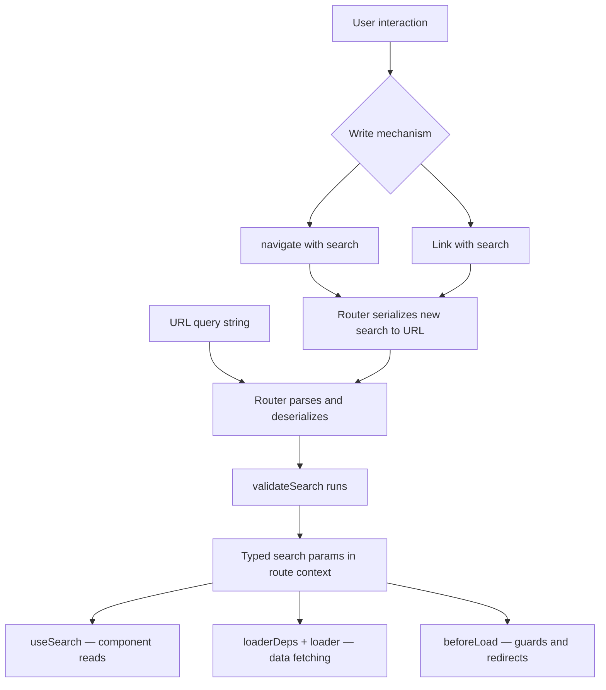

## Reading and Writing Search Params

### Overview

Once search params are declared and validated on a route, TanStack Router provides a consistent set of APIs for reading their current values and writing new values back to the URL. Reading is handled primarily through `useSearch`. Writing is handled through `navigate`, `<Link>`, and `useNavigate` — all of which accept a typed `search` option. These APIs form a closed loop: validated schema in, typed reads and writes out.

---

### Reading Search Params

#### `useSearch`

The primary hook for reading search params in a component:

```ts
import { useSearch } from '@tanstack/react-router'

function ProductList() {
  const { query, page, sort, inStock } = useSearch({ from: '/products' })

  return <p>Page {page} — Sorted {sort}</p>
}
```

**Key Points**
- `from` identifies the route whose `validateSearch` schema defines the return type.
- The returned object is the validated output of `validateSearch` — already coerced and defaulted.
- `useSearch` is reactive: the component re-renders when any search param changes. [Inference: reactivity follows React's standard rendering model — granular subscriptions are not guaranteed unless the router implements them explicitly.]

#### Selecting a Subset with `select`

To avoid unnecessary re-renders when only a subset of params is needed, use the `select` option:

```ts
const page = useSearch({
  from: '/products',
  select: (search) => search.page,
})
```

The component re-renders only when `page` changes, not when other params like `query` or `sort` change. [Inference: depends on referential equality comparison — behavior may vary if `select` returns a new object on every call.]

```ts
// Selecting multiple fields — use a stable reference or memoize if needed
const { query, sort } = useSearch({
  from: '/products',
  select: (search) => ({ query: search.query, sort: search.sort }),
})
```

[Inference: returning a new object literal from `select` on every render may defeat the optimization. Consider `useCallback` or defining the selector outside the component if re-render frequency is a concern.]

#### Reading in Loaders

Search params are available in `loader` via `loaderDeps`. The `loader` function itself does not receive raw search — only the deps extracted by `loaderDeps`:

```ts
export const Route = createFileRoute('/products')({
  validateSearch: zodSearchValidator(searchSchema),
  loaderDeps: ({ search }) => ({
    page: search.page,
    query: search.query,
  }),
  loader: async ({ deps }) => {
    return fetchProducts({ page: deps.page, query: deps.query })
  },
})
```

**Key Points**
- Only params listed in `loaderDeps` trigger a loader re-run when changed.
- Params not included in `loaderDeps` are invisible to the loader's reactivity system — changing them will not re-invoke the loader. [Inference: this is by design to allow fine-grained control over loader invalidation.]

#### Reading in `beforeLoad`

The full validated search object is available in `beforeLoad` context:

```ts
export const Route = createFileRoute('/admin')({
  validateSearch: zodSearchValidator(adminSearchSchema),
  beforeLoad: ({ search }) => {
    if (!search.token) {
      throw redirect({ to: '/login' })
    }
  },
})
```

---

### Writing Search Params

Writing search params means producing a new URL with updated query string values. TanStack Router provides three mechanisms: `navigate`, `<Link>`, and `useNavigate`. All three accept a `search` option typed against the target route's schema.

#### Writing with `navigate`

```ts
import { useNavigate } from '@tanstack/react-router'

function Pagination({ currentPage }: { currentPage: number }) {
  const navigate = useNavigate()

  return (
    <button
      onClick={() =>
        navigate({
          to: '/products',
          search: (prev) => ({ ...prev, page: currentPage + 1 }),
        })
      }
    >
      Next Page
    </button>
  )
}
```

#### Writing with `<Link>`

```tsx
import { Link } from '@tanstack/react-router'

function SortToggle({ currentSort }: { currentSort: 'asc' | 'desc' }) {
  return (
    <Link
      to="/products"
      search={(prev) => ({
        ...prev,
        sort: currentSort === 'asc' ? 'desc' : 'asc',
      })}
    >
      Toggle Sort
    </Link>
  )
}
```

**Key Points**
- `<Link>` with a `search` function is preferred over `navigate` when the interaction maps directly to a visible anchor element, for accessibility reasons.
- Both `navigate` and `<Link>` support the function form of `search`, which receives the current validated search params and returns the next state.

---

### The Function Form of `search`

Both `navigate` and `<Link>` accept `search` as either a static object or a function:

```ts
// Static — replaces all search params
search: { page: 2, query: '', sort: 'asc', inStock: false }

// Function — derives next state from current state
search: (prev) => ({ ...prev, page: 2 })
```

**Key Points**
- The static form replaces all search params. Any params not included are dropped from the URL.
- The function form receives the currently validated search params of the current route as `prev`. Spreading `prev` preserves params not being changed.
- The `prev` argument in the function form is typed based on the current route's schema, not the target route's schema. When navigating between different routes with different schemas, the types may diverge. [Inference: cross-route `prev` typing behavior depends on router version and whether `from` is specified.]

#### Merging vs Replacing

```ts
// Replaces — page and sort are lost if not included
navigate({
  to: '/products',
  search: { query: 'shoes' },
})

// Merges — page and sort are preserved
navigate({
  to: '/products',
  search: (prev) => ({ ...prev, query: 'shoes' }),
})
```

---

### Resetting Search Params

To clear all search params, pass an empty object or an object containing only required fields with their defaults:

```ts
navigate({
  to: '/products',
  search: { query: '', page: 1, sort: 'asc', inStock: false },
})
```

There is no dedicated "reset" API — resetting is achieved by navigating with the desired default values explicitly. [Inference: if the schema uses `.default()`, omitting a field from a static `search` object may still be rejected by TypeScript if the field is required in the schema output type.]

---

### Reading and Writing in the Same Component

A common pattern combines `useSearch` for reading and `useNavigate` for writing in the same component:

```tsx
import { useSearch, useNavigate } from '@tanstack/react-router'

function SearchBar() {
  const { query, page } = useSearch({ from: '/products' })
  const navigate = useNavigate()

  function handleQueryChange(newQuery: string) {
    navigate({
      to: '/products',
      search: (prev) => ({ ...prev, query: newQuery, page: 1 }),
    })
  }

  return (
    <input
      value={query}
      onChange={(e) => handleQueryChange(e.target.value)}
      placeholder="Search products..."
    />
  )
}
```

**Key Points**
- Resetting `page` to `1` on a query change is intentional — changing the query invalidates any existing page offset.
- The URL is the source of truth for `query`. The input's `value` is derived from `useSearch`, not from local state. This makes the component URL-driven by design.

---

### Diagram: Read and Write Data Flow



---

### Controlled Inputs Backed by Search Params

Search params can back controlled form inputs, making filters and search boxes URL-persistent without separate state management:

```tsx
import { useSearch, useNavigate } from '@tanstack/react-router'

function FilterPanel() {
  const { category, inStock, sort } = useSearch({ from: '/products' })
  const navigate = useNavigate()

  function set<K extends keyof typeof search>(
    key: K,
    value: (typeof search)[K]
  ) {
    navigate({
      to: '/products',
      search: (prev) => ({ ...prev, [key]: value }),
    })
  }

  const search = { category, inStock, sort }

  return (
    <div>
      <select
        value={category ?? ''}
        onChange={(e) => set('category', e.target.value || undefined)}
      >
        <option value="">All</option>
        <option value="electronics">Electronics</option>
        <option value="books">Books</option>
      </select>

      <label>
        <input
          type="checkbox"
          checked={inStock}
          onChange={(e) => set('inStock', e.target.checked)}
        />
        In Stock Only
      </label>

      <select
        value={sort}
        onChange={(e) => set('sort', e.target.value as 'asc' | 'desc')}
      >
        <option value="asc">Ascending</option>
        <option value="desc">Descending</option>
      </select>
    </div>
  )
}
```

[Inference: each `set` call triggers a navigation and a re-render cycle. For high-frequency inputs like text fields, debouncing the navigate call may be appropriate to avoid excessive history entries and re-renders.]

---

### Debouncing Search Param Writes

For text inputs backed by search params, debouncing avoids creating a history entry on every keystroke:

```tsx
import { useSearch, useNavigate } from '@tanstack/react-router'
import { useDebouncedCallback } from 'use-debounce' // external library

function SearchInput() {
  const { query } = useSearch({ from: '/products' })
  const navigate = useNavigate()

  const debouncedNavigate = useDebouncedCallback((value: string) => {
    navigate({
      to: '/products',
      search: (prev) => ({ ...prev, query: value, page: 1 }),
      replace: true,
    })
  }, 300)

  return (
    <input
      defaultValue={query}
      onChange={(e) => debouncedNavigate(e.target.value)}
    />
  )
}
```

**Key Points**
- `replace: true` prevents each debounced update from adding a history entry, keeping the back button functional.
- Using `defaultValue` instead of `value` makes the input uncontrolled locally, avoiding a re-render on every keystroke while the debounce is pending. [Inference: this means the input value and the URL value are briefly out of sync during the debounce window — acceptable for most search UIs.]

---

### Caveats and Limitations

- `useSearch` returns the validated output of `validateSearch`. If the URL contains params not declared in the schema, they are not present in the returned object.
- Writing search params via `navigate` or `<Link>` serializes values using TanStack Router's internal serializer. Complex types such as arrays, nested objects, or `Date` instances may not serialize as expected without a custom serializer. [Inference]
- When the function form of `search` is used across different routes — for example, navigating from `/orders` to `/products` — the `prev` argument reflects the current route's schema, which may not match the target schema. The spread may include keys that the target route's schema does not declare. [Inference: undeclared keys may be stripped at validation time on the next route load.]
- Re-renders triggered by `useSearch` are scoped to the validated params object. If the schema changes structure across a version update, components consuming `useSearch` may need corresponding updates. [Inference]

---

**Related Topics**
- Debouncing and throttling search param writes
- `replace: true` and history stack management
- Custom search serializers for arrays and complex types
- `useRouterState` — accessing raw location and search string
- Combining `useSearch` with `useSuspenseQuery` for data fetching
- Search params as filter state — patterns for data tables
- Preserving search params across nested route navigation
- `loaderDeps` reactivity and cache invalidation