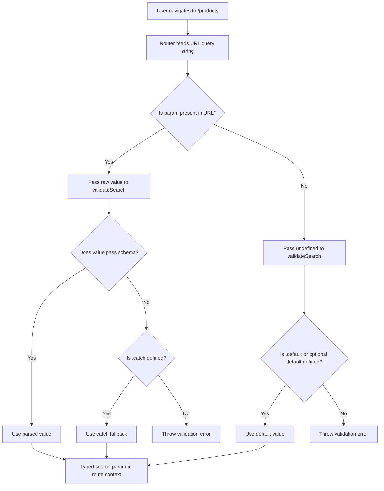

## Default Search Param Values

### Overview

Default search param values define what a param resolves to when it is absent from the URL. In TanStack Router, defaults are not declared through a dedicated router API — they are established inside `validateSearch`, either through manual fallback logic or through the default mechanisms of the schema library in use. The approach chosen affects URL cleanliness, type inference, and navigation behavior in ways that are worth understanding explicitly.

---

### Where Defaults Live

Defaults are set at the schema level inside `validateSearch`. The router has no separate defaults registry. When a param is missing from the URL, the raw input to `validateSearch` will contain `undefined` for that key, and the schema is responsible for substituting a value.

```ts
validateSearch: (search: Record<string, unknown>) => ({
  page: typeof search.page === 'number' ? search.page : 1,
  sort: (search.sort as string) ?? 'asc',
  query: (search.query as string) ?? '',
})
```

This is the manual approach — explicit, dependency-free, and verbose. Schema libraries reduce this verbosity considerably.

---

### Defaults with Zod

#### `.default()`

`.default(value)` substitutes the given value when the input is `undefined`:

```ts
const searchSchema = z.object({
  page: z.coerce.number().int().min(1).default(1),
  sort: z.enum(['asc', 'desc']).default('asc'),
  query: z.string().default(''),
  inStock: z.string().transform((v) => v === 'true').default('false'),
})
```

**Key Points**
- `.default()` only activates when the input is `undefined` — not when it is `null`, `""`, or any other falsy value.
- `.default()` is applied before other validations in Zod's pipeline. [Inference: exact pipeline order is Zod-internal and may be version-sensitive — verify against the Zod version in use.]
- The type of the output field becomes non-optional when `.default()` is present — the inferred type reflects that the value is always present after validation.

#### `.catch()`

`.catch(fallback)` substitutes the fallback when parsing fails for any reason, including type mismatches, constraint violations, or transform errors:

```ts
const searchSchema = z.object({
  page: z.coerce.number().int().min(1).catch(1),
  sort: z.enum(['asc', 'desc']).catch('asc'),
})
```

**Key Points**
- `.catch()` is fault-tolerant: it handles both missing values and invalid values.
- `.default()` only handles missing values — passing `?page=abc` will still throw without `.catch()`.
- For URL-sourced params, `.catch()` is generally more appropriate than `.default()` alone, since users or external links may pass malformed values.

#### Combining `.default()` and `.catch()`

```ts
page: z.coerce.number().int().min(1).default(1).catch(1),
```

This covers both cases: missing param defaults to `1`, invalid param falls back to `1`. The combination is redundant for the missing-param case but makes intent explicit. [Inference: the exact evaluation order of `.default()` and `.catch()` in Zod is internal — test behavior for the version in use if order matters.]

---

### Defaults with Valibot

Valibot handles defaults through `optional(schema, defaultValue)` or `withDefault`:

```ts
import {
  parse, object, string, number, boolean,
  optional, pipe, transform, toMinValue
} from 'valibot'

const searchSchema = object({
  query: optional(string(), ''),
  page: optional(
    pipe(string(), transform(Number), toMinValue(1)),
    1
  ),
  sort: optional(string(), 'asc'),
  inStock: optional(
    pipe(string(), transform((v) => v === 'true')),
    false
  ),
})
```

**Key Points**
- The second argument to `optional()` is the default value applied when the input is `undefined`.
- Valibot does not have a direct equivalent to Zod's `.catch()` for field-level fault tolerance. Invalid values that fail schema constraints will throw. [Inference: error recovery strategies in Valibot may require wrapping at the object level or custom transform logic.]

[Unverified: Valibot API is version-sensitive. The above reflects patterns from Valibot v0.31+. Confirm against the version in use.]

---

### Defaults and URL Cleanliness

A key design decision is whether to include default values in the URL or omit them. Both approaches are valid — they have different tradeoffs.

#### Omitting Defaults from the URL

When a param equals its default, it can be excluded from the URL. This produces shorter, cleaner URLs:

```
/products              → page=1, sort='asc', query=''
/products?page=2       → page=2, sort='asc', query=''
/products?sort=desc    → page=1, sort='desc', query=''
```

This requires that navigation calls use the function form of `search` and explicitly omit default-valued params:

```ts
navigate({
  to: '/products',
  search: (prev) => {
    const next = { ...prev, page: 2 }
    if (next.sort === 'asc') delete (next as Partial<typeof next>).sort
    return next
  },
})
```

This is manual and error-prone. TanStack Router does not provide an automatic mechanism for omitting default-valued params from URLs. [Inference: any omission logic must be authored and maintained manually or abstracted into a utility.]

#### Including Defaults in the URL

Simpler to implement — always write all params explicitly:

```ts
navigate({
  to: '/products',
  search: { page: 2, sort: 'asc', query: '', inStock: false },
})
```

URLs are longer but unambiguous:

```
/products?page=2&sort=asc&query=&inStock=false
```

**Conclusion**  
For most applications, including defaults in the URL is simpler and less error-prone. Omitting them is a valid optimization for URL aesthetics, particularly when URLs are shared externally, but requires additional authoring discipline.

---

### Defaults in `<Link>` and `navigate`

When writing search params, defaults must be explicitly included in the static form or they will be absent from the URL:

```ts
// If the user navigates here, 'page' is absent from the URL
// validateSearch will default it to 1 — but the URL reads '/products?sort=desc'
navigate({
  to: '/products',
  search: { sort: 'desc' },
})

// Explicit — URL reads '/products?page=1&sort=desc&query=&inStock=false'
navigate({
  to: '/products',
  search: { page: 1, sort: 'desc', query: '', inStock: false },
})
```

Neither is wrong — the behavior depends on whether URL cleanliness or explicitness is the priority.

---

### Utility: A `useSearchWithDefaults` Pattern

To consistently apply defaults when reading and avoid scattering default values across the codebase, the schema's inferred type and a defaults constant can be combined:

```ts
import { z } from 'zod'

export const searchSchema = z.object({
  page: z.coerce.number().int().min(1).catch(1),
  sort: z.enum(['asc', 'desc']).catch('asc'),
  query: z.string().catch(''),
  inStock: z.string().transform((v) => v === 'true').catch(false),
})

export type ProductSearch = z.infer<typeof searchSchema>

export const productSearchDefaults: ProductSearch = {
  page: 1,
  sort: 'asc',
  query: '',
  inStock: false,
}
```

Navigation calls can then spread from defaults:

```ts
navigate({
  to: '/products',
  search: { ...productSearchDefaults, sort: 'desc' },
})
```

This creates a single source of truth for defaults, usable in both navigation and reset operations. [Inference: this pattern is not enforced by the router — it is a convention that must be maintained by the team.]

---

### Defaults for Optional vs Required Params

The schema output type determines whether a param is required in navigation calls.

```ts
const searchSchema = z.object({
  page: z.coerce.number().default(1),  // always present in output — required in search object
  tag: z.string().optional(),           // may be absent — optional in search object
})
```

- `page` has a default, so its output type is `number` (not `number | undefined`). Navigation calls must include `page` or TypeScript will not infer it as present — though the URL may omit it and `validateSearch` will substitute the default at read time.
- `tag` is optional — its type is `string | undefined`. It can be omitted from navigation calls without TypeScript errors.

[Inference: TypeScript enforcement of required vs optional params in `search` objects depends on correct route tree generation and strict mode. Behavior may vary.]

---

### Diagram: Default Resolution Flow



---

### Caveats and Limitations

- Defaults defined in `validateSearch` are applied at read time only. They do not retroactively update the URL — the URL remains as the user or navigation call left it. [Inference: this means the URL and the validated params may represent different states when defaults are active.]
- `.default()` in Zod does not cover invalid input — only absent input. A URL with `?page=xyz` will throw from `z.number()` even with `.default(1)`. Use `.catch()` or `.default().catch()` for URL-sourced params. [Fact for Zod behavior — verify against version in use.]
- When sharing URLs externally, default-omitting URLs depend on the receiving application running the same `validateSearch` logic. If the schema changes, previously valid short URLs may resolve differently. [Inference]
- TypeScript's type for a field with `.default()` reflects the post-validation shape — always present. But the URL may still omit that field, and the router resolves it at runtime. These two representations are not always visually aligned when debugging.

---

**Related Topics**
- `z.catch()` vs `.default()` — Zod fault tolerance strategies in depth
- Custom search serializers — controlling how params are written to and read from the URL
- Resetting search params to defaults — navigation patterns
- Optional vs required params in schema design
- Search param persistence across navigations — when params carry over and when they do not
- URL design conventions for filter and pagination state
- `loaderDeps` and how defaults interact with loader cache invalidation
- Sharing and bookmarking URLs with default-omitting param strategies