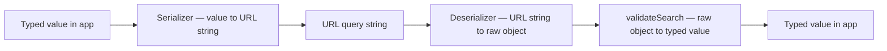
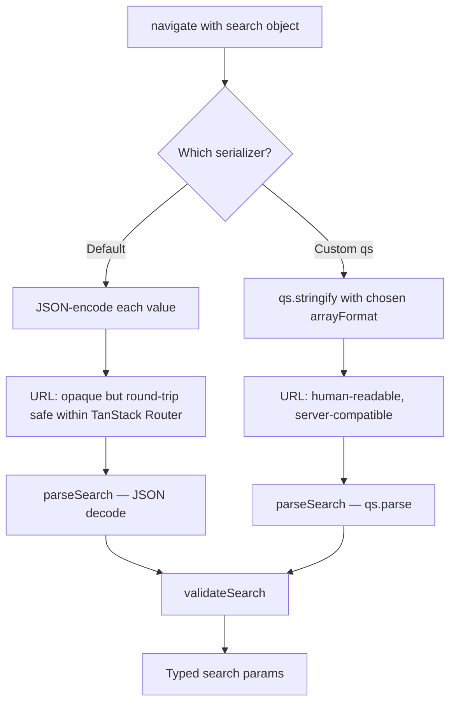

## Search Param Serialization

### Overview

Serialization is the process of converting typed in-memory values into URL query string representations, and deserialization is the reverse — parsing the URL string back into values that `validateSearch` can process. TanStack Router handles both automatically using a built-in serializer. Understanding how this serializer works, what it supports natively, and where it falls short determines how reliably complex types survive a round-trip through the URL.

---

### The Serialization Round-Trip

Every search param write-read cycle passes through two transformations:



The serializer runs when `navigate` or `<Link>` writes params to the URL. The deserializer runs when the router reads the URL, before `validateSearch` is called. `validateSearch` then converts the deserialized raw object into the application's typed shape.

Serialization fidelity — whether a value survives this round-trip unchanged — depends on what the serializer supports and how `validateSearch` handles the deserialized form.

---

### TanStack Router's Default Serializer

TanStack Router uses a JSON-based serializer by default. Values passed to the `search` option of `navigate` or `<Link>` are serialized using a process similar to `JSON.stringify`, then encoded into the query string. On read, the string is decoded and parsed back into a raw object.

**Key Points**
- Primitive types — `string`, `number`, `boolean`, `null` — round-trip reliably with the default serializer. [Inference: confirmed for standard usage; edge cases with special characters or encoding are not fully verified.]
- `undefined` values are typically omitted from the serialized output — the corresponding key does not appear in the URL.
- The exact encoding format is router-internal and not guaranteed to match standard `application/x-www-form-urlencoded` or `URLSearchParams` output. [Inference: TanStack Router's default format uses JSON encoding per param value, not raw string encoding.]

---

### Primitive Type Behavior

| Type | Written value | URL representation | Deserialized as |
|---|---|---|---|
| `string` | `"electronics"` | `?category=electronics` | `"electronics"` |
| `number` | `2` | `?page=2` | `2` (number, not string) |
| `boolean` | `true` | `?inStock=true` | `true` (boolean) |
| `null` | `null` | `?tag=null` | `null` |
| `undefined` | `undefined` | *(key omitted)* | `undefined` |

[Inference: the above reflects expected behavior based on TanStack Router's JSON-based serialization. Actual encoding in the URL string — e.g. whether `2` appears as `2` or `%222%22` — depends on the serializer implementation and may not be human-readable in all cases. Verify with the version in use.]

---

### Arrays

Arrays are a common source of serialization complexity. The default serializer handles arrays, but the URL representation may not match what other systems expect.

```ts
// Writing an array
navigate({
  to: '/products',
  search: { tags: ['shoes', 'running', 'sale'] },
})
```

The resulting URL will encode the array in a JSON-compatible format, not as repeated keys (`?tags=shoes&tags=running&tags=sale`) or comma-separated values (`?tags=shoes,running,sale`). [Inference: exact encoding format is internal to TanStack Router's serializer — do not rely on it being human-readable or compatible with server-side query parsers without verification.]

`validateSearch` must handle the deserialized form, which will be a JavaScript array:

```ts
const searchSchema = z.object({
  tags: z.array(z.string()).default([]),
})
```

**Key Points**
- Arrays round-trip reliably within TanStack Router's own serializer.
- If the URL is constructed externally — from a server redirect, a manually typed URL, or another framework — the array encoding may not match what TanStack Router's deserializer expects. [Inference]
- If interoperability with standard query string formats is required, a custom serializer is necessary.

---

### Nested Objects

Nested objects can be serialized, but their URL representation is opaque:

```ts
navigate({
  to: '/reports',
  search: {
    filters: {
      dateRange: { from: '2024-01-01', to: '2024-12-31' },
      status: 'active',
    },
  },
})
```

[Inference: TanStack Router will serialize this nested object, but the resulting URL string will not be human-readable in a conventional sense. The round-trip will work within TanStack Router but will not be parseable by standard URL parsers or backend query string libraries without custom handling.]

For nested structures, consider flattening to top-level params where possible:

```ts
// Prefer flat params for readability and interoperability
search: {
  dateFrom: '2024-01-01',
  dateTo: '2024-12-31',
  status: 'active',
}
```

---

### Dates

`Date` objects do not serialize reliably through JSON round-trips because `JSON.stringify` converts them to ISO strings, and `JSON.parse` returns them as strings — not `Date` instances.

```ts
// Writing
navigate({ to: '/events', search: { date: new Date('2024-06-01') } })

// After deserialization, 'date' arrives in validateSearch as a string: "2024-06-01T00:00:00.000Z"
// Not as a Date instance
```

Handle this in `validateSearch` by treating dates as strings and converting explicitly:

```ts
const searchSchema = z.object({
  date: z.string().default(new Date().toISOString().split('T')[0]),
})

// Or convert to Date in the component after reading:
const { date } = useSearch({ from: '/events' })
const dateObj = new Date(date)
```

Storing dates as ISO strings in search params and converting at point of use is the most reliable pattern. [Inference: storing `Date` objects directly in search params is not recommended with any JSON-based serializer.]

---

### Custom Serializers

TanStack Router allows replacing the default serializer by passing `stringifySearch` and `parseSearch` to the router instance:

```ts
import { createRouter } from '@tanstack/react-router'
import { stringify, parse } from 'qs' // example: qs library

const router = createRouter({
  routeTree,
  stringifySearch: (search) => '?' + stringify(search, { arrayFormat: 'repeat' }),
  parseSearch: (searchStr) => parse(searchStr, { ignoreQueryPrefix: true }),
})
```

**Key Points**
- `stringifySearch` receives the raw search object and must return a complete query string including the leading `?`.
- `parseSearch` receives the raw query string (including `?`) and must return a `Record<string, unknown>`.
- The returned object from `parseSearch` is passed directly to `validateSearch` on each route — its shape must be compatible with what each route's schema expects.
- Custom serializers apply globally — all routes use the same serializer. [Inference: there is no per-route serializer override in the standard API.]

---

### Using `qs` as a Custom Serializer

`qs` is a well-established query string library that supports arrays, nested objects, and various encoding formats in a standards-adjacent way.

```ts
import { stringify, parse } from 'qs'
import { createRouter } from '@tanstack/react-router'

const router = createRouter({
  routeTree,
  stringifySearch: (search) =>
    stringify(search, {
      addQueryPrefix: true,
      arrayFormat: 'repeat',       // ?tags=shoes&tags=running
      encodeValuesOnly: true,
      skipNulls: true,
    }),
  parseSearch: (search) =>
    parse(search, {
      ignoreQueryPrefix: true,
      parseArrays: true,
    }) as Record<string, unknown>,
})
```

With this configuration:

| Value | URL with default serializer | URL with `qs` + repeat |
|---|---|---|
| `tags: ['a', 'b']` | `?tags=%5B%22a%22%2C%22b%22%5D` | `?tags=a&tags=b` |
| `page: 2` | `?page=2` | `?page=2` |
| `active: true` | `?active=true` | `?active=true` |

[Inference: exact default serializer encoding is approximated above for illustration — actual encoding characters may differ. The `qs` output column reflects documented `qs` behavior with `arrayFormat: 'repeat'`.]

**Key Points**
- With `qs` and `arrayFormat: 'repeat'`, arrays arrive in `parseSearch` as JavaScript arrays, which Zod's `z.array()` can validate directly without coercion.
- `qs` does not coerce strings to numbers or booleans — `validateSearch` must still handle coercion. `?page=2` arrives as `"2"` (string) with `qs`, requiring `z.coerce.number()`.
- Choosing `arrayFormat` affects interoperability with backend APIs. `repeat` (`?a=1&a=2`) is most widely supported across server frameworks.

---

### Using `query-string` as a Custom Serializer

An alternative to `qs` with a simpler API:

```ts
import { stringify, parse } from 'query-string'
import { createRouter } from '@tanstack/react-router'

const router = createRouter({
  routeTree,
  stringifySearch: (search) =>
    '?' + stringify(search, { arrayFormat: 'none', skipNull: true }),
  parseSearch: (search) =>
    parse(search, {
      arrayFormat: 'none',
      parseNumbers: false,
      parseBooleans: false,
    }) as Record<string, unknown>,
})
```

[Unverified: `query-string` v8+ changed its API significantly. Confirm the exact options for the version in use.]

---

### Interoperability with Server-Side Query Parsers

When TanStack Router is used with a server that reads the same URL query string — for example, in SSR or API routes — the serializer format must be compatible with the server's parser.

**Key Points**
- Node.js `url.parse` and `URLSearchParams` parse repeated keys as the last value only, unless the framework wraps them. Arrays encoded as `?tags=a&tags=b` may not parse correctly on the server without a library like `qs`.
- If the server uses `qs` with the same options, round-trip compatibility is achievable.
- The default TanStack Router serializer is not designed for server compatibility. [Inference: using the default serializer in SSR contexts where the server must parse search params requires a shared custom serializer.]

---

### Diagram: Default vs Custom Serializer Paths



---

### Serialization Checklist

| Concern | Default serializer | Custom serializer needed |
|---|---|---|
| Primitive types | Reliable | Not required |
| Arrays | Works, but opaque encoding | Required for server compatibility or readable URLs |
| Nested objects | Works, but opaque encoding | Required for readability or interoperability |
| Dates | Store as strings | Consistent either way |
| SSR / server reads same URL | Likely incompatible | Required |
| Shareable human-readable URLs | Partially | Recommended |
| External links or redirects | May fail for complex types | Required |

---

### Caveats and Limitations

- The default serializer's internal format is not part of TanStack Router's public API contract and may change across versions. [Unverified: no explicit stability guarantee has been confirmed in documentation.]
- Switching serializers after a production deployment changes how existing bookmarked or shared URLs are parsed, potentially breaking them. Serializer choice is a long-term commitment. [Inference]
- Custom serializers apply to all routes uniformly. There is no mechanism for per-route serialization in the standard API. [Inference: may be addressable through wrapper utilities, but not natively supported.]
- `parseSearch` receives the full query string including `?`. Forgetting to strip `?` with `ignoreQueryPrefix` or equivalent will corrupt all deserialized values.
- Values that are not JSON-serializable — functions, class instances, circular references — cannot be stored in search params with any serializer. [Fact: fundamental URL constraint.]

---

**Related Topics**
- `qs` library — array formats, nested object encoding, and options reference
- `validateSearch` coercion — handling string inputs from non-JSON serializers
- SSR and search param compatibility — aligning client and server parsers
- URL length limits — practical constraints on how much state can live in search params
- Custom serializer testing strategies — verifying round-trip fidelity
- Search param encoding and special characters — percent-encoding edge cases
- Migrating serializers in production — handling legacy URLs gracefully
- Comparing `qs`, `query-string`, and `URLSearchParams` for TanStack Router use