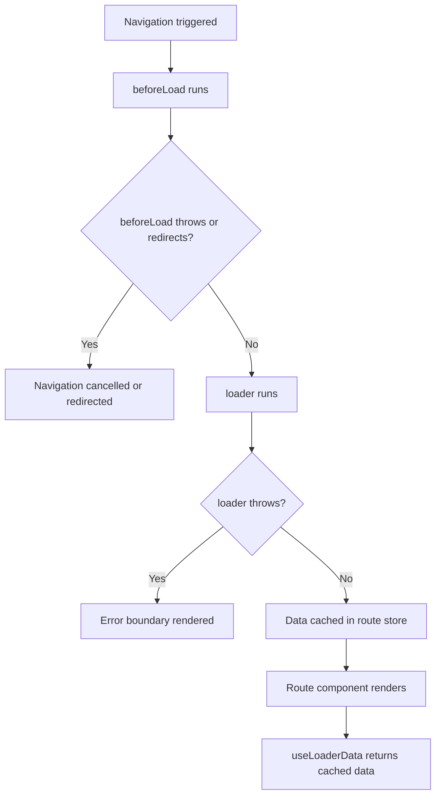

## Route Loaders

### Overview

Route loaders are functions defined on a route that fetch or prepare data before the route renders. TanStack Router calls the loader before the route's component mounts, making data available synchronously at render time without waterfall loading states inside components. Loaders are the primary data-fetching primitive in TanStack Router's own data layer — though they can also be used as integration points with external libraries like TanStack Query.

---

### Defining a Loader

Loaders are defined on a route using the `loader` property:

```ts
import { createFileRoute } from '@tanstack/react-router'

export const Route = createFileRoute('/products')({
  loader: async () => {
    const products = await fetchProducts()
    return products
  },
})
```

**Key Points**
- The return value of `loader` is stored in the route's data cache and becomes accessible to components via `useLoaderData`.
- The loader runs on every navigation to the route unless the data is still considered fresh by the cache. [Inference: freshness behavior depends on `staleTime` and related cache configuration.]
- Loaders are async by nature but may return synchronously if no async work is needed.

---

### Accessing Loader Data in Components

Use `useLoaderData` inside any component rendered under the route:

```ts
import { useLoaderData } from '@tanstack/react-router'

function ProductList() {
  const products = useLoaderData({ from: '/products' })
  return (
    <ul>
      {products.map((p) => <li key={p.id}>{p.name}</li>)}
    </ul>
  )
}
```

**Key Points**
- `from` identifies the route whose loader data to read. It is required for correct type inference.
- The return type of `useLoaderData` is inferred from the loader's return type — no manual typing is needed. [Inference: requires correct route tree generation.]
- `useLoaderData` does not suspend or trigger loading states when used correctly — data is already resolved by the time the component renders.

---

### Loader Context

The `loader` function receives a context object with several useful properties:

```ts
loader: async ({ params, search, context, location, abortController }) => {
  // params     — typed path parameters for this route
  // search     — validated search params (requires loaderDeps)
  // context    — router context and any beforeLoad context injected values
  // location   — current location object
  // abortController — for cancelling in-flight requests
}
```

#### Path Parameters

```ts
export const Route = createFileRoute('/products/$productId')({
  loader: async ({ params }) => {
    return fetchProduct(params.productId)
  },
})
```

`params.productId` is typed based on the route's path definition. [Inference: type safety requires correct route tree generation and TypeScript configuration.]

#### Search Parameters via `loaderDeps`

The loader does not receive the full search object directly. Search params must be declared as loader dependencies through `loaderDeps`:

```ts
export const Route = createFileRoute('/products')({
  validateSearch: zodSearchValidator(searchSchema),
  loaderDeps: ({ search }) => ({
    page: search.page,
    category: search.category,
  }),
  loader: async ({ deps }) => {
    return fetchProducts({ page: deps.page, category: deps.category })
  },
})
```

**Key Points**
- Only params declared in `loaderDeps` are available in `deps` inside the loader.
- `loaderDeps` also determines which search param changes trigger a loader re-run. Params not listed are invisible to the loader's reactivity. [Inference: this is intentional — omitting a param from `loaderDeps` means the loader will not re-run when that param changes.]
- The return value of `loaderDeps` is used as a cache key component. [Inference: exact caching behavior is version-dependent.]

---

### Router Context in Loaders

TanStack Router supports injecting shared context — such as authentication state or API clients — through the router's `context` option. This context is available in every loader:

```ts
// Router setup
const router = createRouter({
  routeTree,
  context: {
    auth: getAuthService(),
    apiClient: createApiClient(),
  },
})

// Route loader
export const Route = createFileRoute('/dashboard')({
  loader: async ({ context }) => {
    const user = await context.apiClient.getUser(context.auth.userId)
    return { user }
  },
})
```

**Key Points**
- Router context is the recommended way to share services, clients, or utilities across loaders without module-level singletons. [Inference]
- Context is typed — the router infers context types from the `context` option, and each loader receives the full typed context object.
- `beforeLoad` can augment or transform context before it reaches the loader. Values added in `beforeLoad` are merged into the context object received by the loader.

---

### Loader Lifecycle and Timing



**Key Points**
- `beforeLoad` always runs before the loader. It is the correct place for authentication checks and redirects.
- If `beforeLoad` throws a redirect, the loader never runs.
- If the loader throws, the route's error boundary handles it. [Inference: requires an error boundary to be configured on the route or a parent route.]

---

### Parallel Loaders

Nested routes run their loaders in parallel by default. For a route tree such as `/dashboard/settings`, the loaders for both `/dashboard` and `/dashboard/settings` run concurrently, not sequentially:

```ts
// Both run at the same time when navigating to /dashboard/settings
export const dashboardRoute = createFileRoute('/dashboard')({
  loader: async () => fetchDashboardData(),   // runs in parallel
})

export const settingsRoute = createFileRoute('/dashboard/settings')({
  loader: async () => fetchSettingsData(),    // runs in parallel
})
```

**Key Points**
- Parallel loader execution is one of TanStack Router's primary performance advantages over routers that serialize nested data fetching.
- A child loader does not have access to the parent loader's return value at the time it runs — both start simultaneously. [Inference: if a child loader depends on parent loader data, it must fetch that data independently or use router context instead.]

---

### Aborting Loader Requests

Each loader receives an `abortController` that signals cancellation when the navigation is superseded:

```ts
loader: async ({ abortController }) => {
  const response = await fetch('/api/products', {
    signal: abortController.signal,
  })
  return response.json()
}
```

**Key Points**
- Pass `abortController.signal` to `fetch` or any library that accepts an `AbortSignal` to cancel in-flight requests when the user navigates away before the loader completes.
- Not handling the abort signal means the request continues in the background even after the navigation is cancelled. This wastes bandwidth and may cause state updates on unmounted components. [Inference: consequences depend on what the loader does with its return value after abort.]

---

### Error Handling in Loaders

Errors thrown from a loader are caught by the router and rendered through the route's `errorComponent`:

```ts
export const Route = createFileRoute('/products/$productId')({
  loader: async ({ params }) => {
    const product = await fetchProduct(params.productId)
    if (!product) {
      throw new Error(`Product ${params.productId} not found`)
    }
    return product
  },
  errorComponent: ({ error }) => (
    <div>Failed to load: {error.message}</div>
  ),
})
```

TanStack Router also provides a `notFound` helper for 404-style errors:

```ts
import { notFound } from '@tanstack/react-router'

loader: async ({ params }) => {
  const product = await fetchProduct(params.productId)
  if (!product) throw notFound()
  return product
}
```

`notFound()` renders the route's `notFoundComponent` rather than its `errorComponent`. [Inference: requires `notFoundComponent` to be configured on the route or a parent route — behavior when absent is version-dependent.]

---

### Redirects from Loaders

The loader can redirect by throwing a `redirect`:

```ts
import { redirect } from '@tanstack/react-router'

loader: async ({ context }) => {
  if (!context.auth.isAuthenticated) {
    throw redirect({ to: '/login' })
  }
  return fetchProtectedData()
}
```

**Key Points**
- Redirects from loaders are thrown, not returned. Returning a redirect object has no effect.
- `redirect` accepts the same options as `navigate` — `to`, `search`, `params`, `replace`, and others.
- Authentication checks are more commonly placed in `beforeLoad` than in the loader, since `beforeLoad` runs earlier and prevents the loader from executing at all. [Inference: placing auth checks in the loader is valid but slightly less efficient.]

---

### Loader Caching and Staleness

TanStack Router caches loader data per route match. The behavior is controlled by `staleTime` and `gcTime`:

```ts
export const Route = createFileRoute('/products')({
  loader: async () => fetchProducts(),
  staleTime: 30_000,   // data considered fresh for 30 seconds
  gcTime: 60_000,      // cached data kept in memory for 60 seconds after no longer active
})
```

**Key Points**
- If cached data is still within `staleTime`, the loader does not re-run on re-navigation — the cached value is returned immediately.
- After `staleTime` elapses, the next navigation to the route re-runs the loader.
- After `gcTime` elapses and the route is no longer active, the cached data is discarded.
- Default values for `staleTime` and `gcTime` are version-dependent. [Unverified: confirm defaults for the router version in use.]

---

### Pending State and `pendingComponent`

When a loader takes time to resolve, TanStack Router can render a pending component:

```ts
export const Route = createFileRoute('/products')({
  loader: async () => {
  	await new Promise(r => setTimeout(r, 1000)) // simulate delay
    return fetchProducts()
  },
  pendingComponent: () => <div>Loading products...</div>,
  pendingMs: 300,      // only show pending component if loader takes longer than 300ms
  pendingMinMs: 500,   // show pending component for at least 500ms to avoid flicker
})
```

**Key Points**
- `pendingMs` prevents the pending component from flashing for fast loaders. [Inference: if the loader resolves within `pendingMs`, the pending component never renders.]
- `pendingMinMs` prevents the pending component from disappearing too quickly after it appears, avoiding layout flicker. [Inference]
- These options are optional. Without them, the pending component renders immediately when the loader starts and disappears when it finishes.

---

### Using Loaders as TanStack Query Integration Points

TanStack Router loaders are commonly used to prefetch TanStack Query cache entries rather than return data directly. This integrates the two libraries while keeping components connected to TanStack Query's cache:

```ts
import { queryClient } from '../queryClient'
import { productsQueryOptions } from '../queries/products'

export const Route = createFileRoute('/products')({
  loader: () => queryClient.ensureQueryData(productsQueryOptions),
})

// In the component
function ProductList() {
  const { data } = useSuspenseQuery(productsQueryOptions)
  // ...
}
```

**Key Points**
- `ensureQueryData` fetches if the cache is empty or stale, and returns immediately if fresh data exists.
- The component uses `useSuspenseQuery` rather than `useLoaderData`, keeping TanStack Query as the data source of truth.
- The loader's return value is not used in this pattern — its purpose is to prime the cache before render.
- This is the recommended integration pattern when TanStack Query is the primary server state library. [Inference: "recommended" based on common documentation examples — verify with current official guidance.]

---

### Full Example: Authenticated Route with Dynamic Param

```ts
import { createFileRoute, redirect, notFound } from '@tanstack/react-router'
import { z } from 'zod'

export const Route = createFileRoute('/orders/$orderId')({
  beforeLoad: ({ context }) => {
    if (!context.auth.isAuthenticated) {
      throw redirect({ to: '/login', search: { returnTo: '/orders' } })
    }
  },
  loader: async ({ params, context, abortController }) => {
    const order = await context.apiClient.getOrder(params.orderId, {
      signal: abortController.signal,
    })
    if (!order) throw notFound()
    return order
  },
  errorComponent: ({ error }) => <div>Error: {error.message}</div>,
  notFoundComponent: () => <div>Order not found.</div>,
  pendingComponent: () => <div>Loading order...</div>,
  pendingMs: 200,
  pendingMinMs: 300,
  staleTime: 10_000,
})
```

---

### Caveats and Limitations

- Loaders run on the server in SSR configurations. Any browser-only APIs used inside a loader will cause errors in SSR environments. [Inference: guard with environment checks or move browser-specific code to components.]
- Loader data is not reactive to external changes — it reflects the state at the time the loader ran. Polling, WebSocket updates, or manual invalidation are needed for live data. [Inference]
- The loader return value must be serializable if SSR is in use, since it is transferred from server to client. Functions, class instances, and non-serializable values will cause issues. [Inference: exact constraints depend on the SSR adapter in use.]
- Loaders do not have access to React context — only to the router context, params, deps, and location. If React context values are needed in a loader, they must be passed through router context instead. [Inference]
- Running too much work in parallel loaders on initial page load may compete for network resources, potentially slowing overall load time despite parallel execution. [Inference: trade-off is workload-dependent.]

---

**Related Topics**
- `beforeLoad` — pre-loader guards, redirects, and context augmentation
- `useLoaderData` — reading loader return values in components
- `loaderDeps` — controlling loader reactivity from search params
- `notFound` and `notFoundComponent` — 404 handling in loaders
- `errorComponent` — route-level error boundaries for loader failures
- `staleTime` and `gcTime` — loader cache configuration
- `pendingComponent`, `pendingMs`, `pendingMinMs` — loading UI configuration
- TanStack Query integration — `ensureQueryData` and `useSuspenseQuery` patterns
- SSR with loaders — server-side data fetching and hydration
- Abort signals — cancelling fetch requests on navigation