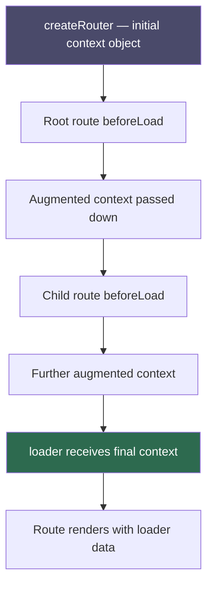
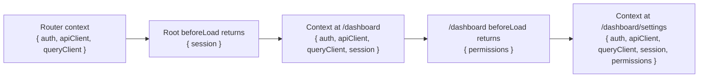

## Loader Context

### Overview

Loader context is a typed, router-wide object that is made available to every loader, `beforeLoad`, and other router lifecycle functions. It provides a structured way to share services, utilities, authentication state, or any application-level dependency with route-level code — without relying on module-level singletons, React context, or prop drilling. Context flows from the router definition through `beforeLoad` functions and into loaders, accumulating additional values as it passes through the route hierarchy.

---

### How Context Flows



Context starts at the router level, is optionally extended at each `beforeLoad` in the route hierarchy, and arrives at the loader fully assembled. Each `beforeLoad` can add new keys or transform existing ones. The loader receives the final merged result.

---

### Defining Initial Context at the Router Level

Context is declared when creating the router. The shape of the initial context must match the type expected by the root route:

```ts
// src/routeTree.gen.ts or root route file
import { createRootRouteWithContext } from '@tanstack/react-router'

interface RouterContext {
  auth: AuthService
  apiClient: ApiClient
  queryClient: QueryClient
}

export const rootRoute = createRootRouteWithContext<RouterContext>()({
  component: RootComponent,
})
```

```ts
// src/router.ts
import { createRouter } from '@tanstack/react-router'
import { routeTree } from './routeTree.gen'
import { authService } from './services/auth'
import { apiClient } from './services/api'
import { queryClient } from './queryClient'

export const router = createRouter({
  routeTree,
  context: {
    auth: authService,
    apiClient: apiClient,
    queryClient: queryClient,
  },
})
```

**Key Points**
- `createRootRouteWithContext<T>()` declares the expected shape of the context object. This is what gives `context` its type throughout the route tree.
- The `context` object passed to `createRouter` must satisfy the type declared in `createRootRouteWithContext`. TypeScript will surface mismatches at the router definition site.
- The context object is created once per router instance, not once per navigation. [Inference: for values that must reflect per-request state in SSR, context must be constructed per-request — see SSR section below.]

---

### Accessing Context in a Loader

Every loader receives `context` as part of its argument object:

```ts
export const Route = createFileRoute('/dashboard')({
  loader: async ({ context }) => {
    const user = await context.apiClient.getUser()
    return { user }
  },
})
```

The type of `context` is inferred from the root route's context declaration plus any augmentations made in parent `beforeLoad` functions. No manual type annotation is needed. [Inference: requires correct route tree generation.]

---

### Augmenting Context in `beforeLoad`

`beforeLoad` can return an object that is merged into the context before it is passed to the loader or to child route `beforeLoad` functions:

```ts
export const Route = createFileRoute('/dashboard')({
  beforeLoad: async ({ context }) => {
    const session = await context.auth.getSession()

    if (!session) {
      throw redirect({ to: '/login' })
    }

    // Returned object is merged into context
    return { session }
  },
  loader: async ({ context }) => {
    // context.session is now available and typed
    const profile = await context.apiClient.getProfile(context.session.userId)
    return { profile }
  },
})
```

**Key Points**
- The return value of `beforeLoad` is shallowly merged into the context object.
- Child routes inherit the augmented context — their `beforeLoad` and `loader` functions receive the parent's additions. [Inference: inheritance follows the route hierarchy.]
- If `beforeLoad` returns nothing (or `undefined`), the context is not modified.
- `beforeLoad` augmentations accumulate down the route tree. A deeply nested route receives all augmentations from all ancestor `beforeLoad` functions.

---

### Context Accumulation Across the Route Hierarchy



Each route adds to the context without removing what was already there. By the time a deeply nested loader runs, it has access to the full accumulated context.

---

### Type Safety for Augmented Context

When `beforeLoad` augments context, TypeScript must be able to infer the added properties in child routes. This works automatically when the route tree is correctly generated:

```ts
// Parent route
export const Route = createFileRoute('/dashboard')({
  beforeLoad: async ({ context }) => {
    const session = await context.auth.getSession()
    if (!session) throw redirect({ to: '/login' })
    return { session }   // TypeScript knows session is added here
  },
})

// Child route — context.session is typed
export const Route = createFileRoute('/dashboard/profile')({
  loader: async ({ context }) => {
    // context.session is available and typed — no assertion needed
    return context.apiClient.getProfile(context.session.userId)
  },
})
```

[Inference: type propagation of `beforeLoad` return values into child route context depends on correct route tree generation. Manual type assertions may be needed in some configurations — verify with the router version in use.]

---

### Common Context Patterns

#### Authentication Service

```ts
interface RouterContext {
  auth: {
    isAuthenticated: () => boolean
    getSession: () => Promise<Session | null>
    getToken: () => string | null
  }
}
```

Place authentication state in context rather than importing auth modules directly in loaders. This makes loaders testable in isolation by substituting the auth service in tests. [Inference: testability benefit depends on how the router and context are structured in tests.]

#### API Client

```ts
interface RouterContext {
  apiClient: {
    get: <T>(url: string, options?: RequestInit) => Promise<T>
    post: <T>(url: string, body: unknown) => Promise<T>
  }
}
```

Centralizing the API client in context allows request interceptors, base URL configuration, and auth header injection to be defined once.

#### TanStack Query Client

```ts
interface RouterContext {
  queryClient: QueryClient
}

// In a loader — prefetch into query cache
loader: async ({ context }) => {
  await context.queryClient.ensureQueryData(userQueryOptions)
}
```

Passing `QueryClient` through router context is the standard pattern for TanStack Query integration. [Inference: this is the approach shown in official TanStack Router + Query integration examples — verify against current documentation.]

#### Feature Flags

```ts
interface RouterContext {
  features: {
    betaDashboard: boolean
    newCheckout: boolean
  }
}

// In a loader — redirect if feature is disabled
loader: async ({ context }) => {
  if (!context.features.newCheckout) {
    throw redirect({ to: '/checkout/legacy' })
  }
}
```

---

### Context vs Module-Level Imports

A common question is when to use router context versus importing a service directly at the module level.

| Concern | Router context | Module-level import |
|---|---|---|
| Testability | Substitutable per test | Requires mocking the module |
| SSR per-request isolation | Supported via per-request context | Requires careful singleton management |
| Type safety | Fully typed through route tree | Depends on export types |
| Setup complexity | Requires router configuration | Simpler for small apps |
| Shared across all routes | Yes, automatically | Yes, but implicit |

**Key Points**
- For small applications or loaders that only need one or two utilities, module-level imports are simpler and acceptable.
- For applications with SSR, testing requirements, or many routes sharing the same services, router context is the more maintainable approach. [Inference]

---

### SSR Considerations

In server-side rendering, the router is typically instantiated per request to avoid sharing state between users. The context must therefore be constructed per request as well:

```ts
// Server entry point (simplified)
async function handleRequest(req: Request) {
  const router = createRouter({
    routeTree,
    context: {
      auth: createAuthService(req.headers.get('Authorization')),
      apiClient: createApiClient({ baseUrl: process.env.API_URL }),
      queryClient: new QueryClient(),
    },
  })

  const html = await renderToString(<RouterProvider router={router} />)
  return new Response(html, { headers: { 'Content-Type': 'text/html' } })
}
```

**Key Points**
- A new router instance per request means a new context per request. User-specific state does not leak between requests. [Inference: requires the application to not share mutable state in module scope that is also referenced by the context.]
- Services that are safe to share across requests — such as a connection pool or read-only configuration — can be created once outside the request handler.
- `QueryClient` should typically be created per request in SSR to avoid cross-request cache contamination. [Inference]

---

### Accessing Context Outside Loaders

Context is available in `beforeLoad`, `loader`, and several other router lifecycle positions:

| Position | Context available |
|---|---|
| `beforeLoad` | Yes — receives current accumulated context |
| `loader` | Yes — receives fully accumulated context |
| Route `component` | No — use `useRouteContext` hook instead |
| `errorComponent` | No — use `useRouteContext` hook instead |
| `notFoundComponent` | No — use `useRouteContext` hook instead |

#### `useRouteContext` in Components

```ts
import { useRouteContext } from '@tanstack/react-router'

function DashboardHeader() {
  const { session } = useRouteContext({ from: '/dashboard' })
  return <span>Welcome, {session.user.name}</span>
}
```

**Key Points**
- `useRouteContext` reads the context as it existed when the route's `beforeLoad` finished — not the loader's return value.
- `from` is required for type inference.
- Loader return values are accessed via `useLoaderData`, not `useRouteContext`.

---

### Full Example: Multi-Level Context Accumulation

```ts
// Root route — declares and augments base context
export const rootRoute = createRootRouteWithContext<RouterContext>()({
  component: RootComponent,
})

// Auth layout route — adds session to context
export const authRoute = createFileRoute('/_auth')({
  beforeLoad: async ({ context }) => {
    const session = await context.auth.getSession()
    if (!session) throw redirect({ to: '/login' })
    return { session }
  },
})

// Admin layout route — adds permissions to context
export const adminRoute = createFileRoute('/_auth/_admin')({
  beforeLoad: async ({ context }) => {
    const permissions = await context.apiClient.getPermissions(
      context.session.userId
    )
    if (!permissions.isAdmin) throw redirect({ to: '/dashboard' })
    return { permissions }
  },
})

// Admin users page — uses fully accumulated context
export const adminUsersRoute = createFileRoute('/_auth/_admin/users')({
  loader: async ({ context }) => {
    // context has: auth, apiClient, queryClient, session, permissions
    return context.apiClient.getUsers({
      token: context.session.token,
      scope: context.permissions.scope,
    })
  },
})
```

---

### Caveats and Limitations

- Context is not reactive. If a context value changes after the router is initialized — for example, auth state after a login — the router does not automatically re-run loaders. Navigation or manual invalidation is required. [Inference: exact behavior depends on how auth state is managed and whether a new router instance is created.]
- `beforeLoad` augmentations are typed incrementally. In some router versions or configurations, TypeScript may not propagate augmented context types to sibling or cousin routes — only to descendants. [Inference: verify type propagation behavior for the specific route tree structure in use.]
- Context is available in loaders during SSR and on the client. If context values differ between server and client — for example, a token present on the server but not the client — loaders may produce different results in each environment. [Inference]
- Circular dependencies between context services — for example, an API client that depends on an auth service that itself calls the API — must be resolved before constructing the context object. The router does not manage service initialization order. [Inference]
- Returning large objects from `beforeLoad` to augment context increases memory usage per navigation, since the context object is held in memory for the duration of the route match. [Inference]

---

**Related Topics**
- `beforeLoad` — guards, redirects, and context augmentation in depth
- `createRootRouteWithContext` — declaring the root context type
- `useRouteContext` — reading context values in components
- Router context in SSR — per-request context construction
- TanStack Query integration via `queryClient` in context
- Authentication patterns — session injection through `beforeLoad`
- Testing loaders with substituted context
- Context vs `useSearch` — when to use each for shared state