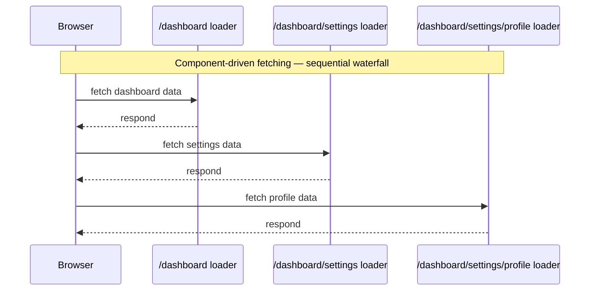
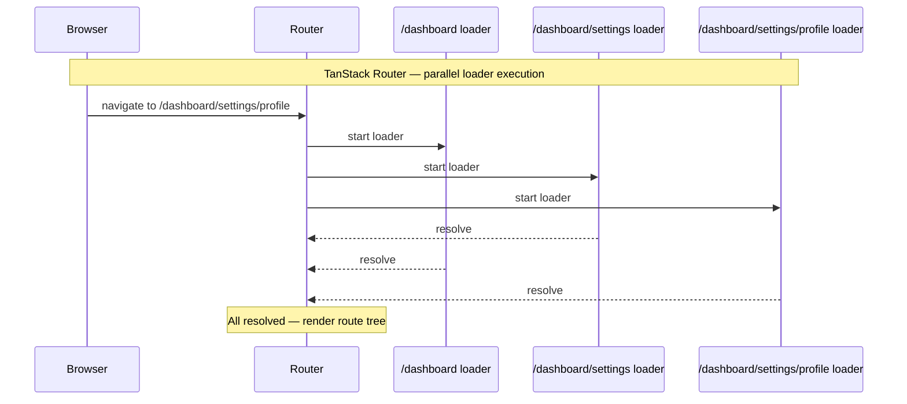
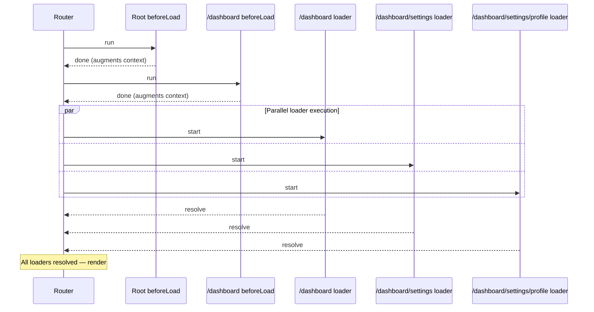

## Parallel Loaders

### Overview

TanStack Router runs route loaders in parallel by default. When navigating to a URL that matches a nested route tree — for example `/dashboard/settings/profile` — the loaders for every matched route in that hierarchy start simultaneously rather than sequentially. This eliminates the request waterfall that occurs when a parent component must finish rendering before a child component can begin its own data fetch. Understanding how parallel execution works, where it breaks down, and how to manage dependencies between loaders is essential for building performant route trees.

---

### The Waterfall Problem

In component-based data fetching, data requests are initiated inside components. Because React renders top-down, a child component cannot start fetching until its parent renders, which requires the parent's data to be available first:



Each request waits for the previous one to complete. Total time is the sum of all request durations.

---

### How TanStack Router Eliminates the Waterfall

TanStack Router knows the full matched route tree before any component renders. It starts all loaders simultaneously at navigation time:



Total time is determined by the slowest loader, not the sum of all loaders.

---

### Default Parallel Behavior

No configuration is required to enable parallel loaders. Defining loaders on multiple routes in a hierarchy automatically produces parallel execution:

```ts
// /dashboard route
export const Route = createFileRoute('/dashboard')({
  loader: async () => {
    return fetchDashboardSummary()   // starts immediately on navigation
  },
})

// /dashboard/settings route
export const Route = createFileRoute('/dashboard/settings')({
  loader: async () => {
    return fetchUserSettings()   // starts simultaneously with dashboard loader
  },
})

// /dashboard/settings/profile route
export const Route = createFileRoute('/dashboard/settings/profile')({
  loader: async () => {
    return fetchUserProfile()   // starts simultaneously with both above
  },
})
```

**Key Points**
- All three loaders fire at the same time when navigating to `/dashboard/settings/profile`.
- Each loader's return value is stored separately and accessed via `useLoaderData` with the appropriate `from`.
- A loader on a route that is not part of the current match does not run. [Inference: only loaders belonging to matched routes are invoked.]

---

### Accessing Each Loader's Data

Each route's component reads only its own loader data:

```ts
// In /dashboard component
function Dashboard() {
  const summary = useLoaderData({ from: '/dashboard' })
  return <div>{summary.title}</div>
}

// In /dashboard/settings component
function Settings() {
  const settings = useLoaderData({ from: '/dashboard/settings' })
  return <div>{settings.theme}</div>
}

// In /dashboard/settings/profile component
function Profile() {
  const profile = useLoaderData({ from: '/dashboard/settings/profile' })
  return <div>{profile.displayName}</div>
}
```

**Key Points**
- There is no API for a child component to directly read a parent route's loader data through `useLoaderData` without specifying `from`. [Inference: a child component can read a parent route's data by specifying the parent's `from` path — verify this behavior for the version in use.]
- Each loader is independently typed based on its own return value.

---

### When Loaders Cannot Be Parallel

Parallel execution requires that loaders be independent of each other's results. If a child loader genuinely needs the result of a parent loader, parallelism breaks down.

#### Anti-Pattern: Depending on Parent Loader Data

```ts
// Parent loader
export const Route = createFileRoute('/dashboard')({
  loader: async () => {
    const org = await fetchOrganization()
    return org   // child needs org.id — but child loader runs simultaneously
  },
})

// Child loader — cannot use parent's return value
export const Route = createFileRoute('/dashboard/settings')({
  loader: async ({ context }) => {
    // org.id is not available here — parent and child start at the same time
    const settings = await fetchSettings(/* ??? */)
    return settings
  },
})
```

A child loader starts at the same time as the parent loader. The parent's return value does not exist yet when the child begins. [Inference: attempting to access parent loader data from a child loader through any shared mutable reference introduces a race condition.]

---

### Resolving Cross-Loader Dependencies

When a child loader needs data that a parent loader would fetch, there are three approaches.

#### Approach 1: Fetch the Shared Data in Router Context via `beforeLoad`

Move the shared fetch into the parent route's `beforeLoad`, which runs before loaders and augments context:

```ts
// Parent route
export const Route = createFileRoute('/dashboard')({
  beforeLoad: async ({ context }) => {
    const org = await context.apiClient.getOrganization()
    return { org }   // available in context for all child loaders
  },
  loader: async ({ context }) => {
    return fetchDashboardSummary(context.org.id)
  },
})

// Child route — org is available via context
export const Route = createFileRoute('/dashboard/settings')({
  loader: async ({ context }) => {
    return fetchSettings(context.org.id)   // context.org set by parent beforeLoad
  },
})
```

**Key Points**
- `beforeLoad` runs sequentially up the route hierarchy before any loaders start. A parent `beforeLoad` always completes before child `beforeLoad` and loaders begin. [Inference: sequential `beforeLoad` execution is a documented property of TanStack Router's lifecycle — verify for the version in use.]
- This approach restores the parent-to-child dependency while keeping the loaders themselves parallel for independent data.
- The tradeoff is that the shared fetch blocks all loaders from starting until it completes.

#### Approach 2: Fetch the Shared Data Independently in Both Loaders

If the shared data is cacheable — for example, through TanStack Query — each loader can request it independently. The cache handles deduplication:

```ts
const orgQueryOptions = queryOptions({
  queryKey: ['org'],
  queryFn: fetchOrganization,
})

// Parent loader
export const Route = createFileRoute('/dashboard')({
  loader: async ({ context }) => {
    const org = await context.queryClient.ensureQueryData(orgQueryOptions)
    return fetchDashboardSummary(org.id)
  },
})

// Child loader — fetches org independently; cache deduplicates the request
export const Route = createFileRoute('/dashboard/settings')({
  loader: async ({ context }) => {
    const org = await context.queryClient.ensureQueryData(orgQueryOptions)
    return fetchSettings(org.id)
  },
})
```

**Key Points**
- `ensureQueryData` returns immediately if the cache has a fresh entry, so only one network request is made even though both loaders call it.
- Both loaders remain parallel — neither waits for the other.
- This is the recommended approach when TanStack Query is used as the data layer. [Inference]

#### Approach 3: Flatten the Route Hierarchy

If a child route consistently depends on parent data, the route structure may be more deeply nested than necessary. Flattening routes reduces artificial dependencies:

```ts
// Instead of /dashboard + /dashboard/settings as separate loaders with a dependency,
// fetch both datasets in a single loader on a combined route:

export const Route = createFileRoute('/dashboard/settings')({
  loader: async ({ context }) => {
    const [org, settings] = await Promise.all([
      fetchOrganization(),
      fetchSettings(),
    ])
    return { org, settings }
  },
})
```

---

### Parallelism Within a Single Loader

Independent requests within a single loader should also run in parallel using `Promise.all`:

```ts
export const Route = createFileRoute('/dashboard')({
  loader: async ({ context, params }) => {
    const [summary, notifications, recentActivity] = await Promise.all([
      context.apiClient.getDashboardSummary(),
      context.apiClient.getNotifications(),
      context.apiClient.getRecentActivity(),
    ])
    return { summary, notifications, recentActivity }
  },
})
```

**Key Points**
- Sequential `await` inside a loader is a common source of avoidable latency.
- `Promise.all` runs all three requests in parallel. Total time is the slowest of the three, not their sum.
- `Promise.all` rejects if any promise rejects. Use `Promise.allSettled` when partial failure is acceptable and the component can handle missing data. [Inference: behavior depends on how the component handles undefined or null values in the loader return.]

```ts
// Tolerating partial failure
loader: async ({ context }) => {
  const [summaryResult, notificationsResult] = await Promise.allSettled([
    context.apiClient.getDashboardSummary(),
    context.apiClient.getNotifications(),
  ])

  return {
    summary: summaryResult.status === 'fulfilled' ? summaryResult.value : null,
    notifications: notificationsResult.status === 'fulfilled' ? notificationsResult.value : [],
  }
}
```

---

### Parallel Loaders with `loaderDeps`

When routes use `loaderDeps`, parallel execution is preserved. Each route's `loaderDeps` is evaluated independently, and all loaders start simultaneously:

```ts
export const Route = createFileRoute('/products')({
  validateSearch: zodSearchValidator(productSearchSchema),
  loaderDeps: ({ search }) => ({ page: search.page, category: search.category }),
  loader: async ({ deps }) => fetchProducts(deps),
})

export const Route = createFileRoute('/products/featured')({
  validateSearch: zodSearchValidator(featuredSearchSchema),
  loaderDeps: ({ search }) => ({ limit: search.limit }),
  loader: async ({ deps }) => fetchFeaturedProducts(deps),
})
```

Both loaders start at the same time with their own resolved deps. [Inference: `loaderDeps` affects cache invalidation independently per route — changes to one route's deps do not affect the other's cache.]

---

### Abort Signal Coordination in Parallel Loaders

Each loader receives its own `abortController`. When navigation is cancelled — for example, the user clicks a different link before loaders resolve — all in-flight loaders are signalled concurrently:

```ts
export const Route = createFileRoute('/dashboard')({
  loader: async ({ abortController }) => {
    return fetch('/api/dashboard', { signal: abortController.signal }).then(r => r.json())
  },
})

export const Route = createFileRoute('/dashboard/settings')({
  loader: async ({ abortController }) => {
    return fetch('/api/settings', { signal: abortController.signal }).then(r => r.json())
  },
})
```

**Key Points**
- Each loader's `abortController` is independent. Aborting one does not abort others. [Inference: the router signals all loaders for a cancelled navigation, but each loader's signal is its own instance.]
- Passing `abortController.signal` to `fetch` is required for cancellation to take effect. The router signals the controller but cannot forcibly terminate JavaScript execution.

---

### Timing Diagram: `beforeLoad` vs Loader Execution Order



**Key Points**
- `beforeLoad` functions execute sequentially from root to leaf before any loader starts.
- All loaders start after all `beforeLoad` functions in the matched hierarchy have completed.
- Loader execution is parallel; `beforeLoad` execution is sequential. [Inference: this is the documented behavior — verify for the version in use.]

---

### Performance Comparison

| Approach | Total time (3 loaders at 200ms each) |
|---|---|
| Sequential component fetching | ~600ms |
| Parallel route loaders | ~200ms (slowest loader) |
| Parallel with `Promise.all` inside one loader | ~200ms (slowest request) |
| Sequential `await` inside one loader | ~600ms |

[Inference: figures are illustrative. Real-world performance depends on network conditions, server response times, and browser connection limits.]

---

### Caveats and Limitations

- Parallel loaders that all make authenticated requests will produce multiple concurrent requests carrying the same auth token. If the token is about to expire, some requests may succeed and others may fail mid-navigation. [Inference: token refresh logic should be handled before loaders start — for example in a root `beforeLoad`.]
- Browser HTTP/1.1 connections have a per-domain concurrency limit (typically 6). Many parallel loaders hitting the same domain may queue behind each other despite starting simultaneously. HTTP/2 mitigates this but does not eliminate all concurrency constraints. [Inference: network-layer behavior is browser and server dependent.]
- `Promise.all` inside a loader fails fast — one rejection rejects the entire group. If independent partial data is needed, `Promise.allSettled` is the safer choice.
- Parallel loaders do not share memory or communicate with each other during execution. Any coordination must happen through router context or the external cache layer (e.g., TanStack Query).
- Excessive parallelism on initial page load may saturate network bandwidth, resulting in all requests taking longer than a smaller parallel group would. [Inference: the optimal parallelism level is workload-dependent.]

---

**Related Topics**
- `beforeLoad` — sequential pre-loader execution and context augmentation
- `Promise.all` vs `Promise.allSettled` — intra-loader parallelism strategies
- TanStack Query `ensureQueryData` — cache deduplication for shared data across loaders
- Abort signals in loaders — cancellation during parallel execution
- `loaderDeps` — controlling loader cache invalidation per route
- Router context — sharing fetched data across loaders without duplication
- Loader `staleTime` and caching — reducing redundant parallel fetches on re-navigation
- SSR and parallel loaders — server-side execution constraints