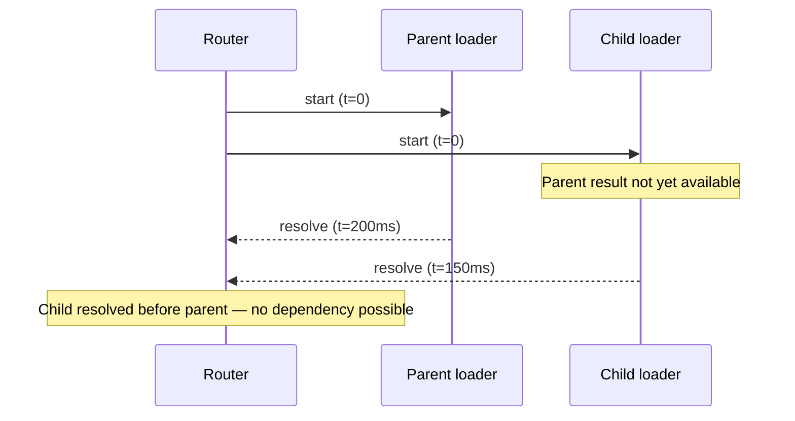
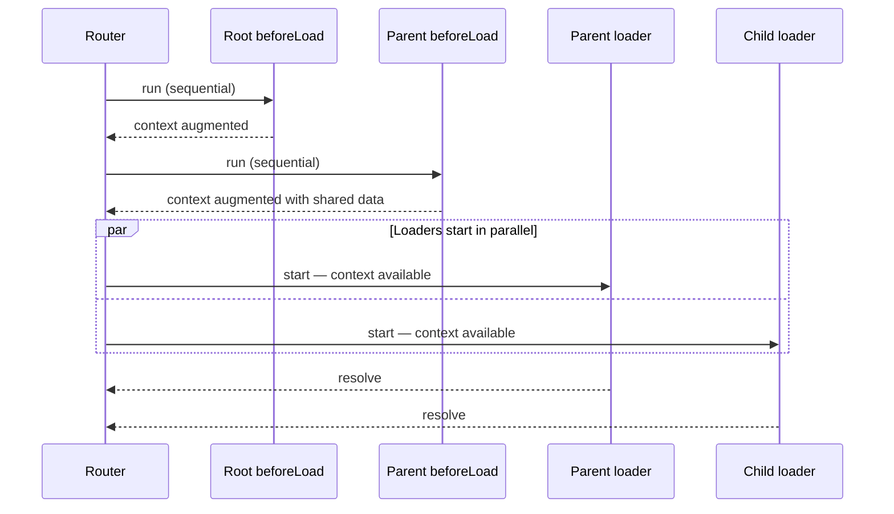

## Dependent Loaders

### Overview

Dependent loaders are loaders that cannot execute independently because they require data produced by another part of the route lifecycle — typically a parent route's fetched data, an authenticated session, or a resolved identifier. Because TanStack Router runs all matched route loaders in parallel by default, direct loader-to-loader dependencies within the same navigation are not natively supported. Handling dependencies correctly requires understanding which mechanisms run sequentially — and using them intentionally to pass required values before parallel loader execution begins.

---

### Why Loader-to-Loader Dependencies Are Not Directly Supported

All loaders in a matched route tree start simultaneously. At the moment a child loader begins, the parent loader is still in flight. There is no API for a loader to await another loader's result:



Any pattern that attempts to share data between loaders through a mutable closure or module-level variable introduces a race condition. [Inference: the router does not provide synchronization primitives between parallel loaders — any such coordination must be implemented externally and carefully.]

---

### The Sequential Mechanism: `beforeLoad`

`beforeLoad` is the correct insertion point for data that other loaders depend on. `beforeLoad` functions execute sequentially from root to leaf before any loader starts. Data fetched in a `beforeLoad` is available in the router context by the time all loaders run:



By moving shared or prerequisite data into `beforeLoad`, both the parent and child loaders receive it through context simultaneously when they start.

---

### Pattern 1: Fetching Shared Data in `beforeLoad`

The most direct approach. Prerequisite data is fetched in `beforeLoad` and injected into context:

```ts
// Parent route — fetches org in beforeLoad, making it available to all child loaders
export const Route = createFileRoute('/dashboard')({
  beforeLoad: async ({ context }) => {
    const org = await context.apiClient.getOrganization()

    if (!org) throw redirect({ to: '/onboarding' })

    return { org }
  },
  loader: async ({ context }) => {
    // context.org is available
    return context.apiClient.getDashboardSummary(context.org.id)
  },
})

// Child route — org is available without fetching it again
export const Route = createFileRoute('/dashboard/settings')({
  loader: async ({ context }) => {
    // context.org set by parent beforeLoad
    return context.apiClient.getSettings(context.org.id)
  },
})
```

**Key Points**
- `beforeLoad` returns are shallowly merged into context. All descendant `beforeLoad` functions and loaders receive the additions.
- This is the recommended approach for data that multiple loaders depend on. [Inference]
- The tradeoff is that the shared fetch in `beforeLoad` blocks all loaders from starting until it resolves. If the fetched data is slow, this delays the entire navigation.

---

### Pattern 2: Cache Deduplication via TanStack Query

When using TanStack Query, multiple loaders can independently request the same data. The cache deduplicates concurrent requests — only one network call is made even if several loaders call `ensureQueryData` with the same key simultaneously:

```ts
const orgQueryOptions = queryOptions({
  queryKey: ['organization'],
  queryFn: fetchOrganization,
  staleTime: 60_000,
})

// Parent loader
export const Route = createFileRoute('/dashboard')({
  loader: async ({ context }) => {
    const org = await context.queryClient.ensureQueryData(orgQueryOptions)
    const summary = await context.apiClient.getDashboardSummary(org.id)
    return { summary }
  },
})

// Child loader — calls ensureQueryData with the same key
export const Route = createFileRoute('/dashboard/settings')({
  loader: async ({ context }) => {
    const org = await context.queryClient.ensureQueryData(orgQueryOptions)
    const settings = await context.apiClient.getSettings(org.id)
    return { settings }
  },
})
```

**Key Points**
- Both loaders start in parallel and both call `ensureQueryData`. TanStack Query deduplicates the underlying network request — only one `fetchOrganization` call is made. [Inference: deduplication applies when both calls occur before the first resolves, which is likely given parallel execution. Verify with TanStack Query's deduplication documentation for the version in use.]
- Both loaders proceed independently once `org` resolves from the cache.
- This approach preserves parallel execution while handling the shared dependency, at the cost of requiring TanStack Query.

---

### Pattern 3: Root-Level Authentication Context

Authentication is the most common real-world loader dependency. A session or token resolved at the root level is required by virtually every protected loader. This is a natural fit for root `beforeLoad`:

```ts
// Root route — resolves session once for the entire app
export const rootRoute = createRootRouteWithContext<RouterContext>()({
  component: RootComponent,
  beforeLoad: async ({ context }) => {
    const session = await context.auth.getSession()
    return { session }
  },
})

// Any protected route — session is available without fetching it
export const Route = createFileRoute('/orders/$orderId')({
  beforeLoad: ({ context }) => {
    if (!context.session) throw redirect({ to: '/login' })
  },
  loader: async ({ context, params }) => {
    return context.apiClient.getOrder(params.orderId, {
      token: context.session.token,
    })
  },
})

// Another protected route — also receives session from root
export const Route = createFileRoute('/profile')({
  loader: async ({ context }) => {
    return context.apiClient.getProfile(context.session.userId)
  },
})
```

**Key Points**
- The session is fetched once at the root level. All loaders across the entire route tree receive it through context.
- This avoids redundant session fetches in each individual loader.
- If `getSession` is slow, it delays the start of all loaders on every navigation. Session caching at the auth service level mitigates this. [Inference]

---

### Pattern 4: Sequential Dependency Within a Single Loader

When two pieces of data have a strict dependency and belong to the same route, fetch them sequentially within one loader using `Promise.all` where possible or sequential `await` where genuinely serial:

```ts
export const Route = createFileRoute('/dashboard/billing')({
  loader: async ({ context }) => {
    // org must resolve before subscription can be fetched
    const org = await context.apiClient.getOrganization()
    const subscription = await context.apiClient.getSubscription(org.id)

    // invoices and paymentMethods are independent of each other — run in parallel
    const [invoices, paymentMethods] = await Promise.all([
      context.apiClient.getInvoices(subscription.id),
      context.apiClient.getPaymentMethods(org.id),
    ])

    return { org, subscription, invoices, paymentMethods }
  },
})
```

**Key Points**
- Sequential `await` is used only where there is a genuine data dependency (`org` → `subscription`).
- Independent subsequent requests (`invoices`, `paymentMethods`) are parallelized with `Promise.all`.
- Keeping dependent and independent fetches within one loader is appropriate when all the data belongs to a single route's view.

---

### Pattern 5: Layout Routes for Shared Data

Layout routes — routes that wrap a group of child routes without corresponding URL segments — are a natural boundary for data shared across a section of the application:

```ts
// _authenticated layout route — handles session for all children
export const Route = createFileRoute('/_authenticated')({
  beforeLoad: async ({ context }) => {
    const session = await context.auth.getSession()
    if (!session) throw redirect({ to: '/login' })
    return { session }
  },
})

// _authenticated/dashboard layout route — handles org for dashboard section
export const Route = createFileRoute('/_authenticated/dashboard')({
  beforeLoad: async ({ context }) => {
    const org = await context.apiClient.getOrganization(context.session.orgId)
    return { org }
  },
})

// Leaf route — receives both session and org through context
export const Route = createFileRoute('/_authenticated/dashboard/reports')({
  loader: async ({ context }) => {
    return context.apiClient.getReports({
      orgId: context.org.id,
      userId: context.session.userId,
    })
  },
})
```

Layout routes allow dependency chains to be expressed structurally in the route tree rather than inline in individual loaders.

---

### Dependency Diagram: `beforeLoad` Chain

```mermaid
flowchart TD
    A[Navigation to /_auth/dashboard/reports] --> B

    subgraph Sequential
        B["/_auth beforeLoad\nfetches session\nreturns session"] --> C
        C["/_auth/dashboard beforeLoad\nfetches org using session.orgId\nreturns org"] --> D
        D["All beforeLoads complete"]
    end

    subgraph Parallel
        D --> E[/_auth loader\nuses session]
        D --> F[/_auth/dashboard loader\nuses org]
        D --> G[/_auth/dashboard/reports loader\nuses session + org]
    end

    E --> H[Render]
    F --> H
    G --> H
```

---

### Choosing the Right Pattern

| Scenario | Recommended approach |
|---|---|
| Auth token or session needed by all loaders | Root `beforeLoad` — inject into context |
| Organization or tenant ID needed by a section | Layout route `beforeLoad` — inject into context |
| Shared entity needed by sibling loaders | TanStack Query `ensureQueryData` — cache deduplication |
| Sequential dependency within one route's data | Sequential `await` inside one loader, with `Promise.all` for independent parts |
| Child needs parent's API response, not just an ID | Refactor to `beforeLoad` or flatten the route hierarchy |

---

### Anti-Patterns

#### Module-Level Shared State

```ts
// AVOID — race condition
let cachedOrg: Org | null = null

// Parent loader sets it
export const dashboardRoute = createFileRoute('/dashboard')({
  loader: async ({ context }) => {
    cachedOrg = await context.apiClient.getOrganization()
    return cachedOrg
  },
})

// Child loader reads it — but may run before parent loader sets it
export const settingsRoute = createFileRoute('/dashboard/settings')({
  loader: async () => {
    // cachedOrg may still be null here
    return fetchSettings(cachedOrg?.id)
  },
})
```

[Inference: module-level mutable state introduces a race condition because both loaders start simultaneously. This pattern is unreliable and should not be used.]

#### Artificially Delaying a Child Loader

```ts
// AVOID — arbitrary delay is not a reliable synchronization mechanism
export const Route = createFileRoute('/dashboard/settings')({
  loader: async ({ context }) => {
    await new Promise(r => setTimeout(r, 300)) // hoping parent resolves first
    return fetchSettings(/* ... */)
  },
})
```

[Inference: timing-based synchronization is fragile and will fail under varying network or server conditions. Never use it.]

---

### Full Example: Multi-Level Dependency Chain

```ts
// Root route — session for entire app
export const rootRoute = createRootRouteWithContext<RouterContext>()({
  component: RootComponent,
  beforeLoad: async ({ context }) => {
    const session = await context.auth.getSession()
    if (!session) throw redirect({ to: '/login' })
    return { session }
  },
})

// Organization layout — org for org-scoped routes
export const Route = createFileRoute('/_org')({
  beforeLoad: async ({ context }) => {
    const org = await context.apiClient.getOrg(context.session.orgId)
    return { org }
  },
})

// Project layout — project for project-scoped routes
export const Route = createFileRoute('/_org/projects/$projectId')({
  beforeLoad: async ({ context, params }) => {
    const project = await context.apiClient.getProject(
      context.org.id,
      params.projectId
    )
    if (!project) throw notFound()
    return { project }
  },
})

// Leaf routes — all dependencies resolved through context
export const Route = createFileRoute('/_org/projects/$projectId/tasks')({
  loader: async ({ context }) => {
    const [tasks, members] = await Promise.all([
      context.apiClient.getTasks(context.project.id),
      context.apiClient.getMembers(context.org.id),
    ])
    return { tasks, members }
  },
})

export const Route = createFileRoute('/_org/projects/$projectId/activity')({
  loader: async ({ context }) => {
    return context.apiClient.getActivity(
      context.project.id,
      context.session.userId
    )
  },
})
```

When navigating to `/_org/projects/abc/tasks`:
- Root `beforeLoad` → resolves session
- `/_org` `beforeLoad` → resolves org using session
- `/_org/projects/$projectId` `beforeLoad` → resolves project using org
- All three leaf loaders (tasks, activity if matched, and any siblings) start in parallel with full context

---

### Caveats and Limitations

- Every `beforeLoad` in the chain is sequential. Deep dependency chains in `beforeLoad` add latency equal to the sum of each step's duration. Keep individual `beforeLoad` fetches fast or cache aggressively. [Inference]
- Data fetched in `beforeLoad` is not returned as loader data and is not accessible via `useLoaderData`. It is accessible via `useRouteContext`. Mixing up these two APIs is a common source of confusion. [Inference]
- TanStack Query deduplication applies to concurrent calls with the same query key. If one call resolves before the second begins — possible if network latency is very low — the second call hits the cache directly rather than deduplicating an in-flight request. Either way, only one network request is made. [Inference]
- Flattening route hierarchies to eliminate loader dependencies reduces code organization benefits of nested routes. This tradeoff is workload-dependent — prefer `beforeLoad` augmentation over flattening unless the route hierarchy is genuinely artificial.
- In SSR environments, `beforeLoad` fetches run on the server. Context values set there must be serializable for hydration if they are passed to the client. [Inference: exact serialization requirements depend on the SSR adapter in use.]

---

**Related Topics**
- `beforeLoad` — sequential execution, context augmentation, and guards in depth
- Loader context — injecting shared services and resolved values
- Parallel loaders — default execution model and performance characteristics
- TanStack Query `ensureQueryData` — cache deduplication for shared dependencies
- Layout routes — structuring shared data boundaries in the route tree
- `notFound` and `redirect` in `beforeLoad` — handling missing or unauthorized dependencies
- `useRouteContext` — reading `beforeLoad`-injected values in components
- SSR and `beforeLoad` — server-side dependency resolution and hydration