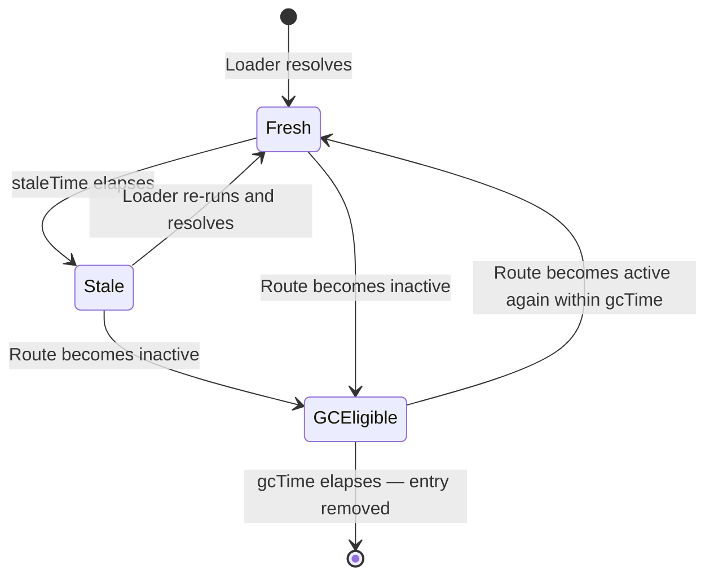

## Loader Caching and `staleTime`

### Overview

TanStack Router maintains an in-memory cache of loader results per route match. When a user navigates to a route whose loader has previously run, the router consults this cache before deciding whether to re-run the loader. The primary controls for this behavior are `staleTime` — how long cached data is considered fresh — and `gcTime` — how long cached data is retained in memory after the route becomes inactive. Understanding these controls determines how aggressively the router refetches data and how responsive navigations feel when returning to previously visited routes.

---

### The Cache Lifecycle

Each route match — identified by its route path plus its resolved params, deps, and search — has an independent cache entry. That entry passes through a defined set of states:



**Key Points**
- A Fresh entry is served immediately on navigation — the loader does not re-run.
- A Stale entry triggers a loader re-run on the next navigation to that route.
- A GCEligible entry is retained in memory for `gcTime` after the route is no longer active. If the route becomes active again within that window, the entry is reused (as Stale, triggering a background refetch or blocking refetch depending on configuration). [Inference: exact reuse behavior depends on whether the entry is still within `staleTime` when the route becomes active again.]
- After `gcTime` elapses, the entry is discarded. The next navigation will run the loader from scratch.

---

### `staleTime`

`staleTime` defines how long a loader's cached result is considered fresh, measured in milliseconds from when the loader last resolved:

```ts
export const Route = createFileRoute('/products')({
  loader: async () => fetchProducts(),
  staleTime: 30_000,   // data is fresh for 30 seconds
})
```

**Key Points**
- While the cached result is within `staleTime`, navigating to the route returns the cached value immediately without re-running the loader.
- After `staleTime` elapses, the next navigation to the route re-runs the loader.
- `staleTime: 0` means the data is considered stale immediately after it resolves — the loader re-runs on every navigation. This is the default behavior. [Unverified: confirm the default `staleTime` for the router version in use, as defaults may differ.]
- `staleTime: Infinity` means the data never becomes stale — the loader runs once and the result is used indefinitely until the cache entry is garbage collected or explicitly invalidated.

---

### `gcTime`

`gcTime` defines how long a cache entry is retained in memory after the route it belongs to becomes inactive:

```ts
export const Route = createFileRoute('/products')({
  loader: async () => fetchProducts(),
  staleTime: 30_000,
  gcTime: 60_000,   // cache entry kept for 60 seconds after route becomes inactive
})
```

**Key Points**
- A route becomes inactive when the user navigates away from it.
- During the `gcTime` window, the cache entry survives even though the route is not rendered. Navigating back within this window does not require a fresh loader run — the stale or fresh entry is used.
- After `gcTime` elapses, the entry is removed. The next navigation runs the loader from scratch.
- `gcTime` should be greater than or equal to `staleTime` for the configuration to be coherent. A `gcTime` shorter than `staleTime` would remove the entry before it has a chance to become stale, making `staleTime` partially ineffective. [Inference]
- Default `gcTime` value is version-dependent. [Unverified: confirm for the router version in use.]

---

### Interaction Between `staleTime` and `gcTime`

```mermaid
gantt
    title Cache Entry Lifecycle Example — staleTime 30s, gcTime 60s
    dateFormat ss
    axisFormat %Ss

    section Cache Entry
    Loader runs and resolves     :milestone, m1, 00, 0s
    Fresh window                 :active, fresh, 00, 30s
    Stale window (route active)  :stale1, 30, 15s
    Route becomes inactive       :milestone, m2, 45, 0s
    GC window (route inactive)   :crit, gc, 45, 60s
    Entry removed                :milestone, m3, 105, 0s
```



In this example:
- At `t=0` the loader resolves. Data is fresh.
- At `t=30s` the data becomes stale. The next navigation will re-run the loader.
- At `t=45s` the user navigates away. The `gcTime` clock starts.
- At `t=105s` the cache entry is removed (45s + 60s gcTime).
- Navigating back at any point before `t=105s` uses the cached entry and re-runs the loader if stale.
- Navigating back after `t=105s` finds no cache — the loader runs from scratch.

---

### Default Behavior Without Configuration

Without explicit `staleTime` or `gcTime`, TanStack Router uses its default values. Based on observed behavior: [Inference — confirm against the specific version in use]

- Default `staleTime` is likely `0` — data is stale immediately, loader re-runs on every navigation.
- Default `gcTime` retains cache entries for some period to support the pending component flickering prevention mechanism.

In practice, omitting both options produces the most conservative behavior: the loader always re-runs when the route is visited. This is safe but not performant for data that changes infrequently.

---

### Setting Defaults at the Router Level

Rather than configuring `staleTime` and `gcTime` on every route individually, defaults can be set at the router level:

```ts
const router = createRouter({
  routeTree,
  defaultStaleTime: 30_000,
  defaultGcTime: 60_000,
})
```

**Key Points**
- Route-level `staleTime` and `gcTime` override the router-level defaults for that specific route.
- Router-level defaults apply to all routes that do not set their own values.
- This allows a sensible application-wide baseline while permitting per-route overrides for routes with different data freshness requirements.

---

### Per-Route Overrides

Different routes warrant different caching strategies based on how frequently their data changes:

```ts
// Static reference data — rarely changes
export const Route = createFileRoute('/countries')({
  loader: async () => fetchCountries(),
  staleTime: Infinity,   // fetch once per session
  gcTime: Infinity,
})

// User-specific data — changes occasionally
export const Route = createFileRoute('/profile')({
  loader: async ({ context }) => fetchProfile(context.session.userId),
  staleTime: 60_000,     // fresh for 1 minute
  gcTime: 300_000,       // retained for 5 minutes after leaving
})

// Live operational data — must always be current
export const Route = createFileRoute('/orders')({
  loader: async () => fetchOrders(),
  staleTime: 0,          // always re-fetch on navigation
  gcTime: 30_000,        // retain briefly for back-navigation
})
```

---

### Cache Keying

The cache key for a route match is derived from the route's path combined with its resolved params and loader deps. Two navigations to the same route with different params or deps produce separate cache entries:

```ts
// /products/1 and /products/2 are separate cache entries
export const Route = createFileRoute('/products/$productId')({
  loader: async ({ params }) => fetchProduct(params.productId),
  staleTime: 60_000,
})

// /products?page=1 and /products?page=2 are separate cache entries
export const Route = createFileRoute('/products')({
  validateSearch: zodSearchValidator(searchSchema),
  loaderDeps: ({ search }) => ({ page: search.page }),
  loader: async ({ deps }) => fetchProducts({ page: deps.page }),
  staleTime: 30_000,
})
```

**Key Points**
- Each unique combination of route path, params, and `loaderDeps` result produces an independent cache entry with its own `staleTime` and `gcTime` clock.
- Navigating from `/products?page=1` to `/products?page=2` and back to `/products?page=1` will use the cached result for page 1 if it is still within `staleTime`.
- `loaderDeps` is part of the cache key. Params not included in `loaderDeps` do not contribute to cache differentiation for that route. [Inference]

---

### Manual Cache Invalidation

TanStack Router provides `router.invalidate()` to manually mark all cache entries as stale and trigger a re-run of active route loaders:

```ts
import { useRouter } from '@tanstack/react-router'

function SaveButton({ onSave }: { onSave: () => Promise<void> }) {
  const router = useRouter()

  async function handleSave() {
    await onSave()
    await router.invalidate()   // re-run active loaders after mutation
  }

  return <button onClick={handleSave}>Save</button>
}
```

**Key Points**
- `router.invalidate()` marks all active route cache entries as stale and re-runs their loaders immediately.
- This is the primary mechanism for refreshing data after a mutation. [Inference]
- `router.invalidate()` is a blunt instrument — it invalidates all routes, not just the affected one. [Inference: more granular invalidation may not be available in all versions — verify with the router version in use.]
- When using TanStack Query alongside TanStack Router loaders, prefer `queryClient.invalidateQueries()` for granular invalidation of specific data, and `router.invalidate()` for router-level cache invalidation.

---

### `shouldReload`

TanStack Router supports a `shouldReload` option that provides fine-grained control over when a loader re-runs, independent of `staleTime`:

```ts
export const Route = createFileRoute('/products')({
  loader: async () => fetchProducts(),
  shouldReload: ({ cause }) => cause === 'enter',
  // 'enter'  — navigating to this route from a different route
  // 'stay'   — re-rendering while already on this route
  // 'leave'  — navigating away (typically not used for shouldReload)
})
```

[Unverified: `shouldReload` API shape and available `cause` values are version-dependent. Verify against current TanStack Router documentation before use.]

**Key Points**
- `shouldReload` returning `false` prevents the loader from re-running regardless of `staleTime`.
- `shouldReload` returning `true` allows normal `staleTime` evaluation to proceed.
- This is useful for loaders that should only re-run on specific navigation events, such as first entering a route rather than returning to it via the back button. [Inference]

---

### Caching with TanStack Query

When TanStack Router loaders are used to prefetch TanStack Query cache entries, the caching behavior is governed by TanStack Query's own `staleTime` and `gcTime`, not by the router's:

```ts
const productsQueryOptions = queryOptions({
  queryKey: ['products'],
  queryFn: fetchProducts,
  staleTime: 30_000,   // TanStack Query controls freshness
  gcTime: 60_000,
})

export const Route = createFileRoute('/products')({
  loader: async ({ context }) => {
    await context.queryClient.ensureQueryData(productsQueryOptions)
    // Router loader returns nothing meaningful — TanStack Query is the cache
  },
  staleTime: 0,   // Router loader re-runs on every navigation...
  // ...but ensureQueryData is a no-op if TanStack Query cache is fresh
})
```

**Key Points**
- In this pattern, set router `staleTime: 0` to always re-enter the loader, but rely on `ensureQueryData` to short-circuit network requests when the query cache is fresh.
- The effective cache behavior is controlled by TanStack Query, not the router.
- Avoid fighting two caching layers — choose one as the source of truth. [Inference: in a TanStack Query-first application, the router loader is primarily a prefetch trigger, not a data cache.]

---

### Comparison: Router Cache vs TanStack Query Cache

| Concern | Router loader cache | TanStack Query cache |
|---|---|---|
| Cache scope | Per route match | Per query key — shared across any component |
| Granular invalidation | `router.invalidate()` — all routes | `queryClient.invalidateQueries()` — specific keys |
| Background refetch | Limited | Built-in with `refetchOnWindowFocus`, `refetchInterval` |
| Cache persistence | In-memory only | In-memory; persistable with plugins |
| Devtools | Router Devtools | TanStack Query Devtools |
| Primary use case | Route-level data preloading | Server state management throughout the app |

---

### Configuration Reference

| Option | Scope | Description |
|---|---|---|
| `staleTime` | Route or router default | Milliseconds a cached result is considered fresh |
| `gcTime` | Route or router default | Milliseconds a cache entry is retained after the route becomes inactive |
| `defaultStaleTime` | Router | `staleTime` applied to all routes without a route-level override |
| `defaultGcTime` | Router | `gcTime` applied to all routes without a route-level override |
| `router.invalidate()` | Runtime | Marks all cache entries stale and re-runs active loaders |
| `shouldReload` | Route | Fine-grained control over loader re-run independent of `staleTime` |

[Unverified: option names and availability are version-dependent. Confirm against TanStack Router documentation for the version in use.]

---

### Caveats and Limitations

- The router cache is in-memory only. It does not persist across page refreshes or browser sessions. Every hard reload starts with an empty cache regardless of `staleTime` or `gcTime`. [Inference]
- `staleTime: Infinity` should only be used for data that is genuinely static for the duration of a session. Using it for user-specific or mutable data risks serving outdated results after mutations. [Inference]
- `router.invalidate()` re-runs loaders for all currently active routes. On pages with many active nested routes, this can produce multiple simultaneous network requests. [Inference]
- Cache entries are per match — including `loaderDeps`. If `loaderDeps` returns a new object reference on every call (e.g., using an inline object literal), the cache key may not match previous entries correctly, effectively disabling caching. Ensure `loaderDeps` returns a stable, comparable value. [Inference: exact comparison mechanism is router-internal — verify for the version in use.]
- Memory usage grows with the number of unique route matches cached simultaneously. Applications with many dynamic route params may accumulate a large number of cache entries within `gcTime`. [Inference]

---

**Related Topics**
- `loaderDeps` — how search params and other values contribute to the cache key
- `router.invalidate()` — manual cache invalidation after mutations
- `shouldReload` — navigation-cause-based loader re-run control
- `pendingComponent` and `pendingMs` — loading UI during cache misses
- TanStack Query `staleTime` and `gcTime` — query-level caching in the dual-cache pattern
- `ensureQueryData` vs `prefetchQuery` — TanStack Query prefetch strategies in loaders
- SSR and loader caching — hydration and server-side cache behavior
- Preloading — warming the cache before the user navigates