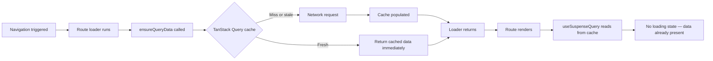

## Integrating TanStack Query with Route Loaders

### Overview

TanStack Router and TanStack Query are designed to work together but serve distinct roles. TanStack Router owns navigation, route matching, and the timing of data loading relative to rendering. TanStack Query owns server state — caching, background refetching, deduplication, and synchronization across components. The integration pattern treats route loaders as prefetch triggers that prime the TanStack Query cache before components render, while components remain connected to TanStack Query's cache as their authoritative data source. This produces routes that load data before render, components that benefit from TanStack Query's full feature set, and a single cache layer rather than two competing ones.

---

### Why Use Both

Using TanStack Router loaders alone provides route-level data loading but lacks background refetching, granular invalidation, shared cache across components, and devtools. Using TanStack Query alone — without loaders — risks waterfall fetching inside components. The integration combines route-level preloading with TanStack Query's cache management:



**Key Points**
- The loader's return value is not used by components in this pattern. Its purpose is to populate the TanStack Query cache before render.
- Components subscribe to the TanStack Query cache through `useSuspenseQuery` or `useQuery`, not through `useLoaderData`.
- If the query cache already has fresh data when the loader runs, `ensureQueryData` is a no-op — no network request is made. [Inference: depends on TanStack Query's `staleTime` for the query, not the router's `staleTime`.]

---

### Setup: Sharing `QueryClient` via Router Context

The `QueryClient` instance must be accessible in loaders. The standard approach is to pass it through router context:

```ts
// src/queryClient.ts
import { QueryClient } from '@tanstack/react-query'

export const queryClient = new QueryClient({
  defaultOptions: {
    queries: {
      staleTime: 30_000,
      gcTime: 60_000,
    },
  },
})
```

```ts
// src/router.ts
import { createRouter } from '@tanstack/react-router'
import { routeTree } from './routeTree.gen'
import { queryClient } from './queryClient'

export interface RouterContext {
  queryClient: QueryClient
}

export const router = createRouter({
  routeTree,
  context: { queryClient },
})
```

```ts
// src/routes/__root.tsx
import { createRootRouteWithContext } from '@tanstack/react-router'
import type { RouterContext } from '../router'

export const Route = createRootRouteWithContext<RouterContext>()({
  component: RootComponent,
})
```

**Key Points**
- A single `QueryClient` instance is created once and shared across all loaders and components.
- In SSR, a new `QueryClient` should be created per request to avoid cross-request cache contamination. [Inference: see SSR section below.]
- Passing `queryClient` through router context rather than importing it directly makes loaders testable by substitution. [Inference]

---

### Defining Query Options

Centralizing query definitions using `queryOptions` from TanStack Query produces a single source of truth for the query key, fetch function, and cache configuration. This definition is shared between the loader and the component:

```ts
// src/queries/products.ts
import { queryOptions } from '@tanstack/react-query'
import { fetchProducts, fetchProduct } from '../api/products'

export const productsQueryOptions = queryOptions({
  queryKey: ['products'],
  queryFn: fetchProducts,
  staleTime: 30_000,
})

export const productQueryOptions = (productId: string) =>
  queryOptions({
    queryKey: ['products', productId],
    queryFn: () => fetchProduct(productId),
    staleTime: 60_000,
  })
```

**Key Points**
- `queryOptions` is a helper that types the query key and query function together, enabling type inference at `useQuery` and `useSuspenseQuery` call sites.
- Factory functions — `productQueryOptions(productId)` — produce per-entity query options with stable, correctly keyed cache entries.
- The same `queryOptions` object is passed to both the loader and the component hook, keeping the query key consistent and avoiding duplication. [Inference: inconsistent query keys between loader and component would result in the component not finding the prefetched cache entry.]

---

### The Core Integration Pattern

```ts
// src/routes/products/index.tsx
import { createFileRoute } from '@tanstack/react-router'
import { productsQueryOptions } from '../../queries/products'

export const Route = createFileRoute('/products')({
  loader: async ({ context }) => {
    await context.queryClient.ensureQueryData(productsQueryOptions)
    // Return value intentionally omitted — TanStack Query is the data source
  },
})

// Component
import { useSuspenseQuery } from '@tanstack/react-query'

function ProductList() {
  const { data: products } = useSuspenseQuery(productsQueryOptions)

  return (
    <ul>
      {products.map((p) => <li key={p.id}>{p.name}</li>)}
    </ul>
  )
}
```

**Key Points**
- `ensureQueryData` fetches if the cache is empty or stale, returns immediately if fresh.
- `useSuspenseQuery` reads from the cache synchronously after the loader has populated it. The component never enters a loading state on initial render. [Inference: depends on the cache being populated before the component renders, which the loader guarantees for standard navigations.]
- `useSuspenseQuery` suspends if the data is not in the cache — for example on a direct page load before the loader runs. This is expected behavior handled by the route's `pendingComponent` or a Suspense boundary. [Inference]

---

### Dynamic Routes with Path Params

```ts
// src/routes/products/$productId.tsx
import { createFileRoute, notFound } from '@tanstack/react-router'
import { productQueryOptions } from '../../queries/products'

export const Route = createFileRoute('/products/$productId')({
  loader: async ({ params, context }) => {
    const product = await context.queryClient.ensureQueryData(
      productQueryOptions(params.productId)
    )

    if (!product) throw notFound()
  },
})

// Component
import { useSuspenseQuery } from '@tanstack/react-query'
import { useParams } from '@tanstack/react-router'

function ProductDetail() {
  const { productId } = useParams({ from: '/products/$productId' })
  const { data: product } = useSuspenseQuery(productQueryOptions(productId))

  return <div>{product.name}</div>
}
```

**Key Points**
- The loader awaits `ensureQueryData` when it needs to inspect the result — for example to throw `notFound()` on missing data.
- When no post-fetch logic is needed, the loader can use `void context.queryClient.prefetchQuery(...)` to fire without awaiting, allowing the navigation to complete while the fetch continues in the background. [Inference: non-awaited prefetch means the component may render before data arrives — only appropriate with a Suspense boundary and `useSuspenseQuery`.]

---

### `ensureQueryData` vs `prefetchQuery`

Both methods prime the cache. They differ in how they handle existing cached data and in their return values:

| Behavior | `ensureQueryData` | `prefetchQuery` |
|---|---|---|
| Returns | The data (typed) | `void` |
| If cache is fresh | Returns cached data immediately | No-op — does not refetch |
| If cache is stale or missing | Fetches and returns result | Fetches, returns `void` |
| Throws on error | Yes | No — silently ignores errors |
| Use when | You need the data in the loader | You want fire-and-forget prefetching |

```ts
// Use ensureQueryData when the loader needs to inspect the result
loader: async ({ params, context }) => {
  const user = await context.queryClient.ensureQueryData(userQueryOptions(params.userId))
  if (!user.isActive) throw redirect({ to: '/inactive' })
}

// Use prefetchQuery for fire-and-forget — component handles loading state
loader: async ({ context }) => {
  void context.queryClient.prefetchQuery(productsQueryOptions)
}
```

---

### Parallel Prefetching in a Single Loader

Multiple independent queries can be prefetched in parallel using `Promise.all`:

```ts
export const Route = createFileRoute('/dashboard')({
  loader: async ({ context }) => {
    await Promise.all([
      context.queryClient.ensureQueryData(userQueryOptions),
      context.queryClient.ensureQueryData(notificationsQueryOptions),
      context.queryClient.ensureQueryData(activityQueryOptions),
    ])
  },
})
```

All three queries start simultaneously. The loader resolves when the slowest one completes. Components reading any of these queries find warm cache entries on render. [Inference: parallel prefetch benefit depends on the server being able to handle concurrent requests.]

---

### Invalidating After Mutations

After a mutation, invalidate the relevant query keys to trigger a background refetch:

```ts
import { useMutation, useQueryClient } from '@tanstack/react-query'
import { useRouter } from '@tanstack/react-router'

function EditProductForm({ productId }: { productId: string }) {
  const queryClient = useQueryClient()
  const router = useRouter()

  const mutation = useMutation({
    mutationFn: (data: ProductUpdate) => updateProduct(productId, data),
    onSuccess: async () => {
      // Invalidate the specific product and the product list
      await queryClient.invalidateQueries({ queryKey: ['products', productId] })
      await queryClient.invalidateQueries({ queryKey: ['products'] })

      // Optionally also invalidate the router's loader cache
      await router.invalidate()
    },
  })

  return (
    <form onSubmit={(e) => {
      e.preventDefault()
      mutation.mutate(new FormData(e.currentTarget))
    }}>
      {/* form fields */}
      <button type="submit">Save</button>
    </form>
  )
}
```

**Key Points**
- `queryClient.invalidateQueries()` marks matched cache entries as stale and triggers background refetches for active queries.
- `router.invalidate()` re-runs active route loaders, which will call `ensureQueryData` again — triggering refetches for stale query entries.
- Calling both is sometimes redundant but ensures consistency between the TanStack Query cache and the route loader state. [Inference: in most configurations, `queryClient.invalidateQueries()` alone is sufficient when components use `useQuery` or `useSuspenseQuery`.]
- `queryKey` hierarchy matters: invalidating `['products']` also invalidates `['products', productId]` entries by prefix matching. [Inference: prefix-based invalidation is a TanStack Query feature — verify behavior for the version in use.]

---

### `useSuspenseQuery` vs `useQuery`

Both hooks read from the TanStack Query cache. Their behavior differs in how they handle loading states:

| Concern | `useSuspenseQuery` | `useQuery` |
|---|---|---|
| Loading state | Suspends — handled by Suspense boundary | Returns `isLoading: true` |
| Error state | Throws — handled by error boundary | Returns `isError: true` |
| Data type | Always defined (non-nullable after resolve) | `data` may be `undefined` |
| Requires Suspense boundary | Yes | No |
| Preferred with loaders | Yes — loader guarantees data is present | Acceptable as fallback |

With the loader integration pattern, `useSuspenseQuery` is preferred because the loader guarantees the cache is populated before the component renders. The Suspense fallback only activates if the component renders without the loader having run — for example in a Suspense boundary deeper than the route boundary. [Inference]

---

### Nested Routes and Parallel Query Prefetching

Parallel route loaders translate directly to parallel query prefetches:

```ts
// /dashboard loader
export const Route = createFileRoute('/dashboard')({
  loader: async ({ context }) => {
    await context.queryClient.ensureQueryData(dashboardSummaryQueryOptions)
  },
})

// /dashboard/settings loader — runs in parallel with dashboard loader
export const Route = createFileRoute('/dashboard/settings')({
  loader: async ({ context }) => {
    await context.queryClient.ensureQueryData(settingsQueryOptions)
  },
})
```

Both loaders start simultaneously. Both `ensureQueryData` calls execute in parallel. If either query's result is already cached and fresh, that call returns immediately. The router renders when all loaders resolve. [Inference: network-level parallelism is subject to browser HTTP connection limits.]

---

### SSR Considerations

In SSR, a new `QueryClient` must be created per request. The dehydrated cache is passed to the client for hydration:

```ts
// Server entry (simplified)
import { dehydrate, HydrationBoundary, QueryClient } from '@tanstack/react-query'
import { createRouter } from '@tanstack/react-router'

async function handleRequest(req: Request) {
  const queryClient = new QueryClient()

  const router = createRouter({
    routeTree,
    context: { queryClient },
  })

  // Router renders — loaders run on server, populating queryClient
  const html = await renderToString(
    <HydrationBoundary state={dehydrate(queryClient)}>
      <RouterProvider router={router} />
    </HydrationBoundary>
  )

  return new Response(html)
}
```

**Key Points**
- `dehydrate(queryClient)` serializes the populated cache for transfer to the client.
- `HydrationBoundary` rehydrates the cache on the client, making data available immediately without a client-side fetch.
- Loader data fetched on the server is available in components during client-side hydration — no loading states on first render. [Inference: exact hydration behavior depends on the SSR adapter and TanStack Query version in use.]
- A per-request `QueryClient` prevents cache leakage between users. [Inference]

---

### Full Example: Products Route with Pagination

```ts
// src/queries/products.ts
import { queryOptions } from '@tanstack/react-query'

export const productsQueryOptions = (page: number, category?: string) =>
  queryOptions({
    queryKey: ['products', { page, category }],
    queryFn: () => fetchProducts({ page, category }),
    staleTime: 30_000,
    placeholderData: (prev) => prev,  // keep previous page data while next loads
  })
```

```ts
// src/routes/products/index.tsx
import { createFileRoute } from '@tanstack/react-router'
import { zodSearchValidator } from '@tanstack/router-zod-adapter'
import { z } from 'zod'
import { productsQueryOptions } from '../../queries/products'

const searchSchema = z.object({
  page: z.coerce.number().int().min(1).catch(1),
  category: z.string().optional(),
})

export const Route = createFileRoute('/products')({
  validateSearch: zodSearchValidator(searchSchema),
  loaderDeps: ({ search }) => ({ page: search.page, category: search.category }),
  loader: async ({ deps, context }) => {
    await context.queryClient.ensureQueryData(
      productsQueryOptions(deps.page, deps.category)
    )
  },
})
```

```tsx
// Component
import { useSuspenseQuery } from '@tanstack/react-query'
import { useSearch, useNavigate } from '@tanstack/react-router'
import { productsQueryOptions } from '../../queries/products'

function ProductList() {
  const { page, category } = useSearch({ from: '/products' })
  const navigate = useNavigate()
  const { data } = useSuspenseQuery(productsQueryOptions(page, category))

  return (
    <div>
      <ul>
        {data.products.map((p) => <li key={p.id}>{p.name}</li>)}
      </ul>
      <button
        disabled={page <= 1}
        onClick={() => navigate({ to: '/products', search: (prev) => ({ ...prev, page: page - 1 }) })}
      >
        Previous
      </button>
      <button
        disabled={!data.hasNextPage}
        onClick={() => navigate({ to: '/products', search: (prev) => ({ ...prev, page: page + 1 }) })}
      >
        Next
      </button>
    </div>
  )
}
```

---

### Caveats and Limitations

- The loader and component must use identical `queryOptions` — specifically the same `queryKey` — for the prefetched cache entry to be found by the component. A mismatch results in the component seeing a cache miss and triggering a fresh fetch. [Inference]
- `ensureQueryData` honors TanStack Query's `staleTime`, not the router's. If the router's `staleTime` causes the loader to re-run, `ensureQueryData` may still short-circuit the network request if the query cache is fresh. The two `staleTime` settings operate independently. [Inference]
- `prefetchQuery` silently ignores errors. If a prefetch fails, the component will encounter a cache miss and attempt to fetch again, potentially showing a loading state. For critical data, `ensureQueryData` with explicit error handling is more reliable. [Inference]
- In SSR, only queries fetched during the server render are dehydrated. Queries fetched client-side after hydration are not included in the initial HTML. [Inference: exact dehydration scope depends on SSR adapter configuration.]
- Using `placeholderData: (prev) => prev` in `queryOptions` prevents empty states between paginated navigations but means stale data is displayed while the next page loads. This is generally desirable for pagination UX but should be considered explicitly. [Inference]
- `router.invalidate()` and `queryClient.invalidateQueries()` are not automatically synchronized. Calling one does not call the other. Both may be needed after mutations depending on what each cache layer holds. [Inference]

---

**Related Topics**
- `queryOptions` helper — centralizing query key and function definitions
- `ensureQueryData` vs `prefetchQuery` — prefetch strategies in depth
- `useSuspenseQuery` — Suspense-based data access in components
- TanStack Query `staleTime` and `gcTime` — query-level cache configuration
- `queryClient.invalidateQueries()` — granular cache invalidation after mutations
- `router.invalidate()` — router-level cache invalidation
- Dehydration and hydration — SSR cache transfer patterns
- `placeholderData` — pagination and transition UX with TanStack Query
- Parallel loaders — how nested route loaders and parallel prefetching interact
- Dependent loaders with TanStack Query — using `ensureQueryData` for shared dependencies