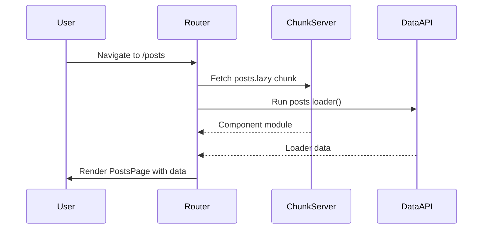

## Code Splitting and Lazy Routes

Code splitting in TanStack Router allows route components and their dependencies to be loaded on demand rather than bundled into the initial JavaScript payload. This reduces time-to-interactive for large applications by deferring the loading of route-specific code until it is actually needed.

---

### Why Code Splitting Matters

In a standard bundled application, all route components ship in a single chunk. As an application grows, this initial bundle grows with it, increasing parse and execution time even for routes the user may never visit.

Code splitting addresses this by creating separate chunks per route. The router loads these chunks asynchronously when a route is matched.

**Key Points:**
- Smaller initial bundle → faster first load
- Route chunks are fetched only when navigated to
- TanStack Router integrates splitting at the route definition level, not as an afterthought

---

### The `lazy` Route Option

TanStack Router provides a `lazy` option on route definitions. This accepts a function that returns a dynamic `import()` promise. The result must export a subset of route options that are safe to defer.

```ts
// routes/posts.lazy.ts
import { createLazyFileRoute } from '@tanstack/react-router'

export const Route = createLazyFileRoute('/posts')({
  component: PostsPage,
})

function PostsPage() {
  return <div>Posts</div>
}
```

```ts
// routes/posts.ts  ← the "critical" route file
import { createFileRoute } from '@tanstack/react-router'

export const Route = createFileRoute('/posts')({
  loader: async () => fetchPosts(),
  // component is NOT here — it lives in posts.lazy.ts
})
```

**Key Points:**
- The `.lazy.ts` file suffix is a convention recognized by TanStack Router's file-based routing
- The non-lazy route file retains critical options: `loader`, `errorComponent` definitions for error boundaries, `pendingComponent`, `beforeLoad`
- The lazy file carries only: `component`, `pendingComponent`, `errorComponent`, `notFoundComponent`

[Inference] This separation exists because `loader` and `beforeLoad` must resolve before the route renders, so deferring them would not improve perceived performance and could introduce race conditions.

---

### Split Points: What Can and Cannot Be Lazy

**Can be lazy (safe to split):**
- `component`
- `pendingComponent`
- `errorComponent`
- `notFoundComponent`

**Cannot be lazy (must remain in the critical path):**
- `loader`
- `beforeLoad`
- `validateSearch`
- `params` parsing

This constraint is intentional. Data fetching and auth guards must run before rendering begins; deferring them would make the router unable to determine the route's readiness state.

---

### Code-Based (Non-File) Route Splitting

When not using file-based routing, use the `lazy` method on a route object directly:

```ts
import { createRoute, lazyRouteComponent } from '@tanstack/react-router'

const postsRoute = createRoute({
  getParentRoute: () => rootRoute,
  path: '/posts',
  loader: async () => fetchPosts(),
  component: lazyRouteComponent(() =>
    import('./PostsPage').then(m => ({ default: m.PostsPage }))
  ),
})
```

`lazyRouteComponent` is a helper that wraps a dynamic import and integrates with React's Suspense internally. [Inference] Under the hood it likely uses `React.lazy`, but exact implementation details may vary across versions — verify against the source or changelog.

Alternatively, attach `.lazy()` directly to a route:

```ts
const postsRoute = createRoute({
  getParentRoute: () => rootRoute,
  path: '/posts',
  loader: async () => fetchPosts(),
}).lazy(() => import('./PostsPage.lazy').then(d => d.Route))
```

This form explicitly defers the component chunk until the route is first matched.

---

### File-Based Routing Convention: `.lazy.ts` Files

When using TanStack Router's file-based routing with `@tanstack/router-plugin` (Vite, Rspack, or Webpack), the router code generator recognizes the `.lazy.ts` / `.lazy.tsx` suffix automatically.

**Convention:**

| File | Purpose |
|------|---------|
| `routes/posts.ts` | Critical route options (`loader`, `beforeLoad`, etc.) |
| `routes/posts.lazy.ts` | Deferred component and UI-only options |

The code generator wires these together — no manual `.lazy()` call is needed. The plugin injects the dynamic import automatically during the build.

**Key Points:**
- Both files correspond to the same route path
- The router plugin merges them at build time
- Developers do not need to manually call `.lazy()` when using the file-based plugin

---

### Preloading Lazy Routes

Lazy loading introduces a network round trip on first navigation. TanStack Router mitigates this with preloading, which fetches a route's chunk before the user actually navigates to it.

```ts
const router = createRouter({
  routeTree,
  defaultPreload: 'intent', // preload on hover or focus
})
```

**Preload strategies:**

| Value | Behavior |
|-------|---------|
| `'intent'` | Preloads when the user hovers or focuses a `<Link>` |
| `'viewport'` | [Unverified — check current docs for support status] |
| `false` | No preloading |

Per-link override:

```tsx
<Link to="/posts" preload="intent">
  Posts
</Link>
```

[Inference] Preloading the component chunk alongside the loader's data fetch can overlap network requests, reducing the total wait time when navigating, though actual gains depend on chunk size and network conditions. Behavior is not guaranteed.

---

### Pending and Error States for Lazy Routes

Because lazy routes introduce an async load, TanStack Router supports `pendingComponent` and `errorComponent` for the loading and failure states respectively.

```ts
// posts.lazy.ts
import { createLazyFileRoute } from '@tanstack/react-router'

export const Route = createLazyFileRoute('/posts')({
  component: PostsPage,
  pendingComponent: () => <div>Loading posts...</div>,
  errorComponent: ({ error }) => <div>Failed: {error.message}</div>,
})
```

`pendingComponent` renders while both the lazy chunk and the loader are resolving. `errorComponent` renders if either the chunk fetch or the loader throws.

**Key Points:**
- `pendingMinMs` and `pendingMs` on the router control when the pending state appears, avoiding flash-of-loading for fast connections
- These can be set globally on `createRouter` or per-route

---

### Interaction with Loaders

Loaders run in parallel with the lazy component chunk fetch. This is a deliberate design decision.

```
Navigation triggered
       │
       ├──→ Fetch lazy component chunk  (network)
       └──→ Run loader()                (data fetch)
                   │
            Both resolve → render
```

[Inference] Because both operations start simultaneously, the effective wait time is `max(chunkLoadTime, loaderTime)` rather than their sum, which improves perceived performance over sequential loading. Actual behavior may vary depending on browser, network, and bundler behavior.

---

### Mermaid: Lazy Route Loading Lifecycle



---

### Bundle Analysis and Verification

After configuring code splitting, verify that chunks are actually separated using a bundle analyzer.

**For Vite:**
```bash
npm run build -- --mode production
npx vite-bundle-visualizer
```

Or use `rollup-plugin-visualizer`:

```ts
// vite.config.ts
import { visualizer } from 'rollup-plugin-visualizer'

export default defineConfig({
  plugins: [visualizer({ open: true })],
})
```

Confirm that route-specific components appear in separate chunks, not the main bundle.

---

### Common Mistakes

**Putting the loader in the `.lazy.ts` file:**
The loader will not be recognized as a critical-path option and may not execute before render. Keep loaders in the non-lazy route file.

**Default export mismatch:**
`lazyRouteComponent` expects the dynamic import to resolve to a module with a `default` export. If the component is a named export, use `.then(m => ({ default: m.MyComponent }))`.

**Forgetting `createLazyFileRoute` path must match:**
The path string passed to `createLazyFileRoute('/posts')` must exactly match the corresponding `createFileRoute('/posts')` path. A mismatch causes a runtime warning or silent failure. [Unverified — exact error behavior may differ across versions.]

---

**Related Topics:**
- Virtual file routes and programmatic route generation
- Route preloading strategies in depth (`defaultPreloadStaleTime`, `defaultPreloadDelay`)
- `pendingMs` and `pendingMinMs` — controlling loading state thresholds
- Parallel data loading with `loader` + `Route.useLoaderData`
- Error boundaries and `errorComponent` patterns
- Integrating TanStack Router with Vite's `manualChunks` for fine-grained splitting
- SSR and streaming with lazy routes