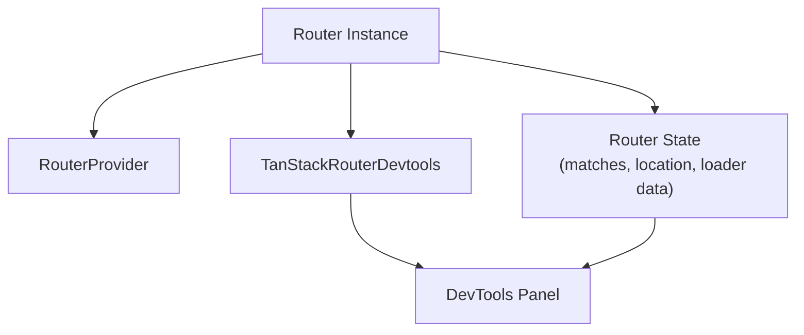

## TanStack Router DevTools

TanStack Router DevTools is an official companion package that provides a visual debugging interface for inspecting router state, matched routes, search parameters, loader data, and navigation history during development. It is designed to be included only in development builds and excluded from production bundles.

---

### Installation

```bash
npm install @tanstack/router-devtools
```

This package is separate from `@tanstack/react-router` and must be installed independently.

---

### Basic Setup

The DevTools component is mounted once, typically at the root of the application alongside the router provider.

```tsx
import { RouterProvider, createRouter } from '@tanstack/react-router'
import { TanStackRouterDevtools } from '@tanstack/router-devtools'
import { routeTree } from './routeTree.gen'

const router = createRouter({ routeTree })

function App() {
  return (
    <>
      <RouterProvider router={router} />
      <TanStackRouterDevtools router={router} />
    </>
  )
}
```

**Key Points:**
- `TanStackRouterDevtools` requires the `router` prop — the same router instance passed to `RouterProvider`
- It renders a floating panel in the viewport, toggled by a TanStack logo button
- No configuration is required for basic use

---

### Excluding from Production

The DevTools should never ship in production bundles. There are two common patterns for excluding them.

**Pattern 1 — Environment-conditional import:**

```tsx
const TanStackRouterDevtools =
  process.env.NODE_ENV === 'production'
    ? () => null
    : React.lazy(() =>
        import('@tanstack/router-devtools').then(d => ({
          default: d.TanStackRouterDevtools,
        }))
      )
```

This uses a dynamic import so the devtools chunk is never included in the production bundle at all. [Inference] Most modern bundlers (Vite, webpack, Rollup) will tree-shake the import away when the condition is statically `false` in production mode, though exact behavior depends on bundler configuration.

**Pattern 2 — Vite-specific conditional:**

```tsx
// vite.config.ts already sets NODE_ENV=production for builds
// Pattern 1 above is sufficient for Vite projects
```

**Pattern 3 — Separate dev-only root component:**

```tsx
// App.tsx
export function App() {
  return <RouterProvider router={router} />
}

// main.tsx (development only entry)
import { TanStackRouterDevtools } from '@tanstack/router-devtools'

root.render(
  <>
    <App />
    {import.meta.env.DEV && <TanStackRouterDevtools router={router} />}
  </>
)
```

---

### Placement Inside File-Based Routing

When using file-based routing, the root route (`__root.tsx`) is a natural location for the DevTools, keeping the setup co-located with the router outlet.

```tsx
// routes/__root.tsx
import { createRootRoute, Outlet } from '@tanstack/react-router'
import { TanStackRouterDevtools } from '@tanstack/router-devtools'

export const Route = createRootRoute({
  component: () => (
    <>
      <Outlet />
      <TanStackRouterDevtools />
    </>
  ),
})
```

**Key Points:**
- When placed inside a file-based root route, the `router` prop is optional — the DevTools can infer the router from context
- This is the recommended placement for file-based routing projects

---

### DevTools Panel: What It Shows

The DevTools panel is divided into several inspection areas.

#### Router State

Displays the current router state object, including:
- `location` — current pathname, search, hash, and state
- `matches` — the active route match stack
- `pendingMatches` — matches being resolved during a navigation
- `status` — `idle`, `pending`, or `redirecting`

#### Route Matches

Lists all currently matched routes from root to leaf. Each match entry shows:
- Route ID and path pattern
- Match status: `pending`, `success`, `error`
- Loader data (if any)
- Search params scoped to that route
- Params (path parameters)

Clicking a match expands its full detail view.

#### Search Params

Displays the parsed and validated search parameters for the current location, as seen by the router after `validateSearch` runs. This is useful for debugging search param schemas.

#### Loader Data

Shows the data returned by each matched route's `loader`. Nested routes display their loader data independently.

#### Navigation History

[Unverified — availability of a full history view may vary by version. Verify against current devtools release.]

---

### Props Reference

| Prop | Type | Default | Description |
|------|------|---------|-------------|
| `router` | `Router` | from context | The router instance to inspect |
| `initialIsOpen` | `boolean` | `false` | Open the panel on mount |
| `position` | `'bottom-left' \| 'bottom-right' \| 'top-left' \| 'top-right'` | `'bottom-left'` | Position of the toggle button |
| `toggleButtonProps` | `object` | `{}` | Props forwarded to the toggle button element |
| `panelProps` | `object` | `{}` | Props forwarded to the panel container |

[Inference] Additional props may exist in newer versions. Verify against the `@tanstack/router-devtools` type definitions for the installed version.

---

### `initialIsOpen` Usage

Useful during active debugging sessions to keep the panel open across hot reloads.

```tsx
<TanStackRouterDevtools
  router={router}
  initialIsOpen={true}
  position="bottom-right"
/>
```

---

### DevTools with `RouterDevtoolsPanel` (Embedded Mode)

For custom layouts or integrated tooling, TanStack Router also exports `TanStackRouterDevtoolsPanel`, which renders the panel content directly without the floating toggle button.

```tsx
import { TanStackRouterDevtoolsPanel } from '@tanstack/router-devtools'

function DevLayout() {
  return (
    <div style={{ display: 'flex', height: '100vh' }}>
      <main style={{ flex: 1 }}>
        <Outlet />
      </main>
      <aside style={{ width: 400, overflowY: 'auto' }}>
        <TanStackRouterDevtoolsPanel router={router} />
      </aside>
    </div>
  )
}
```

**Key Points:**
- `TanStackRouterDevtoolsPanel` renders inline — no floating button or overlay
- Suitable for split-pane dev environments or Storybook-style setups
- [Inference] Accepts the same props as `TanStackRouterDevtools` minus position-related ones, though this should be verified against current type definitions

---

### Mermaid: DevTools Data Flow



---

### Relationship to TanStack Query DevTools

If the application uses both TanStack Router and TanStack Query, both DevTools components can be mounted independently. They operate on separate stores and do not interfere with each other.

```tsx
import { TanStackRouterDevtools } from '@tanstack/router-devtools'
import { ReactQueryDevtools } from '@tanstack/react-query-devtools'

function Root() {
  return (
    <>
      <Outlet />
      <TanStackRouterDevtools router={router} />
      <ReactQueryDevtools initialIsOpen={false} />
    </>
  )
}
```

[Inference] Both panels render as separate floating buttons and can be open simultaneously. Visual overlap depends on their configured positions.

---

### Practical Debugging Scenarios

**Debugging search param validation failures:**
If `validateSearch` rejects input, the router may redirect or reset params. The DevTools search param panel shows what the router resolved after validation, making it possible to compare against the raw URL.

**Inspecting nested loader data:**
When multiple route loaders run (root, layout, leaf), each match entry in the DevTools shows its own loader data independently. This clarifies which route owns which data.

**Verifying pending states:**
During slow loaders or lazy chunk fetches, `pendingMatches` in the router state panel shows what is being resolved. Useful for confirming that `pendingComponent` is wired correctly.

**Confirming route matching:**
The route match list makes it immediately visible whether a route pattern matched as expected, which is useful when debugging dynamic segments or splat routes.

---

**Related Topics:**
- Integrating TanStack Query DevTools alongside Router DevTools
- Debugging `validateSearch` with DevTools search param inspection
- Loader data inspection and nested route loader patterns
- Pending and error state debugging with DevTools
- Using `RouterDevtoolsPanel` in Storybook or custom dev environments
- Source map configuration for clearer DevTools stack traces