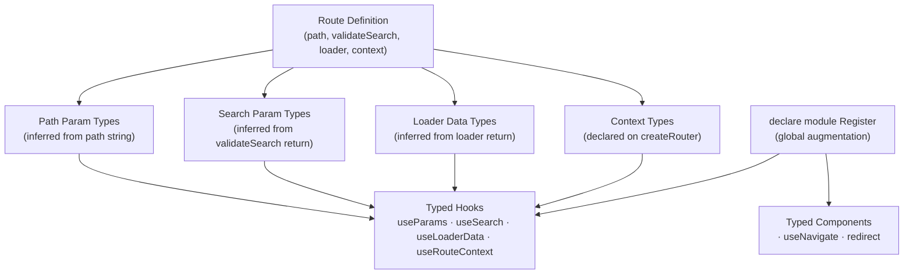

## Full Type Safety Across Routes

TanStack Router is built type-first. Unlike most routing libraries where types are bolted on via generics or casting, TanStack Router infers types directly from route definitions — path parameters, search parameters, loader data, and router context are all fully typed end-to-end without manual annotation in most cases.

---

### How Type Inference Works

TanStack Router constructs a complete type map of the entire route tree at the TypeScript level. Each route contributes its typed shape — params, search, loader return, context — and these are merged and propagated through the tree so that any hook or component consuming route data receives the correct inferred type.

**Key Points:**
- Types flow from route definitions, not from separate type declaration files
- No casting (`as`) is needed in standard usage
- The router instance itself is typed, carrying the full route tree as a type parameter

---

### Registering the Router for Global Type Inference

TanStack Router uses a module augmentation pattern to make the router instance's types available globally. Without this step, hooks like `useParams` and `useSearch` cannot infer route-specific types.

```ts
// router.ts
import { createRouter } from '@tanstack/react-router'
import { routeTree } from './routeTree.gen'

export const router = createRouter({ routeTree })

// Module augmentation — required for global type inference
declare module '@tanstack/react-router' {
  interface Register {
    router: typeof router
  }
}
```

**Key Points:**
- This declaration must be made exactly once, globally
- After this, all TanStack Router hooks infer types from the registered router without requiring explicit generic arguments
- [Inference] TypeScript resolves the `Register` interface at compile time through declaration merging, which is why no runtime wiring is needed

---

### Path Parameter Types

Path parameters are inferred from the route's `path` string. A segment prefixed with `$` is treated as a dynamic parameter.

```ts
// routes/posts/$postId.ts
import { createFileRoute } from '@tanstack/react-router'

export const Route = createFileRoute('/posts/$postId')({
  component: PostDetail,
})

function PostDetail() {
  const { postId } = Route.useParams()
  // postId: string — inferred, no annotation needed
  return <div>{postId}</div>
}
```

For code-based routes:

```ts
const postRoute = createRoute({
  getParentRoute: () => rootRoute,
  path: '/posts/$postId',
})

// Elsewhere:
const { postId } = postRoute.useParams()
// postId: string
```

**Key Points:**
- All path params are `string` by default — path segments are always strings at the URL level
- Numeric coercion must be done explicitly in the loader or component
- TypeScript will error if you access a param key that does not exist in the route's path pattern

---

### Search Parameter Types

Search parameters require explicit schema definition via `validateSearch`. The return type of the validator becomes the inferred search type for the route.

```ts
import { createFileRoute } from '@tanstack/react-router'
import { z } from 'zod'
import { zodSearchValidator } from '@tanstack/zod-adapter'

const searchSchema = z.object({
  page: z.number().int().min(1).default(1),
  query: z.string().optional(),
})

export const Route = createFileRoute('/posts')({
  validateSearch: zodSearchValidator(searchSchema),
  component: PostsList,
})

function PostsList() {
  const { page, query } = Route.useSearch()
  // page: number
  // query: string | undefined
  return <div>Page {page}</div>
}
```

**Key Points:**
- Without `validateSearch`, search params are typed as `Record<string, unknown>`
- The validator's return type — not the schema itself — determines the inferred type
- Zod, Valibot, and ArkType adapters are available via `@tanstack/zod-adapter`, `@tanstack/valibot-adapter`, `@tanstack/arktype-adapter`

---

### Loader Data Types

The return type of a `loader` function is inferred automatically and made available through `Route.useLoaderData()`.

```ts
export const Route = createFileRoute('/posts/$postId')({
  loader: async ({ params }) => {
    const post = await fetchPost(params.postId)
    // post must be typed for inference to flow correctly
    return { post }
  },
  component: PostDetail,
})

function PostDetail() {
  const { post } = Route.useLoaderData()
  // post: Post — inferred from loader return type
}
```

**Key Points:**
- The loader's return type must be inferrable — avoid `any` or untyped fetch results
- `Route.useLoaderData()` is scoped to the specific route; it does not return data from parent loaders
- For parent loader data, use `Route.useRouteContext()` or access via `useLoaderData` with a `from` argument

---

### Typed `useLoaderData` with `from`

When consuming loader data outside the route's own component tree, use `useLoaderData` with the `from` option:

```ts
import { useLoaderData } from '@tanstack/react-router'

function SomeChildComponent() {
  const { post } = useLoaderData({ from: '/posts/$postId' })
  // post: Post — fully typed, derived from the specified route's loader
}
```

TypeScript will error if the `from` path does not match a registered route, or if the destructured key does not exist in that route's loader return.

---

### Router Context Types

Router context is typed through the `context` option on `createRouter` and propagated to all routes.

```ts
// router.ts
import { createRouter } from '@tanstack/react-router'

export interface RouterContext {
  auth: { userId: string | null }
  queryClient: QueryClient
}

const router = createRouter({
  routeTree,
  context: {
    auth: { userId: null },
    queryClient,
  } satisfies RouterContext,
})
```

Routes access context through `beforeLoad` or `loader`:

```ts
export const Route = createFileRoute('/dashboard')({
  beforeLoad: ({ context }) => {
    // context: RouterContext — fully typed
    if (!context.auth.userId) throw redirect({ to: '/login' })
  },
  loader: ({ context }) => {
    return context.queryClient.ensureQueryData(dashboardQuery)
  },
})
```

**Key Points:**
- Context type flows into every route's `loader`, `beforeLoad`, and `component` via `Route.useRouteContext()`
- Use `satisfies RouterContext` rather than an explicit type cast to keep inference intact while still validating the shape

---

### `Link` Type Safety

The `<Link>` component is fully typed. The `to` prop only accepts valid registered route paths, and `params` / `search` props are required and typed per destination.

```tsx
import { Link } from '@tanstack/react-router'

// ✓ Valid — postId is required and typed as string
<Link to="/posts/$postId" params={{ postId: '42' }}>
  View Post
</Link>

// ✗ TypeScript error — unknown route
<Link to="/does-not-exist">Bad</Link>

// ✗ TypeScript error — missing required param
<Link to="/posts/$postId">Missing param</Link>
```

**Key Points:**
- `params` is required when the target route has dynamic segments
- `search` is typed against the target route's `validateSearch` return type
- `state` is typed if the route declares a state schema [Inference — verify state typing support in current version]

---

### `useNavigate` Type Safety

`useNavigate` returns a typed `navigate` function. The options object is narrowed per destination path.

```ts
const navigate = useNavigate()

navigate({
  to: '/posts/$postId',
  params: { postId: post.id },
  search: { page: 1 },
})
// All fields typed and validated at compile time
```

---

### `useParams` and `useSearch` with `from`

Hooks called outside a route's own component scope require a `from` argument to narrow the type:

```ts
import { useParams, useSearch } from '@tanstack/react-router'

// Typed to the specific route's params
const { postId } = useParams({ from: '/posts/$postId' })

// Typed to the specific route's search schema
const { page } = useSearch({ from: '/posts' })
```

Without `from`, these hooks return a union of all possible param/search shapes across all routes, which is rarely useful in practice.

---

### `strict` vs `from` — The `strict` Option

When using hooks without `from`, pass `strict: false` to opt into a looser union type explicitly:

```ts
const params = useParams({ strict: false })
// params: Partial<union of all route params>
```

This is [Inference] intended for components genuinely shared across multiple routes where the exact route is not known statically. It trades type precision for flexibility.

---

### Type-Safe `redirect`

The `redirect` utility is also typed — its `to` field accepts only registered route paths.

```ts
import { redirect } from '@tanstack/react-router'

throw redirect({ to: '/login' })
// ✗ Error if '/login' is not a registered route
```

---

### Mermaid: Type Flow Through the Route Tree



---

### Common Type Errors and Their Causes

**`Type 'string' is not assignable to type 'never'` on `params`:**
The target route has no dynamic segments, so `params` is not accepted. Remove the `params` prop from `<Link>`.

**`Property 'x' does not exist on type '{}'` on loader data:**
The loader return type was not inferred correctly, often because the fetch function returns `any`. Add an explicit return type to the fetch function.

**`Argument of type '"/unknown"' is not assignable`:**
The `to` value is not a registered route path. Verify the path matches a route definition exactly, including the leading slash.

**`from` path not recognized:**
The path string passed to `from` does not match any registered route. Check spelling and that the route file exists and is included in the route tree.

---

**Related Topics:**
- Zod, Valibot, and ArkType search param adapters
- Router context — typed dependency injection patterns
- Typed route masking and `useMatchedRoute`
- End-to-end type safety with TanStack Query (`from` + `useLoaderData` + `ensureQueryData`)
- `createRouteMask` and its type constraints
- TypeScript `satisfies` vs `as` in route and context definitions
- Generating route types with `@tanstack/router-plugin` and `routeTree.gen.ts`