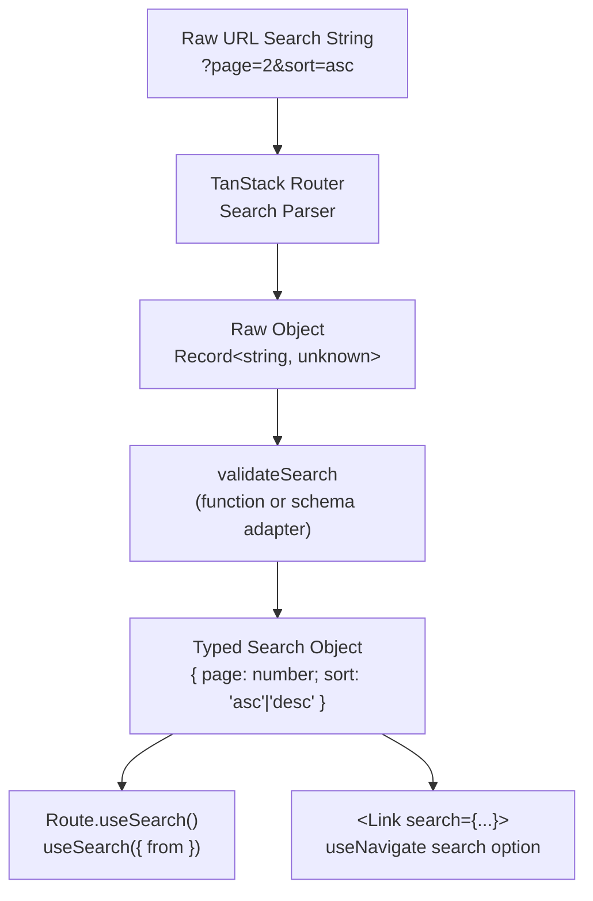

## Typed Route Params and Search Params

TanStack Router provides end-to-end type inference for both path parameters and search parameters. Path params are derived structurally from the route's path string. Search params require an explicit validator, whose return type becomes the inferred search type. Both are enforced at every consumption point — hooks, `<Link>`, `useNavigate`, and `redirect`.

---

### Path Parameters: How Types Are Derived

Path parameters are segments prefixed with `$` in the route path string. TypeScript extracts these segment names at the type level — no manual annotation is needed.

```ts
createFileRoute('/posts/$postId')
// Inferred params: { postId: string }

createFileRoute('/org/$orgId/repo/$repoId')
// Inferred params: { orgId: string; repoId: string }
```

All path params are `string` at the type level because URL segments are always strings. Numeric or other coercions must be handled explicitly.

**Key Points:**
- Param keys are extracted from the path literal at compile time
- Accessing a key not present in the path is a TypeScript error
- The `$` prefix is the only required convention — no additional configuration

---

### Consuming Path Params: `Route.useParams()`

Within a route's own component, use `Route.useParams()` — the route-scoped hook that requires no `from` argument and returns the tightest possible type.

```ts
// routes/posts/$postId.tsx
export const Route = createFileRoute('/posts/$postId')({
  component: PostDetail,
})

function PostDetail() {
  const { postId } = Route.useParams()
  // postId: string
}
```

---

### Consuming Path Params Outside the Route: `useParams` with `from`

When a component is rendered outside the route's direct component tree but needs params from a specific route, use the global `useParams` with `from`:

```ts
import { useParams } from '@tanstack/react-router'

function Breadcrumb() {
  const { postId } = useParams({ from: '/posts/$postId' })
  // postId: string — narrowed to this route only
}
```

Without `from`, `useParams` returns a broad union of all param shapes across all routes — rarely useful and difficult to consume safely.

---

### Coercing Path Params to Non-String Types

Path params are always `string` at the router level. Coercion belongs in the `loader` or inside the component, not in the route path.

```ts
export const Route = createFileRoute('/posts/$postId')({
  loader: ({ params }) => {
    const id = Number(params.postId)
    if (Number.isNaN(id)) throw new Error('Invalid post ID')
    return fetchPost(id)
  },
  component: PostDetail,
})
```

[Inference] Performing coercion in the loader keeps component code clean and centralizes validation, though the approach is a design choice rather than a framework requirement.

---

### Splat (Catch-All) Params

A route path ending in `$` with no name — written as `$` alone — is a splat route. Its captured value is available under the key `_splat`.

```ts
createFileRoute('/files/$')
// Inferred params: { _splat: string }

function FileViewer() {
  const { _splat } = Route.useParams()
  // _splat: string — the remainder of the path after /files/
}
```

**Key Points:**
- `_splat` captures everything after the matched prefix, including slashes
- [Inference] The key `_splat` is a fixed convention in TanStack Router, not configurable

---

### Search Parameters: Why a Validator Is Required

Unlike path params, search parameters cannot be inferred from the path string — they are not part of the route pattern. TanStack Router requires an explicit `validateSearch` function. Its return type becomes the inferred search type for the route.

Without `validateSearch`, search params are typed as `Record<string, unknown>` — effectively untyped.

---

### `validateSearch`: Function Form

The simplest validator is a plain function. Its parameter is the raw parsed search object (`Record<string, unknown>`), and its return value is the typed search shape.

```ts
export const Route = createFileRoute('/posts')({
  validateSearch: (search: Record<string, unknown>) => ({
    page: Number(search.page) || 1,
    query: typeof search.query === 'string' ? search.query : undefined,
  }),
  component: PostsList,
})

function PostsList() {
  const { page, query } = Route.useSearch()
  // page: number
  // query: string | undefined
}
```

**Key Points:**
- The return type is inferred — no explicit annotation needed on the return value
- This form requires manual coercion and validation logic
- Invalid or missing values must be handled explicitly to avoid `undefined` leaking into the type

---

### `validateSearch`: Schema Validator Adapters

TanStack Router provides official adapters for popular schema libraries. These wrap the library's parser and conform its output to TanStack Router's validator interface.

**Available adapters:**

| Package | Adapter import |
|---------|---------------|
| `zod` | `@tanstack/zod-adapter` → `zodSearchValidator` |
| `valibot` | `@tanstack/valibot-adapter` → `valibotSearchValidator` |
| `arktype` | `@tanstack/arktype-adapter` → `arktypeSearchValidator` |

**Example with Zod:**

```ts
import { z } from 'zod'
import { zodSearchValidator } from '@tanstack/zod-adapter'

const postsSearch = z.object({
  page: z.number().int().min(1).catch(1),
  query: z.string().optional(),
  sort: z.enum(['asc', 'desc']).catch('asc'),
})

export const Route = createFileRoute('/posts')({
  validateSearch: zodSearchValidator(postsSearch),
  component: PostsList,
})

function PostsList() {
  const { page, query, sort } = Route.useSearch()
  // page: number
  // query: string | undefined
  // sort: 'asc' | 'desc'
}
```

**Key Points:**
- `.catch(value)` on a Zod field provides a fallback when the raw input is invalid or missing — prevents validation from throwing on malformed URLs
- The adapter handles calling `.parse()` or `.safeParse()` internally
- The inferred type comes from the schema's output type, not its input type

---

### `validateSearch` with Valibot

```ts
import * as v from 'valibot'
import { valibotSearchValidator } from '@tanstack/valibot-adapter'

const postsSearch = v.object({
  page: v.optional(v.pipe(v.unknown(), v.transform(Number)), 1),
  query: v.optional(v.string()),
})

export const Route = createFileRoute('/posts')({
  validateSearch: valibotSearchValidator(postsSearch),
})
```

[Inference] The exact transformer syntax for Valibot may differ across Valibot versions — verify against the installed version's documentation.

---

### Consuming Search Params: `Route.useSearch()`

Within the route's component, `Route.useSearch()` returns the fully typed, validated search object.

```ts
function PostsList() {
  const search = Route.useSearch()
  // search: { page: number; query: string | undefined; sort: 'asc' | 'desc' }
}
```

It also supports a `select` option to derive a value and avoid unnecessary re-renders:

```ts
const page = Route.useSearch({ select: s => s.page })
// page: number — component only re-renders when page changes
```

---

### Consuming Search Params Outside the Route: `useSearch` with `from`

```ts
import { useSearch } from '@tanstack/react-router'

function PageIndicator() {
  const { page } = useSearch({ from: '/posts' })
  // page: number — typed to /posts route's search schema
}
```

---

### Navigating with Typed Search Params

`useNavigate` and `<Link>` both enforce the search param types of the target route.

**With `useNavigate`:**

```ts
const navigate = useNavigate()

navigate({
  to: '/posts',
  search: { page: 2, sort: 'desc' },
})

// ✗ TypeScript error — 'sort' must be 'asc' | 'desc', not 'random'
navigate({
  to: '/posts',
  search: { page: 1, sort: 'random' },
})
```

**With `<Link>`:**

```tsx
<Link to="/posts" search={{ page: 1, sort: 'asc' }}>
  First Page
</Link>

// ✗ Error — page must be number, not string
<Link to="/posts" search={{ page: '1' }}>
  Bad
</Link>
```

---

### Partial Search Updates with `search` as a Function

When navigating, `search` can be a function that receives the current search state and returns a partial update. The function's parameter and return type are both inferred.

```ts
navigate({
  to: '/posts',
  search: prev => ({ ...prev, page: prev.page + 1 }),
  // prev: { page: number; query: string | undefined; sort: 'asc' | 'desc' }
})
```

**Key Points:**
- This pattern preserves existing search params while updating specific keys
- TypeScript enforces that the returned object matches the target route's search type
- [Inference] The spread of `prev` followed by overrides is the idiomatic pattern for partial updates, though no framework mechanism enforces this style

---

### Inheriting Search Params from Parent Routes

Child routes do not automatically inherit parent search param types. If a child route needs access to a parent's search params, it must either re-declare the same schema or use `useSearch` with `from` pointing to the parent route.

```ts
// In a child component — accessing parent route's search params
const { page } = useSearch({ from: '/posts' })
```

[Inference] Re-declaring identical schemas in child routes creates redundancy and potential drift. Extracting the schema to a shared constant and importing it in both routes is a common mitigation, though this is a design convention rather than a framework requirement.

---

### Mermaid: Search Param Type Flow



---

### Handling Invalid Search Params Gracefully

If `validateSearch` throws, TanStack Router treats it as a search validation error. To avoid this:

- Use `.catch()` in Zod schemas to supply fallbacks
- Use `optional()` for fields that may be absent
- Use the plain function form with explicit fallbacks for maximum control

```ts
// Defensive plain function validator
validateSearch: (raw) => ({
  page: typeof raw.page === 'number' && raw.page > 0 ? raw.page : 1,
  query: typeof raw.query === 'string' ? raw.query : '',
})
```

This approach means the URL `/posts?page=abc` resolves to `page: 1` rather than throwing. [Inference] Whether to throw or fall back depends on the application's tolerance for malformed URLs — both approaches are valid design decisions.

---

### Summary Comparison

| Feature | Path Params | Search Params |
|---------|-------------|--------------|
| Type source | Inferred from path string | Inferred from `validateSearch` return |
| Always present | Yes, if route matches | No — must handle missing/invalid |
| Raw type | `string` | `Record<string, unknown>` before validation |
| Coercion | Manual, in loader or component | Via validator or adapter |
| Required declaration | None | `validateSearch` required for typed access |
| Hook | `Route.useParams()` / `useParams({ from })` | `Route.useSearch()` / `useSearch({ from })` |

---

**Related Topics:**
- Zod `.catch()` and `.default()` for robust search param fallbacks
- `useSearch` `select` option for derived state and render optimization
- Sharing search param schemas across sibling or child routes
- Splat routes and `_splat` param patterns
- Search param serialization — custom `stringifySearch` and `parseSearch`
- Type-safe navigation patterns with `useNavigate` and `<Link>`
- Parent–child search param inheritance strategies