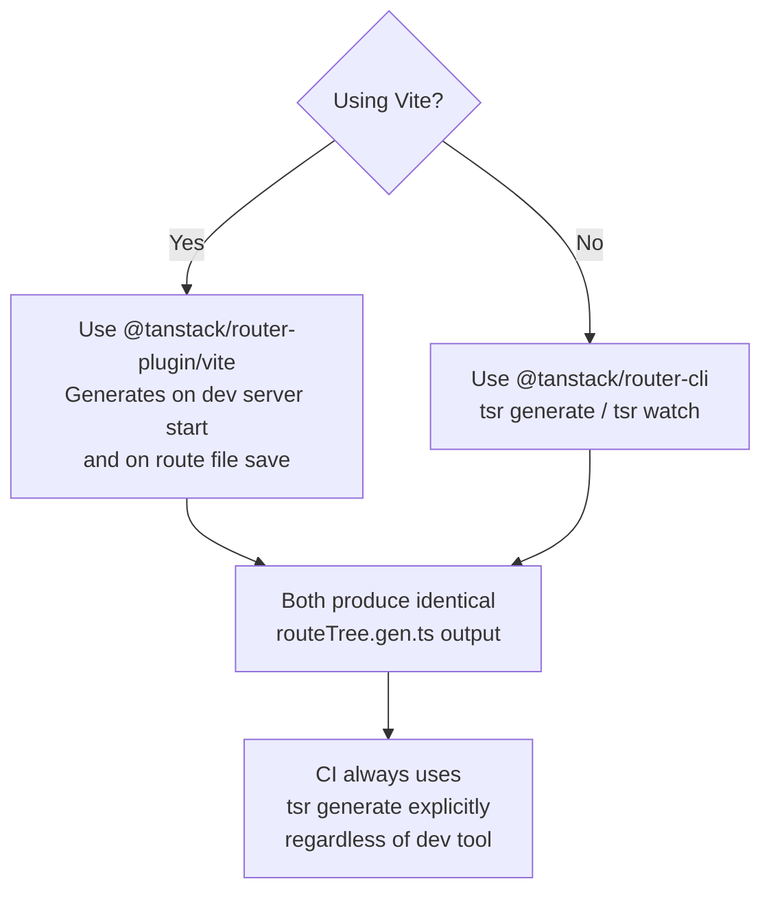

## Generating Route Types with CLI

TanStack Router's file-based routing system includes a code generation step that produces a typed route tree from the filesystem. This generated file — typically `routeTree.gen.ts` — is the foundation for all end-to-end type inference across the application. The CLI and Vite plugin both drive this generation process.

---

### Why Generation Is Necessary

TanStack Router infers route types from the route tree object passed to `createRouter`. For file-based routing, this tree must be assembled from individual route files. Rather than requiring manual assembly, TanStack Router generates `routeTree.gen.ts` automatically by scanning the routes directory and composing the tree with full type information.

**Key Points:**
- `routeTree.gen.ts` is a machine-generated file — it should not be edited manually
- All type inference downstream (hooks, `<Link>`, `useNavigate`) depends on this file being current
- The file must be regenerated whenever route files are added, removed, or renamed

---

### Two Generation Modes

TanStack Router provides route type generation through two mechanisms:

| Mode | Package | Use case |
|------|---------|---------|
| Vite plugin | `@tanstack/router-plugin/vite` | Vite projects — generates on dev server start and on file changes |
| CLI | `@tanstack/router-cli` | Non-Vite projects, CI pipelines, pre-commit hooks, manual generation |

Both produce identical output. The CLI is the focus of this topic.

---

### Installation

```bash
npm install --save-dev @tanstack/router-cli
```

The CLI is a development dependency. It does not ship to production.

---

### CLI Commands

```bash
# Generate the route tree once
npx tsr generate

# Watch mode — regenerate on route file changes
npx tsr watch
```

`tsr` is the CLI binary name. Both commands read configuration from `tsr.config.json` or from `package.json` under the `"tsr"` key.

---

### Configuration: `tsr.config.json`

Place `tsr.config.json` at the project root:

```json
{
  "routesDirectory": "./src/routes",
  "generatedRouteTree": "./src/routeTree.gen.ts"
}
```

**All configuration fields:**

| Field | Type | Default | Description |
|-------|------|---------|-------------|
| `routesDirectory` | `string` | `./src/routes` | Directory scanned for route files |
| `generatedRouteTree` | `string` | `./src/routeTree.gen.ts` | Output path for the generated file |
| `quoteStyle` | `'single' \| 'double'` | `'single'` | Quote style in generated code |
| `semicolons` | `boolean` | `false` | Whether to emit semicolons |
| `disableTypes` | `boolean` | `false` | Emit plain JS without TypeScript types |
| `addExtensions` | `boolean` | `false` | Add `.ts`/`.tsx` extensions to imports |
| `fileExtensions` | `string[]` | `['.ts', '.tsx']` | File extensions recognized as route files |
| `indexToken` | `string` | `'index'` | Filename treated as the index route |
| `routeToken` | `string` | `'route'` | Filename treated as a layout route |
| `experimental` | `object` | — | Experimental options — [Unverified — verify current fields against CLI docs] |

---

### Configuration via `package.json`

Alternatively, embed configuration under the `"tsr"` key in `package.json`:

```json
{
  "name": "my-app",
  "scripts": {
    "generate-routes": "tsr generate",
    "dev": "tsr watch & vite"
  },
  "tsr": {
    "routesDirectory": "./src/routes",
    "generatedRouteTree": "./src/routeTree.gen.ts"
  }
}
```

**Key Points:**
- `tsr.config.json` takes precedence over `package.json` configuration if both are present [Inference — verify precedence behavior in current CLI version]
- Keep configuration minimal; defaults are suitable for most standard project layouts

---

### What the CLI Scans

The CLI recursively scans `routesDirectory` for files matching the configured `fileExtensions`. It interprets the filesystem structure as the route hierarchy.

**File naming conventions recognized:**

| Filename pattern | Route behavior |
|-----------------|---------------|
| `index.tsx` | Index route for its directory |
| `about.tsx` | `/about` path segment |
| `$postId.tsx` | Dynamic segment — `$postId` param |
| `posts.lazy.tsx` | Lazy component split for `posts` route |
| `_layout.tsx` | Pathless layout route |
| `(group).tsx` | Route group — pathless, no URL segment |
| `$.tsx` | Splat (catch-all) route |
| `__root.tsx` | Root route — required, exactly one |

Files prefixed with `-` or named with a leading underscore outside the layout convention are [Inference] typically ignored as non-route files — verify against current CLI documentation.

---

### The Generated File: `routeTree.gen.ts`

The generated file exports the assembled route tree and associated type declarations. A simplified example:

```ts
// routeTree.gen.ts — DO NOT EDIT MANUALLY

import { createFileRoute, createRootRoute } from '@tanstack/react-router'

import { Route as rootRoute } from './routes/__root'
import { Route as IndexRoute } from './routes/index'
import { Route as PostsRoute } from './routes/posts'
import { Route as PostsPostIdRoute } from './routes/posts/$postId'

const routeTree = rootRoute.addChildren([
  IndexRoute,
  PostsRoute.addChildren([PostsPostIdRoute]),
])

export { routeTree }

// Type declarations for module augmentation
declare module '@tanstack/react-router' {
  interface FileRoutesByPath {
    '/': { /* ... */ }
    '/posts': { /* ... */ }
    '/posts/$postId': { /* ... */ }
  }
}
```

**Key Points:**
- The file is entirely auto-assembled — route nesting is derived from directory structure
- `FileRoutesByPath` is the interface that powers typed `from`, `to`, and `Link` props globally
- Importing from this file is required in `createRouter` — the type map does not exist without it

---

### Wiring the Generated Tree into the Router

```ts
// router.ts
import { createRouter } from '@tanstack/react-router'
import { routeTree } from './routeTree.gen'

export const router = createRouter({ routeTree })

declare module '@tanstack/react-router' {
  interface Register {
    router: typeof router
  }
}
```

This is the only manual step required after generation. After this, all hooks and components consume types from the registered router.

---

### Running Generation in CI

In CI pipelines, generate the route tree before the TypeScript type check step:

```yaml
# GitHub Actions example
- name: Install dependencies
  run: npm ci

- name: Generate route tree
  run: npx tsr generate

- name: Type check
  run: npx tsc --noEmit

- name: Build
  run: npm run build
```

**Key Points:**
- If `routeTree.gen.ts` is not committed to version control, generation must run before `tsc`
- If it is committed, generation in CI still catches drift between route files and the generated tree
- [Inference] A drift check can be implemented by running `tsr generate` and then `git diff --exit-code routeTree.gen.ts` — a non-zero exit indicates the committed file is out of date

---

### Committing `routeTree.gen.ts`

Whether to commit the generated file is a team decision. Both approaches are common.

**Commit the file:**
- TypeScript type checking works without a generation step in CI
- Diff in PRs makes route changes visible in code review
- Risk: developers may forget to regenerate after changing routes

**Do not commit the file:**
- Generation is always fresh in CI
- No risk of stale committed output
- Requires generation to run before any TypeScript compilation step

[Inference] For most teams, committing the file reduces CI complexity at the cost of requiring discipline around regeneration. Neither approach is inherently superior.

Add to `.gitignore` if not committing:

```
src/routeTree.gen.ts
```

---

### Pre-commit Hook Integration

To enforce regeneration before commits, use a tool like `lint-staged` with `husky`:

```json
// package.json
{
  "lint-staged": {
    "src/routes/**/*.{ts,tsx}": ["tsr generate", "git add src/routeTree.gen.ts"]
  }
}
```

[Inference] This runs generation whenever route files are staged, then stages the updated generated file. Exact `lint-staged` configuration may need adjustment based on project structure.

---

### Vite Plugin vs CLI: Choosing Between Them



**Key Points:**
- The Vite plugin runs generation automatically during development — no separate watch process needed
- The CLI is the only option for webpack, Rspack, esbuild, or plain TypeScript projects
- In Vite projects, the CLI is still useful for CI and pre-commit hooks
- [Inference] The plugin and CLI share the same underlying generation logic — discrepancies in output between the two would indicate a version mismatch

---

### Troubleshooting Common Issues

**Generated file not updating after adding a route:**
Ensure `tsr watch` is running or the Vite plugin is active. Check that the new file is in `routesDirectory` and uses a recognized extension.

**TypeScript errors referencing stale route paths:**
The generated file is out of sync with the route files. Run `tsr generate` and restart the TypeScript language server.

**`__root.tsx` not found error:**
The CLI requires exactly one root route file named `__root.tsx` (or `__root.ts`) in the routes directory root. It is not optional.

**Route not appearing in generated tree:**
Check that the file exports a `Route` constant created with `createFileRoute`. Files that do not export a recognized route are ignored by the scanner.

**`tsr` command not found:**
The CLI must be invoked via `npx tsr` or added to `package.json` scripts. A global install (`npm install -g`) is [Inference] possible but not recommended for reproducibility across environments.

---

**Related Topics:**
- `@tanstack/router-plugin` — Vite, webpack, and Rspack plugin configuration
- File-based routing conventions — naming, nesting, layout routes, groups
- `routeTree.gen.ts` internals — `FileRoutesByPath` and module augmentation
- Monorepo route generation — configuring `routesDirectory` across packages
- Custom route file extensions with `fileExtensions` config
- Integrating `tsr generate` into Turborepo or Nx pipelines
- `disableTypes` option for JavaScript projects without TypeScript