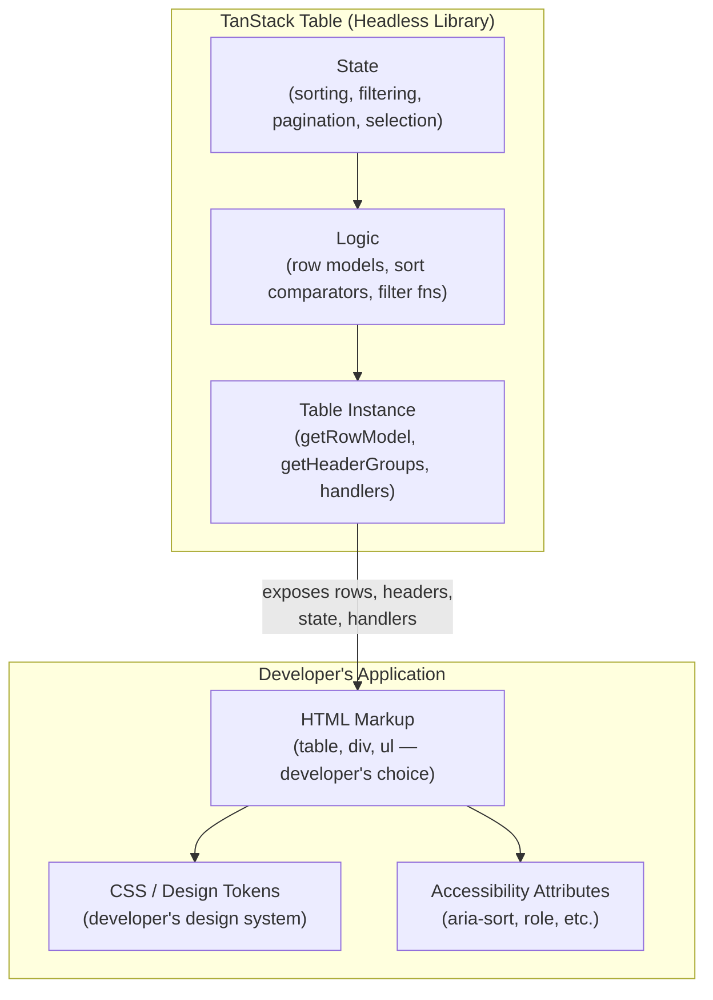

## Headless UI Philosophy

Headless UI is a design approach where a library provides behavior, state, and logic without rendering any markup or applying any styles. The consumer owns the output entirely. TanStack Table is one of the most prominent examples of this philosophy applied to complex interactive data components.

---

### The Core Separation

Headless UI draws a strict boundary between two concerns:

**What the library owns:**
- State (sorting order, selected rows, current page, filter values)
- Computed derivations (sorted row order, filtered row set, visible columns)
- Event handlers and updaters (toggle sort, set filter, go to next page)
- Logic (sort comparison, filter matching, pagination slicing)

**What the consumer owns:**
- HTML structure — `<table>`, `<div>`, `<ul>`, or anything else
- CSS and visual styling — including hover states, borders, spacing, typography
- Accessibility attributes — `aria-sort`, `role`, `aria-label`, and so on
- Interaction affordances — what a sort trigger looks like, where a filter input appears

No assumptions are made about the rendering layer.

---

### Why This Boundary Exists

Traditional component libraries couple behavior and presentation. A `DataGrid` component from a UI kit renders its own markup, applies its own class names, and exposes behavior through a constrained prop API. The developer is a consumer of a black box.

This coupling creates several problems:

**Style conflicts:** The library's CSS coexists with the application's design system, requiring overrides or specificity fights.

**Structural inflexibility:** The rendered HTML cannot be changed. If the library renders `<table>` but the design requires a `<div>`-based grid for virtualization, that is not possible without forking the library.

**API surface limits:** Features not anticipated by the library authors are not accessible. The prop surface is the ceiling.

**Bundle cost:** Even features not used are often included because the component is monolithic.

Headless UI eliminates all of these by delivering only the parts that are genuinely difficult to reimplement: the stateful logic.

---

### What Is Genuinely Hard to Reimplement

The value proposition of headless UI rests on the premise that some behavior is hard enough to justify a library dependency, while presentation is not.

**Hard:**
- Multi-column sort with stable secondary sort keys
- Filter pipelines that compose correctly with grouping and pagination
- Row model computation that stays performant on large datasets
- Column resizing with drag deltas tracked across pointer events
- Accessibility state for complex widgets (comboboxes, date pickers, menus)
- Keyboard navigation across arbitrary DOM structures

**Not hard (but tedious):**
- Rendering a `<tr>` for each row
- Applying a CSS class for a striped row
- Showing a sort arrow icon

The library handles the former. The developer handles the latter.

---

### The Instance Pattern

Headless libraries typically expose an instance object rather than a component. The instance is a plain object (or reactive object, in framework terms) containing state and methods. The developer queries this object to render.

In TanStack Table:

```ts
const table = useReactTable({ data, columns, getCoreRowModel: getCoreRowModel() })

// The instance exposes computed iterables
table.getHeaderGroups()     // typed header rows
table.getRowModel().rows    // typed data rows
table.getState()            // full state snapshot

// And handlers
table.setGlobalFilter(value)
table.setSorting(updater)
table.nextPage()
```

None of these methods touch the DOM. They update state. The developer's render function reads state and produces markup on the next render cycle.

---

### Comparison with Styled and Compound Component Approaches

| Approach | Markup control | Style control | Feature ceiling | Complexity |
|----------|---------------|--------------|----------------|------------|
| Prebuilt component (e.g. AG Grid Community) | None | Limited (theming API) | Library's API | Low setup |
| Compound components (e.g. Radix UI) | Partial | Full (unstyled primitives) | Library's API | Medium setup |
| Headless (e.g. TanStack Table) | Full | Full | Unlimited | Higher setup |

**Key Points:**
- The trade-off is always setup cost against design freedom
- Headless is not universally superior — it is superior when design requirements cannot be met by a prebuilt component
- Prebuilt components are faster to ship when their defaults match requirements

---

### Headless UI and Design Systems

Headless libraries are specifically well-suited to design system contexts, where a team maintains a shared component library and cannot accept external style dependencies.

A design system team can wrap a headless library once — applying their tokens, markup conventions, and accessibility patterns — and expose a styled component to application teams. Application teams get a familiar component API. The design system team retains full control over the output.

```tsx
// Design system layer — wraps TanStack Table in styled components
export function DataTable<T>({ data, columns }: DataTableProps<T>) {
  const table = useReactTable({ data, columns, getCoreRowModel: getCoreRowModel() })

  return (
    <table className={styles.table}>
      <thead className={styles.thead}>
        {table.getHeaderGroups().map(hg => (
          <tr key={hg.id}>
            {hg.headers.map(h => (
              <th key={h.id} className={styles.th}>
                {flexRender(h.column.columnDef.header, h.getContext())}
              </th>
            ))}
          </tr>
        ))}
      </thead>
      {/* ... */}
    </table>
  )
}
```

The application team uses `<DataTable>` without knowing TanStack Table is underneath.

---

### Headless UI and Accessibility

Headless UI does not provide accessibility out of the box — this is both a strength and a responsibility.

**Strength:** The library does not impose incorrect or inappropriate ARIA roles. A table rendered as `<div>` elements can correctly use `role="grid"` and `role="row"` without fighting the library's own role assignments.

**Responsibility:** The developer must implement all ARIA attributes, keyboard navigation, and focus management. For complex widgets — comboboxes, date pickers, menus — this is non-trivial.

[Inference] For simpler structures like data tables, accessibility is more achievable with headless libraries because standard HTML semantics (`<table>`, `<th scope="col">`, `aria-sort`) compose well with the headless instance pattern. For deeply interactive widgets, accessibility gaps in headless implementations are a known risk.

---

### Headless UI and Virtualization

Because a headless table library owns no DOM, it composes naturally with virtualization libraries. A standard prebuilt table cannot easily virtualize rows — its internal rendering loop is not accessible. A headless table exposes its row array, which can be passed directly to a virtualizer.

```tsx
import { useVirtualizer } from '@tanstack/react-virtual'

const rows = table.getRowModel().rows

const virtualizer = useVirtualizer({
  count: rows.length,
  getScrollElement: () => containerRef.current,
  estimateSize: () => 40,
})

// Render only virtualizer.getVirtualItems() — not all rows
```

This composability is structural, not incidental. It is a direct consequence of the headless approach.

---

### Headless UI and Server-Side Data

Headless libraries do not fetch data — they transform and present it. This makes the data layer fully substitutable. The same table works with:

- Static local arrays
- TanStack Query results
- SWR or any data fetching hook
- Direct `useState` with manual fetch

The library makes no assumptions about where data comes from or how it is refreshed.

---

### The Render Props and Hook Evolution

Historically, headless UI was expressed via render props in React — a pattern where a component accepts a function as children and passes state into it.

```tsx
// Render prop era (historical pattern)
<Table data={data}>
  {({ rows, headers }) => (
    <table>...</table>
  )}
</Table>
```

Custom hooks replaced render props as the dominant headless pattern in React after hooks were introduced. Hooks return the same state and handlers without wrapper components, eliminating nesting and improving composability.

```ts
// Hook era (current pattern in TanStack Table)
const table = useReactTable({ ... })
```

[Inference] The shift from render props to hooks did not change the philosophy — only the mechanism. Both separate logic from markup. Hooks are now the standard expression of headless UI in React-based libraries.

---

### Mermaid: Headless Architecture Boundary



---

### When Headless UI Is the Right Choice

**Prefer headless when:**
- The design system has specific markup or token requirements a prebuilt component cannot meet
- Accessibility must be implemented to a specific standard rather than inherited from a library
- The table must compose with virtualization, drag-and-drop, or other behavior libraries
- Features beyond the library's prop API are needed
- Bundle size is a concern and unused feature code must be excluded

**Prefer a prebuilt component when:**
- Shipping speed matters more than design fidelity
- The prebuilt component's defaults match requirements closely
- The team lacks capacity to implement and maintain the rendering layer

---

**Related Topics:**
- `flexRender` — how TanStack Table handles function and value renderers uniformly
- Column definitions — the headless contract between data shape and render logic
- Composing TanStack Table with `@tanstack/react-virtual` for row virtualization
- Accessibility implementation patterns for headless tables — `aria-sort`, keyboard navigation
- Wrapping TanStack Table in a design system component layer
- Headless UI in other TanStack libraries — TanStack Form, TanStack Virtual
- Render props vs hooks — historical context and practical differences