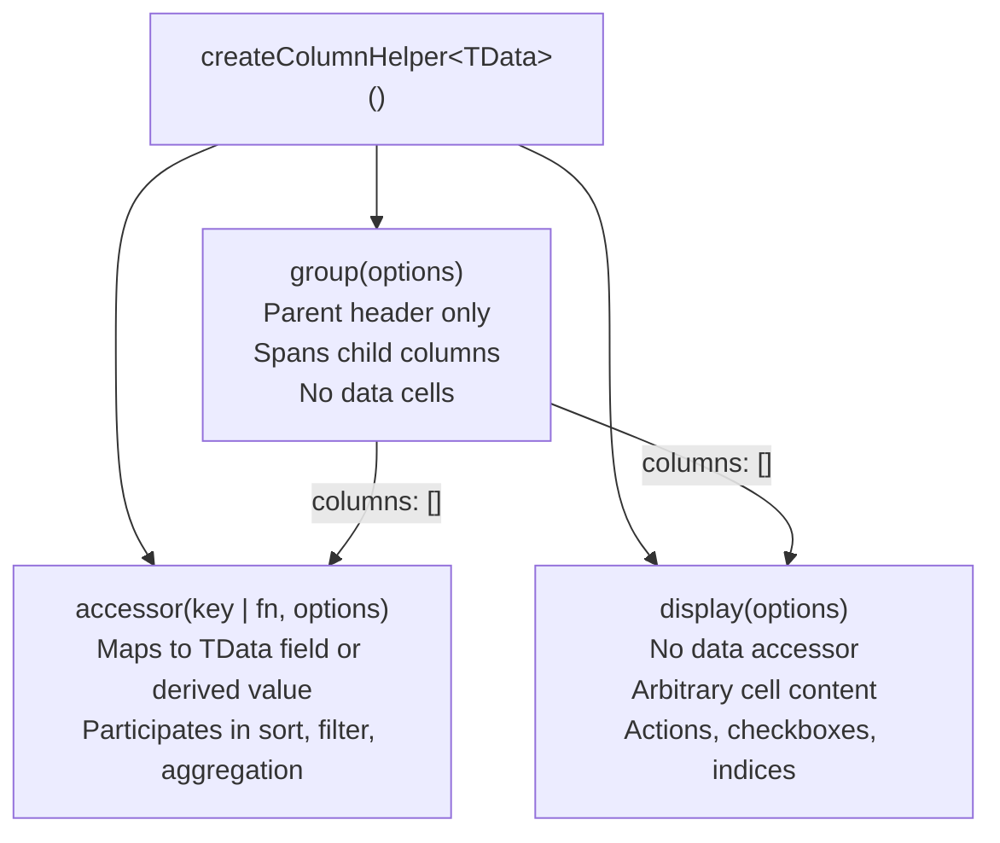

## createColumnHelper

`createColumnHelper` is a factory function that produces a typed helper object for defining table columns. Its primary purpose is to anchor column definitions to a specific row data type, enabling full type inference for accessors, cell values, and header renderers without repeated generic annotations.

---

### Why It Exists

Column definitions in TanStack Table are generic over the row data type `TData`. Without a helper, every column definition would require the type to be manually annotated:

```ts
// Without columnHelper — repetitive generic annotation
const columns: ColumnDef<Person>[] = [
  {
    accessorKey: 'name',
    header: 'Name',
  },
  {
    accessorKey: 'age',
    header: 'Age',
  },
]
```

This works but provides weaker inference — `accessorKey` accepts any string, and cell value types are not narrowed to the actual field type.

`createColumnHelper` solves this by binding the type once and exposing methods that infer correctly from it.

---

### Basic Usage

```ts
import { createColumnHelper } from '@tanstack/react-table'

type Person = {
  name: string
  age: number
  email: string
}

const columnHelper = createColumnHelper<Person>()
```

The returned `columnHelper` object exposes three methods: `accessor`, `display`, and `group`.

---

### `accessor` — Data-Bound Columns

`accessor` defines a column that maps to a field in the row data. It is the most common column type.

**Key-based accessor:**

```ts
columnHelper.accessor('name', {
  header: 'Name',
  cell: info => info.getValue(),
  // getValue() returns string — inferred from Person['name']
})
```

**Function-based accessor:**

```ts
columnHelper.accessor(row => row.age * 2, {
  id: 'doubledAge',   // required when using a function accessor
  header: 'Double Age',
  cell: info => info.getValue(),
  // getValue() returns number — inferred from accessor return type
})
```

**Key Points:**
- Key-based accessors (`'name'`) accept only keys that exist on `TData` — unknown keys are TypeScript errors
- Function-based accessors accept any function `(row: TData) => TValue` and infer `TValue` from the return type
- `id` is required for function-based accessors because no key is available to derive a stable ID from
- `id` is optional for key-based accessors — it defaults to the key string

---

### `accessor` Column Options

The second argument to `accessor` is the column definition object. All options are optional unless noted.

| Option | Type | Description |
|--------|------|-------------|
| `id` | `string` | Column identifier. Required for function accessors. |
| `header` | `string \| ((ctx) => ReactNode)` | Header cell content |
| `footer` | `string \| ((ctx) => ReactNode)` | Footer cell content |
| `cell` | `(info: CellContext) => ReactNode` | Data cell renderer |
| `columns` | `ColumnDef[]` | Nested column definitions (for grouped headers) |
| `enableSorting` | `boolean` | Whether this column is sortable |
| `enableColumnFilter` | `boolean` | Whether this column has a column filter |
| `enableGlobalFilter` | `boolean` | Whether this column participates in global filter |
| `enableResizing` | `boolean` | Whether this column is resizable |
| `enableHiding` | `boolean` | Whether this column can be hidden |
| `enablePinning` | `boolean` | Whether this column can be pinned |
| `sortingFn` | `SortingFn \| string` | Custom or named sort function |
| `filterFn` | `FilterFn \| string` | Custom or named filter function |
| `aggregationFn` | `AggregationFn \| string` | Aggregation for grouped rows |
| `size` | `number` | Default column width in pixels |
| `minSize` | `number` | Minimum width during resizing |
| `maxSize` | `number` | Maximum width during resizing |
| `meta` | `ColumnMeta` | Arbitrary metadata — typed via module augmentation |

---

### `CellContext` — What Cell Renderers Receive

The `cell` renderer receives a `CellContext` object. Its most used members:

```ts
columnHelper.accessor('name', {
  cell: info => {
    info.getValue()        // TValue — the accessor's return value, typed
    info.row.original      // TData — the full row data object
    info.row.index         // number — row index in the current row model
    info.column.id         // string — column ID
    info.table             // Table<TData> — the table instance
    info.renderValue()     // TValue | null — like getValue(), with null fallback
    return info.getValue()
  },
})
```

**Key Points:**
- `getValue()` is typed to the accessor's return type — `string` for `'name'`, `number` for `'age'`
- `row.original` gives access to the full row object when derived or computed values are needed alongside the cell value
- `renderValue()` is equivalent to `getValue()` but returns `null` instead of `undefined` for missing values [Inference — verify exact nullability behavior in current version]

---

### `HeaderContext` — What Header Renderers Receive

```ts
columnHelper.accessor('name', {
  header: info => {
    info.column        // Column<TData, TValue>
    info.header        // Header<TData, TValue>
    info.table         // Table<TData>
    return 'Name'
  },
})
```

Header renderers are most commonly a plain string. The function form is used when the header needs to be interactive — for example, a sort toggle button.

```ts
columnHelper.accessor('name', {
  header: ({ column }) => (
    <button onClick={column.getToggleSortingHandler()}>
      Name {column.getIsSorted() === 'asc' ? '↑' : '↓'}
    </button>
  ),
})
```

---

### `display` — Non-Data Columns

`display` defines a column with no data accessor. It is used for columns that contain arbitrary content — action buttons, checkboxes, row indices, or any derived UI that does not map to a single field.

```ts
columnHelper.display({
  id: 'actions',
  header: 'Actions',
  cell: ({ row }) => (
    <button onClick={() => handleDelete(row.original.id)}>
      Delete
    </button>
  ),
})
```

**Key Points:**
- `id` is required for display columns — no key is available to derive one
- `getValue()` is not available in display column cell renderers — there is no accessor value
- Display columns do not participate in sorting or filtering by default
- `row.original` is still fully typed as `TData`

---

### `group` — Grouped Header Columns

`group` creates a parent column header that spans child columns. It does not render data cells — only a header spanning its children.

```ts
columnHelper.group({
  id: 'contact',
  header: 'Contact Info',
  columns: [
    columnHelper.accessor('email', { header: 'Email' }),
    columnHelper.accessor('phone', { header: 'Phone' }),
  ],
})
```

This produces a two-level header where "Contact Info" spans the "Email" and "Phone" columns. `table.getHeaderGroups()` returns multiple header rows when grouped columns are present.

**Key Points:**
- `group` columns have no `accessorKey` or `accessorFn` — they are purely structural
- Child columns are defined in the `columns` array on the group
- Nesting can go multiple levels deep [Inference — verify depth limits if any in current version]
- The group column itself does not appear in `table.getRowModel()` — only leaf columns produce cells

---

### Mermaid: Column Type Hierarchy



---

### Composing a Full Column Array

```ts
const columnHelper = createColumnHelper<Person>()

const columns = [
  columnHelper.display({
    id: 'select',
    header: ({ table }) => (
      <input
        type="checkbox"
        checked={table.getIsAllRowsSelected()}
        onChange={table.getToggleAllRowsSelectedHandler()}
      />
    ),
    cell: ({ row }) => (
      <input
        type="checkbox"
        checked={row.getIsSelected()}
        onChange={row.getToggleSelectedHandler()}
      />
    ),
  }),

  columnHelper.group({
    id: 'identity',
    header: 'Identity',
    columns: [
      columnHelper.accessor('name', {
        header: 'Name',
        cell: info => info.getValue(),
        enableSorting: true,
      }),
      columnHelper.accessor('age', {
        header: 'Age',
        cell: info => info.getValue(),
        sortingFn: 'basic',
      }),
    ],
  }),

  columnHelper.accessor('email', {
    header: 'Email',
    enableColumnFilter: true,
  }),

  columnHelper.display({
    id: 'actions',
    header: 'Actions',
    cell: ({ row }) => <button>Edit {row.original.name}</button>,
  }),
]
```

---

### Typing `meta` with Module Augmentation

The `meta` field on column definitions accepts arbitrary data. To type it, augment the `ColumnMeta` interface:

```ts
declare module '@tanstack/react-table' {
  interface ColumnMeta<TData, TValue> {
    displayName?: string
    filterVariant?: 'text' | 'range' | 'select'
    align?: 'left' | 'center' | 'right'
  }
}
```

Then use it in definitions:

```ts
columnHelper.accessor('age', {
  header: 'Age',
  meta: {
    filterVariant: 'range',
    align: 'right',
  },
})
```

And access it in renderers:

```ts
cell: info => {
  const align = info.column.columnDef.meta?.align
  return <td style={{ textAlign: align }}>{info.getValue()}</td>
}
```

**Key Points:**
- Without augmentation, `meta` is typed as `unknown`
- The augmentation is global — all columns in all tables share the same `ColumnMeta` shape
- [Inference] If different tables need different meta shapes, a union type or optional fields are the available mitigation strategies

---

### `createColumnHelper` vs Raw `ColumnDef` Array

Both approaches are valid. The helper is preferred when type inference on cell values matters.

```ts
// Raw ColumnDef — accessorKey accepts any string, getValue() is unknown
const columns: ColumnDef<Person>[] = [
  { accessorKey: 'name', header: 'Name' },
]

// columnHelper.accessor — accessorKey constrained to Person keys, getValue() is string
const columns = [
  columnHelper.accessor('name', { header: 'Name' }),
]
```

**Key Points:**
- `ColumnDef[]` is sufficient for simple tables where cell value types are not consumed
- `columnHelper` is preferred when `info.getValue()` is used in cell renderers and its type matters
- Both produce compatible column arrays — they can be mixed in the same `columns` array [Inference — verify compatibility in current version]

---

**Related Topics:**
- `useReactTable` — wiring columns and data into the table instance
- Sorting — `sortingFn` built-in options and custom comparators
- Filtering — `filterFn` built-in options and custom filter functions
- Aggregation — `aggregationFn` for grouped row summaries
- Column sizing — `size`, `minSize`, `maxSize`, and resizing state
- Column pinning and visibility — state-based column control
- `ColumnMeta` augmentation patterns for filter UI variants
- `flexRender` — rendering column definition values safely