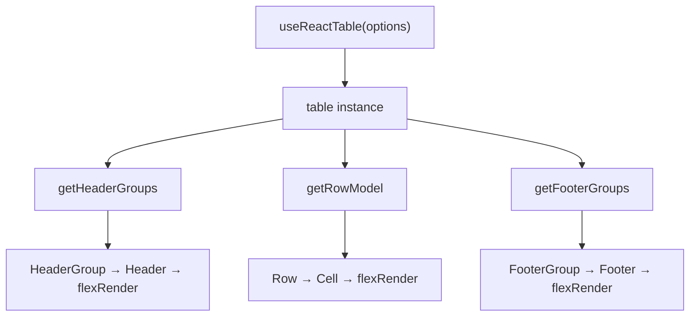

## useReactTable and the Table Instance

The `useReactTable` hook is the primary entry point for TanStack Table in React. It accepts a configuration object and returns a **table instance** — a centralized object that holds all state, computed values, and methods needed to build a fully functional table UI.

---

### What useReactTable Does

`useReactTable` initializes and manages the table's internal logic. It processes your data, column definitions, and options, then returns an object (the table instance) that you use to render the table and interact with its features.

Behavior note: [Inference] The hook is designed to be called at the top level of a React component, following standard React hook rules. Behavior may vary depending on React version and rendering environment.

---

### Minimal Setup

**Example**

```tsx
import {
  useReactTable,
  getCoreRowModel,
  ColumnDef,
} from '@tanstack/react-table';

type Person = {
  name: string;
  age: number;
};

const columns: ColumnDef<Person>[] = [
  { accessorKey: 'name', header: 'Name' },
  { accessorKey: 'age', header: 'Age' },
];

const data: Person[] = [
  { name: 'Alice', age: 30 },
  { name: 'Bob', age: 25 },
];

function MyTable() {
  const table = useReactTable({
    data,
    columns,
    getCoreRowModel: getCoreRowModel(),
  });

  return (
    <table>
      <thead>
        {table.getHeaderGroups().map(headerGroup => (
          <tr key={headerGroup.id}>
            {headerGroup.headers.map(header => (
              <th key={header.id}>
                {header.isPlaceholder
                  ? null
                  : header.column.columnDef.header as string}
              </th>
            ))}
          </tr>
        ))}
      </thead>
      <tbody>
        {table.getRowModel().rows.map(row => (
          <tr key={row.id}>
            {row.getVisibleCells().map(cell => (
              <td key={cell.id}>{cell.getValue() as string}</td>
            ))}
          </tr>
        ))}
      </tbody>
    </table>
  );
}
```

---

### Required Options

These three options are the minimum required to produce a functioning table instance.

#### data

An array of objects representing your rows. TanStack Table treats this as the source of truth for row data.

```ts
const data: Person[] = [
  { name: 'Alice', age: 30 },
];
```

**Key Points**
- `data` should be a stable reference (e.g., from `useState` or `useMemo`) to avoid unnecessary re-renders. [Inference] Passing an inline array literal on every render may cause performance issues in large datasets, though behavior depends on your rendering setup.
- The type parameter you pass to `useReactTable<TData>` determines type safety across columns, rows, and cells.

#### columns

An array of `ColumnDef<TData>` objects that describe how each column accesses and displays data.

```ts
const columns: ColumnDef<Person>[] = [
  { accessorKey: 'name', header: 'Name' },
  { accessorKey: 'age',  header: 'Age'  },
];
```

**Key Points**
- `accessorKey` maps to a key on your data object.
- `accessorFn` can be used instead for computed or nested values.
- Column definitions should also be stable references where possible. [Inference]

#### getCoreRowModel

A required row model factory that tells TanStack Table how to compute the base set of rows. You import and call `getCoreRowModel()` from the library.

```ts
import { getCoreRowModel } from '@tanstack/react-table';

getCoreRowModel: getCoreRowModel()
```

Without this, the table instance cannot produce rows.

---

### The Table Instance

The object returned by `useReactTable` is the table instance. It is the single source of truth for everything related to your table's current state and behavior.

```ts
const table = useReactTable({ data, columns, getCoreRowModel: getCoreRowModel() });
```

The instance exposes three categories of members:

#### State

The table tracks internal state for features like sorting, filtering, pagination, and row selection. You can read and control this state either in managed mode (controlled externally via `state` and `onStateChange`) or unmanaged mode (handled internally).

```ts
// Reading internal state
const { sorting } = table.getState();
```

#### Getters

Methods prefixed with `get` compute and return derived data from the current state. These are used in rendering.

| Method | Returns |
|---|---|
| `table.getHeaderGroups()` | All header groups (rows of headers) |
| `table.getRowModel()` | The current set of processed rows |
| `table.getFooterGroups()` | Footer groups, if defined |
| `table.getAllColumns()` | All column objects |
| `table.getColumn(id)` | A single column by ID |
| `table.getSelectedRowModel()` | Rows currently selected |

#### Handlers and Setters

Methods that mutate state or trigger callbacks. These are commonly passed to UI elements.

```ts
// Example: toggling all rows selected
<input
  type="checkbox"
  checked={table.getIsAllRowsSelected()}
  onChange={table.getToggleAllRowsSelectedHandler()}
/>
```

---

### Row Model Methods in Detail

`table.getRowModel()` is the primary method for accessing rendered rows. It returns a `RowModel` object.

```ts
const rowModel = table.getRowModel();

rowModel.rows;     // Row[] — the flat list of rendered rows
rowModel.flatRows; // Row[] — all rows including sub-rows, flattened
rowModel.rowsById; // Record<string, Row> — rows keyed by ID
```

Each `Row` object exposes:

```ts
row.id;                   // Unique string ID
row.original;             // The original data object
row.getValue(columnId);   // Resolved value for a column
row.getVisibleCells();    // Cell[] for currently visible columns
row.getIsSelected();      // Boolean selection state
row.toggleSelected();     // Toggles selection
row.subRows;              // Child rows if grouping is active
```

---

### Column Objects

`table.getAllColumns()` returns an array of `Column` objects. Each column object wraps the column definition and exposes computed properties.

```ts
const columns = table.getAllColumns();

columns[0].id;               // Column ID string
columns[0].columnDef;        // Original ColumnDef
columns[0].getIsVisible();   // Whether the column is visible
columns[0].toggleVisibility(); // Toggle visibility
columns[0].getIsSorted();    // false | 'asc' | 'desc'
columns[0].getToggleSortingHandler(); // Event handler for sorting
```

---

### Header Groups

`table.getHeaderGroups()` returns an array of `HeaderGroup` objects. Each group represents one row of headers, which matters when using multi-level (grouped) column headers.

```ts
table.getHeaderGroups().map(headerGroup => (
  <tr key={headerGroup.id}>
    {headerGroup.headers.map(header => (
      <th key={header.id} colSpan={header.colSpan}>
        {flexRender(header.column.columnDef.header, header.getContext())}
      </th>
    ))}
  </tr>
));
```

**Key Points**
- `header.colSpan` is important for grouped headers where a parent column spans multiple child columns.
- `header.isPlaceholder` indicates a filler cell that should render as empty.
- `flexRender` is used to handle both string and function-based header definitions.

---

### flexRender

`flexRender` is a utility function that renders column definitions that can be either a static value (string, number) or a React component.

```ts
import { flexRender } from '@tanstack/react-table';

flexRender(header.column.columnDef.header, header.getContext())
flexRender(cell.column.columnDef.cell, cell.getContext())
```

**Key Points**
- Without `flexRender`, function-based cell renderers would not execute correctly.
- `getContext()` provides the render context object (row, column, table, getValue, etc.) to the renderer.

---

### Controlled vs. Uncontrolled State

By default, the table manages its own internal state (uncontrolled). You can take control of individual state slices by providing them explicitly.

```ts
const [sorting, setSorting] = React.useState<SortingState>([]);

const table = useReactTable({
  data,
  columns,
  getCoreRowModel: getCoreRowModel(),
  state: {
    sorting,
  },
  onSortingChange: setSorting,
});
```

**Key Points**
- Only the state slices you provide in `state` become controlled. Others remain internal. [Inference] This allows gradual adoption of controlled state without a full rewrite, though behavior may vary depending on which features are active.
- Controlled state is useful when you need to persist table state to a URL, localStorage, or a server.

---

### Putting It Together: Annotated Render Flow

```
useReactTable({ data, columns, getCoreRowModel() })
        │
        ▼
   table instance
        │
        ├── table.getHeaderGroups()  ──►  <thead> rows
        │         └── header.getContext() + flexRender
        │
        ├── table.getRowModel().rows  ──►  <tbody> rows
        │         └── row.getVisibleCells()
        │                   └── cell.getContext() + flexRender
        │
        └── table.getFooterGroups()  ──►  <tfoot> rows (optional)
```



---

### Common Mistakes

**Unstable data or columns reference**
Defining `data` or `columns` inline inside the component body causes them to be recreated on every render. [Inference] This may cause unnecessary reprocessing; the extent of the impact depends on dataset size and active features. Use `useState`, `useMemo`, or module-level constants.

```ts
// Avoid
const table = useReactTable({ data: [{ name: 'Alice' }], ... });

// Prefer
const data = useMemo(() => [{ name: 'Alice' }], []);
const table = useReactTable({ data, ... });
```

**Omitting getCoreRowModel**
This is a required option. Omitting it will cause a runtime error. [Unverified: exact error message may vary across library versions.]

**Rendering cell values without flexRender**
If your cell definitions use React components or functions, rendering `cell.getValue()` directly will not invoke the component. Use `flexRender(cell.column.columnDef.cell, cell.getContext())` instead.

---

### Summary of Key Instance Methods

| Category | Method | Purpose |
|---|---|---|
| Rows | `getRowModel()` | Access current rendered rows |
| Headers | `getHeaderGroups()` | Build thead structure |
| Footers | `getFooterGroups()` | Build tfoot structure |
| Columns | `getAllColumns()` | Access all column objects |
| Columns | `getColumn(id)` | Access a single column |
| State | `getState()` | Read full current state |
| Selection | `getIsAllRowsSelected()` | Check global selection |
| Selection | `getToggleAllRowsSelectedHandler()` | Handler for select-all |

---

**Next Steps**

**Related Topics**
- Column Definitions — `accessorKey`, `accessorFn`, `header`, `cell`, `footer`
- Row Models — core, sorted, filtered, paginated, grouped
- Controlled State — managing sorting, filtering, and pagination externally
- `flexRender` — rendering static values and React components from column defs
- Cell Context — what `getContext()` exposes and how to use it in renderers
- Column Visibility — toggling columns via the table instance
- Row Selection — `getIsSelected`, `toggleSelected`, and selection state
- Pagination — `getPageCount`, `nextPage`, `previousPage`, `setPageIndex`
- Column Pinning — `getLeftVisibleLeafColumns`, `getRightVisibleLeafColumns`