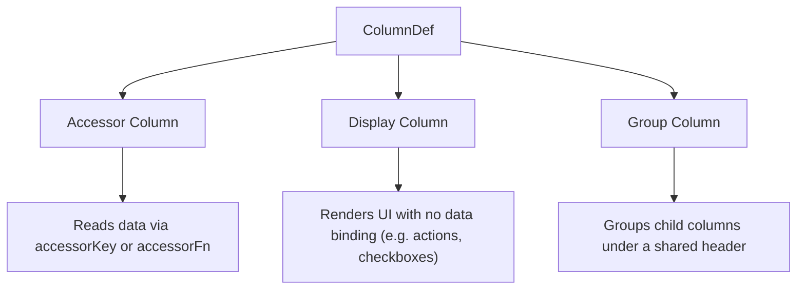

## Column Definitions — Accessor, Display, and Group

Column definitions (`ColumnDef`) are the blueprint for every column in a TanStack Table. Each definition tells the table how to read data, what to render, and how to structure the column hierarchy. There are three distinct column types: **accessor columns**, **display columns**, and **group columns**.

---

### Overview of Column Types



| Type | Reads Data | Renders Custom UI | Has Children |
|---|---|---|---|
| Accessor | ✓ | ✓ | ✗ |
| Display | ✗ | ✓ | ✗ |
| Group | ✗ | Header only | ✓ |

---

### Accessor Columns

An accessor column is the most common column type. It binds to a field in your row data and makes that value available to sorting, filtering, grouping, and rendering.

There are two ways to define an accessor: `accessorKey` and `accessorFn`.

#### accessorKey

Use `accessorKey` when the value maps directly to a top-level key on your data object.

```ts
type Person = {
  firstName: string;
  lastName: string;
  age: number;
};

const columns: ColumnDef<Person>[] = [
  { accessorKey: 'firstName', header: 'First Name' },
  { accessorKey: 'lastName',  header: 'Last Name'  },
  { accessorKey: 'age',       header: 'Age'        },
];
```

**Key Points**
- `accessorKey` must match a key on your `TData` type exactly. TypeScript will flag mismatches when your generic is properly typed.
- The column's `id` defaults to the value of `accessorKey` when no explicit `id` is provided.
- Dot notation for nested keys (`'address.city'`) is not natively supported via `accessorKey`. Use `accessorFn` instead for nested access. [Inference: behavior may vary across versions; verify against your installed version.]

#### accessorFn

Use `accessorFn` when the value needs to be computed, derived from multiple fields, or read from a nested path.

```ts
const columns: ColumnDef<Person>[] = [
  {
    id: 'fullName',
    accessorFn: row => `${row.firstName} ${row.lastName}`,
    header: 'Full Name',
  },
  {
    id: 'city',
    accessorFn: row => row.address?.city ?? '—',
    header: 'City',
  },
];
```

**Key Points**
- When using `accessorFn`, you must provide an explicit `id` because the library cannot infer a stable ID from a function. Omitting `id` will cause a runtime warning or error. [Unverified: exact error message may differ across versions.]
- The function receives the full row data object and returns any value. The returned value is used by sorting, filtering, and `cell.getValue()`.
- `accessorFn` runs for every row on every render cycle that requires value resolution. [Inference] Keep it lightweight to avoid performance overhead in large datasets; actual impact depends on dataset size and active features.

#### Column ID Resolution

TanStack Table resolves a column's `id` in this priority order:

```
explicit id  →  accessorKey  →  accessorFn (requires explicit id)
```

The `id` is used internally to reference columns by key — for sorting state, filter state, column visibility, and more.

---

### The header Option

Both accessor and display columns accept a `header` option, which defines what renders in the column header cell.

#### String header

```ts
{ accessorKey: 'name', header: 'Full Name' }
```

#### Function header (with context)

```ts
{
  accessorKey: 'name',
  header: ({ column }) => (
    <button onClick={column.getToggleSortingHandler()}>
      Name {column.getIsSorted() === 'asc' ? '↑' : '↓'}
    </button>
  ),
}
```

**Key Points**
- The function receives a `HeaderContext<TData, TValue>` object containing `column`, `header`, and `table`.
- Function headers are rendered via `flexRender`. Returning a React element here is the standard pattern for interactive or styled headers.

---

### The cell Option

The `cell` option defines what renders inside each data cell for that column.

#### Default behavior (no cell defined)

If `cell` is omitted, TanStack Table renders the raw value returned by `accessorKey` or `accessorFn` as a string. [Inference: actual rendering depends on what `flexRender` does with a primitive value; behavior may vary.]

#### Custom cell renderer

```ts
{
  accessorKey: 'status',
  header: 'Status',
  cell: ({ getValue }) => {
    const status = getValue<string>();
    return <span className={`badge badge--${status}`}>{status}</span>;
  },
}
```

The cell function receives a `CellContext<TData, TValue>` object. Commonly used properties:

| Property | Type | Description |
|---|---|---|
| `getValue()` | `() => TValue` | Returns the resolved accessor value |
| `row` | `Row<TData>` | The full row object |
| `column` | `Column<TData, TValue>` | The column object |
| `table` | `Table<TData>` | The table instance |
| `renderValue()` | `() => TValue \| null` | Like `getValue()` but returns `null` for undefined |

**Example — accessing row data beyond the column value**

```ts
{
  accessorKey: 'salary',
  header: 'Salary',
  cell: ({ getValue, row }) => {
    const salary = getValue<number>();
    const currency = row.original.currency;
    return `${currency}${salary.toLocaleString()}`;
  },
}
```

---

### The footer Option

The `footer` option defines content rendered in `<tfoot>`. It accepts the same string or function pattern as `header`.

```ts
{
  accessorKey: 'age',
  header: 'Age',
  footer: ({ column }) => `Column: ${column.id}`,
}
```

Footer groups are accessed via `table.getFooterGroups()`. If no `footer` is defined on any column, you can omit the `<tfoot>` block entirely.

---

### Display Columns

Display columns have no data accessor. They exist purely to render UI elements — such as row selection checkboxes, expand/collapse controls, or action buttons — that are not tied to any data field.

```ts
import { ColumnDef, Row } from '@tanstack/react-table';

const selectionColumn: ColumnDef<Person> = {
  id: 'select',
  header: ({ table }) => (
    <input
      type="checkbox"
      checked={table.getIsAllRowsSelected()}
      onChange={table.getToggleAllRowsSelectedHandler()}
    />
  ),
  cell: ({ row }) => (
    <input
      type="checkbox"
      checked={row.getIsSelected()}
      onChange={row.getToggleSelectedHandler()}
    />
  ),
};
```

**Key Points**
- Display columns require an explicit `id` since there is no `accessorKey` to derive one from.
- `getValue()` on a display column cell will return `undefined`. Do not rely on it. [Inference]
- Display columns are excluded from sorting and filtering by default because they have no accessor. [Inference: behavior may vary if custom sort/filter functions are explicitly attached.]
- Place display columns at the start or end of your `columns` array by convention, though order is up to you.

---

### Group Columns

Group columns are parent columns that contain child columns. They produce multi-level headers and have no accessor of their own. Their sole purpose is to organize related columns under a shared header label.

```ts
const columns: ColumnDef<Person>[] = [
  {
    header: 'Name',
    columns: [
      { accessorKey: 'firstName', header: 'First' },
      { accessorKey: 'lastName',  header: 'Last'  },
    ],
  },
  {
    header: 'Info',
    columns: [
      { accessorKey: 'age',   header: 'Age'   },
      { accessorKey: 'email', header: 'Email' },
    ],
  },
];
```

**Rendered header structure**

```
┌─────────────────────┬─────────────────────┐
│        Name         │        Info         │  ← Group row
├──────────┬──────────┼──────────┬──────────┤
│  First   │   Last   │   Age    │  Email   │  ← Leaf row
├──────────┼──────────┼──────────┼──────────┤
│  Alice   │  Smith   │   30     │ a@b.com  │
└──────────┴──────────┴──────────┴──────────┘
```

**Key Points**
- `table.getHeaderGroups()` returns one `HeaderGroup` per level of nesting. A flat column definition produces one header group; one level of grouping produces two.
- Group columns set `header.colSpan` automatically based on the number of leaf columns they span. Pass `colSpan={header.colSpan}` to your `<th>` element.
- `header.isPlaceholder` is `true` for filler cells that appear in header rows where a group column has no counterpart. Render these as empty cells.
- Group columns can nest arbitrarily deep. [Inference: deeply nested groups increase header group complexity; test rendering behavior for your specific structure.]

#### Rendering multi-level headers correctly

```tsx
<thead>
  {table.getHeaderGroups().map(headerGroup => (
    <tr key={headerGroup.id}>
      {headerGroup.headers.map(header => (
        <th
          key={header.id}
          colSpan={header.colSpan}
        >
          {header.isPlaceholder
            ? null
            : flexRender(header.column.columnDef.header, header.getContext())}
        </th>
      ))}
    </tr>
  ))}
</thead>
```

---

### Combining All Three Types

In practice, a real table often uses all three column types together.

```ts
const columns: ColumnDef<Person>[] = [
  // Display column — row selection
  {
    id: 'select',
    header: ({ table }) => (
      <input
        type="checkbox"
        checked={table.getIsAllRowsSelected()}
        onChange={table.getToggleAllRowsSelectedHandler()}
      />
    ),
    cell: ({ row }) => (
      <input
        type="checkbox"
        checked={row.getIsSelected()}
        onChange={row.getToggleSelectedHandler()}
      />
    ),
  },

  // Group column — wraps accessor columns
  {
    header: 'Personal Info',
    columns: [
      // Accessor columns
      { accessorKey: 'firstName', header: 'First Name' },
      { accessorKey: 'lastName',  header: 'Last Name'  },
      {
        id: 'fullName',
        accessorFn: row => `${row.firstName} ${row.lastName}`,
        header: 'Full Name',
      },
    ],
  },

  // Display column — row actions
  {
    id: 'actions',
    header: 'Actions',
    cell: ({ row }) => (
      <button onClick={() => console.log(row.original)}>
        View
      </button>
    ),
  },
];
```

---

### Column Definition Properties Reference

| Property | Applies To | Type | Purpose |
|---|---|---|---|
| `accessorKey` | Accessor | `keyof TData` | Maps to a data key |
| `accessorFn` | Accessor | `(row: TData) => TValue` | Computed accessor |
| `id` | All | `string` | Explicit column ID |
| `header` | All | `string \| HeaderFn` | Header cell content |
| `cell` | Accessor, Display | `CellFn` | Data cell content |
| `footer` | All | `string \| FooterFn` | Footer cell content |
| `columns` | Group | `ColumnDef[]` | Child column definitions |
| `enableSorting` | Accessor | `boolean` | Opt in/out of sorting |
| `enableColumnFilter` | Accessor | `boolean` | Opt in/out of filtering |
| `meta` | All | `ColumnMeta` | Custom metadata passthrough |

---

**Next Steps**

**Related Topics**
- `flexRender` — rendering string and component-based header and cell definitions
- `meta` — attaching custom metadata to column definitions for use in renderers
- Column sizing — `size`, `minSize`, `maxSize` on column definitions
- Column visibility — toggling columns using `enableHiding` and `getToggleVisibilityHandler`
- Sorting — `enableSorting`, `sortingFn`, `invertSorting` per column
- Filtering — `enableColumnFilter`, `filterFn` per column
- Row Models — how accessor values feed into sorted, filtered, and grouped row models
- Grouped headers — rendering multi-level `<thead>` with `colSpan` and `isPlaceholder`
- Column pinning — using `enablePinning` and the pin state API