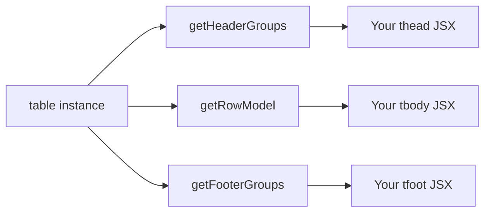
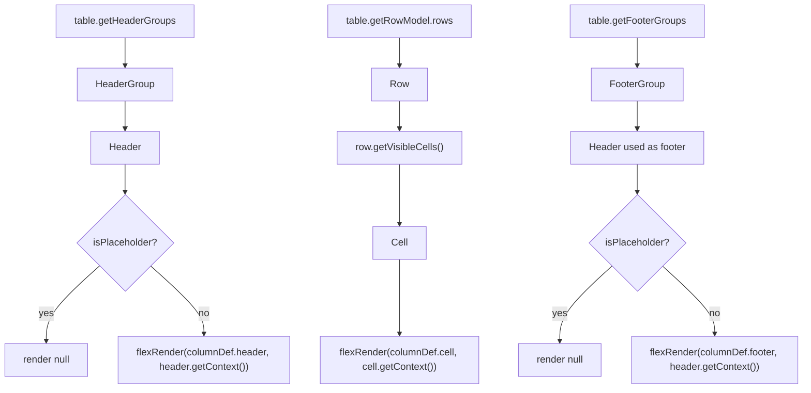

## Rendering Headers and Cells Manually

TanStack Table does not render any HTML on its own. It is a headless library — it computes the structure and state, and you are responsible for producing every DOM element. This topic covers the complete rendering pipeline: how to traverse header groups, rows, and cells, and how to produce correct output using `flexRender`.

---

### The Headless Model



TanStack Table provides data and structure. You supply the markup. This means full control over every element — class names, attributes, event handlers, and layout — with no hidden wrapper components.

---

### Full Rendering Skeleton

```tsx
import { flexRender, useReactTable, getCoreRowModel } from '@tanstack/react-table';

function MyTable() {
  const table = useReactTable({ data, columns, getCoreRowModel: getCoreRowModel() });

  return (
    <table>
      <thead>
        {table.getHeaderGroups().map(headerGroup => (
          <tr key={headerGroup.id}>
            {headerGroup.headers.map(header => (
              <th key={header.id} colSpan={header.colSpan}>
                {header.isPlaceholder
                  ? null
                  : flexRender(header.column.columnDef.header, header.getContext())}
              </th>
            ))}
          </tr>
        ))}
      </thead>

      <tbody>
        {table.getRowModel().rows.map(row => (
          <tr key={row.id}>
            {row.getVisibleCells().map(cell => (
              <td key={cell.id}>
                {flexRender(cell.column.columnDef.cell, cell.getContext())}
              </td>
            ))}
          </tr>
        ))}
      </tbody>

      <tfoot>
        {table.getFooterGroups().map(footerGroup => (
          <tr key={footerGroup.id}>
            {footerGroup.headers.map(header => (
              <th key={header.id} colSpan={header.colSpan}>
                {header.isPlaceholder
                  ? null
                  : flexRender(header.column.columnDef.footer, header.getContext())}
              </th>
            ))}
          </tr>
        ))}
      </tfoot>
    </table>
  );
}
```

---

### Rendering the thead

#### getHeaderGroups

`table.getHeaderGroups()` returns an array of `HeaderGroup` objects. Each group represents one row of the `<thead>`. For a flat column definition, there is exactly one group. For grouped (multi-level) column definitions, there is one group per nesting level.

```ts
const headerGroups = table.getHeaderGroups();
// headerGroups.length === 1  for flat columns
// headerGroups.length === 2  for one level of column grouping
```

Each `HeaderGroup` has:

| Property | Type | Description |
|---|---|---|
| `id` | `string` | Unique ID for the group, used as React key |
| `headers` | `Header[]` | Ordered array of header cells in this row |
| `depth` | `number` | Zero-based nesting depth of this group |

#### The Header Object

Each entry in `headerGroup.headers` is a `Header` object.

| Property / Method | Type | Description |
|---|---|---|
| `id` | `string` | Unique header cell ID |
| `column` | `Column` | The associated column object |
| `colSpan` | `number` | How many leaf columns this header spans |
| `rowSpan` | `number` | Row span (typically 1; relevant for complex layouts) |
| `isPlaceholder` | `boolean` | True if this is a filler cell with no column definition |
| `placeholderId` | `string` | Unique ID for placeholder cells |
| `depth` | `number` | Nesting depth of this header |
| `getContext()` | `() => HeaderContext` | Context object passed to `flexRender` |
| `getLeafHeaders()` | `() => Header[]` | All leaf-level headers under this header |
| `getSize()` | `() => number` | Resolved column width (when sizing is active) |

#### colSpan and isPlaceholder

These two properties are critical for multi-level headers to render correctly.

- `colSpan` tells the browser how many columns wide this `<th>` should span. Always pass it.
- `isPlaceholder` is `true` for synthetic filler cells that appear in upper header rows when a sibling column group has more levels than the current column. Render nothing for placeholders.

```tsx
<th key={header.id} colSpan={header.colSpan}>
  {header.isPlaceholder
    ? null
    : flexRender(header.column.columnDef.header, header.getContext())}
</th>
```

**Example — multi-level header output**

For this column definition:

```ts
[
  {
    header: 'Name',
    columns: [
      { accessorKey: 'firstName', header: 'First' },
      { accessorKey: 'lastName',  header: 'Last'  },
    ],
  },
  { accessorKey: 'age', header: 'Age' },
]
```

`getHeaderGroups()` produces two groups:

```
Group 0 (depth 0):
  Header { column: 'Name',  colSpan: 2, isPlaceholder: false }
  Header { column: 'age',   colSpan: 1, isPlaceholder: true  }  ← filler

Group 1 (depth 1):
  Header { column: 'firstName', colSpan: 1, isPlaceholder: false }
  Header { column: 'lastName',  colSpan: 1, isPlaceholder: false }
  Header { column: 'age',       colSpan: 1, isPlaceholder: false }
```

The placeholder in Group 0 keeps the grid alignment intact while the "Name" group header spans two columns above "First" and "Last".

---

### Rendering the tbody

#### getRowModel().rows

`table.getRowModel().rows` returns the array of `Row` objects to render in the `<tbody>`. The row model reflects the currently active pipeline — if sorting or filtering is active, the rows are already processed before you access them here.

```ts
const rows = table.getRowModel().rows;
```

Each `Row` object:

| Property / Method | Type | Description |
|---|---|---|
| `id` | `string` | Unique row ID (defaults to row index as string) |
| `original` | `TData` | The original data object for this row |
| `index` | `number` | Row index in the current row model |
| `depth` | `number` | Nesting depth (0 for top-level; relevant for expanding) |
| `getVisibleCells()` | `() => Cell[]` | Cells for all currently visible columns |
| `getAllCells()` | `() => Cell[]` | Cells for all columns, visible or not |
| `getValue(colId)` | `(id: string) => unknown` | Resolved accessor value for a column |
| `getIsSelected()` | `() => boolean` | Whether this row is selected |
| `getIsExpanded()` | `() => boolean` | Whether this row is expanded |
| `subRows` | `Row[]` | Child rows when grouping or expanding is active |

#### getVisibleCells vs getAllCells

Use `getVisibleCells()` in your render loop. It respects column visibility state and column pinning order. `getAllCells()` returns every cell regardless of visibility — useful for exporting data or inspecting values programmatically, not for rendering.

```tsx
{row.getVisibleCells().map(cell => (
  <td key={cell.id}>
    {flexRender(cell.column.columnDef.cell, cell.getContext())}
  </td>
))}
```

#### The Cell Object

| Property / Method | Type | Description |
|---|---|---|
| `id` | `string` | Unique cell ID (format: `rowId_columnId`) |
| `column` | `Column` | The column this cell belongs to |
| `row` | `Row` | The row this cell belongs to |
| `getValue()` | `() => TValue` | The resolved accessor value |
| `renderValue()` | `() => TValue \| null` | Like getValue but returns null for undefined |
| `getContext()` | `() => CellContext` | Context object passed to flexRender |

---

### flexRender in Detail

`flexRender` is the utility that bridges column definitions and React rendering. It accepts either a static value or a render function and produces the correct output.

```ts
import { flexRender } from '@tanstack/react-table';

flexRender(definition, context)
```

| `definition` type | What flexRender does |
|---|---|
| `string` or `number` | Returns the value directly |
| `undefined` or `null` | Returns `null` |
| React function component | Calls it with `context` as props and returns the element |
| React element (JSX) | [Inference] Returns it as-is; behavior may vary — prefer function form |

**Example — header definition variants and how flexRender handles them**

```ts
// String — flexRender returns the string
header: 'First Name'

// Function — flexRender calls it with HeaderContext
header: ({ column }) => (
  <button onClick={column.getToggleSortingHandler()}>
    First Name
  </button>
)
```

```tsx
// In your render loop
flexRender(header.column.columnDef.header, header.getContext())
// → renders the string or calls the function, depending on which was defined
```

**Key Points**
- Always use `flexRender` for both headers and cells. Calling `header.column.columnDef.header` directly as a function is possible but bypasses any internal handling. [Inference]
- `getContext()` must be called at render time to get the current context — do not cache the context object across renders. [Inference: stale context may produce incorrect values; behavior is not guaranteed.]

---

### HeaderContext vs CellContext

Both contexts are passed as the second argument to `flexRender`. They share some properties but differ in scope.

**HeaderContext** (available in `header` and `footer` renderers)

```ts
{
  table: Table<TData>        // full table instance
  header: Header<TData>      // the current header object
  column: Column<TData>      // the current column object
}
```

**CellContext** (available in `cell` renderers)

```ts
{
  table: Table<TData>        // full table instance
  row: Row<TData>            // the current row
  column: Column<TData>      // the current column
  cell: Cell<TData, TValue>  // the current cell
  getValue: () => TValue     // shorthand for cell.getValue()
  renderValue: () => TValue | null
}
```

---

### Rendering the tfoot

Footer rendering follows the same pattern as `thead`, using `table.getFooterGroups()`. If no columns define a `footer`, the footer groups will still exist but their rendered output will be `null`. Omit `<tfoot>` entirely if footers are not needed.

```tsx
<tfoot>
  {table.getFooterGroups().map(footerGroup => (
    <tr key={footerGroup.id}>
      {footerGroup.headers.map(header => (
        <th key={header.id} colSpan={header.colSpan}>
          {header.isPlaceholder
            ? null
            : flexRender(header.column.columnDef.footer, header.getContext())}
        </th>
      ))}
    </tr>
  ))}
</tfoot>
```

**Key Points**
- Footer groups mirror the structure of header groups. The same `colSpan` and `isPlaceholder` rules apply.
- Footer cells use `HeaderContext`, not `CellContext`, because they are accessed through the header API — even though they appear in `<tfoot>`.

---

### Accessing Only Visible vs. All Columns

When you need column data outside of a row context — for example, to build a custom column header row from scratch — use these table-level methods:

| Method | Returns |
|---|---|
| `table.getVisibleLeafColumns()` | Leaf columns that are currently visible |
| `table.getAllLeafColumns()` | All leaf columns regardless of visibility |
| `table.getLeftVisibleLeafColumns()` | Left-pinned visible columns |
| `table.getCenterVisibleLeafColumns()` | Unpinned visible columns |
| `table.getRightVisibleLeafColumns()` | Right-pinned visible columns |

These are primarily useful when building custom column header layouts or implementing column pinning with sticky positioning.

---

### Annotated Rendering Flow



---

### Common Mistakes

**Missing colSpan on grouped headers**
Omitting `colSpan={header.colSpan}` on `<th>` elements causes grouped headers to misalign with their child columns. Always pass `colSpan`.

**Not checking isPlaceholder**
Placeholder headers will have `undefined` column definitions for `header` or `footer`. Calling `flexRender` on `undefined` produces `null`, but explicitly checking `isPlaceholder` is clearer and guards against unexpected behavior. [Inference]

**Using getAllCells instead of getVisibleCells**
`getAllCells()` ignores column visibility. Using it in the render loop will render hidden columns.

**Calling columnDef.header as a function directly**
```ts
// Fragile — bypasses flexRender's handling of static values and undefined
header.column.columnDef.header(header.getContext())

// Correct
flexRender(header.column.columnDef.header, header.getContext())
```

**Using row.original for cell rendering instead of getValue**
`row.original` gives you the raw data object. For display purposes, prefer `cell.getValue()` or `flexRender` with the cell definition, which respects any transformation defined in `accessorFn`.

---

**Next Steps**

**Related Topics**
- Column visibility — how `getVisibleCells()` and `getVisibleLeafColumns()` respond to visibility state
- Column pinning — splitting cells across left, center, and right groups with sticky CSS
- Column sizing — using `header.getSize()` and `column.getSize()` to apply widths
- Sorting — attaching `column.getToggleSortingHandler()` in header renderers
- Row selection — rendering checkboxes via display columns and `row.getToggleSelectedHandler()`
- Row expanding — rendering expand controls and `row.subRows` in tbody
- Virtualization — integrating with TanStack Virtual for large row sets
- Custom cell renderers — patterns for badges, links, images, and conditional formatting