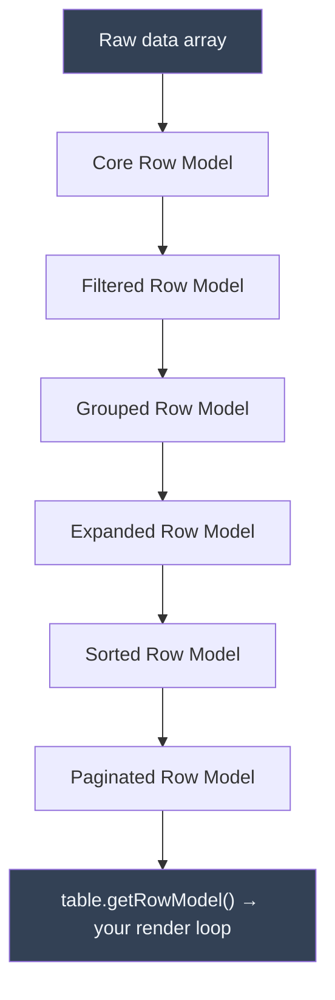

## Row Model Pipeline

The row model pipeline is the processing system TanStack Table uses to transform your raw data array into the final set of rows delivered to your render loop. Each feature — filtering, sorting, grouping, expanding, pagination — is implemented as a discrete row model that takes rows in and passes transformed rows out. Understanding this pipeline is essential for knowing which rows appear in your UI and why.

---

### What a Row Model Is

A row model is a function that accepts the current table state and a set of input rows, and returns a `RowModel<TData>` object.

```ts
type RowModel<TData> = {
  rows: Row<TData>[];      // The processed rows for this stage
  flatRows: Row<TData>[];  // All rows including sub-rows, flattened
  rowsById: Record<string, Row<TData>>; // Rows keyed by ID
}
```

Each row model is registered on the table options object by passing a factory function. TanStack Table chains these models together in a fixed order.

---

### The Pipeline Stages



**Key Points**
- The pipeline order is fixed by the library. You cannot reorder stages. [Inference: this is consistent with TanStack Table v8 design; behavior may differ in future major versions.]
- Each stage only runs if the corresponding row model is registered on the table options.
- `table.getRowModel()` always returns the output of the last registered stage in the pipeline.
- Stages that are not registered are skipped entirely, and the previous stage's output passes through unchanged.

---

### Stage 1 — Core Row Model

The core row model is the only required stage. It converts your raw `data` array into `Row<TData>` objects, assigning each row a stable ID and binding it to its original data.

```ts
import { getCoreRowModel } from '@tanstack/react-table';

const table = useReactTable({
  data,
  columns,
  getCoreRowModel: getCoreRowModel(),
});
```

**What it produces**
- One `Row` per entry in `data`
- Row IDs default to the row's index as a string (`"0"`, `"1"`, ...)
- You can customize row ID generation with the `getRowId` option

```ts
const table = useReactTable({
  data,
  columns,
  getCoreRowModel: getCoreRowModel(),
  getRowId: row => row.uuid, // use a stable unique field
});
```

**Key Points**
- Using a stable `getRowId` is important when rows can be reordered (e.g. after sorting) and you need consistent row selection or expansion state. [Inference: using index-based IDs with sorting active may cause state to shift to different rows; behavior depends on how selection/expansion state is stored.]
- The core row model output is always available via `table.getCoreRowModel()` regardless of what other models are registered.

---

### Stage 2 — Filtered Row Model

When registered, the filtered row model removes rows that do not match the active column filters or global filter.

```ts
import { getFilteredRowModel } from '@tanstack/react-table';

const table = useReactTable({
  data,
  columns,
  getCoreRowModel: getCoreRowModel(),
  getFilteredRowModel: getFilteredRowModel(),
});
```

**What it produces**
- Only rows that pass all active filters
- Sub-rows of grouped/expanded rows are filtered independently [Inference: actual behavior for nested rows depends on `filterFromLeafRows` and related options]

**Relevant options**

| Option | Type | Description |
|---|---|---|
| `columnFilters` | `ColumnFiltersState` | Array of per-column filter values |
| `globalFilter` | `any` | A single filter value applied across all filterable columns |
| `filterFns` | `Record<string, FilterFn>` | Custom filter function registry |
| `filterFromLeafRows` | `boolean` | If true, filters from the bottom up (leaf rows first) |
| `maxLeafRowFilterDepth` | `number` | Max depth to filter leaf rows |

**Accessing filtered row count**

```ts
table.getFilteredRowModel().rows.length   // rows passing filters
table.getPreFilteredRowModel().rows.length // total rows before filtering
```

---

### Stage 3 — Grouped Row Model

When registered, the grouped row model reorganizes rows into a tree structure based on the active grouping columns.

```ts
import { getGroupedRowModel } from '@tanstack/react-table';

const table = useReactTable({
  data,
  columns,
  getCoreRowModel: getCoreRowModel(),
  getGroupedRowModel: getGroupedRowModel(),
});
```

**What it produces**
- Group rows at the top level, each containing `subRows` with the original data rows
- Grouped rows have `row.getIsGrouped()` returning `true`
- Leaf rows have `row.getIsGrouped()` returning `false`

```ts
row.groupingColumnId  // which column this group row is grouped by
row.groupingValue     // the shared value for this group
row.subRows           // the child rows in this group
```

**Key Points**
- Grouping requires columns to have `enableGrouping: true` or for the grouping feature to be enabled globally. [Inference]
- Aggregation functions (`aggregationFn`) can be defined on columns to compute summary values for group rows.
- Without the expanded row model registered after this stage, grouped rows do not expand. [Inference]

---

### Stage 4 — Expanded Row Model

The expanded row model controls which rows with sub-rows (from grouping or manual tree data) are expanded and therefore visible.

```ts
import { getExpandedRowModel } from '@tanstack/react-table';

const table = useReactTable({
  data,
  columns,
  getCoreRowModel: getCoreRowModel(),
  getExpandedRowModel: getExpandedRowModel(),
});
```

**What it produces**
- Only includes sub-rows for rows where `row.getIsExpanded()` is `true`
- Collapsed group or tree rows appear as single rows with no visible children

**Relevant state and methods**

```ts
// State
const [expanded, setExpanded] = React.useState<ExpandedState>({});

// Options
{
  state: { expanded },
  onExpandedChange: setExpanded,
  getSubRows: row => row.children, // for manual tree data
}

// Row methods
row.getIsExpanded()
row.getCanExpand()
row.toggleExpanded()
row.getToggleExpandedHandler()
```

**Key Points**
- `getSubRows` is required when using tree-structured data that is not produced by the grouped row model. It tells TanStack Table how to find child rows on your data objects.
- Expanding state is keyed by row ID. This is why stable row IDs via `getRowId` matter for tree or grouped data. [Inference]

---

### Stage 5 — Sorted Row Model

The sorted row model reorders rows according to the active sorting state.

```ts
import { getSortedRowModel } from '@tanstack/react-table';

const table = useReactTable({
  data,
  columns,
  getCoreRowModel: getCoreRowModel(),
  getSortedRowModel: getSortedRowModel(),
});
```

**What it produces**
- Rows reordered by the active sort columns in priority order (first sort key takes precedence)
- For grouped tables, sorting applies within each group's sub-rows [Inference: behavior may vary depending on active row model combination]

**Sorting state shape**

```ts
type SortingState = {
  id: string;   // column ID
  desc: boolean; // true = descending
}[];
```

**Relevant options**

| Option | Type | Description |
|---|---|---|
| `sorting` | `SortingState` | Active sort columns and directions |
| `onSortingChange` | `OnChangeFn<SortingState>` | Callback when sorting changes |
| `manualSorting` | `boolean` | Disables client-side sorting (for server-side) |
| `enableMultiSort` | `boolean` | Allow sorting by multiple columns |
| `sortDescFirst` | `boolean` | First click sorts descending instead of ascending |

**Accessing sorted data**

```ts
table.getSortedRowModel().rows   // rows after sorting
table.getPreSortedRowModel().rows // rows before sorting
```

---

### Stage 6 — Paginated Row Model

The paginated row model slices the row array to the current page.

```ts
import { getPaginationRowModel } from '@tanstack/react-table';

const table = useReactTable({
  data,
  columns,
  getCoreRowModel: getCoreRowModel(),
  getPaginationRowModel: getPaginationRowModel(),
});
```

**What it produces**
- A slice of rows corresponding to the current page index and page size
- Rows outside the current page are not included in `table.getRowModel().rows`

**Pagination state shape**

```ts
type PaginationState = {
  pageIndex: number; // zero-based
  pageSize: number;
};
```

**Relevant methods**

```ts
table.getPageCount()           // total number of pages
table.getCanNextPage()         // whether a next page exists
table.getCanPreviousPage()     // whether a previous page exists
table.nextPage()               // advance one page
table.previousPage()           // go back one page
table.setPageIndex(n)          // jump to page n
table.setPageSize(n)           // change page size
table.getState().pagination    // current pageIndex and pageSize
```

**Key Points**
- Pagination operates on whatever the previous stage (typically sorted or filtered rows) produces. The page count reflects the total filtered row count divided by page size. [Inference: actual behavior depends on which row models are active]
- Setting `manualPagination: true` disables client-side slicing. You are then responsible for providing pre-paginated data, and you must set `rowCount` (or `pageCount`) manually so the table can compute page counts.

```ts
const table = useReactTable({
  data,             // already paginated from your server
  columns,
  getCoreRowModel: getCoreRowModel(),
  getPaginationRowModel: getPaginationRowModel(),
  manualPagination: true,
  rowCount: totalRowsFromServer,
});
```

---

### Pre-stage Accessors

Every pipeline stage exposes a `getPre*RowModel()` method that returns the input to that stage — i.e., what the previous stage produced. These are useful for displaying counts or building UI that reflects totals before a transformation.

| Method | Returns |
|---|---|
| `table.getCoreRowModel()` | Output of stage 1 (always available) |
| `table.getPreFilteredRowModel()` | Rows before filtering (= core output) |
| `table.getPreGroupedRowModel()` | Rows before grouping (= filtered output) |
| `table.getPreSortedRowModel()` | Rows before sorting |
| `table.getPrePaginationRowModel()` | All rows before pagination slicing |
| `table.getFilteredRowModel()` | Rows after filtering |
| `table.getSortedRowModel()` | Rows after sorting |
| `table.getPaginationRowModel()` | Rows on the current page |

**Example — displaying total vs. filtered count**

```tsx
const totalRows = table.getPreFilteredRowModel().rows.length;
const filteredRows = table.getFilteredRowModel().rows.length;

<p>{filteredRows} of {totalRows} rows</p>
```

---

### Manual (Server-Side) Mode

Each pipeline stage can be disabled in favor of server-side processing by setting the corresponding `manual*` flag.

| Option | Disables |
|---|---|
| `manualFiltering: true` | Client-side filtered row model |
| `manualGrouping: true` | Client-side grouped row model |
| `manualSorting: true` | Client-side sorted row model |
| `manualPagination: true` | Client-side pagination slicing |
| `manualExpanding: true` | Client-side expand behavior |

When a manual flag is set, the corresponding row model factory should still be registered if you want the table to track that feature's state. The factory is skipped for data transformation, but state management (e.g. sort direction, page index) still works and can be read and sent to your server. [Inference: behavior may vary; verify against your installed version.]

**Example — server-side sorting and pagination**

```ts
const [sorting, setSorting] = React.useState<SortingState>([]);
const [pagination, setPagination] = React.useState({ pageIndex: 0, pageSize: 20 });

// Fetch new data whenever sorting or pagination changes
const { data, totalRows } = useServerData({ sorting, pagination });

const table = useReactTable({
  data,
  columns,
  getCoreRowModel: getCoreRowModel(),
  getSortedRowModel: getSortedRowModel(),
  getPaginationRowModel: getPaginationRowModel(),
  manualSorting: true,
  manualPagination: true,
  state: { sorting, pagination },
  onSortingChange: setSorting,
  onPaginationChange: setPagination,
  rowCount: totalRows,
});
```

---

### Pipeline Interaction Summary

```mermaid
flowchart LR
    A[data] --> B[Core]
    B -->|"getPreFilteredRowModel()"| C[Filter]
    C -->|"getPreGroupedRowModel()"| D[Group]
    D -->|"getPreExpandedRowModel()"| E[Expand]
    E -->|"getPreSortedRowModel()"| F[Sort]
    F -->|"getPrePaginationRowModel()"| G[Paginate]
    G --> H["getRowModel()"]
```



Each arrow represents the output of one stage becoming the input of the next. Pre-stage accessors let you tap into any point in the pipeline.

---

### Registering Only What You Need

TanStack Table uses a pay-for-what-you-use model. Row models that are not registered do not run and do not add overhead. [Inference: actual performance characteristics depend on dataset size and React rendering behavior; this claim is not guaranteed.]

```ts
// Minimal — only core
const table = useReactTable({
  data, columns,
  getCoreRowModel: getCoreRowModel(),
});

// Sorting + pagination only (no filtering, grouping, or expanding)
const table = useReactTable({
  data, columns,
  getCoreRowModel: getCoreRowModel(),
  getSortedRowModel: getSortedRowModel(),
  getPaginationRowModel: getPaginationRowModel(),
});

// Full pipeline
const table = useReactTable({
  data, columns,
  getCoreRowModel: getCoreRowModel(),
  getFilteredRowModel: getFilteredRowModel(),
  getGroupedRowModel: getGroupedRowModel(),
  getExpandedRowModel: getExpandedRowModel(),
  getSortedRowModel: getSortedRowModel(),
  getPaginationRowModel: getPaginationRowModel(),
});
```

---

**Next Steps**

**Related Topics**
- Sorting — `sortingFn`, multi-sort, `enableSorting` per column, manual sorting
- Column filtering — `filterFn`, `ColumnFiltersState`, built-in filter functions
- Global filtering — applying a single filter across all columns
- Grouping and aggregation — `groupingFn`, `aggregationFn`, group row rendering
- Row expanding — `getSubRows`, tree data, `ExpandedState`
- Pagination — `pageIndex`, `pageSize`, `rowCount`, server-side pagination
- `getRowId` — custom stable row IDs for selection and expansion consistency
- Server-side tables — combining `manual*` flags with external data fetching