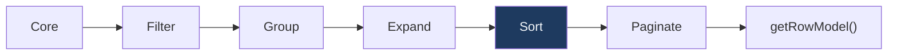

## Client-Side Sorting

Client-side sorting in TanStack Table is handled by the sorted row model, which reorders rows in memory based on the active sorting state. You control sort direction, multi-column sort priority, and the comparison logic used for each column. No server round-trip is required — the table re-sorts on every state change.

---

### Setup

To enable client-side sorting, register `getSortedRowModel` and import the relevant types.

```ts
import {
  useReactTable,
  getCoreRowModel,
  getSortedRowModel,
  SortingState,
  ColumnDef,
} from '@tanstack/react-table';

const [sorting, setSorting] = React.useState<SortingState>([]);

const table = useReactTable({
  data,
  columns,
  state: { sorting },
  onSortingChange: setSorting,
  getCoreRowModel: getCoreRowModel(),
  getSortedRowModel: getSortedRowModel(),
});
```

**Key Points**
- `SortingState` is an array, which allows multi-column sorting.
- Passing `sorting` via `state` makes sorting controlled — your component owns the state and can persist, reset, or inspect it.
- If you omit `state` and `onSortingChange`, sorting state is managed internally by the table instance (uncontrolled mode). [Inference: uncontrolled mode is suitable for simple cases where you do not need to read or persist sort state externally.]

---

### SortingState Shape

```ts
type SortingState = {
  id: string;    // column ID (matches accessorKey or explicit id)
  desc: boolean; // true = descending, false = ascending
}[];
```

**Example**

```ts
// Sort by lastName ascending, then by age descending
const sorting: SortingState = [
  { id: 'lastName', desc: false },
  { id: 'age',      desc: true  },
];
```

The first entry in the array has the highest sort priority. Subsequent entries are tiebreakers.

---

### Connecting Sort to the Header UI

TanStack Table provides methods on each `Column` object to wire up sorting to your header cells.

#### getToggleSortingHandler

Returns an event handler that cycles the column through its sort states when called.

```tsx
<th
  key={header.id}
  onClick={header.column.getCanSort()
    ? header.column.getToggleSortingHandler()
    : undefined}
  style={{ cursor: header.column.getCanSort() ? 'pointer' : 'default' }}
>
  {flexRender(header.column.columnDef.header, header.getContext())}
  {header.column.getIsSorted() === 'asc'  ? ' ↑' : ''}
  {header.column.getIsSorted() === 'desc' ? ' ↓' : ''}
</th>
```

#### Sort State Methods on Column

| Method | Return Type | Description |
|---|---|---|
| `column.getCanSort()` | `boolean` | Whether this column is sortable |
| `column.getIsSorted()` | `false \| 'asc' \| 'desc'` | Current sort direction |
| `column.getSortIndex()` | `number` | Position in the sort priority array (-1 if not sorted) |
| `column.getToggleSortingHandler()` | `MouseEventHandler` | Click handler that toggles sort state |
| `column.toggleSorting(desc?, multi?)` | `void` | Programmatically toggle sorting |
| `column.clearSorting()` | `void` | Remove this column from sort state |

#### Sort Cycle

By default, clicking a sortable column header cycles through these states:

```
unsorted → ascending → descending → unsorted → ...
```

This cycle can be modified with `sortDescFirst`.

---

### Column-Level Sort Options

These options are defined per column in the `ColumnDef`.

```ts
const columns: ColumnDef<Person>[] = [
  {
    accessorKey: 'name',
    header: 'Name',
    enableSorting: true,        // default: true
    sortDescFirst: false,       // first click sorts ascending
    invertSorting: false,       // if true, reverses asc/desc logic
    sortUndefined: 1,           // where to place undefined values: 1 = last, -1 = first
  },
  {
    accessorKey: 'score',
    header: 'Score',
    sortDescFirst: true,        // first click sorts descending (useful for numeric scores)
  },
  {
    accessorKey: 'status',
    header: 'Status',
    enableSorting: false,       // this column is not sortable
  },
];
```

| Option | Type | Default | Description |
|---|---|---|---|
| `enableSorting` | `boolean` | `true` | Whether the column can be sorted |
| `sortDescFirst` | `boolean` | `false` | If true, first click sorts descending |
| `invertSorting` | `boolean` | `false` | Reverses the sort order result |
| `sortUndefined` | `1 \| -1 \| 'first' \| 'last'` | `1` | Placement of rows with undefined values |

---

### Table-Level Sort Options

These options apply globally to the table instance.

```ts
const table = useReactTable({
  data,
  columns,
  state: { sorting },
  onSortingChange: setSorting,
  getCoreRowModel: getCoreRowModel(),
  getSortedRowModel: getSortedRowModel(),

  enableSorting: true,          // master toggle; default true
  enableMultiSort: true,        // allow sorting by multiple columns; default true
  enableSortingRemoval: true,   // allow returning to unsorted; default true
  maxMultiSortColCount: 3,      // max columns in a multi-sort
  isMultiSortEvent: e => e.shiftKey, // which event triggers multi-sort
  sortDescFirst: false,         // global default for first-click direction
});
```

| Option | Type | Default | Description |
|---|---|---|---|
| `enableSorting` | `boolean` | `true` | Globally enable or disable sorting |
| `enableMultiSort` | `boolean` | `true` | Allow multi-column sorting |
| `enableSortingRemoval` | `boolean` | `true` | Allow cycling back to unsorted state |
| `maxMultiSortColCount` | `number` | `Infinity` | Max number of sort columns |
| `isMultiSortEvent` | `(e) => boolean` | Shift key | Determines if a click is a multi-sort action |
| `sortDescFirst` | `boolean` | `false` | Global first-click direction |

---

### Multi-Column Sorting

Multi-sort allows rows to be sorted by more than one column simultaneously, with the first entry taking priority over subsequent ones.

By default, holding **Shift** while clicking a header adds it to the sort array. Single-clicking replaces the sort array with just that column.

```tsx
// Detecting and displaying sort priority
{header.column.getSortIndex() !== -1 && (
  <span className="sort-index">
    {header.column.getSortIndex() + 1}
  </span>
)}
```

**Example — rendering a full sortable header cell**

```tsx
{table.getHeaderGroups().map(headerGroup => (
  <tr key={headerGroup.id}>
    {headerGroup.headers.map(header => (
      <th
        key={header.id}
        colSpan={header.colSpan}
        onClick={header.column.getToggleSortingHandler()}
        style={{ cursor: header.column.getCanSort() ? 'pointer' : 'default' }}
      >
        {header.isPlaceholder ? null : (
          <div style={{ display: 'flex', alignItems: 'center', gap: 4 }}>
            {flexRender(header.column.columnDef.header, header.getContext())}
            {{
              asc:  <span>↑</span>,
              desc: <span>↓</span>,
            }[header.column.getIsSorted() as string] ?? null}
            {header.column.getSortIndex() > -1 && (
              <span style={{ fontSize: '0.75em', opacity: 0.6 }}>
                {header.column.getSortIndex() + 1}
              </span>
            )}
          </div>
        )}
      </th>
    ))}
  </tr>
))}
```

---

### Sorting Functions

A sorting function defines how two values for a column are compared. TanStack Table includes several built-in sorting functions and supports custom ones.

#### Built-in Sorting Functions

| Name | Description |
|---|---|
| `auto` | Infers the appropriate function from the value type |
| `alphanumeric` | Case-insensitive string + number aware comparison |
| `alphanumericCaseSensitive` | Case-sensitive version of alphanumeric |
| `text` | Locale-aware string comparison |
| `textCaseSensitive` | Case-sensitive string comparison |
| `datetime` | Compares `Date` objects |
| `basic` | Simple `<` / `>` comparison |

```ts
const columns: ColumnDef<Person>[] = [
  {
    accessorKey: 'name',
    header: 'Name',
    sortingFn: 'text',
  },
  {
    accessorKey: 'createdAt',
    header: 'Created',
    sortingFn: 'datetime',
  },
];
```

#### Custom Sorting Functions

Define a custom sorting function when built-in options do not meet your needs.

```ts
import { SortingFn } from '@tanstack/react-table';

const statusOrder: Record<string, number> = {
  active:   0,
  pending:  1,
  inactive: 2,
};

const statusSort: SortingFn<Person> = (rowA, rowB, columnId) => {
  const a = statusOrder[rowA.getValue<string>(columnId)] ?? 99;
  const b = statusOrder[rowB.getValue<string>(columnId)] ?? 99;
  return a - b;
};

const columns: ColumnDef<Person>[] = [
  {
    accessorKey: 'status',
    header: 'Status',
    sortingFn: statusSort,
  },
];
```

**Key Points**
- A sorting function must return a negative number, zero, or a positive number — following the same contract as `Array.prototype.sort`. [Inference: violating this contract may produce unpredictable sort results; behavior is not guaranteed.]
- Custom functions receive `(rowA, rowB, columnId)` where `rowA` and `rowB` are full `Row` objects, giving access to `row.original` and `row.getValue()` for any column.
- Custom functions can be registered globally in `sortingFns` on the table options and referenced by name string in column definitions.

```ts
// Register globally
const table = useReactTable({
  data,
  columns,
  sortingFns: {
    statusSort,
  },
  // ...
});

// Reference by name in column def
{
  accessorKey: 'status',
  sortingFn: 'statusSort',
}
```

---

### The `auto` Sorting Function

When `sortingFn` is not specified on a column, TanStack Table defaults to `auto`. This inspects the first non-null value for the column and selects a built-in function based on its type.

| Value type | Selected function |
|---|---|
| `string` | `alphanumeric` |
| `number` | `basic` |
| `boolean` | `basic` |
| `Date` | `datetime` |
| other | `basic` |

[Inference: `auto` inspects the first resolved value it encounters; if your data has mixed or null values in early rows, the inferred function may not match your intent. Behavior is not guaranteed across all edge cases.]

---

### Sorting Pipeline Position

Sorting occurs after filtering and grouping but before pagination in the row model pipeline.



**Key Points**
- Sorting applies to the post-filter, post-group rows. Within grouped tables, sorting reorders the sub-rows inside each group, not the groups themselves. [Inference: this behavior may vary depending on how grouping and sorting interact in your specific version; test with your data structure.]
- Pagination then slices the sorted rows, so each page reflects the correct position in the sorted sequence.

---

### Programmatic Sorting

You can set or clear sorting state outside of user interactions — for example, applying a default sort on mount, or resetting sort when data changes.

```ts
// Set initial sort state
const [sorting, setSorting] = React.useState<SortingState>([
  { id: 'lastName', desc: false },
]);

// Programmatically clear all sorting
table.resetSorting();

// Programmatically set sorting via the column object
table.getColumn('age')?.toggleSorting(true);  // sort descending
table.getColumn('age')?.clearSorting();        // remove from sort state
```

---

### Disabling Sorting Per Column

```ts
const columns: ColumnDef<Person>[] = [
  { accessorKey: 'id',     header: 'ID',     enableSorting: false },
  { accessorKey: 'name',   header: 'Name'   }, // sortable
  { accessorKey: 'avatar', header: 'Avatar', enableSorting: false },
];
```

Columns with `enableSorting: false` will have `column.getCanSort()` return `false`. Use this to conditionally apply the pointer cursor and click handler in your header renderer.

---

### Manual (Server-Side) Sorting

Set `manualSorting: true` to disable client-side row reordering. The table still manages sorting state — you read it and send it to your server.

```ts
const [sorting, setSorting] = React.useState<SortingState>([]);

const table = useReactTable({
  data,             // pre-sorted data from server
  columns,
  state: { sorting },
  onSortingChange: setSorting,
  getCoreRowModel: getCoreRowModel(),
  getSortedRowModel: getSortedRowModel(), // still register for state tracking
  manualSorting: true,
});

// Convert TanStack sort state to your API format
const apiSort = sorting.map(s => ({
  field: s.id,
  order: s.desc ? 'desc' : 'asc',
}));
```

**Key Points**
- With `manualSorting: true`, `getSortedRowModel` is registered but does not reorder rows — it passes them through unchanged. [Inference]
- You are responsible for refetching data whenever `sorting` state changes, typically via a `useEffect` or a query library like TanStack Query.

---

### Common Mistakes

**Using accessorFn without a stable column id**
Sorting state is keyed by column `id`. If a column using `accessorFn` lacks an explicit `id`, sort state may not apply correctly. Always provide `id` when using `accessorFn`.

**Expecting sorting to affect getPreSortedRowModel**
`table.getPreSortedRowModel()` returns rows as they were before the sort stage — useful for displaying an unsorted count, but not for rendering. Always use `table.getRowModel()` or `table.getSortedRowModel()` for display.

**Assuming sort order for equal values is stable**
JavaScript's `Array.prototype.sort` is guaranteed to be stable in modern environments per the ECMAScript spec, but TanStack Table's sort outcome for equal values depends on the underlying engine. [Inference: for reproducible tie-breaking, include a secondary sort column in `SortingState`.]

**Forgetting shift-click for multi-sort**
By default, a plain click replaces the sort array. Shift-click adds to it. If your users need multi-sort, consider adding a visible hint in the UI.

---

**Next Steps**

**Related Topics**
- Column filtering — per-column filter functions, `ColumnFiltersState`, filter UI patterns
- Global filtering — single search input across all columns
- Pagination — slicing sorted rows across pages, page size controls
- Server-side sorting — combining `manualSorting` with TanStack Query
- Custom sorting functions — locale-aware, enum-order, and null-handling strategies
- Column pinning — interaction between pinned columns and sort state
- Grouping — how sorting interacts with grouped sub-rows
- Accessibility — adding `aria-sort` attributes to sorted column headers