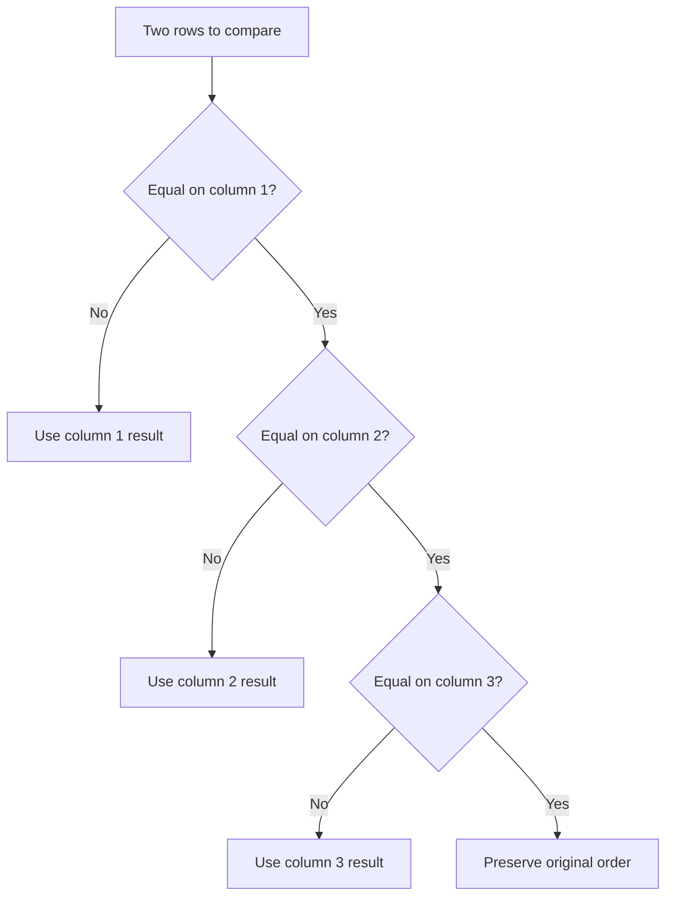

## Multi-Column Sorting

Multi-column sorting allows rows to be sorted by more than one column simultaneously. The first column in the sort array has the highest priority; subsequent columns act as tiebreakers. TanStack Table supports this out of the box with no additional row model required beyond `getSortedRowModel`.

---

### How Multi-Column Sorting Works

When `SortingState` contains more than one entry, the sorted row model applies comparisons in array order. If two rows are equal according to the first sort column, the second column's comparator is applied, and so on.



**Key Points**
- Sort priority is determined by position in the `SortingState` array, not by column order in the UI.
- Rows that are equal across all active sort columns retain their relative order from the previous pipeline stage. [Inference: actual stability depends on the JavaScript engine's sort implementation; modern engines use stable sort per the ECMAScript 2019 spec.]

---

### Enabling Multi-Column Sorting

Multi-sort is enabled by default. The relevant table options are:

```ts
const table = useReactTable({
  data,
  columns,
  state: { sorting },
  onSortingChange: setSorting,
  getCoreRowModel: getCoreRowModel(),
  getSortedRowModel: getSortedRowModel(),

  enableMultiSort: true,           // default: true
  maxMultiSortColCount: Infinity,  // default: Infinity
  enableSortingRemoval: true,      // default: true; allows cycling back to unsorted
  isMultiSortEvent: e => e.shiftKey, // default: shift key triggers multi-sort
});
```

| Option | Type | Default | Description |
|---|---|---|---|
| `enableMultiSort` | `boolean` | `true` | Globally enable multi-column sorting |
| `maxMultiSortColCount` | `number` | `Infinity` | Maximum number of simultaneously sorted columns |
| `enableSortingRemoval` | `boolean` | `true` | Whether clicking a sorted column can return it to unsorted |
| `isMultiSortEvent` | `(e: unknown) => boolean` | Shift key check | Predicate that determines if a user interaction is a multi-sort action |

---

### Default User Interaction Model

With default settings:

| User action | Result |
|---|---|
| Click unsorted column | Replace sort array with that column ascending |
| Click sorted column | Toggle direction (asc → desc → unsorted) |
| Shift+click unsorted column | Add column to end of sort array |
| Shift+click sorted column | Toggle direction of that column within the array |
| Shift+click to remove last column | Remove it from array; others remain |

The shift key behavior is governed by `isMultiSortEvent`. You can replace it with any predicate — for example, always treating every click as a multi-sort event, or using a different modifier key.

```ts
// Always multi-sort — every click adds or toggles, never replaces
isMultiSortEvent: () => true,

// Use Ctrl/Cmd instead of Shift
isMultiSortEvent: e => (e as MouseEvent).ctrlKey || (e as MouseEvent).metaKey,
```

---

### Controlling maxMultiSortColCount

When `maxMultiSortColCount` is set, adding a new sort column beyond the limit removes the lowest-priority (last) entry from the array first.

```ts
maxMultiSortColCount: 2,
```

With this setting, if the user shift-clicks a third column, the first sort column is dropped and the array is updated to contain only the two most recently activated columns. [Inference: the exact eviction behavior — which entry is dropped — may depend on internal implementation; verify with your installed version.]

---

### SortingState Management

#### Controlled state (recommended)

```ts
const [sorting, setSorting] = React.useState<SortingState>([
  { id: 'lastName', desc: false },
  { id: 'firstName', desc: false },
]);

const table = useReactTable({
  data,
  columns,
  state: { sorting },
  onSortingChange: setSorting,
  getCoreRowModel: getCoreRowModel(),
  getSortedRowModel: getSortedRowModel(),
  enableMultiSort: true,
});
```

#### Setting initial multi-sort programmatically

```ts
// On mount, sort by department ascending then salary descending
const [sorting, setSorting] = React.useState<SortingState>([
  { id: 'department', desc: false },
  { id: 'salary',     desc: true  },
]);
```

#### Resetting sort state

```ts
// Clear all sorting
setSorting([]);

// Or use the table API
table.resetSorting();
```

---

### Rendering Multi-Sort Indicators

When multiple columns are sorted, your header UI should communicate both the sort direction and the sort priority of each column. Use `column.getIsSorted()` for direction and `column.getSortIndex()` for priority.

```ts
column.getIsSorted()   // false | 'asc' | 'desc'
column.getSortIndex()  // -1 if not sorted; 0-based index in SortingState array
```

**Example — header cell with direction indicator and priority badge**

```tsx
{table.getHeaderGroups().map(headerGroup => (
  <tr key={headerGroup.id}>
    {headerGroup.headers.map(header => {
      const isSorted = header.column.getIsSorted();
      const sortIndex = header.column.getSortIndex();
      const canSort = header.column.getCanSort();

      return (
        <th
          key={header.id}
          colSpan={header.colSpan}
          onClick={header.column.getToggleSortingHandler()}
          style={{ cursor: canSort ? 'pointer' : 'default', userSelect: 'none' }}
        >
          {header.isPlaceholder ? null : (
            <div style={{ display: 'flex', alignItems: 'center', gap: 4 }}>

              {flexRender(header.column.columnDef.header, header.getContext())}

              {/* Direction indicator */}
              {isSorted === 'asc'  && <span aria-label="sorted ascending">↑</span>}
              {isSorted === 'desc' && <span aria-label="sorted descending">↓</span>}
              {!isSorted && canSort && (
                <span style={{ opacity: 0.3 }}>↕</span>
              )}

              {/* Priority badge — only shown when multi-sorting */}
              {sortIndex > -1 && (
                <span
                  style={{
                    fontSize: '0.7em',
                    background: '#e2e8f0',
                    borderRadius: 4,
                    padding: '0 4px',
                    lineHeight: 1.5,
                  }}
                >
                  {sortIndex + 1}
                </span>
              )}

            </div>
          )}
        </th>
      );
    })}
  </tr>
))}
```

**Output**

For a table sorted by `lastName` ascending (priority 1) then `age` descending (priority 2):

```
┌──────────────┬──────────────┬──────────────┐
│  Name  ↕     │ Last Name ↑1 │    Age ↓2    │
├──────────────┼──────────────┼──────────────┤
│  Alice       │  Anderson    │     29       │
│  Bob         │  Anderson    │     41       │
│  Carol       │  Brown       │     35       │
└──────────────┴──────────────┴──────────────┘
```

---

### Programmatic Multi-Sort Control

#### Adding a column to the sort array

```ts
// toggleSorting(desc?, isMulti?)
// isMulti = true adds to the array instead of replacing it
table.getColumn('department')?.toggleSorting(false, true); // add ascending
table.getColumn('salary')?.toggleSorting(true, true);      // add descending
```

#### Removing one column from the sort array

```ts
table.getColumn('salary')?.clearSorting();
```

`clearSorting()` removes only that column from the `SortingState` array. Other sorted columns are unaffected.

#### Replacing the entire sort array

```ts
// Via the state setter (controlled mode)
setSorting([
  { id: 'role',   desc: false },
  { id: 'tenure', desc: true  },
]);

// Via the table API
table.setSorting([
  { id: 'role',   desc: false },
  { id: 'tenure', desc: true  },
]);
```

---

### Disabling Multi-Sort Per Column

Individual columns can opt out of participating in multi-sort while still being sortable as a standalone column.

```ts
const columns: ColumnDef<Person>[] = [
  {
    accessorKey: 'id',
    header: 'ID',
    enableMultiSort: false, // cannot be added to a multi-sort array
  },
  {
    accessorKey: 'name',
    header: 'Name',
    // enableMultiSort defaults to true
  },
];
```

[Inference: when `enableMultiSort: false` is set on a column, clicking it in a multi-sort context may replace the sort array rather than appending; behavior may vary — verify with your installed version.]

---

### Interaction with enableSortingRemoval

`enableSortingRemoval` controls whether clicking through a column's sort cycle can return it to the unsorted state.

```ts
// With enableSortingRemoval: true (default)
// unsorted → asc → desc → unsorted → ...

// With enableSortingRemoval: false
// unsorted → asc → desc → asc → ...
```

In a multi-sort context, `enableSortingRemoval: false` means a column can never be removed from the sort array by clicking — only by calling `clearSorting()` programmatically or by another column replacing the array entirely. [Inference: this interaction behavior is a logical consequence of the option's design; verify against your installed version.]

---

### Sorting Priority Reordering UI (Custom Pattern)

TanStack Table does not include a built-in UI for reordering sort priority. A common pattern is to expose the active sort columns as draggable chips or a sortable list, and update the `SortingState` array directly when the user reorders them.

```tsx
// Example concept — not a complete drag implementation
function SortChips({ sorting, setSorting, table }) {
  return (
    <div style={{ display: 'flex', gap: 8 }}>
      {sorting.map((sort, index) => (
        <div key={sort.id} style={{ display: 'flex', alignItems: 'center', gap: 4 }}>
          <span>{index + 1}.</span>
          <span>{table.getColumn(sort.id)?.columnDef.header as string}</span>
          <span>{sort.desc ? '↓' : '↑'}</span>
          <button
            onClick={() =>
              setSorting(prev => prev.filter(s => s.id !== sort.id))
            }
          >
            ✕
          </button>
        </div>
      ))}
    </div>
  );
}
```

Moving an entry to a different index in the `sorting` array changes its priority immediately because TanStack Table derives sort order directly from array position.

---

### Server-Side Multi-Sort

With `manualSorting: true`, the `SortingState` array is your contract with the server. Serialize it into whatever format your API expects.

```ts
const [sorting, setSorting] = React.useState<SortingState>([]);

const table = useReactTable({
  data,
  columns,
  state: { sorting },
  onSortingChange: setSorting,
  getCoreRowModel: getCoreRowModel(),
  getSortedRowModel: getSortedRowModel(),
  manualSorting: true,
  enableMultiSort: true,
});

// Convert to API query params
const sortParams = sorting
  .map(s => `${s.desc ? '-' : ''}${s.id}`)
  .join(',');
// e.g. "lastName,-age" for lastName asc, age desc
```

---

### Accessibility Considerations

For accessible sort headers, apply `aria-sort` to `<th>` elements. The `aria-sort` attribute accepts `"ascending"`, `"descending"`, `"none"`, or `"other"`.

```tsx
<th
  key={header.id}
  aria-sort={
    header.column.getIsSorted() === 'asc'  ? 'ascending'  :
    header.column.getIsSorted() === 'desc' ? 'descending' :
    header.column.getCanSort()             ? 'none'       :
    undefined
  }
  onClick={header.column.getToggleSortingHandler()}
>
  {/* header content */}
</th>
```

**Key Points**
- `aria-sort` should only be present on sortable columns. Apply `undefined` (omitting the attribute) to non-sortable columns rather than setting `"none"`.
- For multi-sort, `aria-sort` does not have a standard way to express priority. Consider supplementing with visually displayed priority numbers and a screen-reader-accessible description. [Inference: screen reader behavior for multi-sort tables varies across assistive technologies; test with your target audience's tools.]
- Add `title` or `aria-label` attributes to sort direction indicators (↑ ↓) so they are announced meaningfully by screen readers.

---

### Common Mistakes

**Shift-clicking without `enableMultiSort: true`**
If `enableMultiSort` is `false`, shift-clicking still replaces the sort array with just the clicked column. No multi-sort occurs.

**Expecting column order to determine sort priority**
Sort priority is determined by position in `SortingState`, not by the column's visual or definition order in the table. A column defined last can be priority 1 if it is first in the array.

**Setting `maxMultiSortColCount` without testing eviction**
When the limit is exceeded and an entry is evicted from the array, the UI should reflect the new state. If your sort indicator relies on `getSortIndex()`, this updates automatically. [Inference]

**Using `isMultiSortEvent: () => true` without communicating it to users**
If every click behaves as a multi-sort action, users cannot easily replace the entire sort. Pair this with a visible "Clear sort" control and sort chip UI so the state remains legible.

**Not stabilizing equality with a tiebreaker column**
When two rows are equal on all active sort columns, their relative order is determined by the underlying sort algorithm. [Inference] For reproducible output, include a unique column (e.g., `id`) as the final tiebreaker in the `SortingState` array.

```ts
const [sorting, setSorting] = React.useState<SortingState>([
  { id: 'lastName', desc: false },
  { id: 'id',       desc: false }, // stable tiebreaker
]);
```

---

**Next Steps**

**Related Topics**
- Column filtering — filtering rows before they reach the sort stage
- Pagination — paginating across the sorted row set
- Custom sorting functions — locale-aware, enum-order, and null-safe comparators
- Server-side sorting — serializing `SortingState` for API consumption
- Column visibility — interaction between hidden columns and sort state
- `sortUndefined` — controlling placement of rows with undefined sort values
- Accessibility — `aria-sort`, live regions, and keyboard navigation for sort headers
- TanStack Query integration — refetching on sort state change for server-side tables