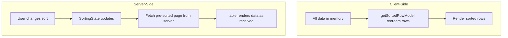
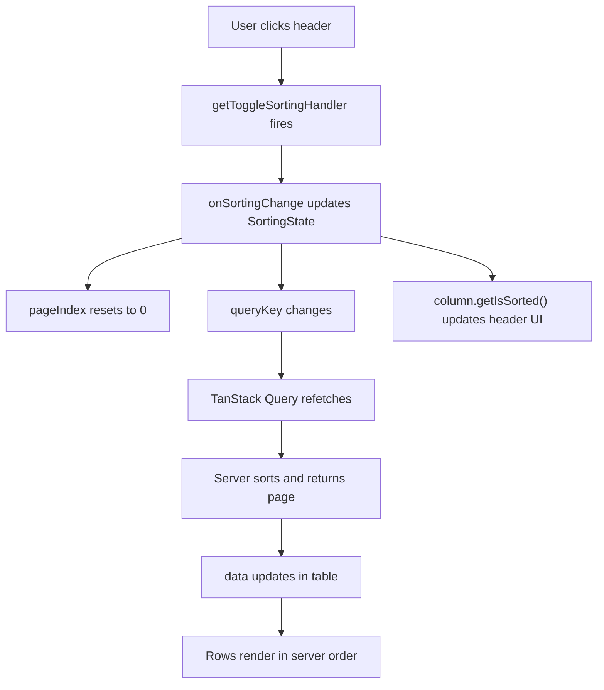

## Manual Server-Side Sorting

Server-side sorting delegates row ordering to an external data source — typically an API or database — rather than reordering rows in the browser. TanStack Table manages the sorting UI and state; your server performs the actual sort. The table receives pre-sorted data on every fetch and renders it as-is.

---

### How It Differs from Client-Side Sorting



| Concern | Client-Side | Server-Side |
|---|---|---|
| Who sorts | Browser (`getSortedRowModel`) | Database / API |
| Data in memory | All rows | Current page only |
| Sort triggers a fetch | No | Yes |
| `manualSorting` | `false` (default) | `true` |
| `getSortedRowModel` needed | Yes (reorders rows) | Optional (state tracking only) |

---

### Minimal Setup

```ts
import {
  useReactTable,
  getCoreRowModel,
  getSortedRowModel,
  SortingState,
  ColumnDef,
} from '@tanstack/react-table';

type Person = {
  id: string;
  name: string;
  age: number;
  department: string;
};

const columns: ColumnDef<Person>[] = [
  { accessorKey: 'name',       header: 'Name'       },
  { accessorKey: 'age',        header: 'Age'        },
  { accessorKey: 'department', header: 'Department' },
];

function ServerSortedTable() {
  const [sorting, setSorting] = React.useState<SortingState>([]);
  const [data, setData] = React.useState<Person[]>([]);

  // Fetch whenever sorting changes
  React.useEffect(() => {
    fetchData(sorting).then(setData);
  }, [sorting]);

  const table = useReactTable({
    data,
    columns,
    state: { sorting },
    onSortingChange: setSorting,
    getCoreRowModel: getCoreRowModel(),
    getSortedRowModel: getSortedRowModel(), // registers state tracking; does not reorder
    manualSorting: true,
  });

  // ... render
}
```

**Key Points**
- `manualSorting: true` tells the sorted row model to pass rows through unchanged. The rows are rendered exactly as your server returned them. [Inference: the sorted row model does not reorder rows when this flag is set; behavior is not guaranteed across all versions — verify with your installed version.]
- `getSortedRowModel` is still registered so that `column.getIsSorted()`, `column.getSortIndex()`, and related UI methods remain functional. Omitting it does not break sorting state but disables those column-level helpers. [Inference]
- `onSortingChange: setSorting` is required for the table to propagate sort interactions back to your state.

---

### Translating SortingState to an API Request

`SortingState` is an array of `{ id: string; desc: boolean }` objects. You must serialize this into whatever format your API expects before sending the request.

#### Common serialization patterns

**Query string — single sort param**

```ts
// SortingState: [{ id: 'name', desc: false }]
// → ?sort=name&order=asc

const buildQuery = (sorting: SortingState) => {
  if (!sorting.length) return '';
  const { id, desc } = sorting[0];
  return `sort=${id}&order=${desc ? 'desc' : 'asc'}`;
};
```

**Query string — multi-sort with prefix convention**

```ts
// SortingState: [{ id: 'department', desc: false }, { id: 'age', desc: true }]
// → ?sort=department,-age

const buildMultiSortQuery = (sorting: SortingState) =>
  sorting.map(s => `${s.desc ? '-' : ''}${s.id}`).join(',');

// Usage: ?sort=department,-age
```

**JSON body**

```ts
// SortingState: [{ id: 'name', desc: false }, { id: 'age', desc: true }]
// →  { "sort": [{ "field": "name", "dir": "asc" }, { "field": "age", "dir": "desc" }] }

const buildSortPayload = (sorting: SortingState) =>
  sorting.map(s => ({ field: s.id, dir: s.desc ? 'desc' : 'asc' }));
```

**OData-style**

```ts
// → $orderby=department asc,age desc

const buildODataSort = (sorting: SortingState) =>
  sorting.map(s => `${s.id} ${s.desc ? 'desc' : 'asc'}`).join(',');
```

---

### Fetch Function Pattern

Keep the fetch function decoupled from the table. It accepts sorting state (and any other active state) and returns data.

```ts
async function fetchPeople(sorting: SortingState): Promise<Person[]> {
  const sortParam = sorting
    .map(s => `${s.desc ? '-' : ''}${s.id}`)
    .join(',');

  const url = new URL('/api/people', window.location.origin);
  if (sortParam) url.searchParams.set('sort', sortParam);

  const res = await fetch(url.toString());
  if (!res.ok) throw new Error(`Fetch failed: ${res.status}`);
  return res.json();
}
```

---

### Combining with Server-Side Pagination

Server-side sorting is almost always paired with server-side pagination. When sorting changes, the page index should reset to zero — otherwise the user may be viewing page 3 of a now-invalid sort order.

```ts
const [sorting, setSorting] = React.useState<SortingState>([]);
const [pagination, setPagination] = React.useState({
  pageIndex: 0,
  pageSize: 20,
});
const [data, setData] = React.useState<Person[]>([]);
const [totalRows, setTotalRows] = React.useState(0);

// Reset page to 0 when sorting changes
const handleSortingChange: OnChangeFn<SortingState> = updater => {
  setSorting(updater);
  setPagination(prev => ({ ...prev, pageIndex: 0 }));
};

React.useEffect(() => {
  fetchPeople({ sorting, pagination }).then(({ rows, total }) => {
    setData(rows);
    setTotalRows(total);
  });
}, [sorting, pagination]);

const table = useReactTable({
  data,
  columns,
  state: { sorting, pagination },
  onSortingChange: handleSortingChange,
  onPaginationChange: setPagination,
  getCoreRowModel: getCoreRowModel(),
  getSortedRowModel: getSortedRowModel(),
  getPaginationRowModel: getPaginationRowModel(),
  manualSorting: true,
  manualPagination: true,
  rowCount: totalRows,
});
```

**Key Points**
- `rowCount` tells the table how many total rows exist so it can compute `getPageCount()`. Without it, page count cannot be determined. [Inference: omitting `rowCount` with `manualPagination: true` may result in incorrect or undefined page count behavior.]
- Resetting `pageIndex` to `0` on sort change prevents stale pagination. This is a UI convention, not enforced by TanStack Table.
- [Inference] The `OnChangeFn<T>` type accepts either a new value or an updater function `(prev: T) => T`. The `updater` parameter in `handleSortingChange` may be either form — use a functional update pattern to handle both safely:

```ts
const handleSortingChange: OnChangeFn<SortingState> = updater => {
  setSorting(prev =>
    typeof updater === 'function' ? updater(prev) : updater
  );
  setPagination(prev => ({ ...prev, pageIndex: 0 }));
};
```

---

### Integration with TanStack Query

TanStack Query is the idiomatic choice for managing server state alongside TanStack Table. It handles caching, deduplication, loading states, and background refetching automatically.

```ts
import { useQuery } from '@tanstack/react-query';

function ServerSortedTable() {
  const [sorting, setSorting] = React.useState<SortingState>([]);
  const [pagination, setPagination] = React.useState({
    pageIndex: 0,
    pageSize: 20,
  });

  const { data, isFetching, isLoading } = useQuery({
    queryKey: ['people', sorting, pagination],
    queryFn: () => fetchPeople({ sorting, pagination }),
    placeholderData: keepPreviousData, // keep stale data visible during refetch
  });

  const handleSortingChange: OnChangeFn<SortingState> = updater => {
    setSorting(prev =>
      typeof updater === 'function' ? updater(prev) : updater
    );
    setPagination(prev => ({ ...prev, pageIndex: 0 }));
  };

  const table = useReactTable({
    data: data?.rows ?? [],
    columns,
    state: { sorting, pagination },
    onSortingChange: handleSortingChange,
    onPaginationChange: setPagination,
    getCoreRowModel: getCoreRowModel(),
    getSortedRowModel: getSortedRowModel(),
    getPaginationRowModel: getPaginationRowModel(),
    manualSorting: true,
    manualPagination: true,
    rowCount: data?.total ?? 0,
  });

  return (
    <>
      {isFetching && <span>Refreshing…</span>}
      {/* table render */}
    </>
  );
}
```

**Key Points**
- `queryKey: ['people', sorting, pagination]` causes the query to refetch automatically whenever sorting or pagination state changes. No manual `useEffect` is needed.
- `placeholderData: keepPreviousData` (imported from `@tanstack/react-query`) keeps the previous page of data visible while the new fetch is in flight, preventing layout shift. [Inference: this is the recommended pattern for paginated/sorted queries in TanStack Query v5; API may differ in earlier versions.]
- `data?.rows ?? []` guards against the brief window where `data` is undefined on initial load.

---

### Loading and Transition States

When a fetch is in flight, the table should communicate that the data is changing. Common patterns:

#### Opacity overlay during refetch

```tsx
<div style={{ position: 'relative' }}>
  {isFetching && (
    <div style={{
      position: 'absolute', inset: 0,
      background: 'rgba(255,255,255,0.6)',
      display: 'flex', alignItems: 'center', justifyContent: 'center',
      zIndex: 1,
    }}>
      Loading…
    </div>
  )}
  <table style={{ opacity: isFetching ? 0.5 : 1 }}>
    {/* thead, tbody */}
  </table>
</div>
```

#### Skeleton rows during initial load

```tsx
{isLoading
  ? Array.from({ length: pagination.pageSize }).map((_, i) => (
      <tr key={i}>
        {columns.map((_, j) => (
          <td key={j}>
            <div style={{ height: 16, background: '#e2e8f0', borderRadius: 4 }} />
          </td>
        ))}
      </tr>
    ))
  : table.getRowModel().rows.map(row => (
      <tr key={row.id}>
        {row.getVisibleCells().map(cell => (
          <td key={cell.id}>
            {flexRender(cell.column.columnDef.cell, cell.getContext())}
          </td>
        ))}
      </tr>
    ))
}
```

---

### Indicating Sort State in Headers

The header rendering for server-side sorting is identical to client-side. `column.getIsSorted()` and `column.getSortIndex()` read from the controlled `SortingState` and work correctly regardless of whether sorting is manual.

```tsx
{table.getHeaderGroups().map(headerGroup => (
  <tr key={headerGroup.id}>
    {headerGroup.headers.map(header => {
      const sorted = header.column.getIsSorted();
      const canSort = header.column.getCanSort();

      return (
        <th
          key={header.id}
          colSpan={header.colSpan}
          onClick={header.column.getToggleSortingHandler()}
          style={{ cursor: canSort ? 'pointer' : 'default', userSelect: 'none' }}
          aria-sort={
            sorted === 'asc'  ? 'ascending'  :
            sorted === 'desc' ? 'descending' :
            canSort           ? 'none'       :
            undefined
          }
        >
          {header.isPlaceholder ? null : (
            <div style={{ display: 'flex', alignItems: 'center', gap: 4 }}>
              {flexRender(header.column.columnDef.header, header.getContext())}
              {sorted === 'asc'  && <span aria-hidden>↑</span>}
              {sorted === 'desc' && <span aria-hidden>↓</span>}
              {!sorted && canSort && <span aria-hidden style={{ opacity: 0.3 }}>↕</span>}
              {header.column.getSortIndex() > -1 && (
                <span style={{ fontSize: '0.7em', opacity: 0.6 }}>
                  {header.column.getSortIndex() + 1}
                </span>
              )}
            </div>
          )}
        </th>
      );
    })}
  </tr>
))}
```

---

### Columns That Cannot Be Sorted Server-Side

Not all columns may be sortable by your API. Disable sorting on columns that the server does not support ordering by.

```ts
const columns: ColumnDef<Person>[] = [
  { accessorKey: 'name',       header: 'Name'       },
  { accessorKey: 'age',        header: 'Age'        },
  {
    accessorKey: 'avatarUrl',
    header: 'Avatar',
    enableSorting: false,  // server cannot sort by this field
  },
  {
    id: 'actions',
    header: 'Actions',
    enableSorting: false,  // display column; no sort concept
    cell: ({ row }) => <button>Edit</button>,
  },
];
```

---

### Preventing Stale Requests (Race Conditions)

When a user changes sort state rapidly, multiple in-flight requests may resolve out of order. [Inference: race conditions are a general async concern; the severity depends on network conditions and server response times.]

With TanStack Query, deduplication and query cancellation handle most of this automatically — a new query for the same key supersedes the previous one. [Inference: actual cancellation behavior depends on TanStack Query version and configuration.]

For a plain `fetch`-based approach, use an `AbortController`:

```ts
React.useEffect(() => {
  const controller = new AbortController();

  fetchPeople(sorting, { signal: controller.signal })
    .then(setData)
    .catch(err => {
      if (err.name !== 'AbortError') throw err;
    });

  return () => controller.abort();
}, [sorting]);
```

The cleanup function aborts the previous request whenever `sorting` changes before the fetch resolves.

---

### Full Pattern Summary



---

### Common Mistakes

**Not resetting pageIndex on sort change**
When sorting changes, staying on the same page index returns the wrong slice of data. Always reset to page 0 when sort state changes.

**Omitting rowCount with manualPagination**
Without `rowCount`, `table.getPageCount()` returns `0` or `Infinity`, breaking pagination controls. Always provide the total row count from your server response.

**Using data as an inline fallback without memoization**
`data?.rows ?? []` creates a new array reference on every render when `data` is undefined. [Inference] Memoize the fallback or initialize state to avoid unnecessary re-renders:

```ts
// Prefer
const [data, setData] = React.useState<Person[]>([]);

// Over
data: serverData?.rows ?? [], // new [] reference every render
```

**Assuming getSortedRowModel reorders server data**
With `manualSorting: true`, the sorted row model is a pass-through. If you remove `manualSorting` accidentally, the client will attempt to re-sort the already-sorted server data, which may appear correct but produces double-sort behavior if the client and server sort logic differ. [Inference]

**Serializing column IDs that don't match server field names**
TanStack Table uses `accessorKey` or the explicit `id` as the sort column identifier. If your server expects different field names, translate them in your serialization step:

```ts
const fieldMap: Record<string, string> = {
  name: 'full_name',   // TanStack ID → server field
  age:  'birth_year',
};

const buildSort = (sorting: SortingState) =>
  sorting.map(s => ({
    field: fieldMap[s.id] ?? s.id,
    dir: s.desc ? 'desc' : 'asc',
  }));
```

---

**Next Steps**

**Related Topics**
- Server-side pagination — `manualPagination`, `rowCount`, `pageIndex` reset patterns
- Server-side filtering — `manualFiltering`, serializing `ColumnFiltersState` for API queries
- TanStack Query integration — `queryKey` patterns, `keepPreviousData`, query invalidation
- Race condition handling — AbortController, query cancellation, debouncing sort changes
- Multi-column server sort — serializing multi-entry `SortingState` for APIs
- Column filtering — combining filter and sort state in a single server request
- Loading states — skeleton rows, opacity overlays, and optimistic UI during fetches
- `OnChangeFn` — handling updater function vs. direct value in state change callbacks