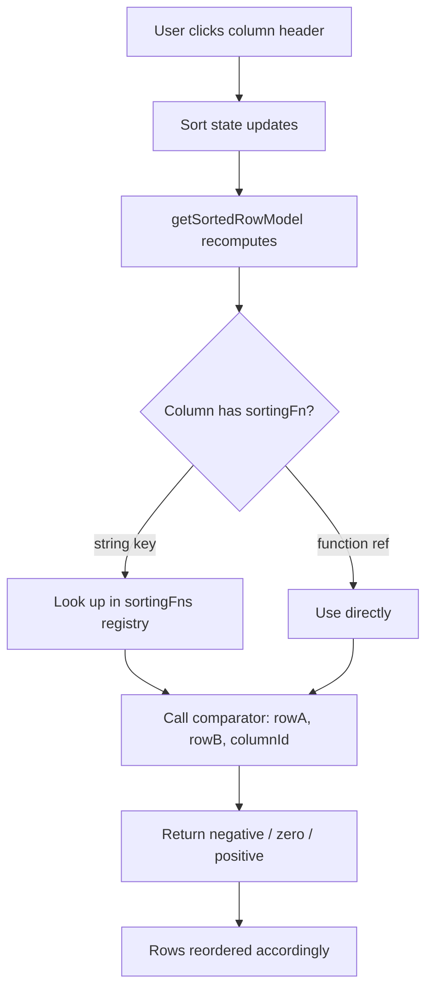

## Custom Sort Functions in TanStack Table

Custom sort functions give you precise control over how column data is ordered, replacing or supplementing the built-in sort algorithms with your own comparison logic.

---

### Overview

TanStack Table ships with a set of built-in sort functions (`alphanumeric`, `alphanumericCaseSensitive`, `text`, `textCaseSensitive`, `datetime`, `basic`). When none of these match your data's shape or business rules, you define a custom sort function and register it with the table.

A sort function is a comparator with the signature:

```ts
(rowA: Row<TData>, rowB: Row<TData>, columnId: string) => number
```

The return value follows standard comparator convention:
- Negative → `rowA` comes before `rowB`
- Zero → order is preserved (behavior may vary by JS engine)
- Positive → `rowB` comes before `rowA`

---

### Defining a Sort Function

Sort functions are defined outside of your component or table configuration, then referenced by name or passed directly.

**By reference (inline on a column):**

```ts
columnHelper.accessor('priority', {
  sortingFn: (rowA, rowB, columnId) => {
    const order = { low: 0, medium: 1, high: 2, critical: 3 }
    const a = order[rowA.getValue<string>(columnId)] ?? -1
    const b = order[rowB.getValue<string>(columnId)] ?? -1
    return a - b
  },
})
```

**By name (registered globally):**

```ts
const table = useReactTable({
  // ...
  sortingFns: {
    prioritySort: (rowA, rowB, columnId) => {
      const order = { low: 0, medium: 1, high: 2, critical: 3 }
      const a = order[rowA.getValue<string>(columnId)] ?? -1
      const b = order[rowB.getValue<string>(columnId)] ?? -1
      return a - b
    },
  },
})
```

Then reference it in the column definition:

```ts
columnHelper.accessor('priority', {
  sortingFn: 'prioritySort',
})
```

---

### Accessing Row Data Inside a Sort Function

You have two ways to read cell values inside a sort function:

**`rowA.getValue(columnId)`** — returns the value after any `accessorFn` transformation. This is the most common approach.

**`rowA.original`** — gives you the raw original data object, useful when you need fields from outside the current column.

```ts
sortingFns: {
  byFullName: (rowA, rowB, _columnId) => {
    const a = `${rowA.original.lastName} ${rowA.original.firstName}`
    const b = `${rowB.original.lastName} ${rowB.original.firstName}`
    return a.localeCompare(b)
  },
},
```

> [Inference] Using `rowA.original` is appropriate when the sort key spans multiple data fields not exposed through any single column's `getValue`. Behavior may vary depending on how your data and accessor functions are configured.

---

### Multi-Field Sort Functions

A single sort function can implement its own internal tie-breaking logic, independent of the table's column-level multi-sort:

```ts
sortingFns: {
  statusThenDate: (rowA, rowB, _columnId) => {
    const statusOrder = { open: 0, pending: 1, closed: 2 }
    const sa = statusOrder[rowA.original.status] ?? 99
    const sb = statusOrder[rowB.original.status] ?? 99

    if (sa !== sb) return sa - sb

    // Tie-break: sort by createdAt ascending
    const da = new Date(rowA.original.createdAt).getTime()
    const db = new Date(rowB.original.createdAt).getTime()
    return da - db
  },
},
```

This is distinct from TanStack Table's built-in multi-sort (which chains multiple column sorts). Here, the logic lives entirely inside one function.

---

### Handling Null and Undefined Values

The built-in sort functions handle nullish values automatically. Custom sort functions do not — you must decide explicitly.

**Common pattern — push nulls to the bottom regardless of sort direction:**

```ts
sortingFns: {
  nullsLast: (rowA, rowB, columnId) => {
    const a = rowA.getValue<number | null>(columnId)
    const b = rowB.getValue<number | null>(columnId)

    if (a == null && b == null) return 0
    if (a == null) return 1   // a goes after b
    if (b == null) return -1  // b goes after a

    return a - b
  },
},
```

> [Inference] TanStack Table does not automatically invert your null-placement logic when sort direction is reversed. If you want nulls-last behavior that respects direction, you must read the column's sort direction and adjust accordingly. Behavior may vary.

**Direction-aware null handling:**

```ts
sortingFns: {
  nullsLastDirectional: (rowA, rowB, columnId) => {
    const a = rowA.getValue<number | null>(columnId)
    const b = rowB.getValue<number | null>(columnId)

    if (a == null && b == null) return 0
    if (a == null) return 1
    if (b == null) return -1

    // The table will flip this result for descending automatically —
    // but null placement above is NOT flipped. That is intentional here.
    return a - b
  },
},
```

---

### Using `sortUndefined` Alongside Custom Sort Functions

The column option `sortUndefined` controls where `undefined` values land relative to defined values. It applies at the table infrastructure level before your sort function is called for those rows.

[Inference] This means your custom function may never receive `undefined` as a `getValue` result if `sortUndefined` is set — the rows are already separated. Behavior may vary by version; verify against your installed version's source.

```ts
columnHelper.accessor('score', {
  sortingFn: 'myCustomSort',
  sortUndefined: -1, // undefined rows sorted to the top
})
```

---

### Extending Built-in Sort Functions

You can compose with the built-in sort functions rather than replacing them entirely. Built-ins are exported from `@tanstack/table-core`:

```ts
import { sortingFns } from '@tanstack/react-table'

sortingFns: {
  textWithFallback: (rowA, rowB, columnId) => {
    const a = rowA.getValue<string>(columnId)
    const b = rowB.getValue<string>(columnId)

    // Custom pre-processing
    const normalize = (s: string) => s.trim().toLowerCase().replace(/^the\s+/i, '')

    const na = normalize(a ?? '')
    const nb = normalize(b ?? '')

    if (na === nb) return 0

    // Delegate to built-in for locale-aware comparison
    return sortingFns.text(
      { ...rowA, getValue: () => na } as any,
      { ...rowB, getValue: () => nb } as any,
      columnId
    )
  },
},
```

> [Inference] The cast to `as any` is required here because `getValue` normally carries the full row's generic type. This pattern works in practice but is not officially documented as a supported composition approach. Behavior may vary. Verify against your version.

---

### TypeScript: Extending the SortingFn Registry

When registering custom sort functions by name, TypeScript will not know about your custom names unless you extend the `SortingFnOption` type via module augmentation:

```ts
// types/table.d.ts
import '@tanstack/react-table'

declare module '@tanstack/react-table' {
  interface SortingFns {
    prioritySort: SortingFn<unknown>
    statusThenDate: SortingFn<unknown>
    nullsLast: SortingFn<unknown>
  }
}
```

After this declaration, referencing `'prioritySort'` in `sortingFn` is fully type-safe and autocompleted.

---

### Sort Function Memoization

Sort functions are called frequently during re-renders triggered by sort state changes. Functions defined inline inside the component body are recreated each render.

**Preferred:** Define sort functions outside the component, or at module scope.

```ts
// At module scope — stable reference, no memoization needed
const prioritySort: SortingFn<Task> = (rowA, rowB, columnId) => {
  const order = { low: 0, medium: 1, high: 2, critical: 3 }
  const a = order[rowA.getValue<string>(columnId)] ?? -1
  const b = order[rowB.getValue<string>(columnId)] ?? -1
  return a - b
}
```

> [Inference] Inline functions passed to `sortingFns` inside `useReactTable` are typically stable enough in practice because `useReactTable` does not re-run the sort comparator on every render — only when sort state changes. Nonetheless, module-scope definitions are the safer pattern. Behavior may vary.

---

### Complete Working Example

```tsx
import {
  createColumnHelper,
  getCoreRowModel,
  getSortedRowModel,
  useReactTable,
  SortingFn,
} from '@tanstack/react-table'

type Task = {
  title: string
  priority: 'low' | 'medium' | 'high' | 'critical'
  score: number | null
}

const PRIORITY_ORDER: Record<string, number> = {
  low: 0, medium: 1, high: 2, critical: 3,
}

const prioritySort: SortingFn<Task> = (rowA, rowB, columnId) => {
  const a = PRIORITY_ORDER[rowA.getValue<string>(columnId)] ?? -1
  const b = PRIORITY_ORDER[rowB.getValue<string>(columnId)] ?? -1
  return a - b
}

const nullsLastNumeric: SortingFn<Task> = (rowA, rowB, columnId) => {
  const a = rowA.getValue<number | null>(columnId)
  const b = rowB.getValue<number | null>(columnId)
  if (a == null && b == null) return 0
  if (a == null) return 1
  if (b == null) return -1
  return a - b
}

const columnHelper = createColumnHelper<Task>()

const columns = [
  columnHelper.accessor('title', { sortingFn: 'text' }),
  columnHelper.accessor('priority', { sortingFn: 'prioritySort' }),
  columnHelper.accessor('score', { sortingFn: 'nullsLastNumeric' }),
]

function TaskTable({ data }: { data: Task[] }) {
  const table = useReactTable({
    data,
    columns,
    getCoreRowModel: getCoreRowModel(),
    getSortedRowModel: getSortedRowModel(),
    sortingFns: {
      prioritySort,
      nullsLastNumeric,
    },
  })

  return (
    <table>
      <thead>
        {table.getHeaderGroups().map(hg => (
          <tr key={hg.id}>
            {hg.headers.map(header => (
              <th
                key={header.id}
                onClick={header.column.getToggleSortingHandler()}
                style={{ cursor: 'pointer' }}
              >
                {header.column.columnDef.header as string}
                {header.column.getIsSorted() === 'asc' ? ' ▲'
                  : header.column.getIsSorted() === 'desc' ? ' ▼' : ''}
              </th>
            ))}
          </tr>
        ))}
      </thead>
      <tbody>
        {table.getRowModel().rows.map(row => (
          <tr key={row.id}>
            {row.getVisibleCells().map(cell => (
              <td key={cell.id}>
                {cell.getValue() as string ?? '—'}
              </td>
            ))}
          </tr>
        ))}
      </tbody>
    </table>
  )
}
```

**Key Points:**
- Sort functions registered in `sortingFns` are referenced by string key in column definitions
- Module-scope function definitions avoid unnecessary recreation
- `sortingFns` at the table level is the single registration point for all named functions

---

### Flow: How a Custom Sort Function Is Invoked



---

**Related Topics**

- Multi-sort behavior and `maxMultiSortColCount`
- `sortDescFirst` and initial sort direction per column
- `getSortedRowModel` internals and manual sorting mode
- Combining custom sort functions with column filters
- Server-side sorting with `manualSorting`
- Sort state persistence (URL params, localStorage)
- Accessible sort indicators and ARIA integration