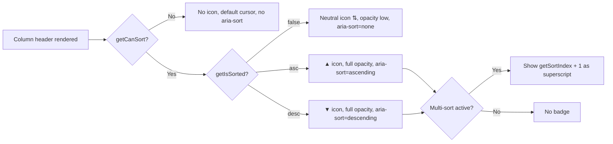

## Sort Direction Indicators

Sort direction indicators communicate the current sort state of a column to the user — which column is sorted, in which direction, and whether multi-sort is active. TanStack Table provides the state and helpers; rendering is entirely your responsibility.

---

### Core State Accessors

Every `header.column` exposes methods for reading sort state:

| Method | Return Type | Description |
|---|---|---|
| `column.getIsSorted()` | `false \| 'asc' \| 'desc'` | Current sort direction, or `false` if unsorted |
| `column.getSortIndex()` | `number` | Position in the multi-sort stack (0-based); `-1` if not sorted |
| `column.getCanSort()` | `boolean` | Whether the column is sortable at all |
| `column.getNextSortingOrder()` | `'asc' \| 'desc' \| false` | What the next toggle will produce |

These are the primary building blocks for any indicator implementation.

---

### Basic Indicator Pattern

```tsx
<th onClick={header.column.getToggleSortingHandler()}>
  {flexRender(header.column.columnDef.header, header.getContext())}
  {{
    asc:  ' ▲',
    desc: ' ▼',
  }[header.column.getIsSorted() as string] ?? ' ⇅'}
</th>
```

**Key Points:**
- `getIsSorted()` returns `false` when unsorted, which falls through to `?? ' ⇅'`
- The lookup object handles `'asc'` and `'desc'` explicitly
- The neutral `⇅` symbol communicates that the column is sortable but not currently active

---

### Indicator Patterns: Comparison

| Pattern | When to Use |
|---|---|
| Unicode symbols (`▲ ▼`) | Simple, no dependencies |
| SVG icons (inline) | Custom styling, pixel precision |
| Icon library components | Design system consistency |
| CSS classes only | Style-driven, framework-agnostic |
| ARIA attributes only | Accessibility-first, no visual change |

---

### Using CSS Classes

Attach classes based on sort state and let CSS handle all visual changes:

```tsx
<th
  className={[
    'sortable-header',
    header.column.getIsSorted() === 'asc'  ? 'sort-asc'  : '',
    header.column.getIsSorted() === 'desc' ? 'sort-desc' : '',
    !header.column.getIsSorted()           ? 'sort-none' : '',
  ].filter(Boolean).join(' ')}
  onClick={header.column.getToggleSortingHandler()}
>
  {flexRender(header.column.columnDef.header, header.getContext())}
</th>
```

```css
.sortable-header { cursor: pointer; user-select: none; }

.sortable-header::after { content: ' ⇅'; opacity: 0.3; }
.sort-asc::after        { content: ' ▲'; opacity: 1; }
.sort-desc::after       { content: ' ▼'; opacity: 1; }
```

---

### SVG Icon Indicator

Inline SVG gives you full control without an icon library dependency:

```tsx
function SortIcon({ direction }: { direction: false | 'asc' | 'desc' }) {
  return (
    <svg width="12" height="12" viewBox="0 0 12 12" aria-hidden="true">
      {/* Up arrow — active when asc */}
      <path
        d="M6 1 L10 6 L2 6 Z"
        fill={direction === 'asc' ? 'currentColor' : '#ccc'}
      />
      {/* Down arrow — active when desc */}
      <path
        d="M6 11 L2 6 L10 6 Z"
        fill={direction === 'desc' ? 'currentColor' : '#ccc'}
      />
    </svg>
  )
}

// Usage in header:
<th onClick={header.column.getToggleSortingHandler()}>
  {flexRender(header.column.columnDef.header, header.getContext())}
  {header.column.getCanSort() && (
    <SortIcon direction={header.column.getIsSorted()} />
  )}
</th>
```

---

### Multi-Sort Position Badge

When multi-sort is enabled, `getSortIndex()` tells you a column's rank in the sort stack. Displaying this helps users understand compound sort order.

```tsx
function SortBadge({ column }: { column: Column<any> }) {
  const sorted = column.getIsSorted()
  const index  = column.getSortIndex()

  if (!sorted) return null

  return (
    <span className="sort-badge">
      {sorted === 'asc' ? '▲' : '▼'}
      {index >= 0 && <sup>{index + 1}</sup>}
    </span>
  )
}
```

**Example output for a three-column multi-sort:**

| Column | Indicator |
|---|---|
| Last Name | ▲¹ |
| First Name | ▲² |
| Created At | ▼³ |

> [Inference] `getSortIndex()` returns `-1` when the column is not part of the active sort. Always guard against this before rendering a numeric badge. Behavior may vary.

---

### Indicating the Next Sort Action

`getNextSortingOrder()` returns what the next toggle will produce. Use this for tooltips or `title` attributes:

```tsx
const nextOrder = header.column.getNextSortingOrder()

const title = !header.column.getCanSort()
  ? undefined
  : nextOrder === 'asc'
    ? 'Sort ascending'
    : nextOrder === 'desc'
      ? 'Sort descending'
      : 'Clear sort'

<th
  title={title}
  onClick={header.column.getToggleSortingHandler()}
>
  {flexRender(header.column.columnDef.header, header.getContext())}
</th>
```

---

### Accessibility: ARIA Attributes

For screen reader compatibility, apply `aria-sort` to `<th>` elements. The `aria-sort` attribute accepts `"ascending"`, `"descending"`, `"none"`, or `"other"`.

```tsx
const ariaSort = (() => {
  const sorted = header.column.getIsSorted()
  if (sorted === 'asc')  return 'ascending'
  if (sorted === 'desc') return 'descending'
  if (header.column.getCanSort()) return 'none'
  return undefined
})()

<th
  aria-sort={ariaSort}
  onClick={header.column.getToggleSortingHandler()}
>
  {flexRender(header.column.columnDef.header, header.getContext())}
  <span aria-hidden="true">
    {header.column.getIsSorted() === 'asc'  ? ' ▲'
    : header.column.getIsSorted() === 'desc' ? ' ▼'
    : header.column.getCanSort()             ? ' ⇅'
    : ''}
  </span>
</th>
```

**Key Points:**
- `aria-hidden="true"` on the visual indicator prevents screen readers from announcing the symbol literally
- `aria-sort` on `<th>` is the semantically correct attribute — do not use `role` overrides
- Columns that cannot be sorted should not receive `aria-sort` at all (omit the attribute entirely rather than setting `"none"`)

---

### Hiding the Indicator When Not Sortable

`getCanSort()` reflects the combination of the global `enableSorting` table option and the per-column `enableSorting` column option. Use it to suppress cursor styles and icons on non-sortable columns:

```tsx
<th
  style={{ cursor: header.column.getCanSort() ? 'pointer' : 'default' }}
  onClick={header.column.getToggleSortingHandler()}
>
  {flexRender(header.column.columnDef.header, header.getContext())}
  {header.column.getCanSort() && (
    <SortIcon direction={header.column.getIsSorted()} />
  )}
</th>
```

---

### Complete Reusable Header Component

```tsx
import {
  Header,
  Column,
  flexRender,
} from '@tanstack/react-table'

function SortableHeader<TData>({ header }: { header: Header<TData, unknown> }) {
  const column = header.column
  const sorted = column.getIsSorted()
  const canSort = column.getCanSort()
  const sortIndex = column.getSortIndex()
  const nextOrder = column.getNextSortingOrder()

  const ariaSort =
    sorted === 'asc'  ? 'ascending'  :
    sorted === 'desc' ? 'descending' :
    canSort           ? 'none'       :
    undefined

  const title =
    !canSort          ? undefined :
    nextOrder === 'asc'  ? 'Sort ascending' :
    nextOrder === 'desc' ? 'Sort descending' :
    'Clear sort'

  return (
    <th
      aria-sort={ariaSort}
      title={title}
      style={{ cursor: canSort ? 'pointer' : 'default', userSelect: 'none' }}
      onClick={canSort ? column.getToggleSortingHandler() : undefined}
    >
      <span style={{ display: 'flex', alignItems: 'center', gap: '4px' }}>
        {flexRender(column.columnDef.header, header.getContext())}

        {canSort && (
          <span aria-hidden="true" style={{ fontSize: '0.75em', opacity: sorted ? 1 : 0.35 }}>
            {sorted === 'asc'  ? '▲' :
             sorted === 'desc' ? '▼' : '⇅'}
          </span>
        )}

        {canSort && sortIndex >= 0 && (
          <sup aria-hidden="true" style={{ fontSize: '0.65em' }}>
            {sortIndex + 1}
          </sup>
        )}
      </span>
    </th>
  )
}
```

**Example** usage in a header group:

```tsx
{table.getHeaderGroups().map(hg => (
  <tr key={hg.id}>
    {hg.headers.map(header => (
      <SortableHeader key={header.id} header={header} />
    ))}
  </tr>
))}
```

---

### Visual Summary of State Combinations



---

**Related Topics**

- Multi-sort configuration (`isMultiSortEvent`, `maxMultiSortColCount`)
- `sortDescFirst` and per-column initial direction
- Keyboard accessibility for sortable headers (`onKeyDown` handlers)
- Animating sort indicator transitions with CSS or Framer Motion
- Server-side sorting and manual sort state synchronization
- Persisting sort state to URL query parameters