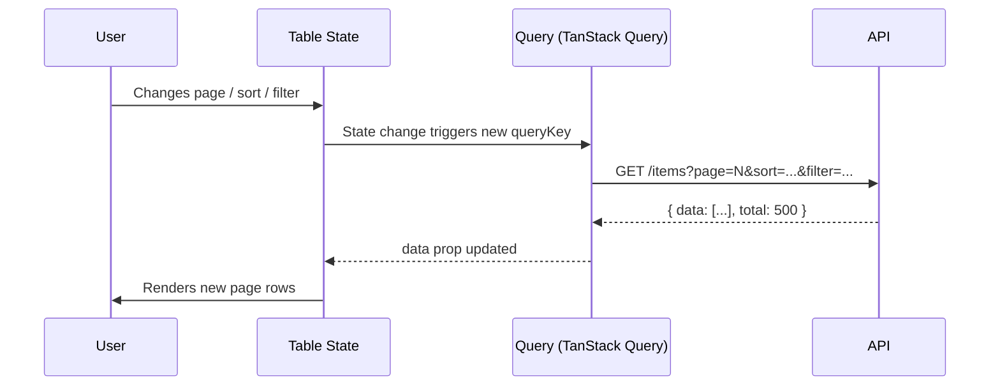

## TanStack Table — Pagination — Manual Server-Side Pagination

### Overview

Manual server-side pagination delegates all data slicing to an external source — typically an API. The table receives only the current page's rows, not the full dataset. TanStack Table manages pagination state and exposes it so the application can construct API requests, but it does not slice, filter, or sort the data itself.

This is the correct approach when datasets are too large to load into memory, or when the backend owns filtering, sorting, and pagination logic.

---

### Core Distinction from Client-Side Pagination

| Concern | Client-Side | Server-Side |
|---|---|---|
| Data in memory | Full dataset | Current page only |
| Row slicing | `getPaginationRowModel` | External API |
| `pageCount` source | Derived from row count | Supplied manually |
| Filter/sort pipeline | Table-internal | API query params |
| `data` prop length | All rows | `pageSize` rows (or fewer) |

---

### Setup

#### Disable the Pagination Row Model

Do **not** register `getPaginationRowModel` for server-side pagination. The table should render whatever rows are in `data` as-is.

```ts
import {
  useReactTable,
  getCoreRowModel,
} from '@tanstack/react-table'

const table = useReactTable({
  data,           // only current page's rows
  columns,
  getCoreRowModel: getCoreRowModel(),
  // getPaginationRowModel is intentionally omitted
  manualPagination: true,
  rowCount: totalRowCount, // total rows across all pages, from API
  state: { pagination },
  onPaginationChange: setPagination,
})
```

#### `manualPagination`

Setting `manualPagination: true` signals to TanStack Table that it should not attempt to derive page slices from the row model. [Inference] Without this flag, the table may apply client-side slicing on top of already-paginated data, producing incorrect results.

#### `rowCount`

`rowCount` supplies the total number of rows across all pages. TanStack Table uses this to compute `getPageCount()`:

```
pageCount = Math.ceil(rowCount / pageSize)
```

This value typically comes from the API response (e.g., a `total` or `count` field).

#### `pageCount` (alternative)

Instead of `rowCount`, you can supply `pageCount` directly if the API returns a total page count rather than a total row count:

```ts
const table = useReactTable({
  data,
  columns,
  getCoreRowModel: getCoreRowModel(),
  manualPagination: true,
  pageCount: apiResponse.totalPages,
  state: { pagination },
  onPaginationChange: setPagination,
})
```

[Inference] `pageCount` and `rowCount` serve the same purpose from the table's perspective. Supplying both when they conflict produces [Unverified] behavior — use one or the other based on what your API provides.

If neither is supplied, `getPageCount()` returns `-1`. [Inference] This is the table's convention for "unknown total pages" and can be used to render indeterminate pagination controls.

---

### Pagination State as API Parameters

The pagination state object drives the API request. On every state change, the application must fetch new data.

```ts
const [pagination, setPagination] = useState({
  pageIndex: 0,
  pageSize: 20,
})
```

#### Deriving API Parameters

Most APIs use one of two conventions:

**Page-index based (zero-based):**

```ts
const { pageIndex, pageSize } = pagination
// API call: GET /items?page=0&limit=20
```

**Offset based:**

```ts
const offset = pagination.pageIndex * pagination.pageSize
// API call: GET /items?offset=0&limit=20
```

**Page-number based (one-based):**

```ts
const pageNumber = pagination.pageIndex + 1
// API call: GET /items?page=1&per_page=20
```

The translation from TanStack Table's zero-based `pageIndex` to the API's expected format is the application's responsibility.

---

### Fetching Data on Pagination State Change

The standard pattern is to watch pagination state (and any other relevant state like sorting or filtering) and trigger a fetch whenever it changes.

#### With TanStack Query (`useQuery`)

[Inference] TanStack Query is the idiomatic companion for server-side table state. The combination is common enough that it warrants a full example.

```tsx
import { useReactTable, getCoreRowModel } from '@tanstack/react-table'
import { useQuery, keepPreviousData } from '@tanstack/react-query'
import { useState } from 'react'

type Item = { id: number; name: string; status: string }

async function fetchItems(pageIndex: number, pageSize: number) {
  const res = await fetch(
    `/api/items?page=${pageIndex}&limit=${pageSize}`
  )
  return res.json() as Promise<{ data: Item[]; total: number }>
}

export function ServerPaginatedTable() {
  const [pagination, setPagination] = useState({ pageIndex: 0, pageSize: 20 })

  const { data, isLoading, isPlaceholderData } = useQuery({
    queryKey: ['items', pagination],
    queryFn: () => fetchItems(pagination.pageIndex, pagination.pageSize),
    placeholderData: keepPreviousData,
  })

  const table = useReactTable({
    data: data?.data ?? [],
    columns,
    getCoreRowModel: getCoreRowModel(),
    manualPagination: true,
    rowCount: data?.total,
    state: { pagination },
    onPaginationChange: setPagination,
  })

  return (
    <div>
      {isLoading && <span>Loading...</span>}

      <table style={{ opacity: isPlaceholderData ? 0.6 : 1 }}>
        <thead>
          {table.getHeaderGroups().map(headerGroup => (
            <tr key={headerGroup.id}>
              {headerGroup.headers.map(header => (
                <th key={header.id}>
                  {flexRender(header.column.columnDef.header, header.getContext())}
                </th>
              ))}
            </tr>
          ))}
        </thead>
        <tbody>
          {table.getRowModel().rows.map(row => (
            <tr key={row.id}>
              {row.getVisibleCells().map(cell => (
                <td key={cell.id}>
                  {flexRender(cell.column.columnDef.cell, cell.getContext())}
                </td>
              ))}
            </tr>
          ))}
        </tbody>
      </table>

      <PaginationControls table={table} />
    </div>
  )
}
```

**Key points in this example:**

- `queryKey: ['items', pagination]` — pagination state is part of the query key, so changing the page triggers a new fetch automatically.
- `keepPreviousData` — retains the previous page's data while the next page loads, preventing a blank table flash.
- `data?.data ?? []` — safely defaults to an empty array before the first fetch resolves.
- `rowCount: data?.total` — passed from the API response; may be `undefined` on first render until data arrives.

---

### Pagination Controls for Server-Side Mode

The same pagination control component used for client-side pagination works here. `getCanPreviousPage()`, `getCanNextPage()`, `getPageCount()`, `nextPage()`, and `previousPage()` all function correctly when `rowCount` or `pageCount` is supplied.

```tsx
function PaginationControls({ table }) {
  const { pageIndex, pageSize } = table.getState().pagination

  return (
    <div style={{ display: 'flex', gap: '0.5rem', alignItems: 'center' }}>
      <button onClick={() => table.firstPage()} disabled={!table.getCanPreviousPage()}>{'<<'}</button>
      <button onClick={() => table.previousPage()} disabled={!table.getCanPreviousPage()}>{'<'}</button>
      <span>
        Page {pageIndex + 1} of{' '}
        {table.getPageCount() === -1 ? '?' : table.getPageCount()}
      </span>
      <button onClick={() => table.nextPage()} disabled={!table.getCanNextPage()}>{'>'}</button>
      <button onClick={() => table.lastPage()} disabled={!table.getCanNextPage()}>{'>>'}</button>
      <select
        value={pageSize}
        onChange={e => {
          table.setPageSize(Number(e.target.value))
        }}
      >
        {[10, 20, 50, 100].map(size => (
          <option key={size} value={size}>Show {size}</option>
        ))}
      </select>
    </div>
  )
}
```

When `pageCount` is `-1` (unknown total), `getCanNextPage()` returns `true` unconditionally. [Inference] In this case, the application must determine when to disable the next-page button, typically by checking whether the API returned fewer rows than `pageSize`.

---

### Indeterminate Page Count Pattern

Some APIs do not return a total row count — they indicate "more pages exist" via a boolean flag or by returning a full `pageSize` worth of rows.

```ts
const hasMore = (data?.data.length ?? 0) === pagination.pageSize

const table = useReactTable({
  data: data?.data ?? [],
  columns,
  getCoreRowModel: getCoreRowModel(),
  manualPagination: true,
  // pageCount deliberately omitted → returns -1
  state: { pagination },
  onPaginationChange: setPagination,
})
```

```tsx
<button
  onClick={() => table.nextPage()}
  disabled={!hasMore}
>
  {'>'}
</button>
```

[Inference] This heuristic (fewer rows than `pageSize` implies last page) is approximate. An API returning exactly `pageSize` rows on the last page would incorrectly enable the next-page button.

---

### Coordinating with Manual Sorting and Filtering

When the backend also owns sorting and filtering, those features must also be set to manual mode. The table then exposes their state for use as additional API parameters.

```ts
const [pagination, setPagination] = useState({ pageIndex: 0, pageSize: 20 })
const [sorting, setSorting] = useState([])
const [columnFilters, setColumnFilters] = useState([])

const table = useReactTable({
  data: data?.data ?? [],
  columns,
  getCoreRowModel: getCoreRowModel(),
  manualPagination: true,
  manualSorting: true,
  manualFiltering: true,
  rowCount: data?.total,
  state: { pagination, sorting, columnFilters },
  onPaginationChange: setPagination,
  onSortingChange: updater => {
    setSorting(updater)
    setPagination(prev => ({ ...prev, pageIndex: 0 }))
  },
  onColumnFiltersChange: updater => {
    setColumnFilters(updater)
    setPagination(prev => ({ ...prev, pageIndex: 0 }))
  },
})
```

**Key point:** Sorting or filtering changes should reset `pageIndex` to `0`. Otherwise the user may be on page 5 of results that no longer have 5 pages after a new filter is applied.

The API query is then constructed from all three state values:

```ts
const queryKey = ['items', pagination, sorting, columnFilters]

const queryFn = () => fetch(`/api/items?${buildParams(pagination, sorting, columnFilters)}`)
```

---

### State and Data Flow



---

### Loading and Transition States

During a page transition, the previous data can remain visible while the new page loads. This prevents layout shifts and blank states.

| Approach | Mechanism | Effect |
|---|---|---|
| `keepPreviousData` (TanStack Query) | Retains stale data during refetch | Table shows previous rows, dimmed |
| Local loading flag | `isLoading` or `isFetching` from `useQuery` | Show spinner overlay |
| Optimistic page advance | Advance `pageIndex` before fetch resolves | Immediate UI response, may flash empty |

[Inference] The `keepPreviousData` / `placeholderData: keepPreviousData` approach is the most common pattern for paginated tables because it eliminates content flicker without requiring skeleton loaders.

---

### Common Pitfalls

**Registering `getPaginationRowModel` alongside `manualPagination: true`**
[Inference] This causes the table to apply client-side slicing on top of already-paginated data, typically rendering only a fraction of the current page's rows or an empty set.

**Not including pagination state in the query key**
If `queryKey` does not include `pagination`, changing the page does not trigger a new fetch. The table advances its internal state but continues to display the original page's data.

**Forgetting to reset `pageIndex` on sort or filter changes**
Sort and filter changes invalidate the current page position. Always reset to page 0 when either changes.

**Assuming `rowCount` is always available**
On initial render before the first API response, `rowCount` is `undefined`. `getPageCount()` returns `-1` until data arrives. Pagination controls must handle this gracefully.

**Using one-based page numbers from the API directly as `pageIndex`**
TanStack Table's `pageIndex` is zero-based. A `pageIndex` of `1` means the second page, not the first.

**Not handling the case where API returns fewer rows than `pageSize`**
On the last page, the API typically returns a partial set. Rendering logic should not assume `data.length === pageSize`.

---

**Related Topics**

- Manual Server-Side Sorting — exposing `sorting` state as API query parameters
- Manual Server-Side Filtering — exposing `columnFilters` and `globalFilter` as API query parameters
- TanStack Query Integration — `useQuery`, `keepPreviousData`, and query key design for table state
- URL-Synchronized Pagination — persisting `pageIndex` and `pageSize` in query parameters
- Infinite Scrolling vs Pagination — comparing cursor-based infinite load with discrete pages
- Row Selection Across Pages — maintaining `rowSelection` state across server-paginated pages
- Optimistic Pagination — advancing page state before the fetch resolves