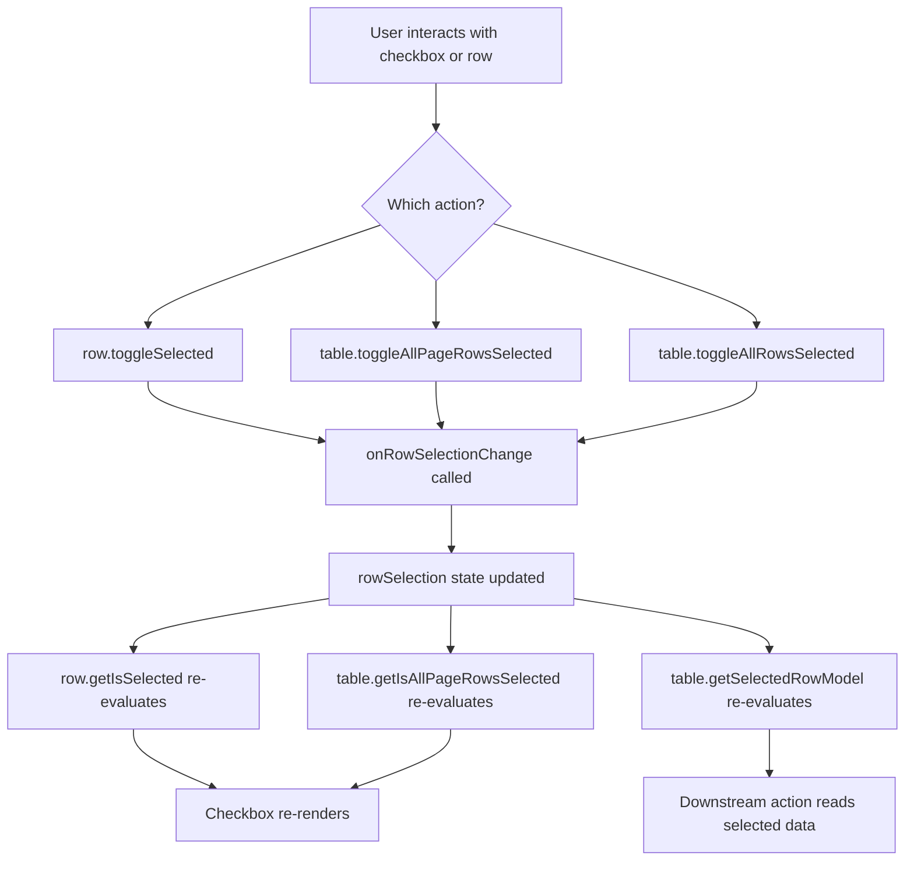

## TanStack Table — Row Selection — Single and Multi-Row Selection

### Overview

Row selection in TanStack Table is a controlled state feature that tracks which rows are currently selected. It supports both single-selection (at most one row selected at a time) and multi-selection (any number of rows selected simultaneously). The table does not prescribe UI — it provides state, toggle methods, and derived helpers. Checkboxes, row click handlers, and selection indicators are all implemented in application code.

---

### Row Selection State

Selection state is a plain object where each key is a row ID and each value is `true`:

```ts
type RowSelectionState = Record<string, boolean>

// Example: rows with IDs "3" and "7" are selected
const rowSelection = { "3": true, "7": true }
```

Only `true` values are meaningful. A key mapped to `false` is equivalent to the key being absent. [Inference] TanStack Table may or may not prune `false` entries depending on how state is updated — treat the presence of a `false` value as unselected.

Row IDs default to the row's index as a string (`"0"`, `"1"`, `"2"`, ...). A custom `getRowId` function can be supplied to use a stable identifier from the data instead.

---

### Basic Setup

```ts
import {
  useReactTable,
  getCoreRowModel,
} from '@tanstack/react-table'
import { useState } from 'react'

const [rowSelection, setRowSelection] = useState<RowSelectionState>({})

const table = useReactTable({
  data,
  columns,
  state: { rowSelection },
  onRowSelectionChange: setRowSelection,
  getCoreRowModel: getCoreRowModel(),
})
```

Row selection does not require any additional row model beyond `getCoreRowModel`. It is purely a state-tracking feature.

---

### Custom Row IDs

By default, row IDs are the row's positional index as a string. This is fragile when rows are reordered, filtered, or paginated — the same index may refer to different data across renders.

Supply `getRowId` to derive a stable ID from the row's data:

```ts
const table = useReactTable({
  data,
  columns,
  getRowId: row => row.id, // use a stable field from the data
  state: { rowSelection },
  onRowSelectionChange: setRowSelection,
  getCoreRowModel: getCoreRowModel(),
})
```

**Key Points:**
- `getRowId` receives the raw data object and should return a unique string.
- Stable IDs are important for persisting selection across filter, sort, and pagination state changes.
- [Inference] Without `getRowId`, selection state built on index-based IDs will silently point to wrong rows after the data order changes.

---

### Enabling and Disabling Selection Per Row

#### `enableRowSelection`

Controls whether row selection is enabled globally or per row. Accepts a boolean or a function of `(row) => boolean`:

```ts
// Disable selection entirely
const table = useReactTable({
  enableRowSelection: false,
  // ...
})

// Enable selection only for rows meeting a condition
const table = useReactTable({
  enableRowSelection: row => row.original.status !== 'locked',
  // ...
})
```

When a row has selection disabled via `enableRowSelection`, `row.getCanSelect()` returns `false` and its checkbox should be rendered as disabled.

#### `enableMultiRowSelection`

Controls whether multiple rows can be selected at once. Accepts a boolean or a per-row function:

```ts
// Single-selection mode globally
const table = useReactTable({
  enableMultiRowSelection: false,
  // ...
})
```

When `enableMultiRowSelection` is `false`, selecting a new row deselects any previously selected row. [Inference] This is enforced by TanStack Table internally when toggling via the provided row methods — if selection state is set directly via `setRowSelection`, this constraint is not enforced automatically.

#### `enableSubRowSelection`

Controls whether selecting a parent row also selects its sub-rows (in grouped or expanded row setups). Accepts a boolean or a per-row function. Defaults to `true`.

```ts
const table = useReactTable({
  enableSubRowSelection: false,
  // ...
})
```

---

### Row Selection API

#### Row-Level Methods

| Method | Returns | Description |
|---|---|---|
| `row.getIsSelected()` | `boolean` | Whether this row is currently selected |
| `row.getIsSomeSelected()` | `boolean` | Whether some (not all) sub-rows are selected |
| `row.getIsAllSubRowsSelected()` | `boolean` | Whether all sub-rows are selected |
| `row.getCanSelect()` | `boolean` | Whether this row is selectable |
| `row.getCanMultiSelect()` | `boolean` | Whether multi-select is enabled for this row |
| `row.toggleSelected(value?)` | `void` | Toggles or sets selection state for this row |
| `row.getToggleSelectedHandler()` | `(e) => void` | Returns an event handler suitable for `onChange` on a checkbox |

#### Table-Level Methods

| Method | Returns | Description |
|---|---|---|
| `table.getIsAllRowsSelected()` | `boolean` | Whether all selectable rows are selected |
| `table.getIsAllPageRowsSelected()` | `boolean` | Whether all selectable rows on the current page are selected |
| `table.getIsSomeRowsSelected()` | `boolean` | Whether some (but not all) rows are selected |
| `table.getIsSomePageRowsSelected()` | `boolean` | Whether some rows on the current page are selected |
| `table.toggleAllRowsSelected(value?)` | `void` | Selects or deselects all rows |
| `table.toggleAllPageRowsSelected(value?)` | `void` | Selects or deselects all rows on the current page |
| `table.getToggleAllRowsSelectedHandler()` | `(e) => void` | Event handler for a select-all checkbox |
| `table.getToggleAllPageRowsSelectedHandler()` | `(e) => void` | Event handler for a select-all-on-page checkbox |
| `table.getSelectedRowModel()` | `RowModel` | Row model containing only selected rows |
| `table.getFilteredSelectedRowModel()` | `RowModel` | Selected rows intersected with filtered rows |

---

### Checkbox Column Definition

The standard approach is to define a display column for checkboxes. Display columns have no accessor — they exist solely for UI.

```tsx
import { ColumnDef } from '@tanstack/react-table'

const selectionColumn: ColumnDef<Person> = {
  id: 'select',
  header: ({ table }) => (
    <input
      type="checkbox"
      checked={table.getIsAllPageRowsSelected()}
      ref={el => {
        if (el) el.indeterminate = table.getIsSomePageRowsSelected()
      }}
      onChange={table.getToggleAllPageRowsSelectedHandler()}
      aria-label="Select all on page"
    />
  ),
  cell: ({ row }) => (
    <input
      type="checkbox"
      checked={row.getIsSelected()}
      disabled={!row.getCanSelect()}
      onChange={row.getToggleSelectedHandler()}
      aria-label={`Select row ${row.id}`}
    />
  ),
}
```

**Key Points:**
- The header checkbox uses `getIsAllPageRowsSelected()` for its `checked` state, scoped to the current page.
- The `indeterminate` state is set via a `ref` callback — it cannot be set as a React prop since `indeterminate` is not a standard HTML attribute managed by React's reconciler.
- `getToggleAllPageRowsSelectedHandler()` and `getToggleSelectedHandler()` return pre-bound event handlers compatible with `<input onChange>`.

---

### Single-Selection Mode

For single-selection, set `enableMultiRowSelection: false`. Only one row may be active at a time. The header select-all checkbox is typically omitted in this mode.

```ts
const table = useReactTable({
  data,
  columns,
  state: { rowSelection },
  onRowSelectionChange: setRowSelection,
  enableMultiRowSelection: false,
  getCoreRowModel: getCoreRowModel(),
})
```

A common alternative to a checkbox in single-selection mode is making the entire row clickable:

```tsx
<tr
  onClick={row.getToggleSelectedHandler()}
  style={{
    cursor: 'pointer',
    background: row.getIsSelected() ? '#e0f0ff' : undefined,
  }}
>
  {row.getVisibleCells().map(cell => (
    <td key={cell.id}>
      {flexRender(cell.column.columnDef.cell, cell.getContext())}
    </td>
  ))}
</tr>
```

---

### Reading Selected Rows

#### From `rowSelection` State

The raw state object maps row IDs to `true`. To retrieve the actual data of selected rows:

```ts
const selectedRowIds = Object.keys(rowSelection)
// ["3", "7"]
```

This requires correlating IDs back to data manually, which is error-prone without stable IDs.

#### From `getSelectedRowModel()`

The more reliable approach — returns a full row model of selected rows with access to `row.original`:

```ts
const selectedRows = table.getSelectedRowModel().rows
const selectedData = selectedRows.map(row => row.original)
```

#### From `getFilteredSelectedRowModel()`

Returns selected rows intersected with the current filter result — rows that are selected but filtered out of view are excluded:

```ts
const visibleSelectedRows = table.getFilteredSelectedRowModel().rows
```

[Inference] `getFilteredSelectedRowModel()` requires `getFilteredRowModel` to be registered. Without it, behavior may fall back to `getSelectedRowModel()` or produce unexpected results — verify against your version.

---

### Select All Behavior: All Rows vs. Page Rows

TanStack Table provides two variants of select-all:

| Method | Scope |
|---|---|
| `toggleAllRowsSelected` | All rows in the entire filtered dataset |
| `toggleAllPageRowsSelected` | Only rows on the current page |

The choice depends on UX intent:

- **Page-scoped select-all** is the safer default for paginated tables — users see exactly which rows they are selecting.
- **Global select-all** is appropriate when the user explicitly wants to act on the entire dataset, but requires clear UI communication since selected rows may not be visible.

[Inference] For server-side paginated tables, `toggleAllRowsSelected` only selects rows present in the current `data` prop — not rows on other pages that have not been fetched. A true "select all across all pages" pattern requires application-level logic outside TanStack Table's selection state.

---

### Selection Across Pages

When using client-side pagination, `rowSelection` state persists across page navigation by default — selecting rows on page 1, navigating to page 2, and returning to page 1 will show those rows still selected, provided stable row IDs are used via `getRowId`.

With index-based IDs (the default), row IDs shift when the dataset is filtered or sorted, causing previously selected rows to appear deselected or to silently point to different rows.

**Always use `getRowId` with a stable data field when selection must persist across pagination.**

---

### State Flow Diagram



---

### Controlled Selection with External Actions

Selection state can be set programmatically — for example, to select all rows matching a condition, or to clear selection after a bulk action:

```ts
// Select all rows where status is 'active'
const selectActive = () => {
  const next: RowSelectionState = {}
  table.getCoreRowModel().rows.forEach(row => {
    if (row.original.status === 'active') {
      next[row.id] = true
    }
  })
  setRowSelection(next)
}

// Clear all selection
const clearSelection = () => setRowSelection({})
```

---

### Practical Example: Bulk Action Bar

A common pattern is showing a contextual action bar when rows are selected:

```tsx
function BulkActionBar({ table }) {
  const selectedRows = table.getFilteredSelectedRowModel().rows

  if (selectedRows.length === 0) return null

  return (
    <div style={{ padding: '0.5rem', background: '#f0f4ff', borderRadius: 4 }}>
      <span>{selectedRows.length} row{selectedRows.length > 1 ? 's' : ''} selected</span>
      <button
        onClick={() => {
          const ids = selectedRows.map(r => r.original.id)
          handleBulkDelete(ids)
          table.resetRowSelection()
        }}
      >
        Delete selected
      </button>
      <button onClick={() => table.resetRowSelection()}>
        Clear selection
      </button>
    </div>
  )
}
```

`table.resetRowSelection()` clears the entire `rowSelection` state back to `{}`.

---

### Common Pitfalls

**Using default index-based row IDs with pagination or filtering**
Row indices shift when data is filtered, sorted, or paginated. Always supply `getRowId` with a stable field (e.g., a database ID) when selection must be meaningful or persistent.

**Setting `indeterminate` as a JSX prop**
React does not support `indeterminate` as a declarative prop on `<input>`. It must be set imperatively via a `ref` callback.

**Expecting `toggleAllRowsSelected` to select unloaded rows in server-side mode**
In server-side pagination, only the current page's data is in memory. Select-all only covers the loaded rows.

**Reading selected data from `rowSelection` keys without `getRowId`**
Index-based row IDs are not stable identifiers for the underlying data. Use `getSelectedRowModel().rows.map(r => r.original)` to safely access selected data objects.

**Not disabling checkboxes for non-selectable rows**
When `enableRowSelection` is a function that returns `false` for some rows, their checkboxes must be disabled in the cell renderer. `row.getCanSelect()` exposes this value.

**Calling `row.toggleSelected()` directly to implement single-selection**
In single-selection mode (`enableMultiRowSelection: false`), use `row.toggleSelected()` via the provided handler — TanStack Table manages deselecting other rows automatically. Setting `rowSelection` state directly bypasses this logic.

---

**Related Topics**

- Row Selection Across Pages — maintaining selection state with pagination, including server-side
- Sub-Row and Grouped Row Selection — `enableSubRowSelection` and selection propagation in expanded rows
- Row Selection with Sorting and Filtering — how `getFilteredSelectedRowModel` interacts with active filters
- Select All Across All Pages — application-level patterns for global selection in server-side tables
- Row Selection Persistence — serializing and restoring `rowSelection` state
- Checkbox Column Patterns — accessible and composable display column implementations
- Bulk Actions Pattern — reading selected rows and triggering operations on `row.original` data