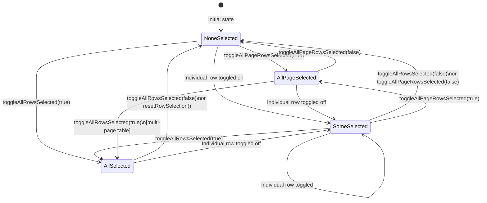

## TanStack Table — Row Selection — Select All Rows

### Overview

"Select all" in TanStack Table comes in two scopes: selecting all rows on the current page, and selecting all rows across the entire filtered dataset. TanStack Table provides dedicated methods for both. The distinction matters most in paginated tables, where "all rows" and "all visible rows" are not the same thing. For server-side paginated tables, a third pattern — selecting all rows across all pages including unloaded ones — requires application-level logic outside TanStack Table's selection state.

---

### Two Scopes of Select All

| Scope | Method | Handler | State Check |
|---|---|---|---|
| All rows (full dataset) | `table.toggleAllRowsSelected(value?)` | `table.getToggleAllRowsSelectedHandler()` | `table.getIsAllRowsSelected()` |
| Current page only | `table.toggleAllPageRowsSelected(value?)` | `table.getToggleAllPageRowsSelectedHandler()` | `table.getIsAllPageRowsSelected()` |

Both accept an optional boolean `value` argument. If `true`, all rows are selected. If `false`, all are deselected. If omitted, the current state is toggled.

---

### Indeterminate State

Both scopes have a corresponding "some selected" check, used to render the checkbox in an indeterminate state:

| Scope | Indeterminate Check |
|---|---|
| All rows | `table.getIsSomeRowsSelected()` |
| Current page | `table.getIsSomePageRowsSelected()` |

Indeterminate state on a checkbox communicates that a partial selection exists — neither all nor none are selected. It is set imperatively via a `ref` callback, as React does not support `indeterminate` as a declarative JSX prop.

---

### Select All — Full Dataset

Selects every selectable row in the filtered row model, regardless of pagination. In a client-side paginated table, this includes rows on all pages.

```tsx
<input
  type="checkbox"
  checked={table.getIsAllRowsSelected()}
  ref={el => {
    if (el) el.indeterminate = table.getIsSomeRowsSelected()
  }}
  onChange={table.getToggleAllRowsSelectedHandler()}
  aria-label="Select all rows"
/>
```

**Behavior of `getIsAllRowsSelected()`:**
Returns `true` only when every row that `getCanSelect()` returns `true` for is currently selected. Rows with selection disabled are excluded from the count.

---

### Select All — Current Page Only

Selects only the rows visible on the current page. Rows on other pages are unaffected.

```tsx
<input
  type="checkbox"
  checked={table.getIsAllPageRowsSelected()}
  ref={el => {
    if (el) el.indeterminate = table.getIsSomePageRowsSelected()
  }}
  onChange={table.getToggleAllPageRowsSelectedHandler()}
  aria-label="Select all rows on this page"
/>
```

**When to prefer page-scoped select all:**
- The user should only act on what they can see.
- The table is paginated and cross-page selection would be surprising.
- Rows are loaded server-side — unloaded rows cannot meaningfully be selected.

**When to prefer full-dataset select all:**
- All data is client-side and the user needs to act on the entire filtered set.
- The table is unpaginated (all rows visible).

---

### Combining Both: Tiered Select All

A common pattern used in applications like Gmail presents a page-scoped checkbox by default, with an additional prompt to extend selection to all rows:

```tsx
function TieredSelectAll({ table }) {
  const isAllPageSelected = table.getIsAllPageRowsSelected()
  const isAllSelected = table.getIsAllRowsSelected()
  const isSomePage = table.getIsSomePageRowsSelected()
  const totalFiltered = table.getFilteredRowModel().rows.length
  const pageCount = table.getPaginationRowModel().rows.length

  return (
    <div>
      {/* Page-scoped checkbox in the column header */}
      <input
        type="checkbox"
        checked={isAllPageSelected}
        ref={el => {
          if (el) el.indeterminate = isSomePage
        }}
        onChange={table.getToggleAllPageRowsSelectedHandler()}
        aria-label="Select all on page"
      />

      {/* Prompt to extend to all rows, shown after page is fully selected */}
      {isAllPageSelected && !isAllSelected && (
        <div>
          <span>
            {pageCount} rows on this page are selected.
          </span>
          <button onClick={() => table.toggleAllRowsSelected(true)}>
            Select all {totalFiltered} rows
          </button>
        </div>
      )}

      {/* Confirmation and clear option when all rows are selected */}
      {isAllSelected && (
        <div>
          <span>All {totalFiltered} rows are selected.</span>
          <button onClick={() => table.toggleAllRowsSelected(false)}>
            Clear selection
          </button>
        </div>
      )}
    </div>
  )
}
```

---

### Interaction with `enableRowSelection`

When `enableRowSelection` is a function that disables selection for some rows, those rows are excluded from all select-all calculations.

```ts
const table = useReactTable({
  enableRowSelection: row => row.original.status !== 'locked',
  // ...
})
```

- `getIsAllRowsSelected()` returns `true` when all *selectable* rows are selected — locked rows are not counted.
- `toggleAllRowsSelected(true)` only selects rows where `getCanSelect()` is `true`.
- [Inference] The total row count used internally excludes non-selectable rows. A table with 100 rows where 10 are locked will report "all selected" when 90 rows are selected.

---

### Interaction with Filtering

Select-all methods operate on the filtered row model, not the core row model. Rows excluded by active filters are not included in select-all operations.

```ts
// This reflects filtered rows only
table.getIsAllRowsSelected()
table.toggleAllRowsSelected()
```

[Inference] If a filter is added after select-all, the newly hidden rows remain in `rowSelection` state — they are selected but not visible. `getFilteredSelectedRowModel()` excludes them from the selection model used for most downstream actions. Whether the hidden-but-selected rows should be deselected on filter change is an application-level decision.

---

### Interaction with Pagination

| Table Mode | `toggleAllRowsSelected` behavior | `toggleAllPageRowsSelected` behavior |
|---|---|---|
| No pagination | Selects all filtered rows | Selects all filtered rows (same) |
| Client-side pagination | Selects all filtered rows across all pages | Selects only current page rows |
| Server-side pagination | Selects only loaded rows in `data` prop | Selects only current page rows (same as loaded rows) |

For server-side paginated tables, `toggleAllRowsSelected` does not — and cannot — select rows that have not been fetched. Only the rows present in the `data` prop are known to the table.

---

### Select All Across All Pages (Server-Side)

TanStack Table has no built-in mechanism for selecting rows that are not loaded. This pattern requires application-level state separate from `rowSelection`.

A common approach is to maintain a boolean flag indicating "all rows selected" alongside the per-row `rowSelection` state:

```tsx
const [rowSelection, setRowSelection] = useState<RowSelectionState>({})
const [allPagesSelected, setAllPagesSelected] = useState(false)

// When submitting a bulk action:
const handleBulkAction = () => {
  if (allPagesSelected) {
    // Send a request to the API with the current filters,
    // indicating "apply to all matching rows"
    bulkAction({ selectAll: true, filters: currentFilters })
  } else {
    const ids = table.getSelectedRowModel().rows.map(r => r.original.id)
    bulkAction({ ids })
  }
}
```

```tsx
{/* After selecting all page rows, prompt to extend to all pages */}
{table.getIsAllPageRowsSelected() && !allPagesSelected && (
  <div>
    <span>{data?.total} total rows match the current filters.</span>
    <button onClick={() => setAllPagesSelected(true)}>
      Select all {data?.total} rows
    </button>
  </div>
)}

{allPagesSelected && (
  <div>
    <span>All {data?.total} rows are selected.</span>
    <button onClick={() => {
      setAllPagesSelected(false)
      setRowSelection({})
    }}>
      Clear selection
    </button>
  </div>
)}
```

[Inference] This pattern delegates the actual "all rows" operation to the API. The client never holds all row IDs — it signals intent via a `selectAll` flag and the current filter parameters.

---

### `resetRowSelection`

Clears all row selection state, equivalent to setting `rowSelection` to `{}`:

```ts
table.resetRowSelection()        // resets to {}
table.resetRowSelection(false)   // same — resets to default empty state
```

This is the canonical way to clear selection after a bulk action completes.

---

### Select All State Machine



---

### Checkbox `indeterminate` Reference Pattern

Because `indeterminate` cannot be set declaratively in React, a `ref` callback or `useRef` must be used. Both approaches are valid:

#### Inline `ref` callback (shown in examples above)

```tsx
ref={el => { if (el) el.indeterminate = table.getIsSomeRowsSelected() }}
```

#### `useRef` with `useEffect`

```tsx
const checkboxRef = useRef<HTMLInputElement>(null)

useEffect(() => {
  if (checkboxRef.current) {
    checkboxRef.current.indeterminate = table.getIsSomeRowsSelected()
  }
}, [table.getIsSomeRowsSelected()])

<input
  type="checkbox"
  ref={checkboxRef}
  checked={table.getIsAllRowsSelected()}
  onChange={table.getToggleAllRowsSelectedHandler()}
/>
```

[Inference] The inline `ref` callback approach is more concise and does not require a `useEffect`. The `useRef` approach may be preferable in components where the checkbox is conditionally rendered or when the `indeterminate` value is derived from complex logic.

---

### Common Pitfalls

**Using `getIsAllRowsSelected()` in a paginated table as a page-level check**
`getIsAllRowsSelected()` checks the full filtered dataset, not the current page. In a paginated table it will return `false` whenever any unviewed page has unselected rows. Use `getIsAllPageRowsSelected()` for page-header checkboxes.

**Not accounting for non-selectable rows in count displays**
If some rows have selection disabled, displaying "X of Y selected" using raw `data.length` as Y is misleading. Use the count of selectable rows as the denominator.

**Assuming `toggleAllRowsSelected` covers server-side unloaded rows**
Only rows present in `data` are selectable. For server-side pagination, "select all" only covers the current page unless a separate application-level mechanism is implemented.

**Forgetting to reset `allPagesSelected` when filters change**
In the tiered server-side pattern, changing filters invalidates the "all rows selected" intent. Reset `allPagesSelected` to `false` whenever filter or sort state changes.

**Setting `indeterminate` as a JSX prop**
`<input indeterminate={true} />` has no effect in React. Always use `ref`.

**Using `getIsSomeRowsSelected()` for the page-scoped checkbox**
The page-scoped checkbox should use `getIsSomePageRowsSelected()`. Using the global variant means the checkbox appears indeterminate whenever any row on any page is selected, even if the current page is fully selected.

---

**Related Topics**

- Single and Multi-Row Selection — `rowSelection` state, `getToggleSelectedHandler`, and per-row checkboxes
- Row Selection Across Pages — stable row IDs and selection persistence across pagination
- Select All in Server-Side Tables — API-delegated bulk selection patterns
- Row Selection with Filtering — behavior of select-all when filters are active
- Sub-Row and Grouped Row Selection — `enableSubRowSelection` and hierarchical selection propagation
- Bulk Actions Pattern — reading `getSelectedRowModel()` and triggering operations post-selection
- `resetRowSelection` and Post-Action Cleanup — clearing state after bulk operations complete