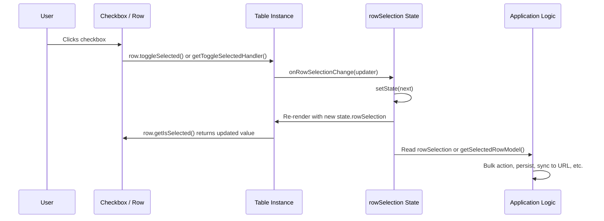

## TanStack Table — Row Selection — Controlled Selection State

### Overview

Controlled selection state means the application owns `rowSelection` — it lives in external state (e.g., React `useState`), is passed into the table via `state.rowSelection`, and is updated via `onRowSelectionChange`. The table never mutates selection state directly; it calls the provided callback and re-renders with whatever value the application supplies back.

This mirrors React's controlled component pattern and is the correct approach whenever selection state must be read, persisted, synchronized, or programmatically modified outside of user checkbox interactions.

---

### Controlled vs Uncontrolled

| Aspect | Uncontrolled | Controlled |
|---|---|---|
| State owner | Table instance (internal) | Application (`useState` or equivalent) |
| Initial value | `initialState.rowSelection` | `useState` initial value |
| Read from outside | Not directly accessible | Available as plain React state |
| Programmatic mutation | Via table methods only | Direct `setState` call |
| Persistence | Lost on unmount | Survives as long as state does |
| `onRowSelectionChange` | Optional | Required for updates to apply |

[Inference] In practice, most non-trivial tables use controlled selection state. Uncontrolled selection is primarily suitable for prototyping or isolated UI components where selection has no external effects.

---

### Minimal Controlled Setup

```ts
import {
  useReactTable,
  getCoreRowModel,
  type RowSelectionState,
} from '@tanstack/react-table'
import { useState } from 'react'

const [rowSelection, setRowSelection] = useState<RowSelectionState>({})

const table = useReactTable({
  data,
  columns,
  state: {
    rowSelection,
  },
  onRowSelectionChange: setRowSelection,
  getCoreRowModel: getCoreRowModel(),
})
```

The three required pieces for controlled selection:

| Piece | Purpose |
|---|---|
| `state.rowSelection` | Passes current selection into the table |
| `onRowSelectionChange` | Receives updates from the table |
| External state variable | Holds the current value between renders |

---

### `onRowSelectionChange` Updater Pattern

`onRowSelectionChange` follows TanStack Table's standard updater convention. The callback receives either a new state value directly or a functional updater — a function that takes the previous state and returns the next state.

```ts
onRowSelectionChange: updater => {
  setRowSelection(prev =>
    typeof updater === 'function' ? updater(prev) : updater
  )
}
```

When passing `setRowSelection` directly from `useState`, React's `setState` already accepts both a value and a functional updater, so this is handled automatically:

```ts
onRowSelectionChange: setRowSelection // works directly
```

The explicit functional form is only needed when intercepting the update to apply additional logic before committing it to state.

---

### Intercepting State Updates

Wrapping `onRowSelectionChange` allows side effects or transformations to be applied whenever selection changes.

#### Enforcing a Maximum Selection Count

```ts
const MAX_SELECTION = 5

onRowSelectionChange: updater => {
  setRowSelection(prev => {
    const next = typeof updater === 'function' ? updater(prev) : updater
    const selectedCount = Object.values(next).filter(Boolean).length
    if (selectedCount > MAX_SELECTION) return prev // reject the update
    return next
  })
}
```

[Inference] Rejecting an update by returning `prev` will cause the table to re-render with the unchanged state. The UI (e.g., a checkbox) may flash to checked momentarily before snapping back, depending on React's render timing. This is generally acceptable but may require additional UI feedback to explain why selection was rejected.

#### Resetting `pageIndex` on Selection Change

Uncommon but occasionally needed — for example, when a selection change triggers a data refetch that should start from page 0:

```ts
onRowSelectionChange: updater => {
  setRowSelection(prev =>
    typeof updater === 'function' ? updater(prev) : updater
  )
  setPagination(p => ({ ...p, pageIndex: 0 }))
}
```

#### Logging or Telemetry

```ts
onRowSelectionChange: updater => {
  const next = typeof updater === 'function' ? updater(rowSelection) : updater
  analytics.track('row_selection_changed', { count: Object.keys(next).length })
  setRowSelection(next)
}
```

---

### Programmatic Selection

Because selection state is plain external state, it can be set directly without going through table methods.

#### Select Specific Rows by ID

```ts
// Select rows with IDs "42" and "99"
setRowSelection({ "42": true, "99": true })
```

#### Select Rows Matching a Condition

```ts
const selectWhere = (predicate: (row: MyData) => boolean) => {
  const next: RowSelectionState = {}
  table.getCoreRowModel().rows.forEach(row => {
    if (predicate(row.original)) {
      next[row.id] = true
    }
  })
  setRowSelection(next)
}

// Usage
selectWhere(row => row.status === 'pending')
```

#### Merge Into Existing Selection

```ts
const addToSelection = (ids: string[]) => {
  setRowSelection(prev => {
    const next = { ...prev }
    ids.forEach(id => { next[id] = true })
    return next
  })
}
```

#### Remove Specific Rows from Selection

```ts
const removeFromSelection = (ids: string[]) => {
  setRowSelection(prev => {
    const next = { ...prev }
    ids.forEach(id => { delete next[id] })
    return next
  })
}
```

#### Clear All Selection

```ts
setRowSelection({})
// or equivalently:
table.resetRowSelection()
```

---

### Coordinating Selection with Other State

#### Clearing Selection on Filter Change

When filters change, selected rows may become hidden or irrelevant. A common pattern clears selection on filter state change:

```ts
onColumnFiltersChange: updater => {
  setColumnFilters(updater)
  setRowSelection({})
}
```

Whether to clear or preserve selection on filter change is a UX decision. Preserving allows "select across filters" workflows; clearing prevents confusion over hidden selected rows.

#### Clearing Selection After a Bulk Action

```ts
const handleBulkDelete = async () => {
  const ids = table.getSelectedRowModel().rows.map(r => r.original.id)
  await deleteRows(ids)
  setRowSelection({}) // clear after action completes
}
```

#### Synchronizing Selection with URL State

Selection can be encoded in a URL query parameter for shareable or bookmarkable selections:

```ts
// Read from URL on mount
const [rowSelection, setRowSelection] = useState<RowSelectionState>(() => {
  const param = new URLSearchParams(window.location.search).get('selected')
  if (!param) return {}
  return Object.fromEntries(param.split(',').map(id => [id, true]))
})

// Write to URL on change
useEffect(() => {
  const ids = Object.keys(rowSelection).join(',')
  const url = new URL(window.location.href)
  if (ids) {
    url.searchParams.set('selected', ids)
  } else {
    url.searchParams.delete('selected')
  }
  window.history.replaceState(null, '', url.toString())
}, [rowSelection])
```

[Inference] URL length limits apply. Encoding large numbers of row IDs in a URL parameter may exceed browser or server limits. This pattern is best suited for small, stable selections.

---

### Deriving Values from Controlled State

Because `rowSelection` is plain state, derived values can be computed directly in the component without going through the table API:

```ts
const selectedCount = Object.values(rowSelection).filter(Boolean).length
const hasSelection = selectedCount > 0
const selectedIds = Object.keys(rowSelection)
```

For accessing the actual data objects of selected rows, use the table API:

```ts
const selectedRows = table.getSelectedRowModel().rows
const selectedData = selectedRows.map(r => r.original)
```

Both approaches are valid. Direct state inspection is cheaper for simple counts and ID lists. The table API is preferable when you need the full row object or `row.original`.

---

### Stable Row IDs with `getRowId`

Controlled selection state is only meaningful with stable row IDs. Without `getRowId`, row IDs are positional indices — they shift when data is filtered, sorted, or paginated, causing the `rowSelection` map to silently reference wrong rows.

```ts
const table = useReactTable({
  data,
  columns,
  getRowId: row => String(row.id), // stable identifier from data
  state: { rowSelection },
  onRowSelectionChange: setRowSelection,
  getCoreRowModel: getCoreRowModel(),
})
```

**Key Points:**
- `getRowId` must return a string.
- The returned value becomes the key used in `rowSelection`.
- If row data does not have a unique identifier, a composite key can be constructed: `row => \`${row.userId}-${row.projectId}\``.

---

### Restoring Selection State

Controlled state can be initialized from any source — localStorage, a server, or a parent component:

```ts
// From localStorage
const [rowSelection, setRowSelection] = useState<RowSelectionState>(() => {
  try {
    const saved = localStorage.getItem('rowSelection')
    return saved ? JSON.parse(saved) : {}
  } catch {
    return {}
  }
})

// Persist on change
useEffect(() => {
  localStorage.setItem('rowSelection', JSON.stringify(rowSelection))
}, [rowSelection])
```

[Inference] Restored `rowSelection` keys may reference rows that no longer exist in the current dataset (e.g., rows deleted since the state was saved). Stale keys in `rowSelection` are harmless to TanStack Table — they will not match any current row ID and will have no visible effect. However, `getSelectedRowModel().rows` will not include them, and bulk actions reading `rowSelection` keys directly should validate IDs against current data.

---

### Full Data Flow



---

### Common Pitfalls

**Passing `setRowSelection` without wrapping when applying side effects**
If `onRowSelectionChange` is set to `setRowSelection` directly, there is no interception point. Wrap it in a custom handler when side effects are needed.

**Reading `rowSelection` synchronously after calling `setRowSelection`**
React state updates are asynchronous. Reading `rowSelection` immediately after `setRowSelection(next)` still returns the previous value. Read `next` directly from within the updater or use `useEffect` to react to the updated value.

**Using `false` values in `rowSelection` as meaningful state**
A key set to `false` is treated as deselected. TanStack Table does not distinguish between `{ "3": false }` and `{}`. Do not store `false` entries as a form of "explicitly deselected" tracking — the information is not preserved.

**Initializing `rowSelection` with row IDs before `getRowId` is established**
If `getRowId` is added after `rowSelection` is already populated with index-based keys, the keys become stale immediately. Always establish `getRowId` before populating controlled selection state.

**Forgetting to clear stale selection after data mutations**
When rows are deleted or updated such that their IDs change, `rowSelection` may hold keys for rows that no longer exist. These are silent — they cause no errors — but they pollute the state and may cause incorrect counts. Clear or sanitize selection after mutations.

---

**Related Topics**

- Single and Multi-Row Selection — `enableMultiRowSelection`, `enableRowSelection`, and per-row toggle methods
- Select All Rows — `toggleAllRowsSelected`, `toggleAllPageRowsSelected`, and tiered selection patterns
- Row Selection Across Pages — stable IDs and selection persistence across paginated navigation
- Programmatic Row Selection — setting `rowSelection` directly for condition-based and bulk selection
- Row Selection Persistence — localStorage, URL, and session-based state restoration
- Row Selection with Server-Side Data — handling unloaded rows and API-delegated bulk operations
- `getRowId` and Stable Identifiers — composite keys, UUID fields, and avoiding index-based IDs