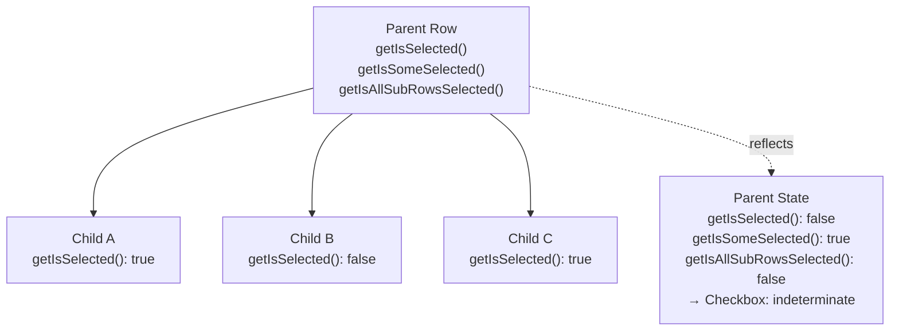
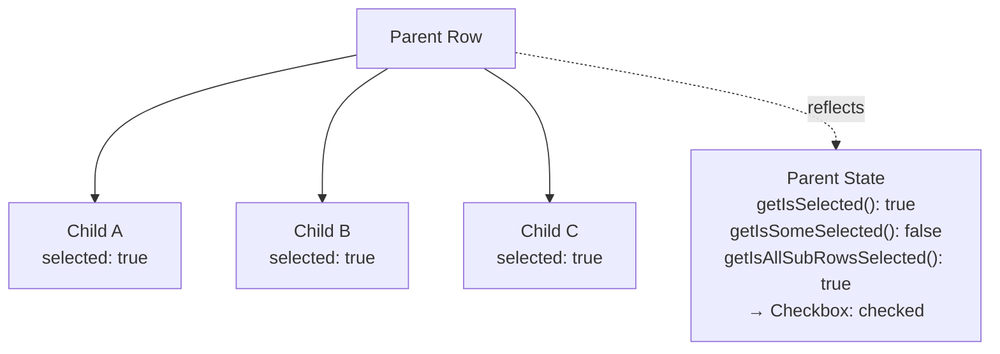

## TanStack Table — Row Selection — Sub-Row Selection Behavior

### Overview

Sub-row selection refers to how selection state propagates between parent rows and their children in hierarchical data structures — grouped rows, expanded rows, or tree-structured data. TanStack Table provides `enableSubRowSelection` to control this propagation, along with row-level APIs that reflect the compound selection state of a row and all its descendants.

Sub-row selection is only relevant when the table has a hierarchical row structure. This requires either row grouping (via `getGroupedRowModel`) or recursive sub-rows supplied directly through the data via `getSubRows`.

---

### Prerequisites

#### Supplying Sub-Rows via `getSubRows`

For tree-structured data, sub-rows are not inferred automatically. The `getSubRows` option tells TanStack Table how to find child rows within a data item:

```ts
type Category = {
  id: string
  name: string
  children?: Category[]
}

const table = useReactTable({
  data,
  columns,
  getSubRows: row => row.children,
  getCoreRowModel: getCoreRowModel(),
  getExpandedRowModel: getExpandedRowModel(),
  state: { rowSelection, expanded },
  onRowSelectionChange: setRowSelection,
  onExpandedChange: setExpanded,
})
```

`getSubRows` is called recursively for each row. Any row for which it returns a non-empty array is treated as a parent row.

#### Row Expansion

Sub-rows are typically shown only when the parent row is expanded. Expansion state is separate from selection state and requires `getExpandedRowModel` and `expanded` state to be wired up. Selection behavior applies to sub-rows regardless of whether they are currently expanded and visible.

---

### `enableSubRowSelection`

Controls whether selecting a parent row also selects its sub-rows, and whether the parent's selection state reflects the aggregate state of its children.

```ts
const table = useReactTable({
  enableSubRowSelection: true, // default
  // ...
})
```

Accepts a boolean or a per-row function:

```ts
// Disable sub-row selection propagation for specific parent rows
enableSubRowSelection: row => row.original.type !== 'locked-group'
```

| Value | Behavior |
|---|---|
| `true` (default) | Selecting a parent selects all its sub-rows; parent state reflects aggregate child state |
| `false` | Parent and children are independent; no propagation in either direction |
| `(row) => boolean` | Propagation enabled or disabled per parent row |

---

### Sub-Row Selection State APIs

These row-level methods reflect the hierarchical selection state of a row relative to its children:

| Method | Returns | Description |
|---|---|---|
| `row.getIsSelected()` | `boolean` | Whether this specific row is selected |
| `row.getIsSomeSelected()` | `boolean` | Whether some (not all) sub-rows are selected |
| `row.getIsAllSubRowsSelected()` | `boolean` | Whether all sub-rows (recursively) are selected |
| `row.getCanSelect()` | `boolean` | Whether this row is individually selectable |
| `row.getCanMultiSelect()` | `boolean` | Whether multi-select applies to this row |
| `row.getCanSelectSubRows()` | `boolean` | Whether sub-row selection propagation is enabled for this row |
| `row.toggleSelected(value?)` | `void` | Toggles or sets selection for this row and its sub-rows (when enabled) |

`getIsSomeSelected()` and `getIsAllSubRowsSelected()` are the basis for rendering an indeterminate checkbox state on parent rows.

---

### Checkbox Rendering for Parent Rows

Parent row checkboxes need three states: unchecked, indeterminate (some children selected), and checked (all children selected).

```tsx
const selectionColumn: ColumnDef<Category> = {
  id: 'select',
  header: ({ table }) => (
    <input
      type="checkbox"
      checked={table.getIsAllRowsSelected()}
      ref={el => {
        if (el) el.indeterminate = table.getIsSomeRowsSelected()
      }}
      onChange={table.getToggleAllRowsSelectedHandler()}
    />
  ),
  cell: ({ row }) => (
    <div style={{ paddingLeft: `${row.depth * 1.5}rem` }}>
      <input
        type="checkbox"
        checked={row.getIsSelected()}
        disabled={!row.getCanSelect()}
        ref={el => {
          if (el) {
            el.indeterminate =
              row.getIsSomeSelected() && !row.getIsAllSubRowsSelected()
          }
        }}
        onChange={row.getToggleSelectedHandler()}
      />
    </div>
  ),
}
```

**Key Points:**
- `row.depth` provides the nesting level (0 = top-level, 1 = first child, etc.), used to indent checkboxes visually.
- The `indeterminate` condition is `getIsSomeSelected() && !getIsAllSubRowsSelected()` — some but not all sub-rows are selected.
- `indeterminate` is set via `ref` because React does not support it as a declarative prop.

---

### Propagation Direction

When `enableSubRowSelection` is `true`, selection propagation works in both directions:

#### Top-Down: Parent → Children

Selecting a parent row selects all of its sub-rows recursively. Deselecting a parent deselects all sub-rows.

```ts
// User selects parent row "group-1"
// Result: rowSelection includes group-1 and all its descendant IDs
row.toggleSelected(true) // on a parent row
```

#### Bottom-Up: Children → Parent Reflection

When sub-rows are individually toggled, the parent row's `getIsSelected()`, `getIsSomeSelected()`, and `getIsAllSubRowsSelected()` update to reflect the aggregate state of the children.

[Inference] The parent row's entry in `rowSelection` state may or may not be explicitly set depending on whether all children are selected. The reflection is computed from child states, not stored as an explicit parent key. Verify the exact keys written to `rowSelection` in your version.

---

### `rowSelection` State Shape with Sub-Rows

When `enableSubRowSelection` is `true` and a parent row is selected, both the parent and all descendant row IDs appear in `rowSelection`:

```ts
// Selecting parent "cat-1" which has children "cat-1-a" and "cat-1-b"
rowSelection = {
  "cat-1": true,
  "cat-1-a": true,
  "cat-1-b": true,
}
```

When only some children are selected:

```ts
rowSelection = {
  "cat-1-a": true,
  // "cat-1" is NOT in rowSelection — it is partially selected
  // row.getIsSomeSelected() returns true for "cat-1"
}
```

[Inference] The exact shape of `rowSelection` when partial child selection exists may vary by version. Do not rely on the presence or absence of parent keys in `rowSelection` as a definitive signal — use `row.getIsSelected()`, `row.getIsSomeSelected()`, and `row.getIsAllSubRowsSelected()` instead.

---

### Sub-Row Selection with `getSubRows` — Full Example

```tsx
import {
  useReactTable,
  getCoreRowModel,
  getExpandedRowModel,
  flexRender,
  type ColumnDef,
  type RowSelectionState,
  type ExpandedState,
} from '@tanstack/react-table'
import { useState } from 'react'

type FileNode = {
  id: string
  name: string
  type: 'folder' | 'file'
  children?: FileNode[]
}

const columns: ColumnDef<FileNode>[] = [
  {
    id: 'select',
    header: ({ table }) => (
      <input
        type="checkbox"
        checked={table.getIsAllRowsSelected()}
        ref={el => { if (el) el.indeterminate = table.getIsSomeRowsSelected() }}
        onChange={table.getToggleAllRowsSelectedHandler()}
      />
    ),
    cell: ({ row }) => (
      <div style={{ paddingLeft: `${row.depth * 1.5}rem`, display: 'flex', alignItems: 'center', gap: '0.5rem' }}>
        {row.getCanExpand() && (
          <button onClick={row.getToggleExpandedHandler()}>
            {row.getIsExpanded() ? '▾' : '▸'}
          </button>
        )}
        <input
          type="checkbox"
          checked={row.getIsSelected()}
          disabled={!row.getCanSelect()}
          ref={el => {
            if (el) {
              el.indeterminate =
                row.getIsSomeSelected() && !row.getIsAllSubRowsSelected()
            }
          }}
          onChange={row.getToggleSelectedHandler()}
        />
      </div>
    ),
  },
  {
    accessorKey: 'name',
    header: 'Name',
  },
]

export function FileTree({ data }: { data: FileNode[] }) {
  const [rowSelection, setRowSelection] = useState<RowSelectionState>({})
  const [expanded, setExpanded] = useState<ExpandedState>({})

  const table = useReactTable({
    data,
    columns,
    getRowId: row => row.id,
    getSubRows: row => row.children,
    enableSubRowSelection: true,
    state: { rowSelection, expanded },
    onRowSelectionChange: setRowSelection,
    onExpandedChange: setExpanded,
    getCoreRowModel: getCoreRowModel(),
    getExpandedRowModel: getExpandedRowModel(),
  })

  return (
    <table>
      <thead>
        {table.getHeaderGroups().map(hg => (
          <tr key={hg.id}>
            {hg.headers.map(h => (
              <th key={h.id}>
                {flexRender(h.column.columnDef.header, h.getContext())}
              </th>
            ))}
          </tr>
        ))}
      </thead>
      <tbody>
        {table.getRowModel().rows.map(row => (
          <tr key={row.id}>
            {row.getVisibleCells().map(cell => (
              <td key={cell.id}>
                {flexRender(cell.column.columnDef.cell, cell.getContext())}
              </td>
            ))}
          </tr>
        ))}
      </tbody>
    </table>
  )
}
```

---

### Disabling Sub-Row Selection

When `enableSubRowSelection: false`, parent and child rows are fully independent. Selecting a parent does not touch its children, and child selections do not affect the parent's `getIsSelected()` return value.

```ts
const table = useReactTable({
  enableSubRowSelection: false,
  // ...
})
```

Use cases for disabling propagation:
- The parent row represents metadata (e.g., a group header) that should not propagate intent to data rows.
- Selection is used to mark individual leaf nodes only, not categories.
- The hierarchy is purely visual — children are logically independent of parents.

---

### Interaction with `enableRowSelection`

`enableRowSelection` and `enableSubRowSelection` interact independently:

```ts
const table = useReactTable({
  enableRowSelection: row => row.original.type === 'file', // only files are selectable
  enableSubRowSelection: true,
  // ...
})
```

In this configuration:
- Parent folder rows cannot be directly selected (`getCanSelect()` returns `false`).
- Sub-row propagation is still active — if all files under a folder are individually selected, `row.getIsAllSubRowsSelected()` returns `true` for the folder.
- [Inference] `toggleSelected()` called on a non-selectable parent with `enableSubRowSelection: true` may still propagate to selectable children. Verify this behavior in your version.

---

### Reading Selected Sub-Rows

`table.getSelectedRowModel()` returns a flat list of all selected rows, including both parent and child rows:

```ts
const allSelected = table.getSelectedRowModel().rows
// Includes parent rows and their selected children as a flat array
```

To retrieve only leaf rows (rows with no children):

```ts
const selectedLeaves = table.getSelectedRowModel().rows.filter(
  row => !row.subRows || row.subRows.length === 0
)
```

To retrieve only top-level selected rows (parents, regardless of children):

```ts
const selectedTopLevel = table.getSelectedRowModel().rows.filter(
  row => row.depth === 0
)
```

---

### Hierarchical Selection State Diagram





---

### Common Pitfalls

**Not providing `getSubRows`**
Without `getSubRows`, TanStack Table does not know the hierarchy exists. Sub-row APIs return default values as if the row has no children.

**Relying on parent keys in `rowSelection` to detect partial selection**
The absence of a parent key in `rowSelection` does not mean it is deselected — it may mean some but not all children are selected. Always use `row.getIsSomeSelected()` and `row.getIsAllSubRowsSelected()` for accurate state.

**Setting `indeterminate` as a JSX prop**
React does not support `indeterminate` as a declarative prop. Always use a `ref` callback.

**Using `depth` for indentation without checking row model**
`row.depth` is only meaningful when sub-rows are supplied via `getSubRows` or produced by grouping. In a flat table, all rows have `depth === 0`.

**Filtering `getSelectedRowModel().rows` by `row.original.type` instead of `row.depth`**
Both approaches work, but `row.depth` is structure-based and does not require knowledge of the data's type field.

**Expecting `getExpandedRowModel` to affect selection**
Expansion state controls visibility only. Sub-row selection applies to all sub-rows regardless of whether they are currently expanded and visible in the DOM.

---

**Related Topics**

- Row Expansion — wiring `expanded` state and `getExpandedRowModel` for tree structures
- `getSubRows` and Recursive Data — supplying hierarchical data to TanStack Table
- Grouped Row Selection — selection behavior with `getGroupedRowModel`
- Single and Multi-Row Selection — base selection setup, `enableMultiRowSelection`, and toggle methods
- Select All Rows — how `toggleAllRowsSelected` interacts with sub-rows
- Controlled Selection State — owning `rowSelection` externally and reading selected leaf nodes
- Reading Selected Data — filtering `getSelectedRowModel()` by depth, type, or other criteria