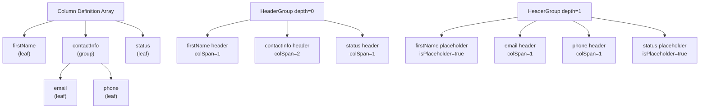

## TanStack Table — Column Model — Column Grouping

### Overview

Column grouping in TanStack Table refers to visually nesting columns under shared header labels — organizing related columns beneath a common parent header that spans multiple columns. This is a column definition concern, not a row grouping concern. It produces multi-row header structures where a single header cell spans the width of its child columns.

Row grouping (aggregating rows by column values) is a separate feature covered under the grouping row model.

---

### What Column Grouping Produces

A grouped column structure renders a `<thead>` with multiple header rows:

```
┌─────────────────────────────────────────────┐
│  Name     │      Contact Info      │ Status  │
│           ├──────────┬─────────────┤         │
│           │  Email   │   Phone     │         │
└─────────────────────────────────────────────┘
```

The top row contains group headers (spanning cells). The bottom row contains leaf column headers (individual cells). Both are derived from the same column definition structure.

---

### Defining Grouped Columns

Column grouping is expressed in the column definition array by nesting columns under a parent definition using the `columns` property.

```ts
import { ColumnDef } from '@tanstack/react-table'

type Person = {
  firstName: string
  lastName: string
  email: string
  phone: string
  status: string
}

const columns: ColumnDef<Person>[] = [
  {
    // Leaf column — no children
    accessorKey: 'firstName',
    header: 'First Name',
  },
  {
    // Group column — has children, no accessor
    id: 'contactInfo',
    header: 'Contact Info',
    columns: [
      {
        accessorKey: 'email',
        header: 'Email',
      },
      {
        accessorKey: 'phone',
        header: 'Phone',
      },
    ],
  },
  {
    accessorKey: 'status',
    header: 'Status',
  },
]
```

**Key Points:**
- Group columns have a `columns` array and no `accessorKey` or `accessorFn` — they exist purely to provide a spanning header.
- Group columns must have an explicit `id` since they have no accessor to derive one from.
- Nesting can be arbitrarily deep — a group column's `columns` array can itself contain group columns.
- Leaf columns (columns with no `columns` property) carry data and are the only columns that render body cells.

---

### How Header Groups Are Structured

TanStack Table processes grouped column definitions into header groups — one `HeaderGroup` per depth level of the hierarchy.

```ts
table.getHeaderGroups()
// Returns an array of HeaderGroup objects, one per row of headers
```

Each `HeaderGroup` contains an array of `Header` objects. A group-level header's `colSpan` property reflects how many leaf columns it spans.

```ts
table.getHeaderGroups().forEach(headerGroup => {
  console.log(headerGroup.depth)   // 0 = top row, 1 = second row, etc.
  headerGroup.headers.forEach(header => {
    console.log(header.id)
    console.log(header.colSpan)    // > 1 for group headers
    console.log(header.isPlaceholder) // true for placeholder cells
  })
})
```

---

### Placeholder Headers

When columns at the same depth level have different nesting depths, TanStack Table inserts placeholder headers to maintain a consistent grid structure.

In the earlier example, `firstName` and `status` are leaf columns at depth 0, while `email` and `phone` are leaf columns at depth 1 (under `contactInfo`). TanStack Table inserts placeholder headers for `firstName` and `status` at depth 1 so all header rows have the correct number of cells.

`header.isPlaceholder` is `true` for these cells. They should be rendered as empty `<th>` elements.

---

### Rendering Multi-Row Headers

```tsx
<thead>
  {table.getHeaderGroups().map(headerGroup => (
    <tr key={headerGroup.id}>
      {headerGroup.headers.map(header => (
        <th
          key={header.id}
          colSpan={header.colSpan}
        >
          {header.isPlaceholder
            ? null
            : flexRender(header.column.columnDef.header, header.getContext())}
        </th>
      ))}
    </tr>
  ))}
</thead>
```

**Key Points:**
- `colSpan={header.colSpan}` is essential — without it, group headers will not span their child columns.
- `header.isPlaceholder` cells render as empty `<th>` elements (or `null` content) — they still occupy space in the grid.
- `flexRender` is called only on non-placeholder headers.

---

### `header.column` vs `header.subHeaders`

Each `Header` object exposes two relevant properties for grouped headers:

| Property | Description |
|---|---|
| `header.column` | The column definition associated with this header |
| `header.subHeaders` | Array of child `Header` objects directly under this header |
| `header.colSpan` | Number of leaf columns this header spans |
| `header.depth` | Depth level in the header hierarchy (0 = top) |
| `header.isPlaceholder` | Whether this is a synthetic placeholder cell |

`subHeaders` is useful for rendering custom nested header structures or for traversing the header tree:

```ts
const countLeafHeaders = (header: Header<any, unknown>): number => {
  if (header.subHeaders.length === 0) return 1
  return header.subHeaders.reduce(
    (sum, sub) => sum + countLeafHeaders(sub),
    0
  )
}
```

---

### Column Definitions: Group vs Leaf

| Property | Group Column | Leaf Column |
|---|---|---|
| `id` | Required (no accessor to derive from) | Optional (derived from accessor if omitted) |
| `accessorKey` / `accessorFn` | Not used | Required for data access |
| `columns` | Required (defines children) | Not present |
| `header` | Renders as spanning cell | Renders as individual cell |
| `cell` | Not rendered (no body cells) | Rendered in `<tbody>` |
| `footer` | Renders as spanning footer cell | Rendered as individual footer cell |
| Sorting | Not applicable | Applicable |
| Filtering | Not applicable | Applicable |
| Visibility | Controls visibility of all children | Controls individual column visibility |

---

### Column Visibility with Grouped Columns

Hiding a group column hides all of its child columns. Hiding all child columns of a group collapses the group header automatically.

```ts
// Hide all columns under the "contactInfo" group
table.getColumn('email')?.toggleVisibility(false)
table.getColumn('phone')?.toggleVisibility(false)
// The "contactInfo" group header now has colSpan 0 and should not render
```

[Inference] When all leaf columns under a group are hidden, the group header's `colSpan` becomes `0`. Rendering a `<th colSpan={0}>` may produce unexpected browser behavior. It is common practice to conditionally omit headers with `colSpan === 0`:

```tsx
{headerGroup.headers.map(header =>
  header.colSpan === 0 ? null : (
    <th key={header.id} colSpan={header.colSpan}>
      {header.isPlaceholder
        ? null
        : flexRender(header.column.columnDef.header, header.getContext())}
    </th>
  )
)}
```

---

### Column Ordering with Grouped Columns

Column ordering (`columnOrder` state) operates on leaf columns only — group columns are structural and are not included in `columnOrder`. Reordering a leaf column repositions it within its parent group or potentially moves it to a different group.

[Inference] Moving a leaf column out of its defined parent group by reordering may produce unexpected header structure. TanStack Table renders the hierarchy based on the column definition tree, not on the flat leaf order. The interaction between column ordering and grouped column definitions is [Unverified] for complex reordering scenarios — test thoroughly in your version.

---

### Column Pinning with Grouped Columns

Column pinning applies to leaf columns. When a leaf column inside a group is pinned, the group header does not automatically pin. [Inference] This can result in the group header scrolling while its pinned child column remains fixed, which may produce visual inconsistencies. Full group pinning (pinning the group and all its children together) requires pinning each leaf column individually.

---

### Deep Nesting Example

Groups can be nested to arbitrary depth:

```ts
const columns: ColumnDef<Report>[] = [
  {
    id: 'geography',
    header: 'Geography',
    columns: [
      {
        id: 'region',
        header: 'Region',
        columns: [
          { accessorKey: 'country', header: 'Country' },
          { accessorKey: 'city', header: 'City' },
        ],
      },
      { accessorKey: 'postalCode', header: 'Postal Code' },
    ],
  },
  { accessorKey: 'revenue', header: 'Revenue' },
]
```

This produces three header rows:

```
┌──────────────────────────┬──────────┐
│         Geography        │          │
├──────────────┬───────────┤ Revenue  │
│    Region    │           │          │
├───────┬──────┤ Postal    │          │
│Country│ City │   Code    │          │
└───────┴──────┴───────────┴──────────┘
```

`table.getHeaderGroups()` returns three `HeaderGroup` objects for this structure.

---

### Footer Groups

Group columns also produce grouped footers. `table.getFooterGroups()` returns footer groups mirroring the header group structure. Footer rendering follows the same pattern:

```tsx
<tfoot>
  {table.getFooterGroups().map(footerGroup => (
    <tr key={footerGroup.id}>
      {footerGroup.headers.map(header => (
        <th
          key={header.id}
          colSpan={header.colSpan}
        >
          {header.isPlaceholder
            ? null
            : flexRender(header.column.columnDef.footer, header.getContext())}
        </th>
      ))}
    </tr>
  ))}
</tfoot>
```

---

### Structure Diagram



---

### Accessing Leaf Columns from a Group

To retrieve all leaf columns under a group column:

```ts
const contactInfoColumn = table.getColumn('contactInfo')
const leafColumns = contactInfoColumn?.getLeafColumns()
// Returns [emailColumn, phoneColumn]
```

`column.getLeafColumns()` recursively traverses the column's children and returns only leaf columns.

To get the parent of a leaf column:

```ts
const emailColumn = table.getColumn('email')
const parent = emailColumn?.parent
// Returns the contactInfo column definition
```

---

### Common Pitfalls

**Omitting `id` on group columns**
Group columns have no `accessorKey` to derive an ID from. Without an explicit `id`, TanStack Table cannot reliably identify the column, which may cause rendering issues or React key warnings.

**Assigning `accessorKey` or `accessorFn` to a group column**
Group columns are structural only — they do not read data. Adding an accessor to a group column produces [Unverified] behavior and should be avoided.

**Forgetting `colSpan={header.colSpan}` in the header render**
Without `colSpan`, each header renders in a single cell regardless of how many leaf columns it spans, breaking the visual alignment.

**Not handling `header.isPlaceholder`**
Attempting to render column definition content (e.g., calling `flexRender`) on a placeholder header will produce `null` or empty content. Always guard with `header.isPlaceholder` before rendering.

**Not handling `colSpan === 0` for hidden-column groups**
When all leaf columns under a group are hidden, the group header has `colSpan === 0`. A `<th colSpan={0}>` is invalid HTML and may cause layout issues in some browsers.

**Confusing column grouping with row grouping**
Column grouping organizes headers visually. Row grouping aggregates rows by column value. They are entirely separate features with different APIs.

---

**Related Topics**

- Column Visibility — hiding individual and grouped columns, `colSpan` collapse behavior
- Column Pinning — pinning leaf columns within grouped header structures
- Column Ordering — reordering leaf columns and the effect on group structure
- Footer Groups — rendering `getFooterGroups()` for grouped footer rows
- Row Grouping — aggregating rows by column values using `getGroupedRowModel`
- Header Context API — accessing `header.column`, `header.subHeaders`, and `header.colSpan` programmatically
- Column `getLeafColumns()` — traversing group hierarchies to reach leaf columns