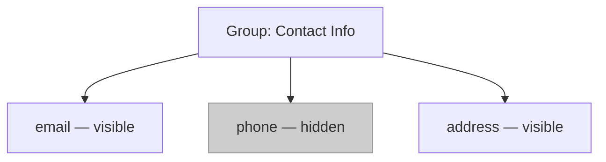

## TanStack Table — Column Features — Column Visibility

### Overview

Column visibility controls which columns are rendered in the table. TanStack Table provides a built-in visibility model that tracks per-column visibility state, exposes toggle APIs, and integrates with the header and cell rendering pipeline so hidden columns are automatically excluded from output.

---

### Enabling the Visibility Feature

Column visibility is part of the core feature set and does not require a separate plugin. It is active by default. The relevant model is initialized via `getCoreRowModel` and participates in the column pipeline automatically.

```ts
import {
  useReactTable,
  getCoreRowModel,
} from '@tanstack/react-table'

const table = useReactTable({
  data,
  columns,
  getCoreRowModel: getCoreRowModel(),
})
```

No additional feature function (like `getSortedRowModel`) is needed solely for visibility.

---

### Visibility State Shape

The visibility state is a plain record mapping column IDs to booleans.

```ts
type VisibilityState = Record<string, boolean>
```

- `true` — column is visible (default)
- `false` — column is hidden

**Key Points:**
- Columns not present in the state object are treated as visible by default.
- Only columns that should be hidden need explicit `false` entries; you do not need to enumerate all columns upfront.

---

### Initializing Visibility State

#### Uncontrolled (internal state)

```ts
const table = useReactTable({
  data,
  columns,
  getCoreRowModel: getCoreRowModel(),
  initialState: {
    columnVisibility: {
      email: false,
      phone: false,
    },
  },
})
```

This hides `email` and `phone` on initial render while leaving all other columns visible.

#### Controlled (external state)

```ts
const [columnVisibility, setColumnVisibility] = React.useState<VisibilityState>({
  email: false,
})

const table = useReactTable({
  data,
  columns,
  getCoreRowModel: getCoreRowModel(),
  state: {
    columnVisibility,
  },
  onColumnVisibilityChange: setColumnVisibility,
})
```

Use controlled state when visibility needs to be persisted (e.g., localStorage), synced with a URL, or driven by external UI logic.

---

### Column Definition Option: `enableHiding`

Each column definition can opt out of user-controlled hiding via the `enableHiding` option.

```ts
const columns = [
  {
    accessorKey: 'id',
    header: 'ID',
    enableHiding: false, // this column cannot be hidden via toggle APIs
  },
  {
    accessorKey: 'name',
    header: 'Name',
  },
]
```

**Key Points:**
- `enableHiding: false` prevents the column from being toggled via `column.toggleVisibility()` and related APIs.
- It does NOT prevent you from manually setting `columnVisibility: { id: false }` in state — that will still hide the column. [Inference: `enableHiding` guards the toggle API, not the raw state.]
- Default value is `true`.

---

### Table-Level Option: `enableHiding`

A global `enableHiding` option on the table configuration controls whether hiding is permitted for all columns at once.

```ts
const table = useReactTable({
  data,
  columns,
  getCoreRowModel: getCoreRowModel(),
  enableHiding: false, // disables toggling for all columns
})
```

Column-level `enableHiding` takes precedence over the table-level default. [Inference]

---

### Visibility APIs

#### On the `table` instance

| Method | Description |
|---|---|
| `table.getIsAllColumnsVisible()` | Returns `true` if every column is visible |
| `table.getIsSomeColumnsVisible()` | Returns `true` if at least one column is visible |
| `table.toggleAllColumnsVisible(value?)` | Toggles all columns; optional boolean forces state |
| `table.getToggleAllColumnsVisibilityHandler()` | Returns a change handler for a checkbox input |
| `table.getAllLeafColumns()` | Returns all leaf columns including hidden ones |
| `table.getVisibleLeafColumns()` | Returns only currently visible leaf columns |
| `table.setColumnVisibility(updater)` | Directly sets the visibility state |
| `table.resetColumnVisibility(defaultState?)` | Resets to initial or default state |

#### On a `column` instance

| Method | Description |
|---|---|
| `column.getIsVisible()` | Returns `true` if column is visible |
| `column.toggleVisibility(value?)` | Toggles this column; optional boolean forces state |
| `column.getToggleVisibilityHandler()` | Returns a change handler suitable for a checkbox |
| `column.getCanHide()` | Returns `true` if the column can be hidden (respects `enableHiding`) |

---

### Building a Column Visibility Toggle UI

A common pattern is a dropdown or panel listing all columns with checkboxes.

```tsx
function ColumnVisibilityToggle({ table }: { table: Table<Person> }) {
  return (
    <div>
      {/* Toggle all */}
      <label>
        <input
          type="checkbox"
          checked={table.getIsAllColumnsVisible()}
          onChange={table.getToggleAllColumnsVisibilityHandler()}
        />
        Toggle All
      </label>

      {/* Per-column toggles */}
      {table.getAllLeafColumns().map(column => (
        <label key={column.id}>
          <input
            type="checkbox"
            checked={column.getIsVisible()}
            disabled={!column.getCanHide()}
            onChange={column.getToggleVisibilityHandler()}
          />
          {column.id}
        </label>
      ))}
    </div>
  )
}
```

**Key Points:**
- `getAllLeafColumns()` includes hidden columns, which is necessary for the toggle list to show all options.
- `getVisibleLeafColumns()` would exclude already-hidden columns and is unsuitable here.
- `getCanHide()` correctly reflects both column-level and table-level `enableHiding`.

---

### Rendering Only Visible Columns

When building the table markup, use visibility-aware APIs so hidden columns are excluded.

```tsx
{table.getHeaderGroups().map(headerGroup => (
  <tr key={headerGroup.id}>
    {headerGroup.headers.map(header => (
      <th key={header.id}>
        {flexRender(header.column.columnDef.header, header.getContext())}
      </th>
    ))}
  </tr>
))}
```

```tsx
{table.getRowModel().rows.map(row => (
  <tr key={row.id}>
    {row.getVisibleCells().map(cell => (
      <td key={cell.id}>
        {flexRender(cell.column.columnDef.cell, cell.getContext())}
      </td>
    ))}
  </tr>
))}
```

**Key Points:**
- `headerGroup.headers` from `getHeaderGroups()` already reflects visibility — hidden columns are excluded.
- `row.getVisibleCells()` returns only cells for visible columns. Using `row.getAllCells()` would include hidden columns and break alignment.

---

### Visibility and Column Grouping

When using grouped column headers, visibility operates on leaf columns. Hiding a leaf column removes its cell from the row. If all leaves under a group header are hidden, the group header itself collapses to zero width.



[Inference: The group header span contracts proportionally as leaf columns are hidden. Exact rendering depends on your CSS/colspan implementation.]

---

### Persisting Visibility State

Because the state is a plain serializable object, it can be persisted easily.

```ts
// Save to localStorage
const [columnVisibility, setColumnVisibility] = React.useState<VisibilityState>(() => {
  const saved = localStorage.getItem('col-visibility')
  return saved ? JSON.parse(saved) : {}
})

// Sync on change
const handleVisibilityChange: OnChangeFn<VisibilityState> = updater => {
  const next = typeof updater === 'function' ? updater(columnVisibility) : updater
  setColumnVisibility(next)
  localStorage.setItem('col-visibility', JSON.stringify(next))
}

const table = useReactTable({
  data,
  columns,
  getCoreRowModel: getCoreRowModel(),
  state: { columnVisibility },
  onColumnVisibilityChange: handleVisibilityChange,
})
```

The same pattern applies to sessionStorage, URL query params, or server-side user preferences.

---

### Visibility in Column Sizing and Pinning

When columns are hidden:
- They are excluded from visible width calculations used by column sizing features.
- Pinned column counts reflect only visible columns. [Inference: Based on the architecture of feature composition in TanStack Table; unverified in all edge cases.]
- Hidden columns still exist in `table.getAllColumns()` and retain their definitions and state.

---

### Common Mistakes

| Mistake | Consequence | Correction |
|---|---|---|
| Using `row.getAllCells()` in render | Renders hidden columns, breaks layout alignment | Use `row.getVisibleCells()` |
| Setting `enableHiding: false` expecting raw state to be blocked | Column still hidden if state explicitly set | `enableHiding` guards the API, not raw state |
| Relying on `getVisibleLeafColumns()` to build toggle list | Hidden columns not listed | Use `getAllLeafColumns()` for toggle UI |
| Not providing `onColumnVisibilityChange` in controlled mode | State updates silently dropped | Always pair `state.columnVisibility` with the handler |

---

**Related Topics:**
- Column Ordering — reordering visible columns
- Column Pinning — pinning visible columns left or right
- Column Sizing — how hidden columns interact with width distribution
- Column Filters — filtering behavior for hidden columns
- Persisting Table State — unified persistence patterns for all state slices
- Faceted Values — whether hidden columns still contribute to filter facets