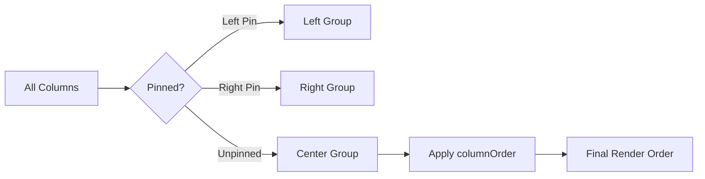

## TanStack Table — Column Features — Column Ordering

### Overview

Column ordering controls the sequence in which columns appear in the table. By default, columns render in the order they are defined in the `columns` array. The ordering feature allows this sequence to be changed at runtime without mutating the original column definitions.

---

### Default Ordering Behavior

Without any ordering state, TanStack Table renders columns in definition order — the order of entries in the `columns` array passed to `useReactTable`. This is the implicit default and requires no configuration.

---

### Ordering State Shape

```ts
type ColumnOrderState = string[]
```

The state is a flat array of column IDs representing the desired left-to-right render order.

**Key Points:**
- Column IDs not present in the array are appended after the listed ones in their original definition order. [Inference]
- An empty array `[]` is equivalent to no ordering state — definition order is used.
- All columns, including hidden ones, can appear in the ordering state. Hidden columns retain their position in the order but are not rendered.

---

### Enabling Column Ordering

No additional row model is required. The feature participates in the core column pipeline.

```ts
import {
  useReactTable,
  getCoreRowModel,
} from '@tanstack/react-table'

const table = useReactTable({
  data,
  columns,
  getCoreRowModel: getCoreRowModel(),
})
```

Ordering state can be initialized or controlled independently.

---

### Initializing Order State

#### Uncontrolled

```ts
const table = useReactTable({
  data,
  columns,
  getCoreRowModel: getCoreRowModel(),
  initialState: {
    columnOrder: ['name', 'email', 'role', 'createdAt'],
  },
})
```

#### Controlled

```ts
const [columnOrder, setColumnOrder] = React.useState<ColumnOrderState>(
  ['name', 'email', 'role', 'createdAt']
)

const table = useReactTable({
  data,
  columns,
  getCoreRowModel: getCoreRowModel(),
  state: {
    columnOrder,
  },
  onColumnOrderChange: setColumnOrder,
})
```

As with all TanStack Table state, use controlled mode when the ordering must be persisted, shared, or driven by external logic.

---

### Ordering APIs

#### On the `table` instance

| Method | Description |
|---|---|
| `table.getState().columnOrder` | Current ordering state array |
| `table.setColumnOrder(updater)` | Directly sets the column order state |
| `table.resetColumnOrder(defaultState?)` | Resets to initial or default order |

There are no per-column ordering APIs. Order is managed exclusively at the table level via the state array.

---

### Interaction with Other Features

#### Visibility

Column ordering and visibility are independent state slices. A hidden column retains its position in `columnOrder` but is excluded from rendered output. Reordering does not affect visibility state and vice versa.

#### Pinning

Column pinning takes precedence over ordering in the render pipeline. Pinned columns are extracted into left/right groups first; the remaining unpinned columns are then ordered according to `columnOrder`. [Inference: Based on feature composition order in TanStack Table internals; behavior may vary in edge cases.]



#### Column Groups

Ordering applies to leaf columns. Group header columns are derived from their children's positions, so reordering leaf columns implicitly reshuffles content under group headers. Moving a leaf column outside its parent group's span produces a visual disconnect between the group header and its cells. [Inference: This is an expected constraint of the grouped header model.]

---

### Implementing Drag-and-Drop Reordering

A common use case is allowing users to drag column headers to reorder them. The general approach is:

1. Attach drag events to header cells.
2. On drop, compute the new column ID array.
3. Call `table.setColumnOrder(newOrder)`.

```tsx
import { useDrag, useDrop } from 'react-dnd'

function DraggableHeader({
  header,
  table,
}: {
  header: Header<Person, unknown>
  table: Table<Person>
}) {
  const { getState, setColumnOrder } = table
  const { columnOrder } = getState()
  const { column } = header

  const [, dropRef] = useDrop({
    accept: 'column',
    drop: (draggedColumn: Column<Person>) => {
      const newOrder = reorderColumn(draggedColumn.id, column.id, columnOrder)
      setColumnOrder(newOrder)
    },
  })

  const [{ isDragging }, dragRef, previewRef] = useDrag({
    type: 'column',
    item: () => column,
    collect: monitor => ({ isDragging: monitor.isDragging() }),
  })

  return (
    <th
      ref={dropRef}
      style={{ opacity: isDragging ? 0.5 : 1 }}
    >
      <div ref={dragRef}>
        {flexRender(column.columnDef.header, header.getContext())}
      </div>
    </th>
  )
}
```

**`reorderColumn` helper:**

```ts
function reorderColumn(
  draggedColumnId: string,
  targetColumnId: string,
  columnOrder: string[]
): ColumnOrderState {
  const order = [...columnOrder]
  const dragIndex = order.indexOf(draggedColumnId)
  const targetIndex = order.indexOf(targetColumnId)
  order.splice(dragIndex, 1)
  order.splice(targetIndex, 0, draggedColumnId)
  return order
}
```

**Key Points:**
- `react-dnd` is not a TanStack dependency — any drag library (`@dnd-kit/core`, native HTML5 drag events) can be used. Behavior may vary by library.
- The column order array must contain all column IDs for the reorder to be stable. If some IDs are absent, TanStack Table appends them in definition order. [Inference]

---

### Constructing a Full Initial Order

When initializing or resetting order, it is common to derive the full ID list from the column definitions to avoid partial arrays.

```ts
// Derive initial order from column definitions
const defaultColumnOrder = columns.map(col =>
  'accessorKey' in col ? (col.accessorKey as string) : (col.id as string)
)

const [columnOrder, setColumnOrder] = React.useState<ColumnOrderState>(defaultColumnOrder)
```

This produces a complete, stable baseline that drag-and-drop mutations can splice into.

---

### Persisting Column Order

```ts
const [columnOrder, setColumnOrder] = React.useState<ColumnOrderState>(() => {
  const saved = localStorage.getItem('column-order')
  return saved ? JSON.parse(saved) : defaultColumnOrder
})

const handleOrderChange: OnChangeFn<ColumnOrderState> = updater => {
  const next = typeof updater === 'function' ? updater(columnOrder) : updater
  setColumnOrder(next)
  localStorage.setItem('column-order', JSON.stringify(next))
}
```

The same pattern applies to URL params or server-persisted user preferences. Because `ColumnOrderState` is a plain string array, it serializes cleanly.

---

### Resetting to Default Order

```ts
// Reset to empty array (reverts to definition order)
table.resetColumnOrder()

// Reset to a specific saved order
table.setColumnOrder(defaultColumnOrder)
```

---

### Common Mistakes

| Mistake | Consequence | Correction |
|---|---|---|
| Partial `columnOrder` array (some IDs missing) | Missing columns appended in definition order, potentially unexpected | Include all leaf column IDs in the array |
| Attempting to reorder group header columns directly | Group headers have no position in `columnOrder` | Reorder leaf columns only |
| Expecting pinned columns to follow `columnOrder` | Pinned columns are extracted before ordering is applied | Manage pinning and ordering state separately |
| Using column index instead of column ID in the state | Index is unstable when columns are added or removed | Always use string IDs |

---

**Related Topics:**
- Column Pinning — interaction between pinning and order
- Column Visibility — combining hidden columns with a custom order
- Column Sizing — whether reordering affects width state
- Drag-and-Drop Libraries — `@dnd-kit/core` and `react-dnd` integration patterns
- Persisting Table State — unified persistence across order, visibility, and sizing
- Header Groups — how leaf column reordering affects grouped headers