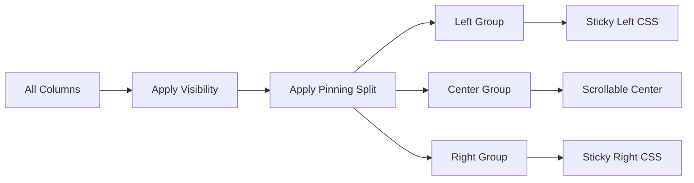
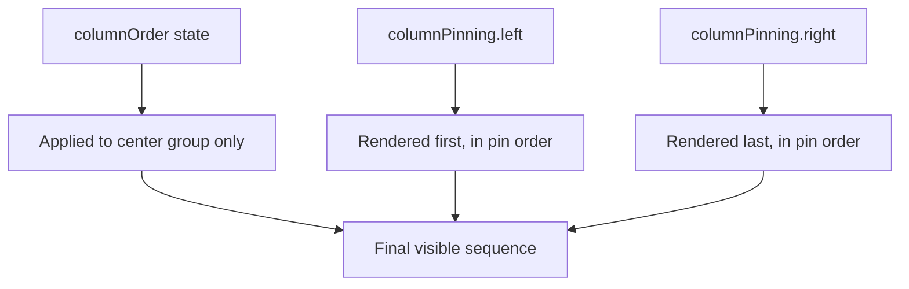
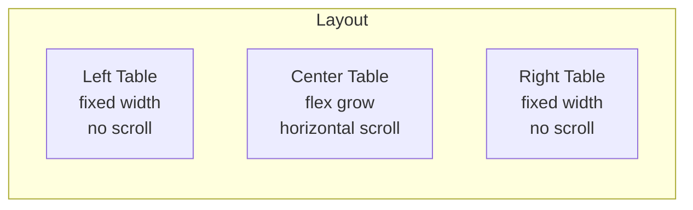

## TanStack Table — Column Features — Column Pinning

### Overview

Column pinning fixes columns to the left or right edge of the table so they remain visible during horizontal scroll. TanStack Table provides a pinning state model and a set of APIs that split columns into three groups — left-pinned, center (unpinned), and right-pinned — which the consuming UI uses to render sticky columns independently.

---

### Pinning State Shape

```ts
type ColumnPinningPosition = false | 'left' | 'right'

type ColumnPinningState = {
  left?: string[]
  right?: string[]
}
```

**Key Points:**
- `left` and `right` are arrays of column IDs in their pinned order.
- Columns absent from both arrays are unpinned (center group).
- A column can only be in one group at a time.

---

### Enabling Column Pinning

No additional row model is required. Pinning participates in the core column pipeline automatically.

```ts
import {
  useReactTable,
  getCoreRowModel,
} from '@tanstack/react-table'

const table = useReactTable({
  data,
  columns,
  getCoreRowModel: getCoreRowModel(),
})
```

---

### Initializing Pinning State

#### Uncontrolled

```ts
const table = useReactTable({
  data,
  columns,
  getCoreRowModel: getCoreRowModel(),
  initialState: {
    columnPinning: {
      left: ['id', 'name'],
      right: ['actions'],
    },
  },
})
```

#### Controlled

```ts
const [columnPinning, setColumnPinning] = React.useState<ColumnPinningState>({
  left: ['id', 'name'],
  right: ['actions'],
})

const table = useReactTable({
  data,
  columns,
  getCoreRowModel: getCoreRowModel(),
  state: { columnPinning },
  onColumnPinningChange: setColumnPinning,
})
```

---

### Column Definition Option: `enablePinning`

```ts
const columns = [
  {
    accessorKey: 'id',
    header: 'ID',
    enablePinning: false, // cannot be pinned via toggle APIs
  },
]
```

**Key Points:**
- Like `enableHiding`, this guards the toggle API, not raw state. Manually including the ID in `columnPinning.left` still pins the column. [Inference]
- Default is `true`.

---

### Table-Level Option: `enableColumnPinning`

```ts
const table = useReactTable({
  data,
  columns,
  getCoreRowModel: getCoreRowModel(),
  enableColumnPinning: false,
})
```

Disables pinning toggling globally. Column-level `enablePinning` takes precedence over the table-level default. [Inference]

---

### Pinning APIs

#### On the `table` instance

| Method | Description |
|---|---|
| `table.getLeftHeaderGroups()` | Header groups for left-pinned columns |
| `table.getCenterHeaderGroups()` | Header groups for unpinned columns |
| `table.getRightHeaderGroups()` | Header groups for right-pinned columns |
| `table.getLeftLeafColumns()` | Leaf columns pinned left |
| `table.getCenterLeafColumns()` | Unpinned leaf columns |
| `table.getRightLeafColumns()` | Leaf columns pinned right |
| `table.getLeftFlatColumns()` | All left-pinned columns (flat, including groups) |
| `table.getCenterFlatColumns()` | All unpinned columns (flat) |
| `table.getRightFlatColumns()` | All right-pinned columns (flat) |
| `table.setColumnPinning(updater)` | Directly sets pinning state |
| `table.resetColumnPinning(defaultState?)` | Resets to initial or default |

#### On a `column` instance

| Method | Description |
|---|---|
| `column.getIsPinned()` | Returns `'left'`, `'right'`, or `false` |
| `column.getPinnedIndex()` | Returns the column's index within its pinned group |
| `column.pin(position)` | Pins to `'left'`, `'right'`, or unpins with `false` |
| `column.getCanPin()` | Returns `true` if pinning is permitted |

#### On a `row` instance

| Method | Description |
|---|---|
| `row.getLeftVisibleCells()` | Cells for left-pinned visible columns |
| `row.getCenterVisibleCells()` | Cells for unpinned visible columns |
| `row.getRightVisibleCells()` | Cells for right-pinned visible columns |

---

### Render Architecture

TanStack Table does not apply CSS directly. Pinning works by splitting columns into three groups; the consuming UI is responsible for sticky positioning.



A typical layout uses a scrollable container with `position: sticky` applied to pinned cells.

---

### Implementation Pattern: Sticky Columns

The most common rendering approach uses a single `<table>` with sticky cells. TanStack Table provides `column.getStart()` and `column.getAfter()` (or equivalent offset helpers) to compute the `left` and `right` CSS values needed for sticky positioning.

```tsx
// Header rendering
<thead>
  {table.getHeaderGroups().map(headerGroup => (
    <tr key={headerGroup.id}>
      {headerGroup.headers.map(header => {
        const isPinned = header.column.getIsPinned()
        const isLastLeft =
          isPinned === 'left' &&
          header.column.getPinnedIndex() ===
            table.getLeftLeafColumns().length - 1
        const isFirstRight =
          isPinned === 'right' &&
          header.column.getPinnedIndex() === 0

        return (
          <th
            key={header.id}
            style={{
              position: isPinned ? 'sticky' : 'relative',
              left: isPinned === 'left'
                ? `${header.getStart('left')}px`
                : undefined,
              right: isPinned === 'right'
                ? `${header.getAfter('right')}px`
                : undefined,
              zIndex: isPinned ? 1 : 0,
              boxShadow: isLastLeft
                ? '4px 0 4px -2px rgba(0,0,0,0.15)'
                : isFirstRight
                ? '-4px 0 4px -2px rgba(0,0,0,0.15)'
                : undefined,
            }}
          >
            {flexRender(header.column.columnDef.header, header.getContext())}
          </th>
        )
      })}
    </tr>
  ))}
</thead>
```

```tsx
// Row rendering
<tbody>
  {table.getRowModel().rows.map(row => (
    <tr key={row.id}>
      {row.getVisibleCells().map(cell => {
        const isPinned = cell.column.getIsPinned()
        return (
          <td
            key={cell.id}
            style={{
              position: isPinned ? 'sticky' : 'relative',
              left: isPinned === 'left'
                ? `${cell.column.getStart('left')}px`
                : undefined,
              right: isPinned === 'right'
                ? `${cell.column.getAfter('right')}px`
                : undefined,
              zIndex: isPinned ? 1 : 0,
              background: isPinned ? 'white' : undefined,
            }}
          >
            {flexRender(cell.column.columnDef.cell, cell.getContext())}
          </td>
        )
      })}
    </tr>
  ))}
</tbody>
```

**Key Points:**
- `getStart('left')` returns the cumulative pixel offset from the left edge for left-pinned columns. It requires column sizing state to be accurate.
- `getAfter('right')` returns the offset from the right edge for right-pinned columns.
- A solid `background` on sticky cells prevents scrolling content from showing through.
- `zIndex` on pinned cells must exceed that of non-pinned cells to render on top during scroll.

---

### `getStart` and `getAfter` Offset Helpers

These methods compute pixel positions based on current column sizes.

```ts
column.getStart(position?: 'left' | 'right' | 'center'): number
column.getAfter(position?: 'left' | 'right' | 'center'): number
```

- `getStart('left')` — sum of all left-pinned column widths to the left of this column.
- `getAfter('right')` — sum of all right-pinned column widths to the right of this column.

[Inference: These helpers rely on `columnSizing` state being populated. With default column sizes (150px) they still produce values, but accuracy depends on actual rendered widths unless column sizing is explicitly tracked.]

---

### Interaction with Column Ordering

Pinning takes precedence over ordering in the render pipeline. Left-pinned columns always render first, right-pinned columns always render last, and `columnOrder` applies only within the center (unpinned) group.



---

### Interaction with Column Visibility

Visibility and pinning are independent state slices. A column can be pinned and hidden simultaneously — it is excluded from rendered output but retains its pinning position in state. If a pinned column is later made visible, it reappears in its pinned position.

---

### Interaction with Column Sizing

Sticky offset values (`getStart`, `getAfter`) depend on column widths. If column sizing is not explicitly managed, TanStack Table uses a default width (150px). For accurate sticky positioning, column sizing state should reflect actual rendered widths, especially after resize operations. [Inference: Mismatch between state width and rendered width produces misaligned sticky offsets.]

---

### Split-Table Rendering Pattern

An alternative to single-table sticky CSS is rendering three separate `<table>` or `<div>` structures side by side, each scrolling independently in the horizontal axis while the center scrolls and the left/right are fixed.



This pattern avoids CSS stacking context issues with `position: sticky` but requires synchronizing row heights across the three tables, which is non-trivial. [Inference: Row height synchronization typically requires explicit height measurement or CSS grid tricks.]

---

### Row Pinning vs Column Pinning

TanStack Table also supports **row pinning** as a separate feature. The two are independent:

| Feature | State Slice | Axis |
|---|---|---|
| Column pinning | `columnPinning` | Horizontal |
| Row pinning | `rowPinning` | Vertical |

They can be combined without conflict.

---

### Persisting Pinning State

```ts
const [columnPinning, setColumnPinning] = React.useState<ColumnPinningState>(() => {
  const saved = localStorage.getItem('column-pinning')
  return saved ? JSON.parse(saved) : { left: ['id'], right: ['actions'] }
})

const handlePinningChange: OnChangeFn<ColumnPinningState> = updater => {
  const next = typeof updater === 'function' ? updater(columnPinning) : updater
  setColumnPinning(next)
  localStorage.setItem('column-pinning', JSON.stringify(next))
}
```

---

### Common Mistakes

| Mistake | Consequence | Correction |
|---|---|---|
| No `background` on sticky cells | Scrolling content bleeds through pinned cells | Set an explicit background color on `position: sticky` cells |
| Incorrect `zIndex` values | Pinned cells render behind scrolling content | Pinned cells need higher `zIndex` than non-pinned |
| Using `getStart()` without correct sizing state | Misaligned sticky offsets | Ensure column sizing state reflects actual widths |
| Expecting `columnOrder` to affect pinned columns | Pinned columns ignore order state | Manage pin order via `columnPinning.left` / `.right` array order |
| Pinning a column and expecting `getVisibleLeafColumns()` to include it | It does — visibility and pinning are separate | Use group-specific APIs (`getLeftLeafColumns()` etc.) to target each group |

---

**Related Topics:**
- Column Sizing — accurate widths for sticky offset calculation
- Column Ordering — ordering within the center (unpinned) group
- Column Visibility — interaction between hidden and pinned columns
- Row Pinning — pinning rows to the top or bottom of the table
- Virtualization — combining column pinning with virtual scrolling
- CSS Stacking Contexts — why `position: sticky` can fail inside certain containers