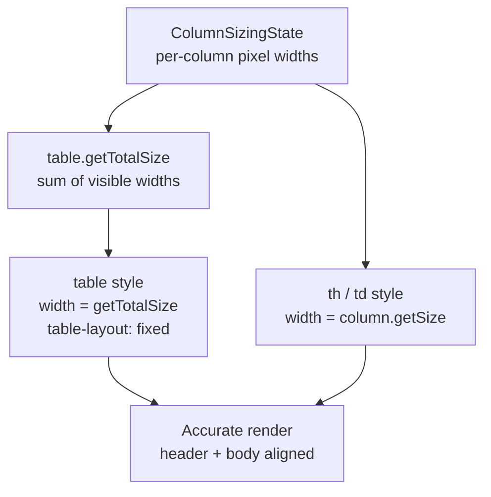

## TanStack Table — Column Features — Column Resizing

### Overview

Column resizing allows users to drag column boundaries to adjust widths at runtime. TanStack Table provides a sizing state model, resize direction options, header resize handle APIs, and offset calculation helpers. The library tracks sizes in state but does not apply CSS or render drag handles — the consuming UI owns all DOM and styling concerns.

---

### Sizing State Shape

```ts
type ColumnSizingState = Record<string, number>

type ColumnSizingInfoState = {
  columnSizingStart: [string, number][]
  deltaOffset: number | null
  deltaPercentage: number | null
  isResizingColumn: string | false
  startOffset: number | null
  startSize: number | null
}
```

- `ColumnSizingState` — maps column IDs to pixel widths.
- `ColumnSizingInfoState` — transient state tracking an in-progress resize gesture. Not typically read directly by consumers.

---

### Column Size Options

Size constraints are defined per column in the column definition.

```ts
const columns = [
  {
    accessorKey: 'name',
    header: 'Name',
    size: 200,       // default width in pixels
    minSize: 80,     // minimum width (default: 20)
    maxSize: 400,    // maximum width (default: Number.MAX_SAFE_INTEGER)
  },
  {
    accessorKey: 'email',
    header: 'Email',
    size: 250,
    minSize: 100,
  },
]
```

**Key Points:**
- `size` sets the initial width. If omitted, the default is `150`.
- `minSize` and `maxSize` are enforced during resize via the table APIs.
- These values are in pixels by convention, but TanStack Table treats them as unitless numbers — the consuming UI decides how to interpret them. [Inference]

---

### Table-Level Size Options

```ts
const table = useReactTable({
  data,
  columns,
  getCoreRowModel: getCoreRowModel(),
  defaultColumn: {
    size: 150,
    minSize: 20,
    maxSize: Number.MAX_SAFE_INTEGER,
  },
})
```

`defaultColumn` provides fallback values for any column that does not specify its own size constraints.

---

### Column Resize Mode

```ts
type ColumnResizeMode = 'onChange' | 'onEnd'
```

```ts
const table = useReactTable({
  data,
  columns,
  getCoreRowModel: getCoreRowModel(),
  columnResizeMode: 'onChange', // default
})
```

| Mode | Behavior |
|---|---|
| `'onChange'` | Sizing state updates continuously as the user drags |
| `'onEnd'` | Sizing state updates only when the drag gesture ends |

**Key Points:**
- `'onChange'` produces live resize feedback but triggers more frequent re-renders.
- `'onEnd'` reduces render frequency during drag at the cost of no live preview unless the consuming UI reads `columnSizingInfo` directly.
- Behavior is not guaranteed to be identical across pointer devices (mouse vs. touch). [Inference]

---

### Column Resize Direction

```ts
type ColumnResizeDirection = 'ltr' | 'rtl'
```

```ts
const table = useReactTable({
  data,
  columns,
  getCoreRowModel: getCoreRowModel(),
  columnResizeDirection: 'ltr', // default
})
```

Set to `'rtl'` for right-to-left layouts so resize drag directions are inverted correctly.

---

### Enabling and Disabling Resize Per Column

```ts
const columns = [
  {
    accessorKey: 'id',
    header: 'ID',
    enableResizing: false, // this column cannot be resized
    size: 60,
  },
  {
    accessorKey: 'name',
    header: 'Name',
    enableResizing: true, // default
  },
]
```

A table-level `enableColumnResizing` option similarly controls all columns at once.

```ts
const table = useReactTable({
  data,
  columns,
  getCoreRowModel: getCoreRowModel(),
  enableColumnResizing: false,
})
```

Column-level `enableResizing` takes precedence over the table-level option. [Inference]

---

### Sizing and Resizing APIs

#### On the `table` instance

| Method | Description |
|---|---|
| `table.setColumnSizing(updater)` | Directly sets `ColumnSizingState` |
| `table.setColumnSizingInfo(updater)` | Sets transient resize gesture state |
| `table.resetColumnSizing(defaultState?)` | Resets all column sizes to defaults |
| `table.resetHeaderSizeInfo(defaultState?)` | Resets transient sizing info |
| `table.getTotalSize()` | Returns sum of all visible column widths |
| `table.getLeftTotalSize()` | Sum of left-pinned column widths |
| `table.getCenterTotalSize()` | Sum of center (unpinned) column widths |
| `table.getRightTotalSize()` | Sum of right-pinned column widths |

#### On a `column` instance

| Method | Description |
|---|---|
| `column.getSize()` | Current width; reflects sizing state or column `size` default |
| `column.getStart(position?)` | Cumulative pixel offset from the left (or right for RTL) |
| `column.getAfter(position?)` | Cumulative pixel offset from the right edge |
| `column.resetSize()` | Resets this column to its default size |
| `column.getCanResize()` | `true` if resizing is permitted |
| `column.getIsResizing()` | `true` if a resize gesture is currently active on this column |

#### On a `header` instance

| Method | Description |
|---|---|
| `header.getSize()` | Width of this header (accounts for colspan in grouped headers) |
| `header.getStart()` | Pixel offset of this header from the left |
| `header.getResizeHandler()` | Returns a pointer/mouse/touch event handler to attach to the resize handle element |
| `header.column.getIsResizing()` | Whether this column is currently being resized |

---

### `getResizeHandler`

This is the primary integration point. It returns a handler that manages the full resize gesture lifecycle — pointer capture, delta calculation, clamping to `minSize`/`maxSize`, and state updates.

```ts
header.getResizeHandler(): (event: unknown) => void
```

Attach it to a drag handle element within the header cell.

---

### Basic Resize Handle Implementation

```tsx
<thead>
  {table.getHeaderGroups().map(headerGroup => (
    <tr key={headerGroup.id}>
      {headerGroup.headers.map(header => (
        <th
          key={header.id}
          style={{ width: `${header.getSize()}px`, position: 'relative' }}
        >
          {header.isPlaceholder
            ? null
            : flexRender(header.column.columnDef.header, header.getContext())}

          {/* Resize handle */}
          {header.column.getCanResize() && (
            <div
              onMouseDown={header.getResizeHandler()}
              onTouchStart={header.getResizeHandler()}
              style={{
                position: 'absolute',
                right: 0,
                top: 0,
                height: '100%',
                width: '5px',
                cursor: 'col-resize',
                userSelect: 'none',
                touchAction: 'none',
              }}
              className={header.column.getIsResizing() ? 'resizing' : ''}
            />
          )}
        </th>
      ))}
    </tr>
  ))}
</thead>
```

**Key Points:**
- `touchAction: 'none'` on the handle prevents the browser from intercepting touch events intended for the drag gesture.
- `userSelect: 'none'` prevents text selection during drag.
- Both `onMouseDown` and `onTouchStart` should be attached for cross-device support.

---

### Applying Column Widths to Cells

Column widths must also be applied to body cells. Without this, the header and body columns diverge visually.

```tsx
<tbody>
  {table.getRowModel().rows.map(row => (
    <tr key={row.id}>
      {row.getVisibleCells().map(cell => (
        <td
          key={cell.id}
          style={{ width: `${cell.column.getSize()}px` }}
        >
          {flexRender(cell.column.columnDef.cell, cell.getContext())}
        </td>
      ))}
    </tr>
  ))}
</tbody>
```

---

### Table Width Strategy

TanStack Table tracks total width via `table.getTotalSize()`. Setting `table-layout: fixed` with an explicit `width` on the `<table>` element allows column widths to be respected precisely.

```tsx
<table
  style={{
    width: `${table.getTotalSize()}px`,
    tableLayout: 'fixed',
  }}
>
```

Without `table-layout: fixed`, browsers distribute remaining space independently and column widths from state may not match rendered widths. [Inference: Browser table layout algorithms vary; this is a well-known CSS behavior.]



---

### Live Resize Preview with `onEnd` Mode

When using `columnResizeMode: 'onEnd'`, the sizing state does not update during drag. To still show a live preview, read the transient `columnSizingInfo` state and compute an adjusted display width.

```ts
// Utility to compute display size during active resize
function getDisplaySize(header: Header<unknown, unknown>, table: Table<unknown>): number {
  const sizingInfo = table.getState().columnSizingInfo

  if (
    sizingInfo.isResizingColumn === header.column.id &&
    sizingInfo.deltaOffset !== null
  ) {
    return Math.max(
      header.column.columnDef.minSize ?? 20,
      header.getSize() + sizingInfo.deltaOffset
    )
  }

  return header.getSize()
}
```

Apply `getDisplaySize(header, table)` in place of `header.getSize()` during render. [Inference: This is a derived pattern; exact deltaOffset semantics should be verified against the version in use.]

---

### Column Sizing and Memoization

With `columnResizeMode: 'onChange'`, every pointer move event updates sizing state and triggers a re-render. For large tables this can cause performance issues.

A common mitigation is memoizing column size data outside the render cycle:

```tsx
// Memoize column sizes to avoid recalculating on every render
const columnSizeVars = React.useMemo(() => {
  const headers = table.getFlatHeaders()
  const colSizes: Record<string, number> = {}
  for (const header of headers) {
    colSizes[`--col-${header.column.id}-size`] = header.column.getSize()
  }
  return colSizes
}, [table.getState().columnSizing, table.getState().columnSizingInfo])
```

Apply as CSS custom properties on the table container:

```tsx
<div style={columnSizeVars}>
  <table style={{ tableLayout: 'fixed', width: `${table.getTotalSize()}px` }}>
    ...
  </table>
</div>
```

Then reference in column styles:

```tsx
<th style={{ width: `var(--col-${header.column.id}-size)px` }}>
```

**Key Points:**
- This pattern limits re-renders to the `columnSizeVars` memo and the container `style` update, rather than re-rendering every cell.
- Whether this produces measurable improvement depends on table size, row count, and cell complexity. Behavior may vary. [Inference]

---

### Interaction with Column Pinning

`column.getStart('left')` and `column.getAfter('right')` use sizing state to compute sticky offsets for pinned columns. Resizing a pinned column updates the offset of all subsequent pinned columns automatically because offsets are derived from `column.getSize()` at render time.

---

### Interaction with Column Visibility

Hidden columns are excluded from `getTotalSize()` and do not contribute to offset calculations. Resizing state is preserved for hidden columns — their size is retained in `columnSizing` and restored when the column becomes visible again.

---

### Persisting Column Sizes

```ts
const [columnSizing, setColumnSizing] = React.useState<ColumnSizingState>(() => {
  const saved = localStorage.getItem('column-sizing')
  return saved ? JSON.parse(saved) : {}
})

const handleSizingChange: OnChangeFn<ColumnSizingState> = updater => {
  const next = typeof updater === 'function' ? updater(columnSizing) : updater
  setColumnSizing(next)
  localStorage.setItem('column-sizing', JSON.stringify(next))
}

const table = useReactTable({
  data,
  columns,
  getCoreRowModel: getCoreRowModel(),
  state: { columnSizing },
  onColumnSizingChange: handleSizingChange,
})
```

---

### Common Mistakes

| Mistake | Consequence | Correction |
|---|---|---|
| Omitting `table-layout: fixed` | Browser overrides column widths; state and render diverge | Set `table-layout: fixed` and `width: getTotalSize()px` on `<table>` |
| Not applying `width` to `<td>` cells | Body cells do not follow header widths | Apply `cell.column.getSize()` to each `<td>` |
| Missing `touchAction: 'none'` on handle | Touch scroll intercepts resize drag on mobile | Add `touchAction: 'none'` to the handle element |
| Using `'onChange'` mode on large tables without memoization | Frequent re-renders during drag degrade performance | Use CSS custom property pattern or switch to `'onEnd'` |
| Not clamping in `onEnd` live preview | Preview can exceed `minSize`/`maxSize` | Manually clamp using column's `minSize`/`maxSize` in the display size utility |

---

**Related Topics:**
- Column Pinning — sticky offset accuracy depends on sizing state
- Column Visibility — hidden columns and preserved sizing state
- Column Ordering — sizing state is keyed by ID, unaffected by order changes
- Virtualization — column resizing with virtual columns
- CSS `table-layout` — fixed vs. auto layout algorithm behavior
- Memoization Patterns — limiting re-renders during continuous resize events