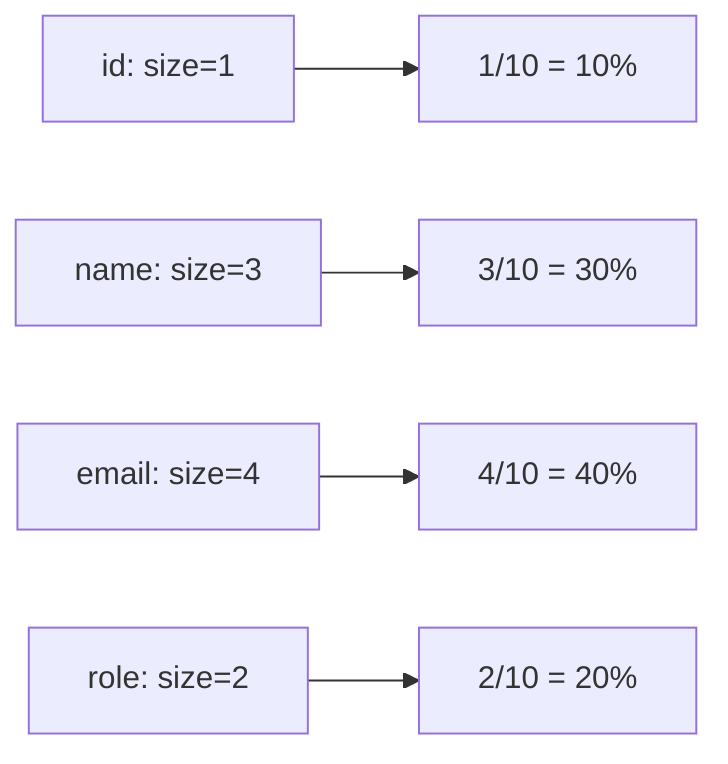
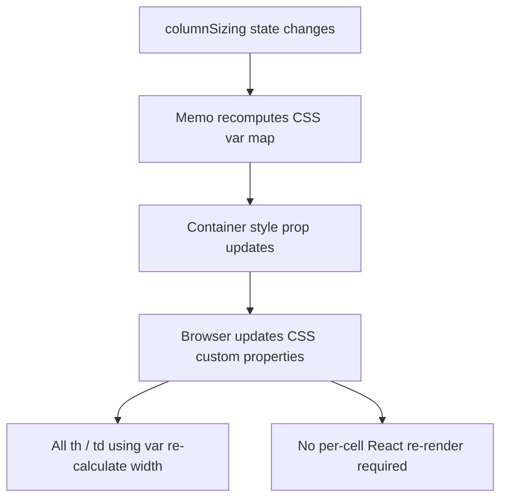

## TanStack Table — Column Features — Column Sizing Units

### Overview

TanStack Table treats all column size values as unitless numbers. The library performs arithmetic on them — summing totals, computing offsets, clamping to min/max — but never interprets them as pixels, percentages, or any other CSS unit. The consuming UI decides what the numbers mean and how to translate them into CSS. This separation enables several sizing strategies beyond the default pixel approach.

---

### The Unitless Model

All sizing state values — `size`, `minSize`, `maxSize`, `columnSizing` entries, `getTotalSize()`, `getSize()`, `getStart()`, `getAfter()` — are plain numbers with no attached unit.

```ts
// TanStack Table only sees: { name: 200, email: 300 }
// It does not know or care whether 200 means pixels, rem, or a fraction
const columns = [
  { accessorKey: 'name', size: 200 },
  { accessorKey: 'email', size: 300 },
]
```

The library's internal sizing arithmetic is consistent regardless of what the numbers represent, provided the consuming UI applies them with a matching interpretation. [Inference: This is based on the library's design; verify against the specific version in use.]

---

### Strategy 1 — Pixels (Default Convention)

The most common approach. Size values are treated as pixel widths and applied directly to element styles.

```tsx
// Column definitions
const columns = [
  { accessorKey: 'id',    size: 60,  minSize: 40,  maxSize: 120  },
  { accessorKey: 'name',  size: 200, minSize: 100, maxSize: 400  },
  { accessorKey: 'email', size: 250, minSize: 120              },
]

// Applied in render
<th style={{ width: `${header.getSize()}px` }}>
<td style={{ width: `${cell.column.getSize()}px` }}>

// Table container
<table style={{
  width: `${table.getTotalSize()}px`,
  tableLayout: 'fixed',
}}>
```

**Key Points:**
- `table-layout: fixed` is required for the browser to honor explicit column widths.
- `getTotalSize()` returns the sum of all visible column sizes, which equals the intended table width in pixels.
- This is the approach assumed by all TanStack Table documentation and examples. [Unverified: whether all official examples use pixels exclusively — treat as likely convention.]

---

### Strategy 2 — Percentage Widths

Size values can represent percentages. The consuming UI applies them as `%` units.

```tsx
const columns = [
  { accessorKey: 'id',    size: 10  }, // 10%
  { accessorKey: 'name',  size: 30  }, // 30%
  { accessorKey: 'email', size: 40  }, // 40%
  { accessorKey: 'role',  size: 20  }, // 20%
]
// Total: 100

<th style={{ width: `${header.getSize()}%` }}>
<td style={{ width: `${cell.column.getSize()}%` }}>

<table style={{ width: '100%', tableLayout: 'fixed' }}>
```

**Key Points:**
- The values should sum to 100 for the percentages to fill the container without overflow or gap.
- `getTotalSize()` returns the raw numeric sum (e.g., 100), not a percentage string — the UI must append `%`.
- Percentage sizing adapts to container width automatically without JavaScript measurement.
- Resize gestures via `getResizeHandler()` produce pixel deltas. Applying a pixel delta to a percentage-based size produces a value that is no longer a valid percentage. [Inference: A unit conversion step is needed when combining resize with percentage columns — see the section on resizing with non-pixel units below.]

---

### Strategy 3 — Fractional Units (flex-like)

Size values act as flex weights. The consuming UI computes actual widths by dividing each column's size by the total.

```ts
// Sizes as weights
const columns = [
  { accessorKey: 'id',    size: 1 },
  { accessorKey: 'name',  size: 3 },
  { accessorKey: 'email', size: 4 },
  { accessorKey: 'role',  size: 2 },
]
// Total weight: 10
```

```tsx
// Compute fractional width per column
function getFractionalWidth(column: Column<unknown>, table: Table<unknown>): string {
  const total = table.getTotalSize() // sum of all weights = 10
  const fraction = column.getSize() / total
  return `${(fraction * 100).toFixed(2)}%`
}

<th style={{ width: getFractionalWidth(header.column, table) }}>
<table style={{ width: '100%', tableLayout: 'fixed' }}>
```



**Key Points:**
- This behaves similarly to CSS `fr` units in grid layout.
- The total weight is dynamic — adding or removing columns changes all fractions proportionally.
- Fractional sizing is straightforward for initial layout but requires careful handling when combined with resize gestures, since resize deltas are unitless offsets, not weight changes. [Inference]

---

### Strategy 4 — CSS Custom Properties (Variable Injection)

Instead of inlining sizes directly in element styles, size values are injected as CSS custom properties on a container element and consumed by CSS rules. This approach is particularly useful for performance optimization during resize.

```tsx
// Build CSS variable map from all column sizes
const columnSizeVars = React.useMemo(() => {
  const vars: Record<string, number> = {}
  for (const header of table.getFlatHeaders()) {
    vars[`--col-${header.column.id}-size`] = header.column.getSize()
  }
  vars['--table-total-size'] = table.getTotalSize()
  return vars
}, [table.getState().columnSizing, table.getState().columnSizingInfo])

// Apply to container
<div style={columnSizeVars as React.CSSProperties}>
  <table style={{ width: 'var(--table-total-size)px', tableLayout: 'fixed' }}>
```

```css
/* In stylesheet */
th[data-column-id='name'] {
  width: calc(var(--col-name-size) * 1px);
}
```

Or inline via a template:

```tsx
<th
  data-column-id={header.column.id}
  style={{ width: `calc(var(--col-${header.column.id}-size) * 1px)` }}
>
```

**Key Points:**
- The `calc(var(...) * 1px)` pattern converts the unitless CSS variable number to a pixel value inside CSS. This is necessary because CSS custom properties do not carry units — `width: var(--col-name-size)` is invalid without a unit attached.
- Updating custom properties on a container does not force child element re-renders in React — only the container style prop updates, making this approach more efficient during continuous resize. [Inference: Whether this produces measurable improvement depends on browser paint behavior and React version; behavior may vary.]



---

### Resizing with Non-Pixel Units

`getResizeHandler()` computes resize deltas in the same unitless numbers as the sizing state. When the sizing strategy is pixels, the delta maps directly to a pixel offset. When the strategy is percentages or fractions, the raw delta is not immediately meaningful as a unit of that strategy.

#### Converting Resize Deltas to Percentages

```ts
// During a resize gesture, deltaOffset is available in columnSizingInfo
const { deltaOffset } = table.getState().columnSizingInfo

// Container width must be known (e.g., measured via ResizeObserver)
const containerWidth = 800 // px

// Convert pixel delta to a percentage delta
const percentageDelta = (deltaOffset ?? 0) / containerWidth * 100
```

[Inference: This conversion requires knowing the container's rendered pixel width. Without it, the delta cannot be accurately mapped to a percentage unit. This is a derived pattern; verify behavior against actual resize events in your version.]

#### Fractional Unit Delta Conversion

```ts
// Convert pixel delta to a fractional weight delta
// Requires knowing the px-per-unit ratio
const totalWeight = table.getTotalSize()  // sum of weights
const containerWidth = 800               // rendered px width
const pxPerUnit = containerWidth / totalWeight

const weightDelta = (deltaOffset ?? 0) / pxPerUnit
```

[Inference: As above — requires runtime container measurement. Behavior not guaranteed.]

---

### Mixing Pixel and Non-Pixel Columns

TanStack Table has no built-in concept of mixed unit columns. All values participate in the same arithmetic. Mixing units (e.g., some columns in pixels, others as fractions) produces arithmetically inconsistent results from `getTotalSize()` and `getStart()`. [Inference: The library cannot detect or warn about mixed units.]

If mixed sizing is required, the consuming UI must maintain the unit distinction externally and bypass `getTotalSize()` and `getStart()` for offset calculations, computing its own layout values. [Speculation: Few implementations do this in practice; most choose a single strategy throughout.]

---

### Default Column Sizes

When no `size` is specified in the column definition and no `defaultColumn.size` override is provided, TanStack Table uses a built-in default.

```ts
// Built-in defaults
size: 150
minSize: 20
maxSize: Number.MAX_SAFE_INTEGER
```

These are the values returned by `column.getSize()` before any user resize or explicit state. Under the pixel convention, this means unspecified columns render at 150px wide.

---

### `getTotalSize` and Layout Width

```ts
table.getTotalSize(): number       // all visible columns
table.getLeftTotalSize(): number   // left-pinned
table.getCenterTotalSize(): number // center (unpinned)
table.getRightTotalSize(): number  // right-pinned
```

These are arithmetic sums. Under pixels, they give the table's intended pixel width. Under percentages (summing to 100), they give 100. Under fractional weights, they give the total weight. The consuming UI is responsible for interpreting the result correctly.

---

### Summary of Strategies

| Strategy | Size values represent | CSS applied as | `getTotalSize()` meaning | Resize delta handling |
|---|---|---|---|---|
| Pixels | px widths | `width: Npx` | Total px width | Direct — delta is in px |
| Percentage | % of container | `width: N%` | Sum (ideally 100) | Requires container px width to convert |
| Fractional | Flex weights | `width: N/total * 100%` | Total weight | Requires px-per-unit ratio |
| CSS vars | Any of above | `width: calc(var(--col-X-size) * 1px)` | Same as chosen strategy | Same as chosen strategy |

---

### Common Mistakes

| Mistake | Consequence | Correction |
|---|---|---|
| Applying unitless values directly as `width: N` | Invalid CSS; column widths ignored | Always append a unit string: `Npx`, `N%`, or `calc(var(--col-X) * 1px)` |
| Mixing units across columns | `getTotalSize()` and `getStart()` return arithmetically inconsistent values | Choose a single unit strategy across all columns |
| Using percentage widths with resize without delta conversion | Resize produces incorrect percentage values | Convert pixel delta to percentage using container width |
| Assuming `getStart()` returns pixels when using fractional units | Offset is in weight units, not pixels | Compute offsets manually or use pixel strategy for pinned columns |
| Forgetting `table-layout: fixed` with explicit widths | Browser layout algorithm overrides column widths | Set `table-layout: fixed` on the `<table>` element |

---

**Related Topics:**
- Column Resizing — resize handler integration and `columnResizeMode`
- Column Pinning — `getStart` / `getAfter` offset accuracy under different unit strategies
- CSS `table-layout` — fixed vs. auto layout algorithm behavior
- CSS Custom Properties — variable injection pattern for resize performance
- ResizeObserver — measuring container width for percentage/fractional delta conversion
- Virtualization — column width strategies under virtual column rendering