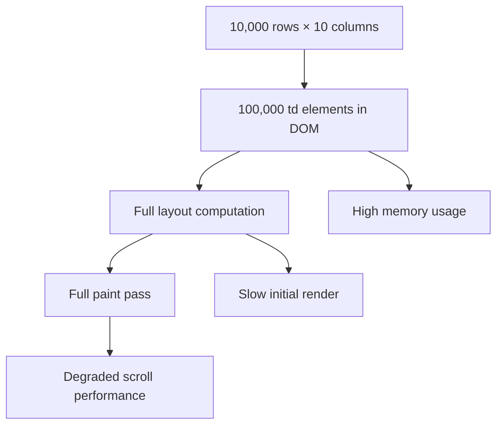
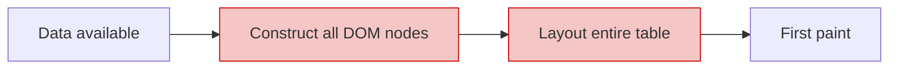
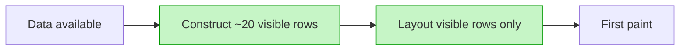
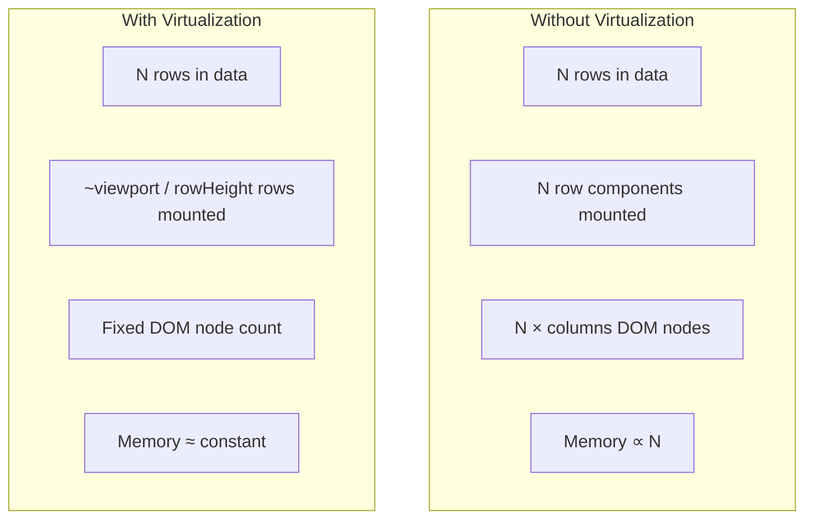
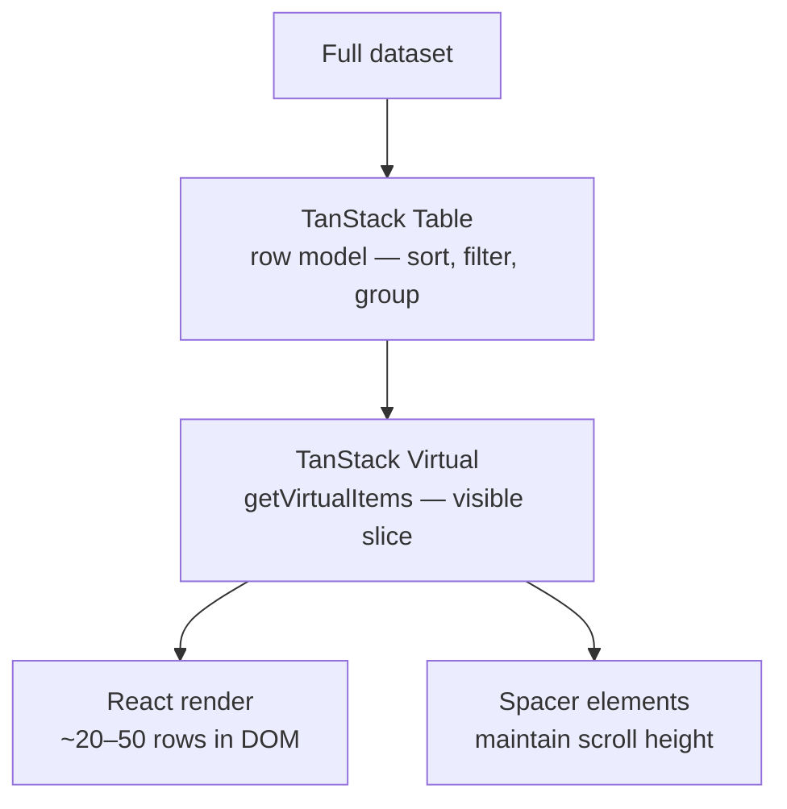

## TanStack Table — Virtualization — Why Virtualize Rows

### Overview

Row virtualization is the practice of rendering only the rows currently visible in the viewport rather than the entire dataset. As table row counts grow, rendering every row simultaneously produces measurable degradation in initial render time, scroll performance, and memory consumption. Virtualization addresses these costs by keeping the DOM minimal and proportional to the visible area rather than the data size.

---

### The Cost of Full Rendering

When a table renders every row unconditionally, the browser must:

1. Create and insert a DOM node for every cell in every row.
2. Compute layout for the entire table.
3. Paint all rows, including those outside the viewport.
4. Retain all DOM nodes in memory for the lifetime of the component.

For a table with 10,000 rows and 10 columns, that is 100,000 `<td>` elements plus structural elements — present in the DOM whether or not the user can see them.



---

### DOM Node Count and Browser Cost

Each DOM node carries overhead: memory allocation, style resolution, layout participation, and event system registration. These costs are roughly linear — more nodes means proportionally more work at each phase.

**Key Points:**
- Browsers have practical limits beyond which layout and paint times become noticeable. The exact threshold varies by device, browser, and cell complexity, but tables with tens of thousands of rows reliably produce sluggishness on mid-range hardware. [Inference: Specific thresholds are not guaranteed and vary by environment.]
- Complex cell content (nested elements, images, interactive controls) multiplies per-node cost significantly compared to plain text cells.
- The cost is incurred on every render — not just the initial one. State changes that trigger re-renders re-process the full node tree.

---

### Initial Render Time

Without virtualization, the browser cannot display anything until the full DOM is constructed and laid out. For large datasets this introduces a perceptible delay between data arrival and first visible output.



With virtualization, only the rows filling the viewport are constructed. First paint occurs after a small, fixed number of nodes are created regardless of total dataset size.



---

### Scroll Performance

Scroll performance is measured in frames per second. At 60fps, the browser has approximately 16ms per frame to handle scroll events, update positions, run JavaScript, and repaint. DOM-heavy tables consume a disproportionate share of that budget.

With full rendering:
- The browser must composite and repaint a large portion of the page on every scroll event.
- Even if individual rows are not re-rendered by React, the browser's own layout and paint work scales with DOM size.

With virtualization:
- Only the visible subset of rows exists in the DOM.
- As the user scrolls, rows entering the viewport are mounted and rows leaving it are unmounted (or repositioned in some implementations).
- The total DOM size remains approximately constant regardless of how far the user scrolls.

[Inference: The exact scroll performance improvement depends on cell complexity, browser, and hardware. Virtualization reduces DOM size but introduces its own overhead — scroll event handling, position recalculation, and React reconciliation for mount/unmount cycles.]

---

### Memory Usage

Every mounted React component and every DOM node consumes memory. For large tables:

- React maintains a fiber tree entry for every rendered component.
- The browser maintains a layout object for every DOM node.
- Event listeners, inline styles, and refs add further per-node overhead.

Virtualization keeps the number of live components and DOM nodes proportional to the viewport height divided by row height — typically 20–100 rows — rather than proportional to the dataset size.



---

### When Full Rendering Is Acceptable

Virtualization introduces complexity. For smaller datasets it is unnecessary and counterproductive.

| Row Count | Typical Recommendation |
|---|---|
| < 100 | Full rendering is generally fine |
| 100 – 500 | Full rendering often acceptable; depends on cell complexity |
| 500 – 2,000 | Pagination or virtualization advisable |
| > 2,000 | Virtualization strongly advisable for smooth scroll |
| > 10,000 | Virtualization effectively required for usability |

[Inference: These thresholds are approximate and derived from general front-end performance guidance. They are not TanStack-specific benchmarks. Actual acceptable limits depend on cell complexity, device capability, and frame rate requirements.]

---

### Pagination as an Alternative

Pagination avoids large DOM trees by loading and displaying only a fixed page of rows at a time. It is simpler to implement than virtualization and appropriate when:

- The user workflow involves discrete page navigation rather than continuous scroll.
- The dataset is fetched from a server in pages (server-side pagination).
- The table does not need to support "scroll to row N" or preserve scroll position across data updates.

Virtualization is preferable when:

- Continuous scrolling is a UX requirement.
- The full dataset must be loaded client-side (e.g., for client-side sorting and filtering across all rows).
- The user needs to scroll freely through a large list without page boundaries.

[Inference: The choice between pagination and virtualization is a UX and architectural decision, not a pure performance one.]

---

### What TanStack Virtual Provides

TanStack Table does not include built-in row virtualization. It is designed to integrate with **TanStack Virtual** (`@tanstack/react-virtual`), a separate headless virtualizer library from the same ecosystem.

TanStack Virtual handles:
- Calculating which items are currently in the viewport (`getVirtualItems()`).
- Computing total scroll height so the scrollbar reflects the full dataset.
- Providing item offsets for absolute positioning of visible rows.

TanStack Table handles:
- Row model (sorting, filtering, grouping, pagination applied to the full dataset).
- Cell rendering, column features, and state management.

The integration point is: TanStack Table produces the full sorted/filtered row model; TanStack Virtual selects the visible slice; the UI renders only that slice.



---

### The Spacer / Total Height Pattern

For the scrollbar to accurately represent the full dataset, the scroll container must have the total logical height of all rows — even the unrendered ones. This is achieved by placing a spacer element whose height equals `totalSize` (from the virtualizer) and absolutely positioning visible rows within it.

```tsx
<div
  style={{
    height: `${rowVirtualizer.getTotalSize()}px`,
    position: 'relative',
  }}
>
  {rowVirtualizer.getVirtualItems().map(virtualRow => (
    <div
      key={virtualRow.key}
      style={{
        position: 'absolute',
        top: `${virtualRow.start}px`,
        height: `${virtualRow.size}px`,
      }}
    >
      {/* render table row */}
    </div>
  ))}
</div>
```

Without the spacer, the scroll container collapses to the height of the rendered rows only, producing a scrollbar that does not reflect the full dataset. [Inference: Exact implementation varies by layout strategy — translate3d-based positioning is a common alternative to `top`.]

---

### Variable Row Heights

A fixed row height assumption simplifies virtualization significantly. Variable row heights — where each row can differ in size — require the virtualizer to either:

1. **Estimate** row heights upfront and correct as rows are measured.
2. **Measure** rendered rows after mount and update size estimates.

TanStack Virtual supports variable row heights via the `measureElement` API. This introduces additional complexity: rows must be measured after render, measurements must be cached, and scroll position may shift as estimates are corrected. [Inference: Variable height virtualization is more complex and may produce visible scroll position jumps during initial load if estimates are inaccurate.]

---

### Virtualization Trade-offs

| Benefit | Cost |
|---|---|
| Constant DOM size regardless of data size | Scroll event overhead for mount/unmount |
| Fast initial render | More complex implementation |
| Lower memory usage | Fixed row heights are simpler; variable heights add complexity |
| Smooth scroll on large datasets | "Find in page" browser search does not find unrendered rows |
| Works with client-side sort and filter | Accessibility tools may not enumerate unrendered rows |

[Inference: The accessibility limitation — screen readers and assistive technologies may only enumerate mounted rows — is a known trade-off of virtualization approaches generally. Exact behavior varies by assistive technology and implementation.]

---

**Related Topics:**
- TanStack Virtual — `useVirtualizer` API and configuration
- Row Virtualization Implementation — integrating `useVirtualizer` with TanStack Table
- Column Virtualization — virtualizing columns for tables with very wide schemas
- Variable Row Heights — `measureElement` and dynamic size estimation
- Pagination — server-side and client-side pagination as an alternative
- Scroll to Row — programmatic scroll position control with a virtualizer
- Accessibility and Virtualization — screen reader behavior with partial DOM rendering