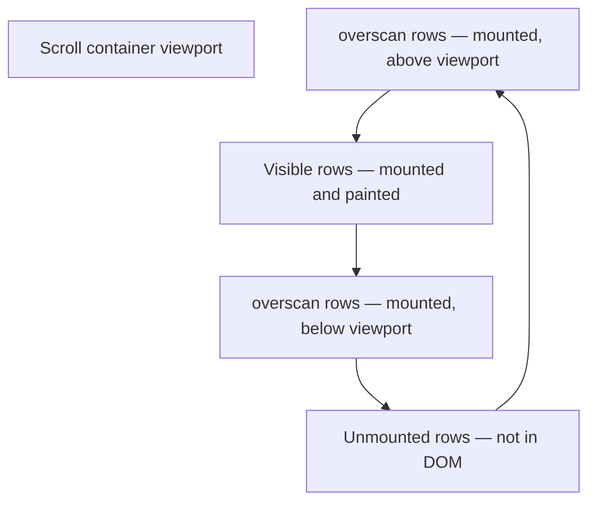

## TanStack Virtual — `useVirtualizer` Basics

### Overview

`useVirtualizer` is the core hook of `@tanstack/react-virtual`. It accepts a list configuration — item count, scroll element reference, and size estimator — and returns a virtualizer instance that computes which items are currently visible and where to position them. It does not render anything; the consuming UI owns all DOM output.

---

### Installation

```bash
npm install @tanstack/react-virtual
```

`@tanstack/react-virtual` is a separate package from `@tanstack/react-table`. The two are designed to integrate but have independent versioning and installation.

---

### Minimal Setup

```tsx
import { useVirtualizer } from '@tanstack/react-virtual'
import React from 'react'

function VirtualList() {
  const parentRef = React.useRef<HTMLDivElement>(null)

  const virtualizer = useVirtualizer({
    count: 10000,
    getScrollElement: () => parentRef.current,
    estimateSize: () => 35,
  })

  return (
    <div
      ref={parentRef}
      style={{ height: '400px', overflow: 'auto' }}
    >
      {/* Total height spacer */}
      <div style={{ height: `${virtualizer.getTotalSize()}px`, position: 'relative' }}>
        {virtualizer.getVirtualItems().map(virtualItem => (
          <div
            key={virtualItem.key}
            style={{
              position: 'absolute',
              top: 0,
              left: 0,
              width: '100%',
              height: `${virtualItem.size}px`,
              transform: `translateY(${virtualItem.start}px)`,
            }}
          >
            Row {virtualItem.index}
          </div>
        ))}
      </div>
    </div>
  )
}
```

**Key Points:**
- The scroll container (`parentRef`) must have a fixed height and `overflow: auto` or `overflow: scroll`.
- The inner spacer div must have `height: getTotalSize()` so the scrollbar reflects the full dataset.
- Visible items are absolutely positioned using `transform: translateY(virtualItem.start)`.
- `estimateSize` is called with each item index and returns an estimated height in pixels.

---

### Core Options

```ts
useVirtualizer({
  count: number,
  getScrollElement: () => HTMLElement | null,
  estimateSize: (index: number) => number,
  // ... additional options
})
```

#### `count`

Total number of items to virtualize. The virtualizer uses this to compute total scroll height.

```ts
count: rows.length
```

#### `getScrollElement`

A function returning the scrollable DOM element. Must return the element that has `overflow: auto/scroll` set — not a parent or child of it.

```ts
getScrollElement: () => parentRef.current
```

[Inference: Returning the wrong element — a non-scrolling ancestor or the document body when the scroll container is a nested div — is a common source of virtualization not working. Behavior may vary by browser.]

#### `estimateSize`

A function called with the item index that returns an estimated size in pixels. For fixed-height rows, return a constant. For variable heights, return a best guess.

```ts
estimateSize: () => 35          // fixed height — all rows 35px
estimateSize: (i) => i % 2 === 0 ? 35 : 60  // alternating heights
```

**Key Points:**
- For fixed-height lists, accuracy is exact. For variable heights, this is an estimate that the virtualizer corrects after measurement.
- A poor estimate for variable heights causes scroll position inaccuracies until measurements are collected. [Inference]

---

### The `VirtualItem` Object

`getVirtualItems()` returns an array of `VirtualItem` objects representing currently visible items.

```ts
type VirtualItem = {
  index: number    // index into the original data array
  key: string | number  // stable key for React reconciliation
  start: number    // pixel offset from the top of the scroll container
  end: number      // start + size
  size: number     // height of this item (estimated or measured)
  lane: number     // used for multi-lane (masonry) layouts; 0 for standard lists
}
```

**`index`** is the position in the source data array. Always use `data[virtualItem.index]` to access the item.

**`key`** should be used as the React `key` prop rather than `virtualItem.index` to ensure stable reconciliation when items are added, removed, or reordered. [Inference: Using `index` as `key` may cause React to reuse the wrong component instance during data changes.]

**`start`** is the pixel distance from the top of the scroll content area where this item should be positioned.

---

### `getTotalSize`

```ts
virtualizer.getTotalSize(): number
```

Returns the total pixel height of all items combined. This is the height that the spacer element must have so the scroll container's scrollbar accurately represents the full dataset.

Under fixed row heights: `getTotalSize() === count × estimateSize()`.

Under variable heights: `getTotalSize()` is updated as items are measured and estimates are refined.

---

### Positioning Strategy: `transform` vs `top`

Two common approaches to positioning virtual items:

#### `transform: translateY` (recommended)

```tsx
style={{
  position: 'absolute',
  transform: `translateY(${virtualItem.start}px)`,
}}
```

- GPU-composited in most browsers; does not trigger layout recalculation.
- Preferred for performance. [Inference: Whether compositing occurs depends on browser and surrounding CSS context; not guaranteed.]

#### `top` offset

```tsx
style={{
  position: 'absolute',
  top: `${virtualItem.start}px`,
}}
```

- Triggers layout recalculation on change.
- Simpler to reason about; may be needed in contexts where `transform` interferes with other CSS (e.g., `position: sticky` inside a transformed ancestor).

---

### Scroll Container Requirements

The scroll element must:

- Have an explicit height (fixed px, `vh`, or constrained by a flex/grid parent).
- Have `overflow: auto` or `overflow: scroll` set.
- Be the direct scroll ancestor of the virtual items.

```tsx
// Correct — scroll element has explicit height and overflow
<div ref={parentRef} style={{ height: '600px', overflow: 'auto' }}>

// Incorrect — no height; container collapses to content height
<div ref={parentRef} style={{ overflow: 'auto' }}>
```

[Inference: A scroll container without an explicit height will expand to fit all content, meaning it never actually scrolls. The virtualizer receives scroll events but the scroll position never changes.]

---

### Additional Configuration Options

```ts
useVirtualizer({
  count,
  getScrollElement,
  estimateSize,

  overscan: 5,
  // Number of items to render beyond the visible boundary on each side.
  // Default: 3. Higher values reduce blank flashes during fast scroll
  // at the cost of more DOM nodes.

  scrollMargin: 0,
  // Pixel offset subtracted from scroll position calculations.
  // Useful when the scroll element has a sticky header consuming space
  // at the top of the scroll area.

  gap: 8,
  // Pixel gap between items. Included in offset calculations.
  // Default: 0.

  paddingStart: 0,
  // Extra padding at the start (top) of the scroll content.

  paddingEnd: 0,
  // Extra padding at the end (bottom) of the scroll content.

  initialOffset: 0,
  // Initial scroll offset in pixels. Used to restore scroll position.

  horizontal: false,
  // Set to true for horizontal virtualization.

  getItemKey: (index) => index,
  // Custom key function. Return a stable, unique identifier per item.
  // Defaults to returning the index.

  onChange: (instance, sync) => void,
  // Callback fired when the virtualizer recalculates.
  // sync=true means the change was triggered synchronously.
})
```

---

### `overscan`

Overscan renders additional items above and below the visible window. This creates a small buffer so that during fast scrolling, items entering the viewport are already mounted before they become visible — reducing blank flicker.

```ts
overscan: 5 // render 5 extra rows above and below the visible area
```



**Key Points:**
- Higher overscan values reduce blank flicker during fast scroll but increase DOM node count.
- Very high overscan values partially defeat the purpose of virtualization. [Inference]
- Default is `3`.

---

### `getItemKey`

By default, `VirtualItem.key` equals the item index. For lists where items can be reordered, inserted, or deleted, provide a stable key function.

```ts
getItemKey: (index) => rows[index].id
```

This maps to `virtualItem.key`, which should be used as the React `key` prop:

```tsx
{virtualizer.getVirtualItems().map(virtualItem => (
  <div key={virtualItem.key}>
    {rows[virtualItem.index].name}
  </div>
))}
```

---

### `scrollMargin`

When the scroll container has a sticky header or other content above the list, the virtualizer's offset calculations must account for that space. `scrollMargin` subtracts the specified pixels from scroll position calculations.

```tsx
const headerHeight = 60

const virtualizer = useVirtualizer({
  count: rows.length,
  getScrollElement: () => parentRef.current,
  estimateSize: () => 35,
  scrollMargin: headerHeight,
})

// In the spacer:
<div style={{ height: `${virtualizer.getTotalSize()}px`, paddingTop: `${headerHeight}px` }}>
```

[Inference: The exact combination of `scrollMargin`, `paddingStart`, and manual offset depends on the layout. Verify against the version in use.]

---

### Virtualizer Instance Methods

```ts
virtualizer.getVirtualItems(): VirtualItem[]
// Currently visible items (plus overscan).

virtualizer.getTotalSize(): number
// Total scroll height of all items.

virtualizer.scrollToIndex(index, options?): void
// Programmatically scroll to bring an item into view.
// options: { align: 'start' | 'center' | 'end' | 'auto', behavior: 'smooth' | 'auto' }

virtualizer.scrollToOffset(offset, options?): void
// Scroll to a specific pixel offset.

virtualizer.measureElement(element): void
// Measure a DOM element and update the item's size.
// Used for variable height rows — attach via ref callback.

virtualizer.resizeItem(index, size): void
// Manually set the size of an item by index.
// Used when measurement is not feasible.
```

---

### `scrollToIndex`

```tsx
// Scroll to row 500, aligning it to the top of the viewport
virtualizer.scrollToIndex(500, { align: 'start' })

// Scroll to row 500, centering it if possible
virtualizer.scrollToIndex(500, { align: 'center' })

// Let the virtualizer choose the least disruptive alignment
virtualizer.scrollToIndex(500, { align: 'auto' })
```

**Key Points:**
- `'auto'` scrolls the minimum amount necessary to bring the item into view. If already visible, no scroll occurs.
- Under variable heights with unvisited items, `scrollToIndex` uses size estimates and may land slightly off. Accuracy improves once items have been measured. [Inference]

---

### Horizontal Virtualization

`useVirtualizer` supports horizontal lists by setting `horizontal: true`.

```tsx
const virtualizer = useVirtualizer({
  count: columns.length,
  getScrollElement: () => parentRef.current,
  estimateSize: () => 150,
  horizontal: true,
})

// Position items using translateX instead of translateY
style={{
  position: 'absolute',
  transform: `translateX(${virtualItem.start}px)`,
  height: '100%',
  width: `${virtualItem.size}px`,
}}
```

The scroll container must have `overflow-x: auto` and a fixed width.

---

### Relationship Between `useVirtualizer` and TanStack Table

`useVirtualizer` is unaware of TanStack Table. The integration is: TanStack Table produces the full row model array; `useVirtualizer` receives `rows.length` as `count` and `rows[virtualItem.index]` is used to access each row during render.

```ts
const rows = table.getRowModel().rows  // full sorted/filtered row array

const virtualizer = useVirtualizer({
  count: rows.length,
  getScrollElement: () => parentRef.current,
  estimateSize: () => 35,
})

// In render:
{virtualizer.getVirtualItems().map(virtualItem => {
  const row = rows[virtualItem.index]  // TanStack Table row
  return (
    <tr key={row.id} style={{ transform: `translateY(${virtualItem.start}px)` }}>
      {row.getVisibleCells().map(cell => (
        <td key={cell.id}>
          {flexRender(cell.column.columnDef.cell, cell.getContext())}
        </td>
      ))}
    </tr>
  )
})}
```

---

### Common Mistakes

| Mistake | Consequence | Correction |
|---|---|---|
| Scroll container has no explicit height | Container never scrolls; virtualizer receives no scroll events | Set a fixed `height` on the scroll element |
| Spacer element missing or wrong height | Scrollbar does not reflect full dataset | Set `height: getTotalSize()px` on the inner container |
| Using `virtualItem.index` as React `key` | Unstable reconciliation when data changes | Use `virtualItem.key` as React `key` |
| Accessing `data[virtualItem.key]` instead of `data[virtualItem.index]` | Wrong item rendered | Always index data with `virtualItem.index` |
| `getScrollElement` returns wrong element | Virtualizer does not track scroll position | Return the exact element with `overflow: auto/scroll` |
| Omitting `position: absolute` on items | Items stack in normal flow, not at computed offsets | All virtual items must be `position: absolute` |

---

**Related Topics:**
- Variable Row Heights — `measureElement` ref callback and size correction
- Row Virtualization with TanStack Table — full integration pattern
- Column Virtualization — `useVirtualizer` with `horizontal: true` for wide tables
- `scrollToIndex` — programmatic navigation in a virtualized list
- Overscan Tuning — balancing blank flash prevention against DOM node count
- Window Virtualization — `useWindowVirtualizer` for page-level scroll contexts
- Masonry / Multi-Lane Layouts — `lanes` option for grid-style virtualization