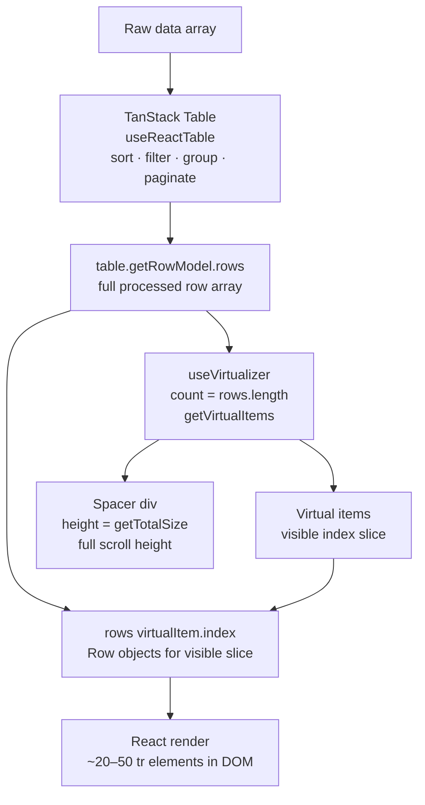
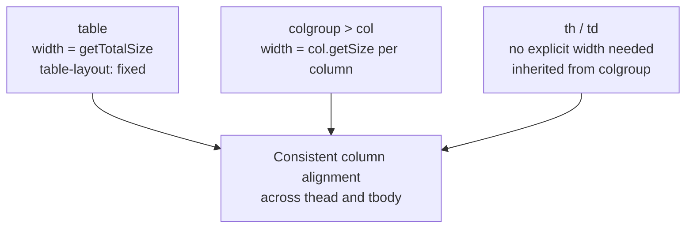
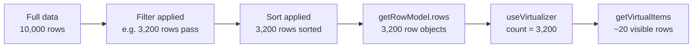

## TanStack Virtual — Row Virtualization with TanStack Table

### Overview

Integrating `useVirtualizer` with TanStack Table connects two headless systems: TanStack Table produces the full processed row array (sorted, filtered, grouped); `useVirtualizer` selects the visible slice; the UI renders only that slice into the DOM. Neither library knows about the other — the integration is entirely in the consuming component.

---

### Architecture



---

### Dependencies

```bash
npm install @tanstack/react-table @tanstack/react-virtual
```

Both packages are required. They are independent — neither lists the other as a peer dependency. [Inference: Version compatibility between the two is not enforced automatically; verify compatible major versions before installing.]

---

### Scroll Container Setup

The scroll container must have a fixed height and `overflow: auto`. For a full-page table, this is typically the `<div>` wrapping the `<table>` element.

```tsx
const parentRef = React.useRef<HTMLDivElement>(null)

<div
  ref={parentRef}
  style={{ height: '600px', overflow: 'auto' }}
>
  <table>...</table>
</div>
```

The `<table>` itself should not be the scroll element — tables have complex layout behavior that can interfere with scroll measurement. [Inference: Wrapping the table in a `<div>` scroll container is the standard pattern observed in TanStack examples.]

---

### Full Integration Example

```tsx
import React from 'react'
import {
  useReactTable,
  getCoreRowModel,
  getSortedRowModel,
  flexRender,
  type ColumnDef,
  type SortingState,
} from '@tanstack/react-table'
import { useVirtualizer } from '@tanstack/react-virtual'

type Person = {
  id: number
  name: string
  email: string
  role: string
}

const columns: ColumnDef<Person>[] = [
  { accessorKey: 'id',    header: 'ID',    size: 60  },
  { accessorKey: 'name',  header: 'Name',  size: 200 },
  { accessorKey: 'email', header: 'Email', size: 250 },
  { accessorKey: 'role',  header: 'Role',  size: 120 },
]

function VirtualTable({ data }: { data: Person[] }) {
  const parentRef = React.useRef<HTMLDivElement>(null)

  const [sorting, setSorting] = React.useState<SortingState>([])

  // ── TanStack Table ──────────────────────────────────────────
  const table = useReactTable({
    data,
    columns,
    state: { sorting },
    onSortingChange: setSorting,
    getCoreRowModel: getCoreRowModel(),
    getSortedRowModel: getSortedRowModel(),
  })

  const rows = table.getRowModel().rows  // full sorted/filtered array

  // ── TanStack Virtual ────────────────────────────────────────
  const virtualizer = useVirtualizer({
    count: rows.length,
    getScrollElement: () => parentRef.current,
    estimateSize: () => 40,
    overscan: 5,
  })

  const virtualItems = virtualizer.getVirtualItems()

  return (
    <div ref={parentRef} style={{ height: '600px', overflow: 'auto' }}>
      <table
        style={{
          width: `${table.getTotalSize()}px`,
          tableLayout: 'fixed',
          borderCollapse: 'collapse',
        }}
      >
        {/* ── Colgroup for column widths ── */}
        <colgroup>
          {table.getVisibleLeafColumns().map(col => (
            <col key={col.id} style={{ width: `${col.getSize()}px` }} />
          ))}
        </colgroup>

        {/* ── Header ── */}
        <thead style={{ position: 'sticky', top: 0, zIndex: 1 }}>
          {table.getHeaderGroups().map(headerGroup => (
            <tr key={headerGroup.id}>
              {headerGroup.headers.map(header => (
                <th
                  key={header.id}
                  onClick={header.column.getToggleSortingHandler()}
                  style={{ cursor: 'pointer' }}
                >
                  {flexRender(header.column.columnDef.header, header.getContext())}
                </th>
              ))}
            </tr>
          ))}
        </thead>

        {/* ── Body ── */}
        <tbody
          style={{
            height: `${virtualizer.getTotalSize()}px`,
            position: 'relative',
          }}
        >
          {virtualItems.map(virtualItem => {
            const row = rows[virtualItem.index]
            return (
              <tr
                key={row.id}
                data-index={virtualItem.index}
                style={{
                  position: 'absolute',
                  width: '100%',
                  height: `${virtualItem.size}px`,
                  transform: `translateY(${virtualItem.start}px)`,
                }}
              >
                {row.getVisibleCells().map(cell => (
                  <td key={cell.id}>
                    {flexRender(cell.column.columnDef.cell, cell.getContext())}
                  </td>
                ))}
              </tr>
            )
          })}
        </tbody>
      </table>
    </div>
  )
}
```

---

### The `<tbody>` Spacer Pattern

Standard table layout does not support `position: relative` on `<tbody>`. To maintain scroll height while absolutely positioning rows, `<tbody>` is given:

```tsx
<tbody
  style={{
    height: `${virtualizer.getTotalSize()}px`,
    position: 'relative',
    display: 'block', // required in some browsers for height + position to work on tbody
  }}
>
```

The `display: block` override removes `<tbody>` from the table layout algorithm, allowing it to behave as a block container. This is necessary for `position: relative` and explicit `height` to take effect.

**Key Points:**
- `display: block` on `<tbody>` breaks the native table column alignment between header and body. Column widths must be explicitly enforced via `<colgroup>`, `table-layout: fixed`, and `width` on the `<table>` element.
- Without `display: block`, browsers may ignore `height` and `position: relative` on `<tbody>`. [Inference: Browser behavior varies; this is a known constraint of table layout.]

---

### Column Width Alignment

Because `<tbody>` uses `display: block`, and `<tr>` uses `position: absolute`, the table's native column alignment is broken. Column widths must be enforced explicitly.

Three layers work together:



```tsx
// table element
<table style={{ width: `${table.getTotalSize()}px`, tableLayout: 'fixed' }}>

// colgroup
<colgroup>
  {table.getVisibleLeafColumns().map(col => (
    <col key={col.id} style={{ width: `${col.getSize()}px` }} />
  ))}
</colgroup>
```

`<colgroup>` applies widths to both `<thead>` and `<tbody>` columns uniformly, which is the most reliable approach when `<tbody>` uses `display: block`. [Inference: `<colgroup>` width propagation behavior may vary under `display: block` across browsers; testing is advisable.]

---

### Sticky Header

With a scrolling container, the header must be sticky to remain visible. Apply `position: sticky; top: 0` to `<thead>`:

```tsx
<thead style={{ position: 'sticky', top: 0, zIndex: 1, background: 'white' }}>
```

**Key Points:**
- A background color is required on sticky headers; otherwise scrolling rows show through beneath them.
- `zIndex: 1` keeps the header above absolutely positioned rows.
- `position: sticky` on `<thead>` works when the scroll container is the wrapper `<div>`, not the `<table>` or `<tbody>`. [Inference: `position: sticky` behavior inside tables depends on the scroll ancestor; verify in target browsers.]
- When `scrollMargin` is needed in the virtualizer, it should equal the header's pixel height.

---

### `data-index` and `measureElement`

For variable row heights, rows must be measured after mount. The `data-index` attribute links a DOM element back to its virtual index so `measureElement` can update the virtualizer's size cache.

```tsx
<tr
  key={row.id}
  data-index={virtualItem.index}
  ref={virtualizer.measureElement}
  style={{
    position: 'absolute',
    width: '100%',
    transform: `translateY(${virtualItem.start}px)`,
    // No explicit height — determined by content
  }}
>
```

**Key Points:**
- When using `measureElement`, do not set an explicit `height` on the `<tr>` — the height is determined by content and measured by the virtualizer.
- `virtualizer.measureElement` is a ref callback. It reads `data-index` from the element to identify which item is being measured.
- The virtualizer updates `getTotalSize()` and item offsets as measurements are collected, which may cause scroll position adjustments during initial load. [Inference: Visible layout shift during measurement collection is a known trade-off of variable height virtualization.]

---

### Interaction with Sorting and Filtering

TanStack Table sorting and filtering operate on the full dataset before the virtual slice is selected. The flow is:



When sort or filter state changes:
- `table.getRowModel().rows` returns a new array.
- `rows.length` changes, updating `count` in the virtualizer.
- The virtualizer recalculates total size and visible items.
- The scroll position is not automatically reset. [Inference: Scroll position after a sort/filter change depends on the scroll container's current offset. Manually resetting scroll to 0 after filter/sort state changes is a common pattern.]

#### Resetting Scroll on Filter/Sort Change

```tsx
React.useEffect(() => {
  if (parentRef.current) {
    parentRef.current.scrollTop = 0
  }
}, [sorting, columnFilters])
```

---

### Interaction with Row Selection

Row selection state is managed by TanStack Table independently of virtualization. Selected rows remain selected when they scroll out of the virtual window — their state is in the table's `rowSelection` state object, not in the DOM.

```tsx
// Row selection state persists across virtual mount/unmount cycles
const [rowSelection, setRowSelection] = React.useState({})

const table = useReactTable({
  data,
  columns,
  state: { rowSelection },
  onRowSelectionChange: setRowSelection,
  getCoreRowModel: getCoreRowModel(),
  // ...
})
```

When a previously selected row re-enters the viewport, the DOM element is remounted and the selection state is re-applied from the table's state. [Inference: Any state stored locally in a row component (not in TanStack Table state) will be lost when the row unmounts due to scrolling out of the virtual window.]

---

### Interaction with Row Expansion

Row expansion follows the same principle as selection — expansion state lives in the table instance, not the DOM. Expanded rows that scroll out of view are unmounted; their content is remounted when they scroll back in.

A subtlety arises with expanded sub-rows: the virtualizer's `count` should reflect the total number of rendered rows including expanded children, not just the top-level row count.

```ts
// Correct: use the full expanded row model count
const rows = table.getRowModel().rows  // includes expanded sub-rows
const virtualizer = useVirtualizer({
  count: rows.length,  // reflects expansion state
  // ...
})
```

---

### Performance Considerations

#### Memoizing Row Data Access

In large tables, accessing `rows[virtualItem.index]` on every render is cheap — it is an array index. The cost is in rendering cells. Memoizing individual row components can reduce unnecessary re-renders when unrelated state changes:

```tsx
const VirtualRow = React.memo(function VirtualRow({
  row,
  virtualItem,
}: {
  row: Row<Person>
  virtualItem: VirtualItem
}) {
  return (
    <tr
      style={{
        position: 'absolute',
        width: '100%',
        height: `${virtualItem.size}px`,
        transform: `translateY(${virtualItem.start}px)`,
      }}
    >
      {row.getVisibleCells().map(cell => (
        <td key={cell.id}>
          {flexRender(cell.column.columnDef.cell, cell.getContext())}
        </td>
      ))}
    </tr>
  )
})
```

[Inference: Whether memoization produces measurable improvement depends on cell complexity and how frequently unrelated state changes occur. Behavior may vary.]

#### CSS Custom Properties for Column Widths

When column resizing is combined with row virtualization, use the CSS custom property pattern to avoid re-rendering all visible rows on every resize event:

```tsx
const columnSizeVars = React.useMemo(() => {
  const vars: Record<string, number> = {}
  for (const header of table.getFlatHeaders()) {
    vars[`--col-${header.column.id}-size`] = header.column.getSize()
  }
  return vars
}, [table.getState().columnSizing, table.getState().columnSizingInfo])

<div ref={parentRef} style={{ ...columnSizeVars, height: '600px', overflow: 'auto' }}>
```

---

### Common Mistakes

| Mistake | Consequence | Correction |
|---|---|---|
| Setting `count` to static data length instead of `rows.length` | Virtualizer count does not reflect filtering or expansion | Always use `table.getRowModel().rows.length` |
| Missing `display: block` on `<tbody>` | `height` and `position: relative` ignored; spacer fails | Add `display: block` to `<tbody>` style |
| Not using `<colgroup>` after `display: block` | Header and body columns misalign | Enforce widths via `<colgroup>` |
| Storing row-level UI state in component local state | State lost when row unmounts from virtual window | Keep all persistent row state in TanStack Table state |
| Not resetting scroll on sort/filter change | User lands at arbitrary scroll position in new result set | Reset `parentRef.current.scrollTop = 0` on state change |
| Setting explicit `height` on `<tr>` when using `measureElement` | Overrides measured height; variable sizing broken | Omit height on `<tr>` when using `measureElement` |
| Using `<table>` element as scroll container | Table layout interferes with scroll measurement | Wrap `<table>` in a `<div>` scroll container |

---

**Related Topics:**
- Variable Row Heights — `measureElement` ref callback and size correction in detail
- Column Virtualization — virtualizing columns alongside rows for very wide tables
- Column Resizing with Virtualization — CSS custom property pattern for resize performance
- Row Selection with Virtualization — checkbox behavior across virtual mount/unmount cycles
- `scrollToIndex` — programmatic navigation to a specific row
- Server-Side Data with Virtualization — infinite scroll and server-driven row models
- Window Virtualization — `useWindowVirtualizer` when the page itself is the scroll context