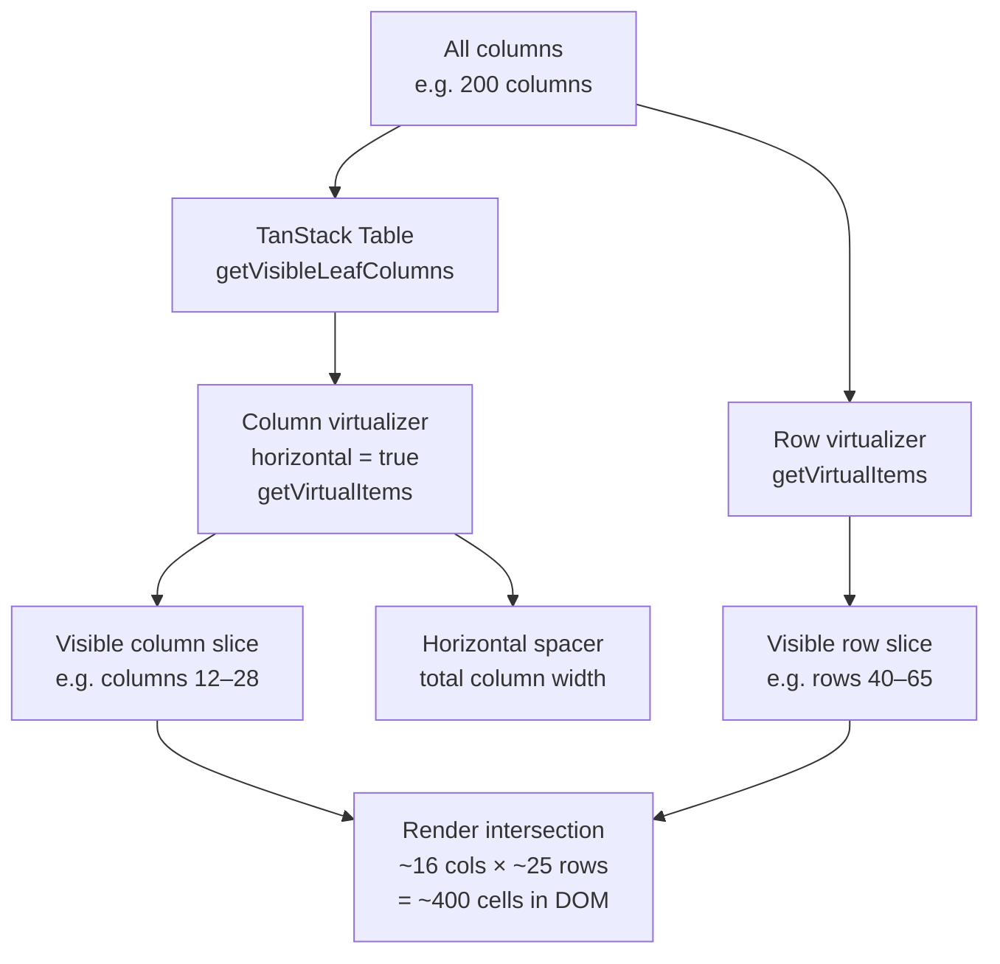
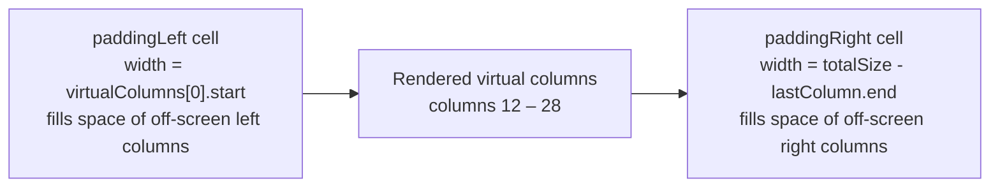

## TanStack Virtual — Column Virtualization

### Overview

Column virtualization renders only the columns currently visible in the horizontal viewport rather than all columns simultaneously. It follows the same principles as row virtualization but operates on the horizontal axis. Column virtualization becomes relevant when a table has enough columns that rendering all of them simultaneously produces meaningful DOM overhead or layout cost — typically tables with dozens to hundreds of columns.

---

### When Column Virtualization Is Warranted

Column virtualization adds implementation complexity. It is not necessary for most tables.

| Column Count | Typical Recommendation |
|---|---|
| < 20 | Full column rendering is generally fine |
| 20 – 50 | Depends on cell complexity; often unnecessary |
| 50 – 100 | Column virtualization worth considering |
| > 100 | Column virtualization advisable |

[Inference: These thresholds are approximate and depend on cell complexity, row count, and device capability. They are not TanStack-specific benchmarks.]

Column virtualization is most impactful when combined with row virtualization in tables that are both wide and tall.

---

### Architecture



---

### Setting Up the Column Virtualizer

Column virtualization uses `useVirtualizer` with `horizontal: true`.

```tsx
import { useVirtualizer } from '@tanstack/react-virtual'

const columns = table.getVisibleLeafColumns()

const columnVirtualizer = useVirtualizer({
  count: columns.length,
  getScrollElement: () => parentRef.current,
  estimateSize: index => columns[index].getSize(),
  horizontal: true,
  overscan: 3,
})
```

**Key Points:**
- `estimateSize` receives a column index and returns the column's pixel width. Using `columns[index].getSize()` reads the current TanStack Table sizing state directly.
- `horizontal: true` switches all offset calculations to the horizontal axis — `start` becomes a left offset rather than a top offset.
- The same scroll container ref (`parentRef`) is shared between the row and column virtualizers if both are used.

---

### Virtual Column Item Structure

`columnVirtualizer.getVirtualItems()` returns `VirtualItem` objects on the horizontal axis:

```ts
virtualColumn.index  // index into the visible columns array
virtualColumn.key    // stable key for React reconciliation
virtualColumn.start  // left pixel offset from start of scroll content
virtualColumn.size   // column width in pixels
virtualColumn.end    // start + size
```

Access the TanStack Table column via:

```ts
const column = columns[virtualColumn.index]
```

---

### Full Integration: Row + Column Virtualization

```tsx
import React from 'react'
import {
  useReactTable,
  getCoreRowModel,
  flexRender,
  type ColumnDef,
} from '@tanstack/react-table'
import { useVirtualizer } from '@tanstack/react-virtual'

function VirtualTable({ data, columnDefs }: {
  data: Record<string, unknown>[]
  columnDefs: ColumnDef<Record<string, unknown>>[]
}) {
  const parentRef = React.useRef<HTMLDivElement>(null)

  // ── TanStack Table ──────────────────────────────────────────
  const table = useReactTable({
    data,
    columns: columnDefs,
    getCoreRowModel: getCoreRowModel(),
    defaultColumn: { size: 150, minSize: 60, maxSize: 400 },
  })

  const rows = table.getRowModel().rows
  const visibleColumns = table.getVisibleLeafColumns()

  // ── Row virtualizer ─────────────────────────────────────────
  const rowVirtualizer = useVirtualizer({
    count: rows.length,
    getScrollElement: () => parentRef.current,
    estimateSize: () => 40,
    overscan: 5,
  })

  // ── Column virtualizer ──────────────────────────────────────
  const columnVirtualizer = useVirtualizer({
    count: visibleColumns.length,
    getScrollElement: () => parentRef.current,
    estimateSize: index => visibleColumns[index].getSize(),
    horizontal: true,
    overscan: 3,
  })

  const virtualRows = rowVirtualizer.getVirtualItems()
  const virtualColumns = columnVirtualizer.getVirtualItems()

  // Padding to maintain correct offsets for non-virtualized edges
  const paddingLeft = virtualColumns.length > 0
    ? virtualColumns[0].start
    : 0
  const paddingRight = virtualColumns.length > 0
    ? columnVirtualizer.getTotalSize() - virtualColumns[virtualColumns.length - 1].end
    : 0

  return (
    <div ref={parentRef} style={{ height: '600px', overflow: 'auto' }}>
      <table
        style={{
          width: `${columnVirtualizer.getTotalSize()}px`,
          tableLayout: 'fixed',
          borderCollapse: 'collapse',
        }}
      >
        {/* ── Header ── */}
        <thead style={{ position: 'sticky', top: 0, zIndex: 1 }}>
          {table.getHeaderGroups().map(headerGroup => (
            <tr key={headerGroup.id}>
              {/* Left padding cell */}
              {paddingLeft > 0 && <th style={{ width: paddingLeft }} />}

              {virtualColumns.map(virtualColumn => {
                const header = headerGroup.headers[virtualColumn.index]
                return (
                  <th
                    key={header.id}
                    style={{ width: `${virtualColumn.size}px` }}
                  >
                    {header.isPlaceholder
                      ? null
                      : flexRender(header.column.columnDef.header, header.getContext())}
                  </th>
                )
              })}

              {/* Right padding cell */}
              {paddingRight > 0 && <th style={{ width: paddingRight }} />}
            </tr>
          ))}
        </thead>

        {/* ── Body ── */}
        <tbody
          style={{
            height: `${rowVirtualizer.getTotalSize()}px`,
            position: 'relative',
            display: 'block',
          }}
        >
          {virtualRows.map(virtualRow => {
            const row = rows[virtualRow.index]
            return (
              <tr
                key={row.id}
                style={{
                  position: 'absolute',
                  width: '100%',
                  height: `${virtualRow.size}px`,
                  transform: `translateY(${virtualRow.start}px)`,
                  display: 'flex', // required for horizontal padding cells
                }}
              >
                {/* Left padding cell */}
                {paddingLeft > 0 && <td style={{ width: paddingLeft, flexShrink: 0 }} />}

                {virtualColumns.map(virtualColumn => {
                  const cell = row.getVisibleCells()[virtualColumn.index]
                  return (
                    <td
                      key={cell.id}
                      style={{
                        width: `${virtualColumn.size}px`,
                        flexShrink: 0,
                        overflow: 'hidden',
                      }}
                    >
                      {flexRender(cell.column.columnDef.cell, cell.getContext())}
                    </td>
                  )
                })}

                {/* Right padding cell */}
                {paddingRight > 0 && <td style={{ width: paddingRight, flexShrink: 0 }} />}
              </tr>
            )
          })}
        </tbody>
      </table>
    </div>
  )
}
```

---

### Padding Cells

When columns are virtualized, only a slice of the total columns is rendered. The horizontal space occupied by non-rendered columns must still be accounted for so the table width is correct and cells align with their headers.

Padding cells fill the left gap (columns before the virtual window) and right gap (columns after the virtual window).

```ts
const paddingLeft = virtualColumns.length > 0
  ? virtualColumns[0].start
  : 0

const paddingRight = virtualColumns.length > 0
  ? columnVirtualizer.getTotalSize() - virtualColumns[virtualColumns.length - 1].end
  : 0
```



**Key Points:**
- Padding cells are empty `<th>` / `<td>` elements whose sole purpose is occupying horizontal space.
- Without them, the rendered columns shift to the leftmost position regardless of scroll, breaking header-to-cell alignment.
- `paddingLeft` equals `virtualColumns[0].start` — the sum of all column widths before the first visible virtual column.
- `paddingRight` equals `totalSize - lastVirtualColumn.end` — the sum of all column widths after the last visible virtual column.

---

### Row Layout with `display: flex`

Absolutely positioned `<tr>` elements under `display: block` tbody do not participate in table column layout. Adding `display: flex` to each `<tr>` allows padding cells and data cells to be laid out horizontally using flex rules:

```tsx
<tr style={{ display: 'flex', position: 'absolute', width: '100%', ... }}>
  <td style={{ width: paddingLeft, flexShrink: 0 }} />
  {virtualColumns.map(...)}
  <td style={{ width: paddingRight, flexShrink: 0 }} />
</tr>
```

**Key Points:**
- `flexShrink: 0` on each cell prevents flex from compressing cells below their specified width.
- `display: flex` on `<tr>` overrides the native table-row layout — column alignment must be enforced entirely through explicit widths. [Inference: Native table column alignment (driven by `<colgroup>`) does not apply to flex rows.]

---

### Pinned Columns and Column Virtualization

Pinned columns are typically excluded from the column virtualizer and rendered separately — always present regardless of horizontal scroll position. Virtualizing pinned columns defeats their purpose.

```tsx
const pinnedLeftColumns = table.getLeftLeafColumns()
const pinnedRightColumns = table.getRightLeafColumns()
const centerColumns = table.getCenterLeafColumns()

// Only virtualize the center (unpinned) columns
const columnVirtualizer = useVirtualizer({
  count: centerColumns.length,
  getScrollElement: () => parentRef.current,
  estimateSize: index => centerColumns[index].getSize(),
  horizontal: true,
  overscan: 3,
})
```

Row structure becomes:

```tsx
<tr style={{ display: 'flex', ... }}>
  {/* Pinned left — always rendered */}
  {pinnedLeftColumns.map(col => <td key={col.id} style={{ width: col.getSize(), flexShrink: 0 }}>...</td>)}

  {/* Left padding for virtual center */}
  {paddingLeft > 0 && <td style={{ width: paddingLeft, flexShrink: 0 }} />}

  {/* Virtual center columns */}
  {virtualColumns.map(virtualColumn => {
    const col = centerColumns[virtualColumn.index]
    // ...
  })}

  {/* Right padding for virtual center */}
  {paddingRight > 0 && <td style={{ width: paddingRight, flexShrink: 0 }} />}

  {/* Pinned right — always rendered */}
  {pinnedRightColumns.map(col => <td key={col.id} style={{ width: col.getSize(), flexShrink: 0 }}>...</td>)}
</tr>
```

[Inference: Sticky CSS for pinned columns must account for the pinned columns' widths on both left and right edges. The left-pinned columns' total width determines the `left` sticky offset of the first virtual center column's left padding cell, if any visible boundary styling is needed.]

---

### Column Virtualization Without Row Virtualization

Column virtualization can be used independently when the table has many columns but few rows.

```tsx
// No row virtualizer — just column virtualization
const columnVirtualizer = useVirtualizer({
  count: visibleColumns.length,
  getScrollElement: () => parentRef.current,
  estimateSize: index => visibleColumns[index].getSize(),
  horizontal: true,
  overscan: 3,
})

// Render all rows, only virtual columns per row
{table.getRowModel().rows.map(row => (
  <tr key={row.id} style={{ display: 'flex' }}>
    {paddingLeft > 0 && <td style={{ width: paddingLeft, flexShrink: 0 }} />}
    {columnVirtualizer.getVirtualItems().map(virtualColumn => {
      const cell = row.getVisibleCells()[virtualColumn.index]
      return (
        <td key={cell.id} style={{ width: virtualColumn.size, flexShrink: 0 }}>
          {flexRender(cell.column.columnDef.cell, cell.getContext())}
        </td>
      )
    })}
    {paddingRight > 0 && <td style={{ width: paddingRight, flexShrink: 0 }} />}
  </tr>
))}
```

---

### Interaction with Column Resizing

When column resizing is combined with column virtualization, resizing a column changes its `getSize()` value, which should update the virtualizer's size estimate. This is done by passing the updated size through `estimateSize`:

```tsx
const columnVirtualizer = useVirtualizer({
  count: visibleColumns.length,
  getScrollElement: () => parentRef.current,
  estimateSize: index => visibleColumns[index].getSize(),
  horizontal: true,
})
```

Because `estimateSize` closes over `visibleColumns`, it re-reads current sizes on every virtualizer recalculation. [Inference: Whether the virtualizer re-calls `estimateSize` after a column resize depends on what triggers a re-render. The virtualizer's `onChange` option or a dependency on `columnSizing` state may be needed to force recalculation in some configurations.]

To force the virtualizer to re-measure after resize:

```tsx
const columnSizing = table.getState().columnSizing

React.useEffect(() => {
  columnVirtualizer.measure()
}, [columnSizing])
```

`virtualizer.measure()` forces a full re-measurement of all items using the current `estimateSize` function.

---

### Interaction with Column Visibility

When columns are hidden, `table.getVisibleLeafColumns()` returns a shorter array. The virtualizer's `count` should reflect the current visible column count:

```tsx
const visibleColumns = table.getVisibleLeafColumns()

const columnVirtualizer = useVirtualizer({
  count: visibleColumns.length, // updates automatically when visibility changes
  // ...
})
```

Because `count` is derived reactively from `getVisibleLeafColumns().length`, visibility toggles automatically update the virtualizer's item count. [Inference: React re-renders triggered by `columnVisibility` state changes will pass the new `count` to the virtualizer.]

---

### Interaction with Column Ordering

`table.getVisibleLeafColumns()` returns columns in their current display order (after ordering and pinning are applied). The column virtualizer indexes into this already-ordered array, so column ordering is transparent to the virtualizer — no special handling is required.

---

### CSS Custom Properties with Column Virtualization

The CSS custom property pattern for resize performance still applies, but only properties for currently rendered columns need to be set:

```tsx
const columnSizeVars = React.useMemo(() => {
  const vars: Record<string, number> = {}
  for (const virtualColumn of columnVirtualizer.getVirtualItems()) {
    const col = visibleColumns[virtualColumn.index]
    vars[`--col-${col.id}-size`] = col.getSize()
  }
  return vars
}, [table.getState().columnSizing, columnVirtualizer.getVirtualItems()])
```

[Inference: Limiting custom properties to virtual items rather than all columns reduces the number of CSS variables updated on each resize, though the practical difference is small for typical virtualized column counts.]

---

### Common Mistakes

| Mistake | Consequence | Correction |
|---|---|---|
| Missing padding cells | Virtual columns shift to left edge; header and body misalign | Add left and right padding cells computed from `virtualColumns[0].start` and `totalSize - lastColumn.end` |
| Missing `flexShrink: 0` on cells | Flex compresses cells below specified widths | Add `flexShrink: 0` to all `<td>` / `<th>` in flex rows |
| Virtualizing pinned columns | Pinned columns disappear during horizontal scroll | Render pinned columns outside the virtual column loop |
| Using `table.getAllLeafColumns()` instead of `getVisibleLeafColumns()` | Hidden columns included in virtualizer count | Use `getVisibleLeafColumns()` |
| Not calling `columnVirtualizer.measure()` after resize | Virtualizer uses stale size estimates for offset calculations | Call `measure()` when `columnSizing` state changes |
| Indexing `row.getAllCells()` instead of `row.getVisibleCells()` | Index mismatch between virtual columns and cell array | Use `row.getVisibleCells()[virtualColumn.index]` |

---

**Related Topics:**
- Row Virtualization with TanStack Table — combining with vertical virtualization
- Column Resizing with Virtualization — `measure()` and CSS variable patterns
- Column Pinning with Virtualization — rendering pinned columns outside the virtual loop
- Variable Column Widths — non-uniform `estimateSize` with measured column widths
- `scrollToIndex` — programmatic horizontal scroll to a specific column
- Window Virtualization — `useWindowVirtualizer` for page-level horizontal scroll